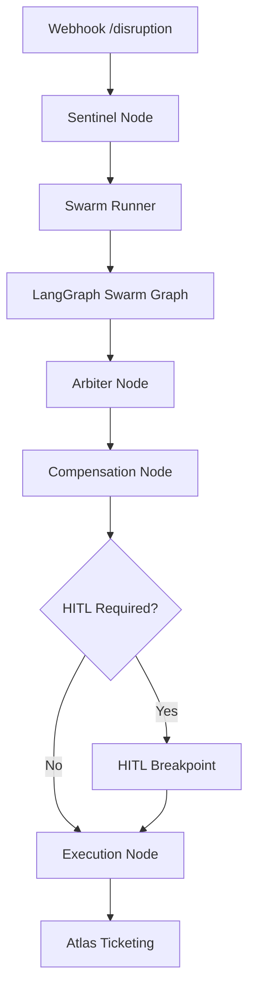
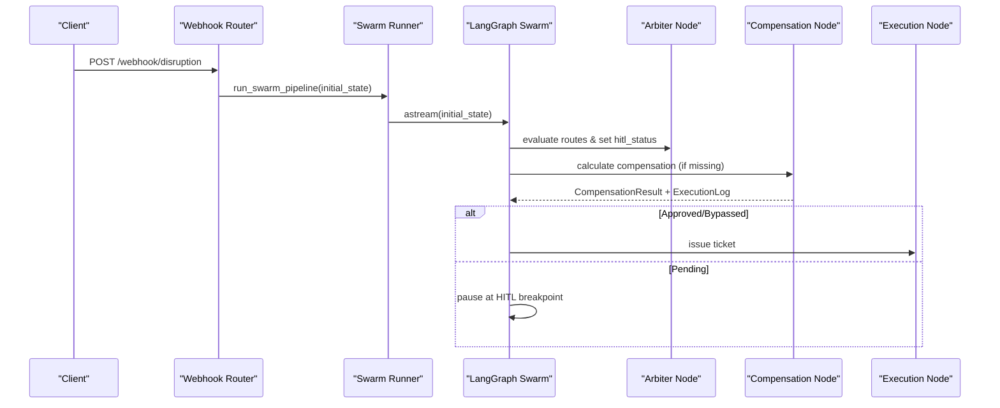
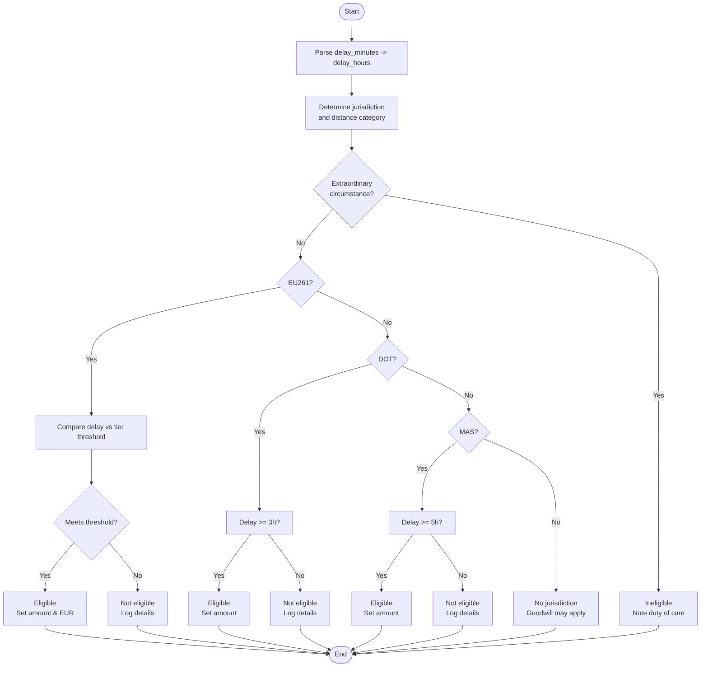
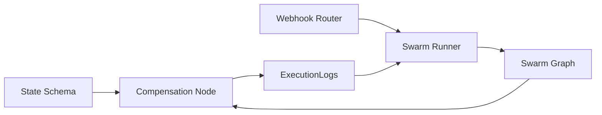

# Compensation Agent

<cite>
**Referenced Files in This Document**
- [compensation.py](file://backend/agents/compensation.py)
- [state.py](file://backend/state.py)
- [swarm.py](file://backend/swarm.py)
- [webhooks.py](file://backend/api/routers/webhooks.py)
- [api_models.py](file://backend/schemas/api_models.py)
- [swarm_runner.py](file://backend/services/swarm_runner.py)
- [arbiter.py](file://backend/agents/arbiter.py)
- [sentinel.py](file://backend/agents/sentinel.py)
- [main.py](file://backend/main.py)
- [config.py](file://backend/config.py)
- [test_qa_suite.py](file://backend/tests/test_qa_suite.py)
</cite>

## Table of Contents
1. Introduction
2. Project Structure
3. Core Components
4. Architecture Overview
5. Detailed Component Analysis
6. Dependency Analysis
7. Performance Considerations
8. Troubleshooting Guide
9. Conclusion
10. Appendices

## Introduction
This document explains the Compensation agent that calculates passenger compensation rights under EU261, DOT, and MAS regulations within the SynapseAir Travel Recovery OS. It covers the regulatory rule engine, eligibility determination algorithms, compensation amount calculations, jurisdiction-specific rules, exception handling, compliance verification, auditability, transparency, and appeal handling procedures. It also describes how the Compensation agent integrates with the broader multi-agent swarm to inform rebooking decisions and final ticketing.

## Project Structure
The Compensation agent is a node in the LangGraph-based multi-agent workflow:
- Ingestion and parsing occur via Sentinel (Hermes LLM) and webhooks.
- The swarm orchestrates parallel agents (Profile, Scout, Baggage, MultiLeg), then Arbiter scoring.
- Compensation runs after Arbiter to compute passenger rights before Human-in-the-Loop or execution.
- Results are persisted and streamed for audit and transparency.

**Diagram sources**
- [webhooks.py:14-72](file://backend/api/routers/webhooks.py#L14-L72)
- [swarm_runner.py:36-69](file://backend/services/swarm_runner.py#L36-L69)
- [swarm.py:162-227](file://backend/swarm.py#L162-L227)
- [arbiter.py:128-244](file://backend/agents/arbiter.py#L128-L244)
- [compensation.py:105-194](file://backend/agents/compensation.py#L105-L194)

**Section sources**
- [webhooks.py:14-72](file://backend/api/routers/webhooks.py#L14-L72)
- [swarm_runner.py:36-69](file://backend/services/swarm_runner.py#L36-L69)
- [swarm.py:162-227](file://backend/swarm.py#L162-L227)

## Core Components
- Compensation Rule Engine: Implements EU261, DOT, and MAS thresholds and amounts; determines jurisdiction based on origin/destination airports; evaluates extraordinary circumstances.
- Eligibility Algorithm: Converts delay minutes to hours, applies distance category logic, checks thresholds per regulation, and flags exemption due to extraordinary circumstances.
- Amount Calculation: Returns eligible flag, amount in USD, currency, and human-readable details.
- State Integration: Writes CompensationResult into the central state for downstream Arbiter scoring and HITL messaging.
- Audit Logging: Emits structured ExecutionLog entries with timestamps, levels, and data payloads for streaming and history.

Key responsibilities and behaviors are implemented in:
- Jurisdiction detection and rule tables
- Distance categorization helper
- Extraordinary circumstance keyword matching
- Main compensation calculation function returning result and logs

**Section sources**
- [compensation.py:24-59](file://backend/agents/compensation.py#L24-L59)
- [compensation.py:62-90](file://backend/agents/compensation.py#L62-L90)
- [compensation.py:105-194](file://backend/agents/compensation.py#L105-L194)
- [state.py:91-99](file://backend/state.py#L91-L99)

## Architecture Overview
The Compensation agent is invoked as part of the orchestrated workflow:
- After Arbiter selects candidate routes and sets hitl_status, the graph routes to Compensation if not yet computed.
- Compensation computes eligibility and amount, writes CompensationResult, and emits logs.
- Routing then decides whether to proceed to HITL or execute ticketing.

**Diagram sources**
- [webhooks.py:14-72](file://backend/api/routers/webhooks.py#L14-L72)
- [swarm_runner.py:71-131](file://backend/services/swarm_runner.py#L71-L131)
- [swarm.py:94-117](file://backend/swarm.py#L94-L117)
- [swarm.py:162-227](file://backend/swarm.py#L162-L227)
- [arbiter.py:128-244](file://backend/agents/arbiter.py#L128-L244)
- [compensation.py:105-194](file://backend/agents/compensation.py#L105-L194)

## Detailed Component Analysis

### Regulatory Rule Engine
- Jurisdiction Determination:
  - EU261: Applies when route involves EU airports (origin or destination).
  - DOT: Applies when route involves US airports.
  - MAS: Applies when route involves Malaysian airports.
  - Default: NONE if no recognized jurisdiction.
- Distance Categorization:
  - Simplified mapping to short/medium/long based on known airport pairs.
- Extraordinary Circumstances:
  - Keyword-based check against reasons such as typhoon, hurricane, volcanic, earthquake, war, ATC strike, severe weather, bird strike, security threat.

These rules determine which regulation applies and whether the airline is exempt from mandatory compensation.

**Section sources**
- [compensation.py:44-59](file://backend/agents/compensation.py#L44-L59)
- [compensation.py:62-90](file://backend/agents/compensation.py#L62-L90)

### Eligibility Determination Algorithm
- Inputs: origin, destination, delay_minutes, reason.
- Steps:
  - Convert delay_minutes to delay_hours.
  - Determine jurisdiction and distance category.
  - Check extraordinary circumstances first; if true, mark ineligible and note duty-of-care still applies.
  - Apply regulation-specific thresholds:
    - EU261: Compare delay_hours to tier thresholds by distance category.
    - DOT: Threshold at 3+ hours tarmac delay.
    - MAS: Threshold at 5+ hours delay.
  - Set eligible flag, amount_usd, currency, and details string.

**Diagram sources**
- [compensation.py:105-194](file://backend/agents/compensation.py#L105-L194)

**Section sources**
- [compensation.py:105-194](file://backend/agents/compensation.py#L105-L194)

### Compensation Amount Calculations
- EU261 Tiers:
  - Short-haul: threshold and fixed amount.
  - Medium-haul: threshold and fixed amount.
  - Long-haul: threshold and fixed amount.
- DOT:
  - Fixed amount for qualifying tarmac delays.
- MAS:
  - Fixed amount for qualifying delays and cancellation scenarios.

Currency handling:
- For EU261, currency is set to EUR while amount_usd is provided for display.
- For DOT/MAS, amount_usd is used directly.

**Section sources**
- [compensation.py:24-41](file://backend/agents/compensation.py#L24-L41)
- [compensation.py:136-162](file://backend/agents/compensation.py#L136-L162)

### Jurisdiction-Specific Rules
- EU261:
  - Applies to flights departing from or arriving in EU airports.
  - Uses distance-based tiers and delay thresholds.
- DOT:
  - Applies to flights involving US airports.
  - Focuses on tarmac delay thresholds.
- MAS:
  - Applies to flights involving Malaysian airports.
  - Provides specific thresholds for delays and cancellations.

**Section sources**
- [compensation.py:44-59](file://backend/agents/compensation.py#L44-L59)
- [compensation.py:136-162](file://backend/agents/compensation.py#L136-L162)

### Exception Handling and Compliance Verification
- Extraordinary Circumstances:
  - If detected, marks compensation ineligible and records rationale.
- No Jurisdiction:
  - Logs that no specific regulation applies; notes goodwill possibilities.
- Compliance Verification:
  - Ensures delay thresholds are met per regulation.
  - Records detailed rationale in logs for auditability.

**Section sources**
- [compensation.py:82-90](file://backend/agents/compensation.py#L82-L90)
- [compensation.py:130-162](file://backend/agents/compensation.py#L130-L162)

### Integration with Legal Databases
- Current implementation uses embedded rule tables and keyword matching for extraordinary circumstances.
- There is no direct integration with external legal databases in the analyzed code.
- Future enhancement could replace hardcoded lists with configurable rule sets or database lookups for dynamic updates.

[No sources needed since this section provides general guidance]

### Audit Requirements and Calculation Transparency
- Structured ExecutionLog entries include:
  - Timestamp, node name, agent name, level, message, and data payload.
  - Data includes compensation_result, jurisdiction, distance_category, and extraordinary_circumstance flag.
- Streaming and History:
  - Swarm runner broadcasts events and persists disruption records for history dashboard.
  - Logs are additive and streamable via SSE/WebSocket for real-time visibility.

**Section sources**
- [compensation.py:173-189](file://backend/agents/compensation.py#L173-L189)
- [swarm_runner.py:47-69](file://backend/services/swarm_runner.py#L47-L69)
- [swarm_runner.py:125-131](file://backend/services/swarm_runner.py#L125-L131)

### Appeal Handling Procedures
- HITL Workflow:
  - If Arbiter requires passenger approval, the graph pauses at HITL breakpoint and dispatches WhatsApp/n8n consent request.
  - Passenger consensus can approve or reject; approved flows resume to execution, rejected flows stop.
- Compensation Visibility:
  - HITL messages include compensation details when eligible, ensuring passengers understand potential rights.

**Section sources**
- [swarm.py:130-159](file://backend/swarm.py#L130-L159)
- [webhooks.py:74-185](file://backend/api/routers/webhooks.py#L74-L185)

### Examples of Compensation Scenarios
- EU261 Eligible:
  - Route involves EU airport; delay meets tier threshold; results in eligible status with EUR currency and USD equivalent.
- EU261 Not Eligible:
  - Delay below threshold for distance category; logs explain non-eligibility.
- DOT Eligible:
  - Tarmac delay meets threshold; eligible with fixed USD amount.
- MAS Eligible:
  - Delay meets threshold; eligible with USD amount derived from MYR value.
- Extraordinary Circumstance:
  - Reason matches keywords; ineligible; logs note duty-of-care obligations.

**Section sources**
- [compensation.py:130-162](file://backend/agents/compensation.py#L130-L162)

### Regulatory Interpretation Logic
- The agent interprets regulations through:
  - Airport-based jurisdiction mapping.
  - Distance category heuristics for EU261 tiers.
  - Keyword-based extraordinary circumstance detection.
- These interpretations are deterministic and auditable via logs.

**Section sources**
- [compensation.py:44-90](file://backend/agents/compensation.py#L44-L90)

## Dependency Analysis
The Compensation agent depends on:
- Central state schema for CompensationResult and ExecutionLog.
- Swarm orchestration to invoke Compensation after Arbiter.
- Webhook ingestion to start the workflow.
- Swarm runner for event broadcasting and persistence.

**Diagram sources**
- [state.py:91-99](file://backend/state.py#L91-L99)
- [swarm.py:162-227](file://backend/swarm.py#L162-L227)
- [webhooks.py:14-72](file://backend/api/routers/webhooks.py#L14-L72)
- [swarm_runner.py:71-131](file://backend/services/swarm_runner.py#L71-L131)
- [compensation.py:105-194](file://backend/agents/compensation.py#L105-L194)

**Section sources**
- [state.py:91-99](file://backend/state.py#L91-L99)
- [swarm.py:162-227](file://backend/swarm.py#L162-L227)
- [webhooks.py:14-72](file://backend/api/routers/webhooks.py#L14-L72)
- [swarm_runner.py:71-131](file://backend/services/swarm_runner.py#L71-L131)
- [compensation.py:105-194](file://backend/agents/compensation.py#L105-L194)

## Performance Considerations
- Deterministic Calculations:
  - Compensation logic is lightweight and fast; dominated by string operations and dictionary lookups.
- Streaming Overhead:
  - Execution logs are broadcast per node; ensure efficient consumers for high-throughput environments.
- Scalability:
  - Stateless computation allows horizontal scaling of nodes; consider caching airport sets and distance mappings if expanded.

[No sources needed since this section provides general guidance]

## Troubleshooting Guide
Common issues and diagnostics:
- Missing or invalid thread_id in consensus:
  - Ensure thread_id exists; otherwise, 404 returned.
- Invalid action in consensus:
  - Validation errors returned for malformed actions.
- Negative or extreme delay values:
  - Accepted at entry; compensation logic handles thresholds appropriately.
- Authentication failures:
  - Missing or invalid API key returns 401 in production modes.

Use telemetry and history endpoints to inspect workflow progress and outcomes.

**Section sources**
- [webhooks.py:74-185](file://backend/api/routers/webhooks.py#L74-L185)
- [test_qa_suite.py:132-180](file://backend/tests/test_qa_suite.py#L132-L180)
- [test_qa_suite.py:78-128](file://backend/tests/test_qa_suite.py#L78-L128)

## Conclusion
The Compensation agent provides a clear, auditable, and transparent mechanism for calculating passenger compensation rights under EU261, DOT, and MAS regulations. It integrates seamlessly into the multi-agent swarm, informs Arbiter scoring and HITL messaging, and ensures compliance through deterministic rules and detailed logging. While currently using embedded rule tables, future enhancements can integrate external legal databases for dynamic rule updates and richer interpretation.

[No sources needed since this section summarizes without analyzing specific files]

## Appendices

### Configuration and Environment
- Application settings and environment variables are managed centrally.
- Production mode validates critical keys and warns about defaults.

**Section sources**
- [config.py:29-116](file://backend/config.py#L29-L116)

### Entry Points and Lifecycle
- FastAPI application initializes logging and tracing.
- Health endpoint provides service status.

**Section sources**
- [main.py:22-37](file://backend/main.py#L22-L37)
- [main.py:119-122](file://backend/main.py#L119-L122)

### Data Models
- DisruptionPayload defines input fields for disruption ingestion.
- ConsensusPayload defines HITL decision inputs.

**Section sources**
- [api_models.py:5-79](file://backend/schemas/api_models.py#L5-L79)
- [api_models.py:81-102](file://backend/schemas/api_models.py#L81-L102)

### Agent Orchestration
- Sentinel parses raw text and normalizes disruption events.
- Arbiter scores routes and influences HITL decisions.

**Section sources**
- [sentinel.py:34-90](file://backend/agents/sentinel.py#L34-L90)
- [arbiter.py:128-244](file://backend/agents/arbiter.py#L128-L244)