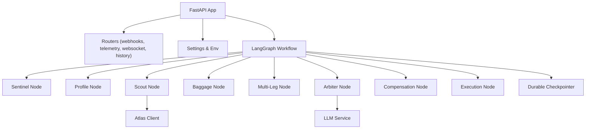
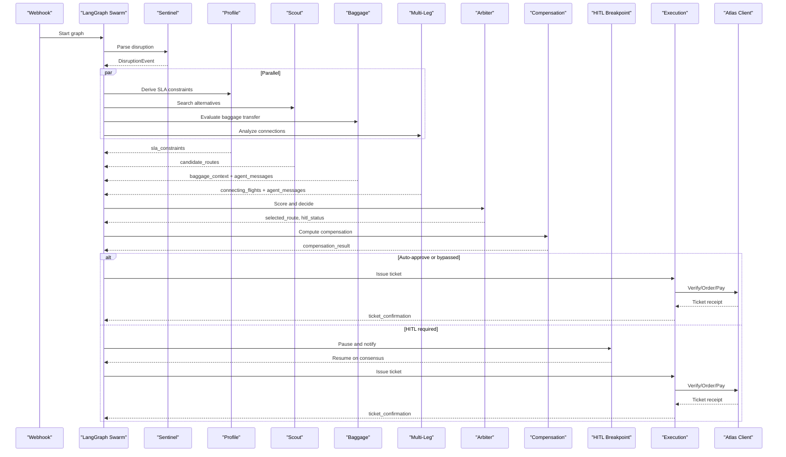
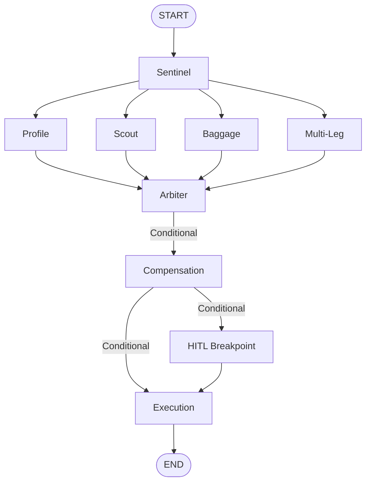
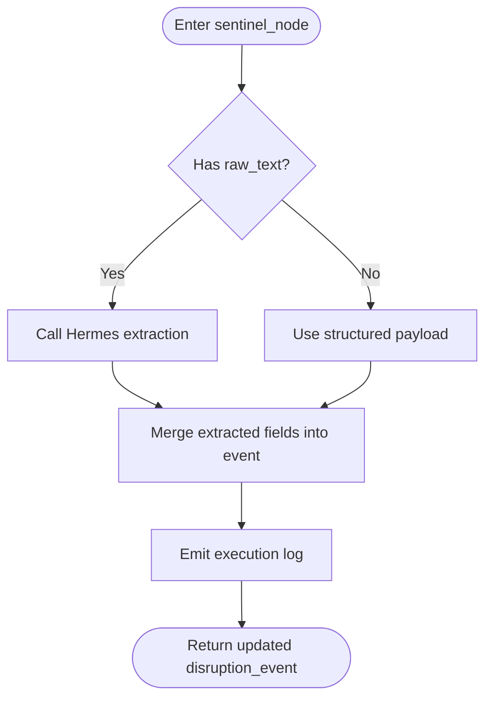
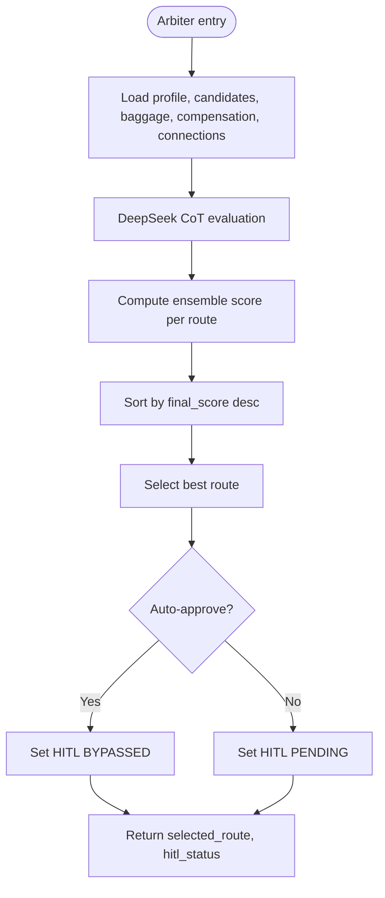
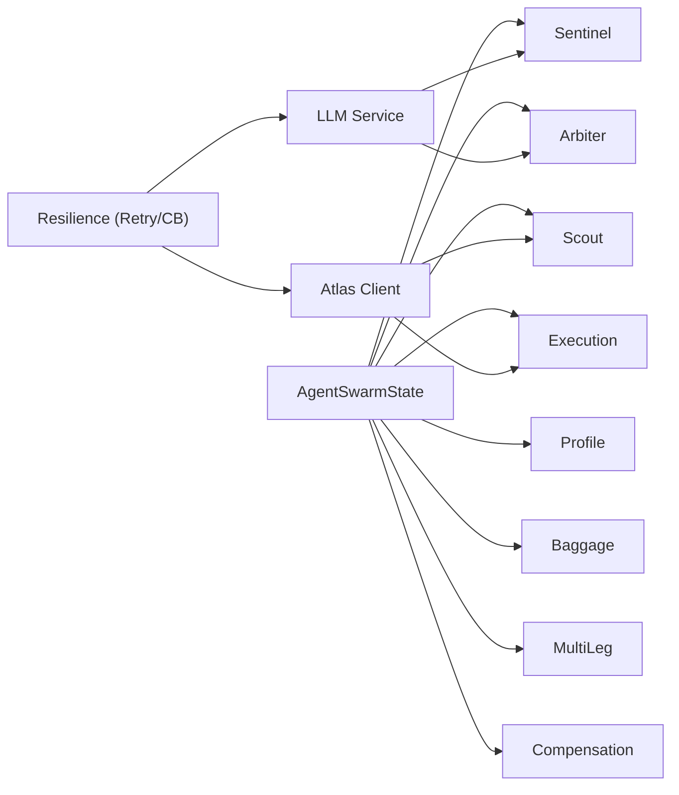

# Multi-Agent System

<cite>
**Referenced Files in This Document**
- [swarm.py](file://backend/swarm.py)
- [state.py](file://backend/state.py)
- [main.py](file://backend/main.py)
- [config.py](file://backend/config.py)
- [sentinel.py](file://backend/agents/sentinel.py)
- [profile.py](file://backend/agents/profile.py)
- [scout.py](file://backend/agents/scout.py)
- [baggage.py](file://backend/agents/baggage.py)
- [multileg.py](file://backend/agents/multileg.py)
- [arbiter.py](file://backend/agents/arbiter.py)
- [compensation.py](file://backend/agents/compensation.py)
- [atlas_client.py](file://backend/tools/atlas_client.py)
- [llm_service.py](file://backend/services/llm_service.py)
- [sqlite_checkpointer.py](file://backend/store/sqlite_checkpointer.py)
- [resilience.py](file://backend/middleware/resilience.py)
- [README.md](file://README.md)
</cite>

## Table of Contents
1. Introduction
2. Project Structure
3. Core Components
4. Architecture Overview
5. Detailed Component Analysis
6. Dependency Analysis
7. Performance Considerations
8. Troubleshooting Guide
9. Conclusion
10. Appendices

## Introduction
SynapseAir is an autonomous multi-agent flight disruption recovery system built on LangGraph. It orchestrates specialized agents to parse disruptions, evaluate passenger constraints, discover alternative routes, analyze baggage and connection viability, make decisions, compute compensation, and execute re-ticketing with human-in-the-loop approval when needed. The system integrates LLMs (Hermes for parsing, DeepSeek for reasoning), a GDS client (Atlas), durable state checkpointing, and real-time telemetry via SSE/WebSocket.

## Project Structure
The backend implements:
- A FastAPI application that mounts routers for webhooks, telemetry, history, and WebSocket.
- A LangGraph StateGraph workflow that defines the agent orchestration graph.
- Typed state schema shared across agents.
- Specialized agent nodes for each role.
- Tools and services for external integrations (LLMs, Atlas GDS).
- Resilience middleware (retry and circuit breakers).
- Durable checkpointer for HITL pause/resume.

**Diagram sources**
- [main.py:40-108](file://backend/main.py#L40-L108)
- [swarm.py:162-227](file://backend/swarm.py#L162-L227)
- [config.py:29-115](file://backend/config.py#L29-L115)
- [atlas_client.py:175-219](file://backend/tools/atlas_client.py#L175-L219)
- [llm_service.py:34-96](file://backend/services/llm_service.py#L34-L96)
- [sqlite_checkpointer.py:43-54](file://backend/store/sqlite_checkpointer.py#L43-L54)

**Section sources**
- [main.py:1-128](file://backend/main.py#L1-L128)
- [swarm.py:1-232](file://backend/swarm.py#L1-L232)
- [config.py:1-116](file://backend/config.py#L1-L116)

## Core Components
- State Schema: Central typed state carrying disruption events, passenger context, candidate routes, selected route, compensation results, connecting flights, agent messages, and logs.
- Orchestration Graph: LangGraph StateGraph defining parallel fan-out after Sentinel, fan-in into Arbiter, conditional routing through Compensation and HITL, and final execution.
- Agents:
  - Sentinel: Parses raw disruption signals using Hermes or fallback regex.
  - Profile: Derives SLA constraints and financial liability based on loyalty tier.
  - Scout: Queries Atlas GDS for candidate routes.
  - Baggage: Evaluates interline transfer feasibility and transfer time.
  - Multi-Leg: Assesses connection viability and MCT at hubs.
  - Arbiter: Scores candidates with ensemble logic and LLM reasoning; sets HITL status.
  - Compensation: Computes passenger rights under EU261/DOT/MAS.
  - Execution: Issues tickets via Atlas and records confirmation.
- Services:
  - LLM Service: Hermes extraction and DeepSeek CoT evaluation with resilience.
  - Atlas Client: Search, verify/order/pay lifecycle with caching and fallback.
- Resilience: Retry with backoff and per-service circuit breakers.
- Persistence: Durable checkpointer enabling HITL pause/resume.

**Section sources**
- [state.py:20-167](file://backend/state.py#L20-L167)
- [swarm.py:162-227](file://backend/swarm.py#L162-L227)
- [sentinel.py:34-90](file://backend/agents/sentinel.py#L34-L90)
- [profile.py:58-126](file://backend/agents/profile.py#L58-L126)
- [scout.py:32-86](file://backend/agents/scout.py#L32-L86)
- [baggage.py:76-151](file://backend/agents/baggage.py#L76-L151)
- [multileg.py:96-167](file://backend/agents/multileg.py#L96-L167)
- [arbiter.py:128-243](file://backend/agents/arbiter.py#L128-L243)
- [compensation.py:105-194](file://backend/agents/compensation.py#L105-L194)
- [atlas_client.py:175-357](file://backend/tools/atlas_client.py#L175-L357)
- [llm_service.py:34-279](file://backend/services/llm_service.py#L34-L279)
- [resilience.py:25-244](file://backend/middleware/resilience.py#L25-L244)
- [sqlite_checkpointer.py:43-54](file://backend/store/sqlite_checkpointer.py#L43-L54)

## Architecture Overview
The workflow starts with a disruption event, parses it, then runs parallel evaluations (Profile, Scout, Baggage, Multi-Leg). Results converge into Arbiter, which scores and decides whether to auto-approve, require HITL, or proceed directly to execution. Compensation is always evaluated before final decision. Execution issues tickets via Atlas.

**Diagram sources**
- [swarm.py:162-227](file://backend/swarm.py#L162-L227)
- [sentinel.py:34-90](file://backend/agents/sentinel.py#L34-L90)
- [profile.py:58-126](file://backend/agents/profile.py#L58-L126)
- [scout.py:32-86](file://backend/agents/scout.py#L32-L86)
- [baggage.py:76-151](file://backend/agents/baggage.py#L76-L151)
- [multileg.py:96-167](file://backend/agents/multileg.py#L96-L167)
- [arbiter.py:128-243](file://backend/agents/arbiter.py#L128-L243)
- [compensation.py:105-194](file://backend/agents/compensation.py#L105-L194)
- [atlas_client.py:222-357](file://backend/tools/atlas_client.py#L222-L357)

## Detailed Component Analysis

### Agent Framework and State Management
- Central state schema defines all fields passed between nodes, including additive reducers for lists (candidate_routes, execution_logs, connecting_flights, agent_messages).
- Graph uses START and END edges, plus conditional routing functions to branch based on state values.
- Interrupts are configured before the HITL breakpoint node for durable pause/resume.

**Diagram sources**
- [swarm.py:162-227](file://backend/swarm.py#L162-L227)
- [state.py:130-167](file://backend/state.py#L130-L167)

**Section sources**
- [state.py:130-167](file://backend/state.py#L130-L167)
- [swarm.py:162-227](file://backend/swarm.py#L162-L227)

### Sentinel: Disruption Parsing
- Accepts structured webhook payloads or unstructured text.
- Uses Hermes LLM function calling to extract structured fields; falls back to regex if unavailable.
- Emits telemetry and updates disruption_event for downstream agents.

**Diagram sources**
- [sentinel.py:34-90](file://backend/agents/sentinel.py#L34-L90)
- [llm_service.py:34-96](file://backend/services/llm_service.py#L34-L96)

**Section sources**
- [sentinel.py:34-90](file://backend/agents/sentinel.py#L34-L90)
- [llm_service.py:34-120](file://backend/services/llm_service.py#L34-L120)

### Profile: Passenger Constraint Evaluation
- Derives SLA rules and financial arbitrage based on loyalty tier and delay magnitude.
- Outputs sla_constraints used by Arbiter to enforce VIP policies and auto-approval thresholds.

**Section sources**
- [profile.py:17-43](file://backend/agents/profile.py#L17-L43)
- [profile.py:58-126](file://backend/agents/profile.py#L58-L126)

### Scout: Route Discovery
- Calls Atlas search to retrieve candidate routes for origin/destination/date.
- Normalizes results into FlightRoute objects and injects them into state.

**Section sources**
- [scout.py:32-86](file://backend/agents/scout.py#L32-L86)
- [atlas_client.py:175-219](file://backend/tools/atlas_client.py#L175-L219)

### Baggage: Transfer Analysis
- Estimates checked bags and special items based on loyalty tier.
- Checks interline eligibility and estimates transfer time.
- Publishes agent message to Arbiter about baggage feasibility.

**Section sources**
- [baggage.py:20-61](file://backend/agents/baggage.py#L20-L61)
- [baggage.py:76-151](file://backend/agents/baggage.py#L76-L151)

### Multi-Leg: Connection Viability
- Detects connection-related disruptions and evaluates minimum connection times at airports.
- Produces ConnectingFlight entries and notifies Arbiter about missed or at-risk connections.

**Section sources**
- [multileg.py:20-40](file://backend/agents/multileg.py#L20-L40)
- [multileg.py:43-81](file://backend/agents/multileg.py#L43-L81)
- [multileg.py:96-167](file://backend/agents/multileg.py#L96-L167)

### Arbiter: Decision Making
- Invokes DeepSeek CoT evaluation and applies ensemble scoring combining base score, punctuality, baggage feasibility, compensation impact, and connection time.
- Sorts candidates, selects best route, and determines HITL status based on loyalty tier and score thresholds.

**Diagram sources**
- [arbiter.py:22-31](file://backend/agents/arbiter.py#L22-L31)
- [arbiter.py:34-113](file://backend/agents/arbiter.py#L34-L113)
- [arbiter.py:128-243](file://backend/agents/arbiter.py#L128-L243)
- [llm_service.py:126-205](file://backend/services/llm_service.py#L126-L205)

**Section sources**
- [arbiter.py:128-243](file://backend/agents/arbiter.py#L128-L243)
- [llm_service.py:126-279](file://backend/services/llm_service.py#L126-L279)

### Compensation: Regulatory Compliance
- Determines jurisdiction (EU261, DOT, MAS) and calculates eligible compensation amounts based on delay thresholds and extraordinary circumstances.
- Emits detailed rationale and influences Arbiter’s cost impact factor.

**Section sources**
- [compensation.py:20-90](file://backend/agents/compensation.py#L20-L90)
- [compensation.py:105-194](file://backend/agents/compensation.py#L105-L194)

### Execution: Automated Ticketing
- Issues tickets via Atlas GDS lifecycle (verify, order, pay, query) and records e-ticket details.
- Handles fallback to high-fidelity simulation when live API fails.

**Section sources**
- [swarm.py:52-91](file://backend/swarm.py#L52-L91)
- [atlas_client.py:222-357](file://backend/tools/atlas_client.py#L222-L357)

### Human-in-the-Loop (HITL) Breakpoint
- Pauses graph execution and dispatches WhatsApp consent message via n8n gateway.
- On consensus, resumes execution to issue ticket.

**Section sources**
- [swarm.py:130-159](file://backend/swarm.py#L130-L159)
- [sqlite_checkpointer.py:43-54](file://backend/store/sqlite_checkpointer.py#L43-L54)

## Dependency Analysis
Agents depend on shared state and external services:
- Sentinel depends on LLM service for parsing.
- Scout depends on Atlas client for inventory.
- Arbiter depends on LLM service and reads baggage/compensation/connection data from state.
- Execution depends on Atlas client for ticketing.
- All nodes emit execution logs and may publish agent messages.

**Diagram sources**
- [state.py:130-167](file://backend/state.py#L130-L167)
- [llm_service.py:34-279](file://backend/services/llm_service.py#L34-L279)
- [atlas_client.py:175-357](file://backend/tools/atlas_client.py#L175-L357)
- [resilience.py:25-244](file://backend/middleware/resilience.py#L25-L244)

**Section sources**
- [state.py:130-167](file://backend/state.py#L130-L167)
- [llm_service.py:34-279](file://backend/services/llm_service.py#L34-L279)
- [atlas_client.py:175-357](file://backend/tools/atlas_client.py#L175-L357)
- [resilience.py:25-244](file://backend/middleware/resilience.py#L25-L244)

## Performance Considerations
- Parallel execution: Profile, Scout, Baggage, and Multi-Leg run concurrently to minimize latency.
- Caching: Atlas search results cached in-memory with TTL to reduce repeated queries.
- Resilience: Circuit breakers and retry with exponential backoff protect against transient failures.
- Deterministic fallbacks: Regex extraction and deterministic arbiter ensure continuity when LLMs are unavailable.
- Efficient state merging: Additive reducers merge lists without full recomputation.

[No sources needed since this section provides general guidance]

## Troubleshooting Guide
Common issues and strategies:
- LLM outages: Hermes/DeepSeek circuit breakers open; fallbacks activate automatically.
- Atlas API errors: Circuit breaker opens; search falls back to sandbox simulation; ticketing falls back to simulated issuance.
- Missing configuration: Settings validator warns on missing production keys; defaults are safe but insecure for production.
- HITL not resuming: Ensure durable checkpointer is available and graph is resumed via consensus webhook.

**Section sources**
- [resilience.py:83-244](file://backend/middleware/resilience.py#L83-L244)
- [llm_service.py:85-120](file://backend/services/llm_service.py#L85-L120)
- [atlas_client.py:197-219](file://backend/tools/atlas_client.py#L197-L219)
- [config.py:92-112](file://backend/config.py#L92-L112)
- [sqlite_checkpointer.py:43-54](file://backend/store/sqlite_checkpointer.py#L43-L54)

## Conclusion
SynapseAir’s LangGraph-based swarm coordinates specialized agents to autonomously recover disrupted travel with minimal friction. By combining robust state management, parallel execution, resilient integrations, and regulatory-aware decision-making, it achieves rapid resolution while protecting passengers and airlines from fines and churn.

[No sources needed since this section summarizes without analyzing specific files]

## Appendices

### Custom Agent Development and Integration Patterns
- Define a new node function that reads/writes fields in AgentSwarmState and emits execution logs.
- Register the node in build_swarm_graph and add edges or conditional routing as needed.
- Integrate external tools via async calls wrapped with resilience utilities.
- Use AgentMessage for inter-agent notifications when necessary.

**Section sources**
- [swarm.py:162-227](file://backend/swarm.py#L162-L227)
- [state.py:116-124](file://backend/state.py#L116-L124)
- [resilience.py:25-80](file://backend/middleware/resilience.py#L25-L80)