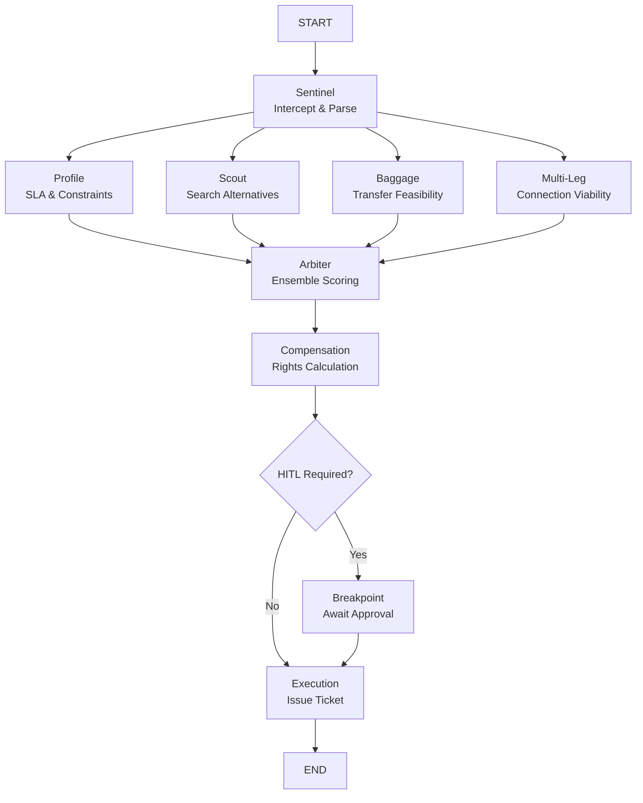
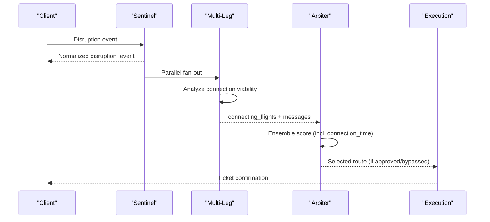
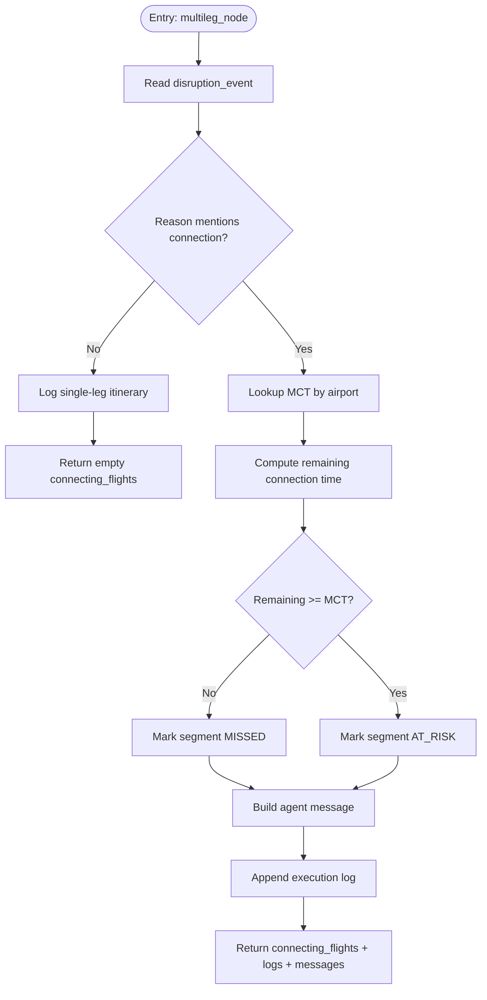
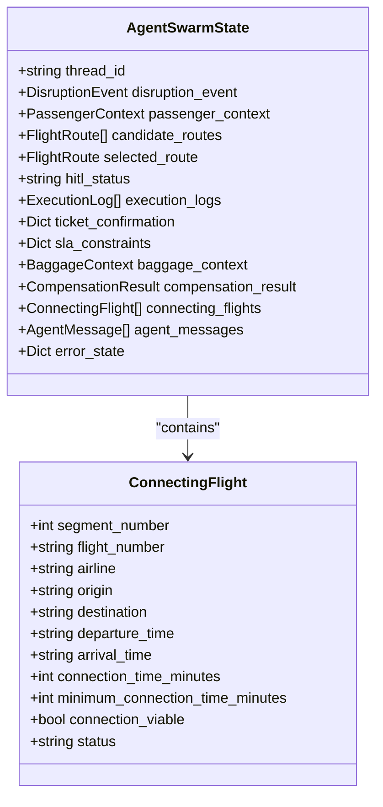
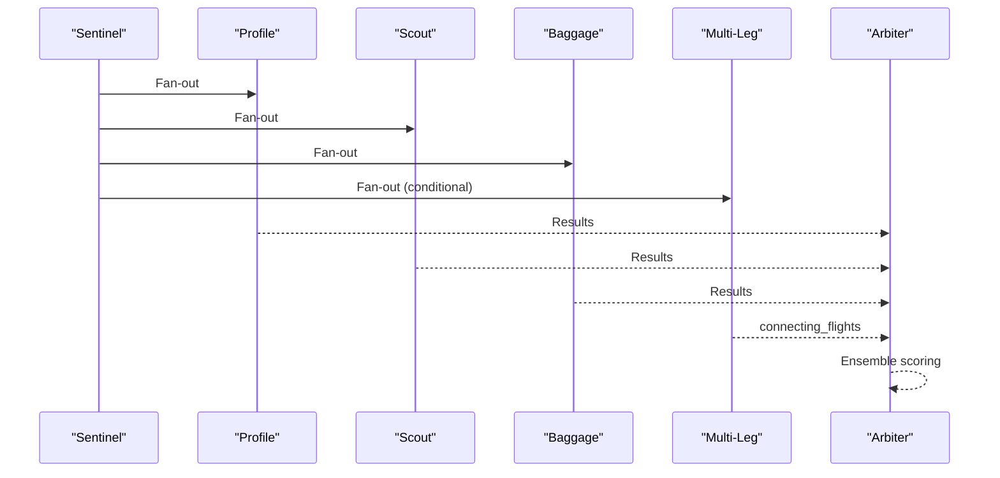
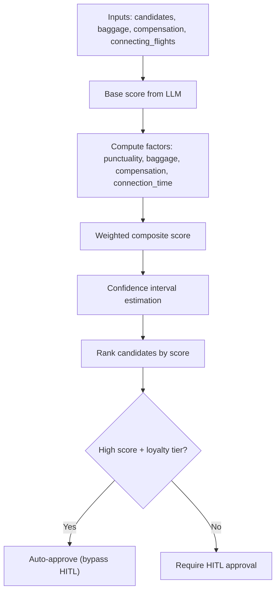
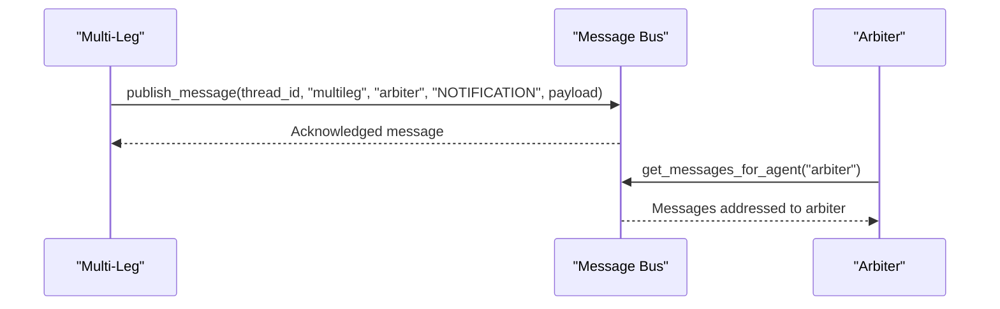
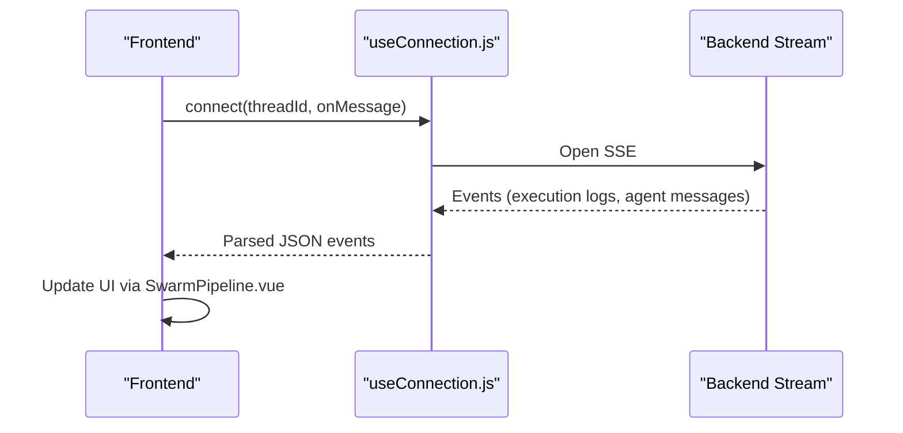
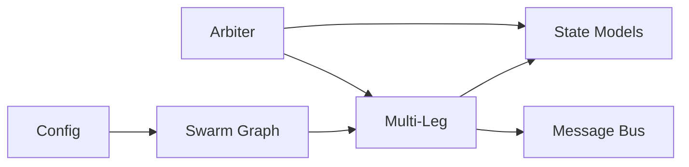

# Multi-Leg Agent

<cite>
**Referenced Files in This Document**
- [multileg.py](file://travel-recovery-os/backend/agents/multileg.py)
- [state.py](file://travel-recovery-os/backend/state.py)
- [swarm.py](file://travel-recovery-os/backend/swarm.py)
- [arbiter.py](file://travel-recovery-os/backend/agents/arbiter.py)
- [sentinel.py](file://travel-recovery-os/backend/agents/sentinel.py)
- [message_bus.py](file://travel-recovery-os/backend/services/message_bus.py)
- [useConnection.js](file://travel-recovery-os/frontend/src/composables/useConnection.js)
- [SwarmPipeline.vue](file://travel-recovery-os/frontend/src/components/SwarmPipeline.vue)
- [config.py](file://travel-recovery-os/backend/config.py)
</cite>

## Table of Contents
1. Introduction
2. Project Structure
3. Core Components
4. Architecture Overview
5. Detailed Component Analysis
6. Dependency Analysis
7. Performance Considerations
8. Troubleshooting Guide
9. Conclusion

## Introduction
This document explains the Multi-Leg agent that evaluates connection viability and validates minimum connection times across multi-segment itineraries. It covers how the agent analyzes connecting flights, coordinates timing across carriers, ensures regulatory compliance considerations via scoring, and integrates with the broader multi-agent swarm to rebook passengers when connections are at risk or missed. It also documents algorithms for connection time validation, carrier coordination logic, conflict resolution strategies, and edge cases such as international transfers, same-terminal vs cross-terminal scenarios, and weather-related delays.

## Project Structure
The Multi-Leg agent is part of a LangGraph-based multi-agent workflow:
- Sentinel intercepts disruptions and normalizes inputs.
- Profile, Scout, Baggage, and Multi-Leg run in parallel to enrich context.
- Arbiter scores candidate routes using ensemble factors including connection viability.
- Compensation calculates passenger rights; HITL may pause for approval.
- Execution issues tickets via Atlas API.

**Diagram sources**
- [swarm.py:162-227](file://travel-recovery-os/backend/swarm.py#L162-L227)
- [sentinel.py:34-90](file://travel-recovery-os/backend/agents/sentinel.py#L34-L90)
- [multileg.py:96-167](file://travel-recovery-os/backend/agents/multileg.py#L96-L167)
- [arbiter.py:128-243](file://travel-recovery-os/backend/agents/arbiter.py#L128-L243)

**Section sources**
- [swarm.py:162-227](file://travel-recovery-os/backend/swarm.py#L162-L227)
- [sentinel.py:34-90](file://travel-recovery-os/backend/agents/sentinel.py#L34-L90)

## Core Components
- Multi-Leg Agent: Evaluates whether downstream segments remain viable given delays, applies airport-specific Minimum Connection Times (MCT), and reports status per segment.
- State Model: Defines ConnectingFlight and other shared structures used by agents.
- Swarm Orchestration: Wires Multi-Leg into the graph and merges results into Arbiter’s scoring.
- Arbiter: Incorporates connection viability into ensemble scoring to influence route selection and HITL decisions.
- Message Bus: Enables inter-agent notifications about connection outcomes.

Key responsibilities:
- Detect connection-related disruptions.
- Compute remaining connection time after delay.
- Compare against MCT thresholds per airport and connection type.
- Emit logs and messages to downstream agents.

**Section sources**
- [multileg.py:20-81](file://travel-recovery-os/backend/agents/multileg.py#L20-L81)
- [state.py:101-114](file://travel-recovery-os/backend/state.py#L101-L114)
- [swarm.py:119-127](file://travel-recovery-os/backend/swarm.py#L119-L127)
- [arbiter.py:25-31](file://travel-recovery-os/backend/agents/arbiter.py#L25-L31)

## Architecture Overview
The Multi-Leg node runs concurrently with Profile, Scout, and Baggage after Sentinel. Its outputs feed into Arbiter’s ensemble scoring. The flow includes conditional routing based on disruption keywords to ensure Multi-Leng analysis only triggers when relevant.

**Diagram sources**
- [swarm.py:182-195](file://travel-recovery-os/backend/swarm.py#L182-L195)
- [multileg.py:96-167](file://travel-recovery-os/backend/agents/multileg.py#L96-L167)
- [arbiter.py:128-243](file://travel-recovery-os/backend/agents/arbiter.py#L128-L243)

## Detailed Component Analysis

### Multi-Leg Agent: Connection Viability and MCT Validation
- Input extraction: Reads origin, destination, delay_minutes, reason from disruption_event.
- Keyword detection: Identifies connection-related disruptions using reason text.
- MCT lookup: Uses airport-specific MCT values; falls back to defaults if unknown.
- Remaining time calculation: Assumes original layover and subtracts delay to estimate remaining connection time.
- Status determination: Marks segments as MISSED or AT_RISK based on comparison between remaining time and MCT.
- Output: Adds connecting_flights list, execution logs, and an agent message to the state.

**Diagram sources**
- [multileg.py:43-81](file://travel-recovery-os/backend/agents/multileg.py#L43-L81)
- [multileg.py:96-167](file://travel-recovery-os/backend/agents/multileg.py#L96-L167)

**Section sources**
- [multileg.py:20-81](file://travel-recovery-os/backend/agents/multileg.py#L20-L81)
- [multileg.py:96-167](file://travel-recovery-os/backend/agents/multileg.py#L96-L167)

### State Model: ConnectingFlight and Shared Types
- ConnectingFlight defines fields for each segment including connection_time_minutes, minimum_connection_time_minutes, connection_viable, and status.
- AgentSwarmState aggregates connecting_flights with additive reducer semantics so multiple nodes can append results safely.

**Diagram sources**
- [state.py:101-114](file://travel-recovery-os/backend/state.py#L101-L114)
- [state.py:130-167](file://travel-recovery-os/backend/state.py#L130-L167)

**Section sources**
- [state.py:101-114](file://travel-recovery-os/backend/state.py#L101-L114)
- [state.py:130-167](file://travel-recovery-os/backend/state.py#L130-L167)

### Swarm Integration: Conditional Routing and Parallel Execution
- Conditional routing: If disruption reason contains connection-related keywords, the workflow spawns the Multi-Leg node alongside others.
- Parallel fan-out: After Sentinel, Profile, Scout, Baggage, and Multi-Leg execute concurrently.
- Fan-in: All results merge into Arbiter for scoring.

**Diagram sources**
- [swarm.py:119-127](file://travel-recovery-os/backend/swarm.py#L119-L127)
- [swarm.py:182-195](file://travel-recovery-os/backend/swarm.py#L182-L195)

**Section sources**
- [swarm.py:119-127](file://travel-recovery-os/backend/swarm.py#L119-L127)
- [swarm.py:182-195](file://travel-recovery-os/backend/swarm.py#L182-L195)

### Arbiter: Connection Time Impact on Scoring and Conflict Resolution
- Weights include base_score, punctuality, baggage_feasibility, compensation_impact, and connection_time.
- Connection_time factor:
  - If connecting_flights exist, all must be viable to achieve full score; otherwise penalty applied.
  - Direct flights without layovers get best score; layovers without specific analysis get intermediate score.
- Conflict resolution:
  - High-scoring routes favored; HITL bypass allowed for high loyalty tiers with strong scores.
  - Connection viability directly influences final score and confidence intervals.

**Diagram sources**
- [arbiter.py:25-31](file://travel-recovery-os/backend/agents/arbiter.py#L25-L31)
- [arbiter.py:34-113](file://travel-recovery-os/backend/agents/arbiter.py#L34-L113)
- [arbiter.py:194-203](file://travel-recovery-os/backend/agents/arbiter.py#L194-L203)

**Section sources**
- [arbiter.py:25-31](file://travel-recovery-os/backend/agents/arbiter.py#L25-L31)
- [arbiter.py:34-113](file://travel-recovery-os/backend/agents/arbiter.py#L34-L113)
- [arbiter.py:194-203](file://travel-recovery-os/backend/agents/arbiter.py#L194-L203)

### Inter-Agent Messaging: Notifications to Arbiter
- Multi-Leg publishes a notification to Arbiter indicating whether connecting flights exist, how many are missed, and whether multi-leg rebooking is required.
- Message bus stores messages per thread and supports filtering by recipient and type.

**Diagram sources**
- [multileg.py:147-161](file://travel-recovery-os/backend/agents/multileg.py#L147-L161)
- [message_bus.py:27-63](file://travel-recovery-os/backend/services/message_bus.py#L27-L63)
- [message_bus.py:66-90](file://travel-recovery-os/backend/services/message_bus.py#L66-L90)

**Section sources**
- [multileg.py:147-161](file://travel-recovery-os/backend/agents/multileg.py#L147-L161)
- [message_bus.py:27-63](file://travel-recovery-os/backend/services/message_bus.py#L27-L63)
- [message_bus.py:66-90](file://travel-recovery-os/backend/services/message_bus.py#L66-L90)

### Frontend Streaming and Visibility
- useConnection.js provides SSE primary stream and WebSocket secondary channel for real-time updates.
- SwarmPipeline.vue visualizes pipeline stages and current phase, reflecting agent activity and completion.

**Diagram sources**
- [useConnection.js:24-83](file://travel-recovery-os/frontend/src/composables/useConnection.js#L24-L83)
- [SwarmPipeline.vue:86-164](file://travel-recovery-os/frontend/src/components/SwarmPipeline.vue#L86-L164)

**Section sources**
- [useConnection.js:24-83](file://travel-recovery-os/frontend/src/composables/useConnection.js#L24-L83)
- [SwarmPipeline.vue:86-164](file://travel-recovery-os/frontend/src/components/SwarmPipeline.vue#L86-L164)

## Dependency Analysis
- Multi-Leg depends on state models for ConnectingFlight and AgentSwarmState.
- Swarm wires Multi-Leg into the graph and merges its output into Arbiter.
- Arbiter consumes Multi-Leg outputs to compute connection_time factor.
- Message bus enables decoupled communication between Multi-Leg and Arbiter.
- Configuration centralizes environment settings for external services (LLMs, GDS, n8n).

**Diagram sources**
- [multileg.py:14-17](file://travel-recovery-os/backend/agents/multileg.py#L14-L17)
- [state.py:130-167](file://travel-recovery-os/backend/state.py#L130-L167)
- [swarm.py:162-227](file://travel-recovery-os/backend/swarm.py#L162-L227)
- [arbiter.py:128-243](file://travel-recovery-os/backend/agents/arbiter.py#L128-L243)
- [config.py:29-116](file://travel-recovery-os/backend/config.py#L29-L116)

**Section sources**
- [multileg.py:14-17](file://travel-recovery-os/backend/agents/multileg.py#L14-L17)
- [state.py:130-167](file://travel-recovery-os/backend/state.py#L130-L167)
- [swarm.py:162-227](file://travel-recovery-os/backend/swarm.py#L162-L227)
- [arbiter.py:128-243](file://travel-recovery-os/backend/agents/arbiter.py#L128-L243)
- [config.py:29-116](file://travel-recovery-os/backend/config.py#L29-L116)

## Performance Considerations
- Parallel execution: Multi-Leg runs concurrently with other agents to minimize latency.
- Lightweight checks: MCT lookup and simple arithmetic keep processing fast.
- Additive reducers: State fields like connecting_flights and execution_logs use operator.add to avoid contention during merges.
- Conditional routing: Only triggers Multi-Leg when necessary to reduce overhead.

[No sources needed since this section provides general guidance]

## Troubleshooting Guide
Common issues and resolutions:
- No connecting flights detected: Ensure disruption reason includes connection-related keywords; verify sentinel parsing captured correct fields.
- Incorrect MCT: Confirm airport codes and connection types match expected values; extend MCT_BY_AIRPORT as needed.
- Missed connections flagged incorrectly: Validate delay_minutes and assumed original layover; adjust assumptions if actual schedule differs.
- Arbiter not considering connection viability: Verify connecting_flights populated in state and that Arbiter receives them via fan-in.
- Message delivery failures: Check message bus store and filters; ensure thread_id matches across nodes.

**Section sources**
- [multileg.py:54-81](file://travel-recovery-os/backend/agents/multileg.py#L54-L81)
- [swarm.py:119-127](file://travel-recovery-os/backend/swarm.py#L119-L127)
- [message_bus.py:66-90](file://travel-recovery-os/backend/services/message_bus.py#L66-L90)

## Conclusion
The Multi-Leg agent provides essential connection viability assessment within the travel recovery OS. By applying airport-specific MCT rules, analyzing delays, and integrating with Arbiter’s ensemble scoring, it helps ensure robust rebooking decisions that respect regulatory constraints and operational realities. Its design supports scalability through parallel execution, clear state modeling, and inter-agent messaging, enabling resilient handling of complex multi-segment itineraries.

[No sources needed since this section summarizes without analyzing specific files]