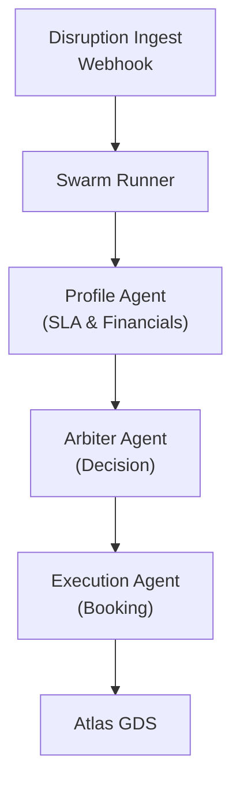
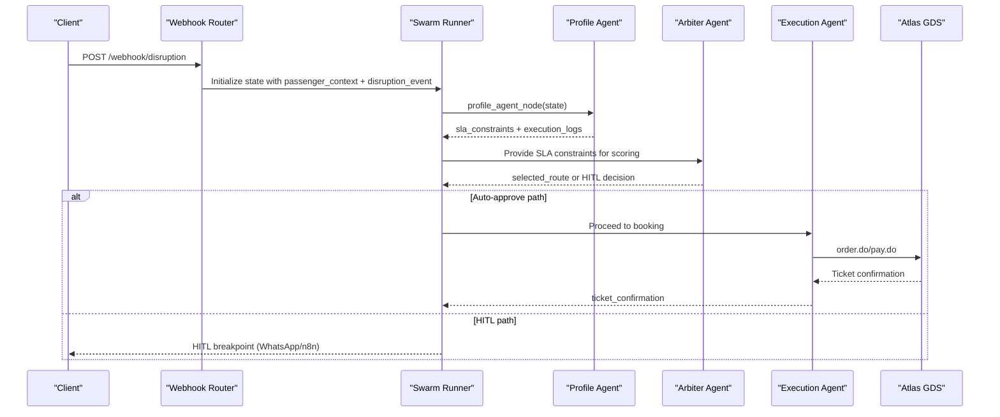
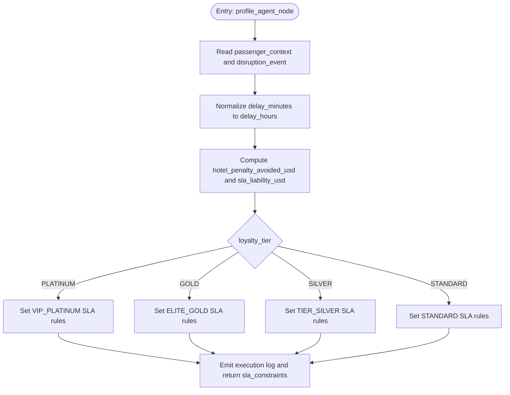
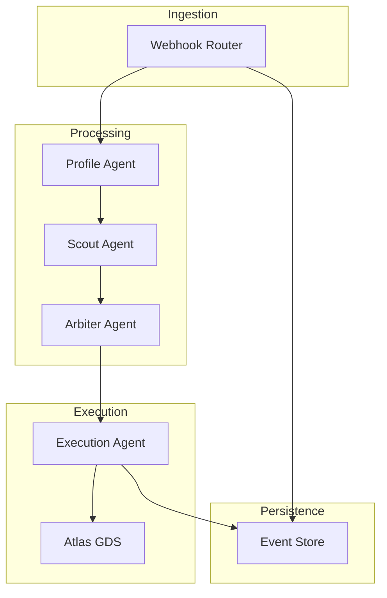
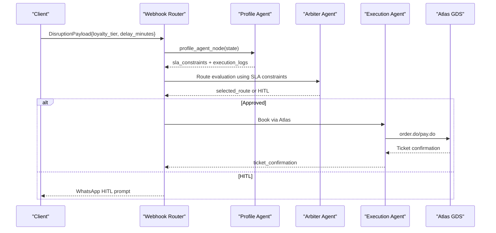
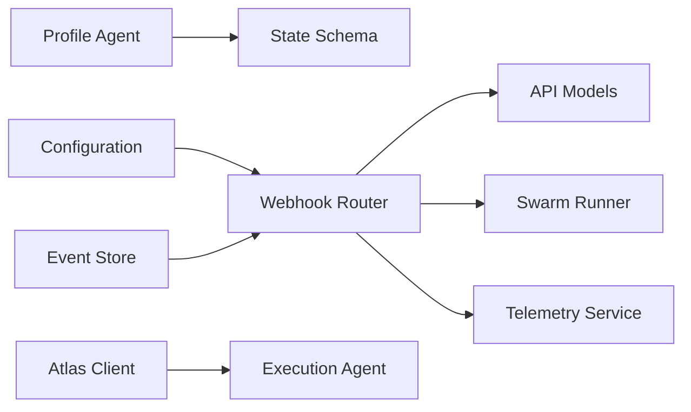

# Profile Agent

<cite>
**Referenced Files in This Document**
- [profile.py](file://travel-recovery-os/backend/agents/profile.py)
- [state.py](file://travel-recovery-os/backend/state.py)
- [api_models.py](file://travel-recovery-os/backend/schemas/api_models.py)
- [webhooks.py](file://travel-recovery-os/backend/api/routers/webhooks.py)
- [main.py](file://travel-recovery-os/backend/main.py)
- [config.py](file://travel-recovery-os/backend/config.py)
- [event_store.py](file://travel-recovery-os/backend/store/event_store.py)
- [atlas_client.py](file://travel-recovery-os/backend/tools/atlas_client.py)
- [README.md](file://travel-recovery-os/README.md)
</cite>

## Table of Contents
1. [Introduction](#introduction)
2. [Project Structure](#project-structure)
3. [Core Components](#core-components)
4. [Architecture Overview](#architecture-overview)
5. [Detailed Component Analysis](#detailed-component-analysis)
6. [Dependency Analysis](#dependency-analysis)
7. [Performance Considerations](#performance-considerations)
8. [Troubleshooting Guide](#troubleshooting-guide)
9. [Conclusion](#conclusion)
10. [Appendices](#appendices)

## Introduction
This document explains the Profile agent that evaluates passenger constraints and loyalty tier SLAs within the SynapseAir Travel Recovery OS. It details how the agent analyzes passenger profiles, calculates financial liability thresholds, determines priority levels based on loyalty status, and integrates into the broader multi-agent recovery workflow. It also documents constraint evaluation algorithms, SLA calculation logic, decision trees for different passenger categories, example workflows, validation rules, integration points with external systems, and privacy considerations for sensitive passenger data.

## Project Structure
The Profile agent is part of a LangGraph-based multi-agent swarm that orchestrates disruption recovery. The key files involved include:
- Profile agent implementation and SLA derivation
- Central state schema defining passenger context and disruption events
- API models for inbound disruption payloads
- Webhook router that initializes the swarm and passes passenger context to agents
- Configuration for environment and integrations
- Event store for persistence of disruption records
- Atlas client for GDS booking operations
- README for system overview and architecture

**Diagram sources**
- [webhooks.py:23-72](file://travel-recovery-os/backend/api/routers/webhooks.py#L23-L72)
- [profile.py:58-126](file://travel-recovery-os/backend/agents/profile.py#L58-L126)
- [README.md:88-126](file://travel-recovery-os/README.md#L88-L126)

**Section sources**
- [profile.py:1-126](file://travel-recovery-os/backend/agents/profile.py#L1-L126)
- [state.py:130-167](file://travel-recovery-os/backend/state.py#L130-L167)
- [api_models.py:5-79](file://travel-recovery-os/backend/schemas/api_models.py#L5-L79)
- [webhooks.py:23-72](file://travel-recovery-os/backend/api/routers/webhooks.py#L23-L72)
- [README.md:88-126](file://travel-recovery-os/README.md#L88-L126)

## Core Components
- Profile Agent: Evaluates loyalty tier and computes SLA constraints and financial arbitrage metrics used by downstream agents.
- State Schema: Defines the central state including passenger context, disruption event, and SLA constraints.
- API Models: Define structured inputs for disruptions, including loyalty tier and passenger identifiers.
- Webhooks Router: Initializes the swarm state from incoming payloads and triggers the agent pipeline.
- Configuration: Manages environment variables and external service endpoints (e.g., Atlas GDS).
- Event Store: Persists disruption records and outcomes for auditability and analytics.
- Atlas Client: Executes bookings via the Atlas GDS API when execution proceeds.

Key responsibilities:
- Derive financial liability thresholds based on delay duration and loyalty tier.
- Map loyalty tiers to SLA rules such as max layovers, cabin class preference, auto-approval allowance, and minimum carrier rating.
- Emit execution logs for observability and traceability.

**Section sources**
- [profile.py:17-43](file://travel-recovery-os/backend/agents/profile.py#L17-L43)
- [profile.py:58-126](file://travel-recovery-os/backend/agents/profile.py#L58-L126)
- [state.py:33-44](file://travel-recovery-os/backend/state.py#L33-L44)
- [state.py:130-167](file://travel-recovery-os/backend/state.py#L130-L167)
- [api_models.py:5-79](file://travel-recovery-os/backend/schemas/api_models.py#L5-L79)
- [webhooks.py:23-72](file://travel-recovery-os/backend/api/routers/webhooks.py#L23-L72)
- [config.py:62-70](file://travel-recovery-os/backend/config.py#L62-L70)
- [event_store.py:183-203](file://travel-recovery-os/backend/store/event_store.py#L183-L203)
- [atlas_client.py:270-300](file://travel-recovery-os/backend/tools/atlas_client.py#L270-L300)

## Architecture Overview
The Profile agent sits early in the recovery pipeline. Upon receiving a disruption payload, the webhook router constructs an initial state with passenger context and disruption event. The Profile agent then derives SLA constraints and financial metrics, which inform subsequent agents (Scout, Arbiter, Execution).

**Diagram sources**
- [webhooks.py:23-72](file://travel-recovery-os/backend/api/routers/webhooks.py#L23-L72)
- [profile.py:58-126](file://travel-recovery-os/backend/agents/profile.py#L58-L126)
- [README.md:88-126](file://travel-recovery-os/README.md#L88-L126)

## Detailed Component Analysis

### Profile Agent: Constraint Evaluation and SLA Logic
The Profile agent performs two primary tasks:
- Financial Arbitrage Calculation: Computes hotel penalty avoidance and SLA liability based on delay hours and loyalty tier.
- SLA Rule Derivation: Maps loyalty tier to operational constraints (max layovers, cabin class preference, auto-approval allowance, minimum carrier rating).

Algorithm highlights:
- Delay normalization: Converts delay minutes to hours with a minimum threshold.
- Tier-specific thresholds: Differentiates PLATINUM, GOLD, SILVER, and STANDARD tiers with distinct cost and penalty calculations.
- SLA rule mapping: Assigns tiered SLA constraints that guide downstream route selection and approval policies.

**Diagram sources**
- [profile.py:17-43](file://travel-recovery-os/backend/agents/profile.py#L17-L43)
- [profile.py:58-126](file://travel-recovery-os/backend/agents/profile.py#L58-L126)

**Section sources**
- [profile.py:17-43](file://travel-recovery-os/backend/agents/profile.py#L17-L43)
- [profile.py:58-126](file://travel-recovery-os/backend/agents/profile.py#L58-L126)

### Data Model and Inputs
- DisruptionPayload: Structured input fields include PNR, flight number, airline, origin, destination, scheduled departure, delay minutes, reason, loyalty tier, passenger name, phone, and optional n8n webhook URL.
- PassengerContext: Contains passenger identifiers, loyalty tier, and preferences like preferred cabin and seat.
- AgentSwarmState: Central state includes disruption_event, passenger_context, candidate_routes, selected_route, hitl_status, execution_logs, ticket_confirmation, and sla_constraints.

These models ensure consistent data flow from ingestion through agent processing to final booking.

**Section sources**
- [api_models.py:5-79](file://travel-recovery-os/backend/schemas/api_models.py#L5-L79)
- [state.py:33-44](file://travel-recovery-os/backend/state.py#L33-L44)
- [state.py:130-167](file://travel-recovery-os/backend/state.py#L130-L167)

### Integration Points
- Webhook Router: Accepts disruption payloads, builds initial state, and triggers the swarm pipeline asynchronously.
- Configuration: Provides Atlas GDS credentials and base URLs for booking and search operations.
- Event Store: Persists disruption records including loyalty tier and passenger name for audit and analytics.
- Atlas Client: Executes orders and payments via Atlas GDS APIs during execution phase.

**Diagram sources**
- [webhooks.py:23-72](file://travel-recovery-os/backend/api/routers/webhooks.py#L23-L72)
- [config.py:62-70](file://travel-recovery-os/backend/config.py#L62-L70)
- [event_store.py:183-203](file://travel-recovery-os/backend/store/event_store.py#L183-L203)
- [atlas_client.py:270-300](file://travel-recovery-os/backend/tools/atlas_client.py#L270-L300)

**Section sources**
- [webhooks.py:23-72](file://travel-recovery-os/backend/api/routers/webhooks.py#L23-L72)
- [config.py:62-70](file://travel-recovery-os/backend/config.py#L62-L70)
- [event_store.py:183-203](file://travel-recovery-os/backend/store/event_store.py#L183-L203)
- [atlas_client.py:270-300](file://travel-recovery-os/backend/tools/atlas_client.py#L270-L300)

### Decision Trees by Loyalty Tier
- PLATINUM: Direct flights preferred; zero layovers allowed; Business cabin preference; auto-approval enabled; high minimum carrier rating; VIP_PLATINUM SLA tier.
- GOLD: Up to one layover; limited layover hours; Business cabin preference; auto-approval enabled; elevated minimum carrier rating; ELITE_GOLD SLA tier.
- SILVER: Up to one layover; moderate layover hours; Economy cabin preference; no auto-approval; mid-tier minimum carrier rating; TIER_SILVER SLA tier.
- STANDARD: Up to two layovers; higher layover hours; Economy cabin preference; no auto-approval; lower minimum carrier rating; STANDARD SLA tier.

These rules constrain route candidates and determine whether human-in-the-loop intervention is required.

**Section sources**
- [profile.py:70-109](file://travel-recovery-os/backend/agents/profile.py#L70-L109)

### Example Workflow: Profile Analysis
End-to-end steps:
1. Client sends disruption payload with loyalty tier and delay minutes.
2. Webhook router constructs initial state and starts swarm.
3. Profile agent normalizes delay, computes financials, and sets SLA rules based on tier.
4. Downstream agents use SLA constraints to evaluate routes and decide approvals.
5. If approved, execution proceeds to book via Atlas GDS; otherwise, HITL may be triggered.

**Diagram sources**
- [webhooks.py:23-72](file://travel-recovery-os/backend/api/routers/webhooks.py#L23-L72)
- [profile.py:58-126](file://travel-recovery-os/backend/agents/profile.py#L58-L126)
- [atlas_client.py:270-300](file://travel-recovery-os/backend/tools/atlas_client.py#L270-L300)

**Section sources**
- [webhooks.py:23-72](file://travel-recovery-os/backend/api/routers/webhooks.py#L23-L72)
- [profile.py:58-126](file://travel-recovery-os/backend/agents/profile.py#L58-L126)
- [atlas_client.py:270-300](file://travel-recovery-os/backend/tools/atlas_client.py#L270-L300)

## Dependency Analysis
- Profile Agent depends on:
  - State schema for reading passenger_context and disruption_event.
  - ExecutionLog type for emitting telemetry.
- Webhook Router depends on:
  - API models for input validation.
  - Swarm runner to execute the pipeline.
  - Telemetry service for broadcasting events.
- Configuration provides external service endpoints and credentials.
- Event Store persists disruption records and results.
- Atlas Client interacts with GDS for booking operations.

**Diagram sources**
- [profile.py:10-14](file://travel-recovery-os/backend/agents/profile.py#L10-L14)
- [state.py:130-167](file://travel-recovery-os/backend/state.py#L130-L167)
- [api_models.py:5-79](file://travel-recovery-os/backend/schemas/api_models.py#L5-L79)
- [webhooks.py:23-72](file://travel-recovery-os/backend/api/routers/webhooks.py#L23-L72)
- [config.py:62-70](file://travel-recovery-os/backend/config.py#L62-L70)
- [event_store.py:183-203](file://travel-recovery-os/backend/store/event_store.py#L183-L203)
- [atlas_client.py:270-300](file://travel-recovery-os/backend/tools/atlas_client.py#L270-L300)

**Section sources**
- [profile.py:10-14](file://travel-recovery-os/backend/agents/profile.py#L10-L14)
- [state.py:130-167](file://travel-recovery-os/backend/state.py#L130-L167)
- [api_models.py:5-79](file://travel-recovery-os/backend/schemas/api_models.py#L5-L79)
- [webhooks.py:23-72](file://travel-recovery-os/backend/api/routers/webhooks.py#L23-L72)
- [config.py:62-70](file://travel-recovery-os/backend/config.py#L62-L70)
- [event_store.py:183-203](file://travel-recovery-os/backend/store/event_store.py#L183-L203)
- [atlas_client.py:270-300](file://travel-recovery-os/backend/tools/atlas_client.py#L270-L300)

## Performance Considerations
- Minimal computation in Profile agent ensures fast SLA derivation; complexity is O(1) per request due to fixed tier branching.
- Asynchronous swarm execution prevents blocking on I/O-bound operations (GDS calls, messaging).
- Telemetry streaming enables real-time monitoring without impacting core processing latency.
- Caching or precomputing tier-specific constants could further reduce overhead if needed.

[No sources needed since this section provides general guidance]

## Troubleshooting Guide
Common issues and resolutions:
- Missing or invalid API key: Ensure API key is provided and configured; verify rate limiter initialization.
- No active session for thread_id: Confirm that the swarm graph has been initialized and checkpointer state exists before sending consensus.
- Booking failures: Validate Atlas GDS credentials and response codes; handle errors gracefully and emit execution logs.
- Persistence errors: Check database connectivity and schema consistency for disruption records.

Operational checks:
- Health endpoint returns service status and version.
- Logs include node-level execution entries with timestamps and messages.

**Section sources**
- [main.py:119-122](file://travel-recovery-os/backend/main.py#L119-L122)
- [webhooks.py:84-105](file://travel-recovery-os/backend/api/routers/webhooks.py#L84-L105)
- [atlas_client.py:270-300](file://travel-recovery-os/backend/tools/atlas_client.py#L270-L300)
- [event_store.py:183-203](file://travel-recovery-os/backend/store/event_store.py#L183-L203)

## Conclusion
The Profile agent is a critical component that translates passenger loyalty and disruption characteristics into actionable SLA constraints and financial metrics. Its deterministic logic ensures consistent prioritization and guides downstream agents toward optimal recovery decisions. Integrated with robust state management, webhooks, configuration, and external GDS services, it supports scalable, low-latency disruption recovery while maintaining observability and auditability.

[No sources needed since this section summarizes without analyzing specific files]

## Appendices

### Privacy and Data Handling
- Sensitive fields in payloads include passenger name and phone number; these are passed through the state and persisted in the event store for tracking and compliance.
- External integrations (Atlas GDS) receive minimal necessary passenger identifiers for booking; ensure encryption in transit and access controls at rest.
- Environment configuration manages secrets and endpoints securely; validate production settings to avoid default insecure values.
- Logging should avoid emitting unnecessary sensitive data; prefer anonymized identifiers where possible.

**Section sources**
- [api_models.py:56-70](file://travel-recovery-os/backend/schemas/api_models.py#L56-L70)
- [event_store.py:183-203](file://travel-recovery-os/backend/store/event_store.py#L183-L203)
- [config.py:92-112](file://travel-recovery-os/backend/config.py#L92-L112)
- [atlas_client.py:270-300](file://travel-recovery-os/backend/tools/atlas_client.py#L270-L300)