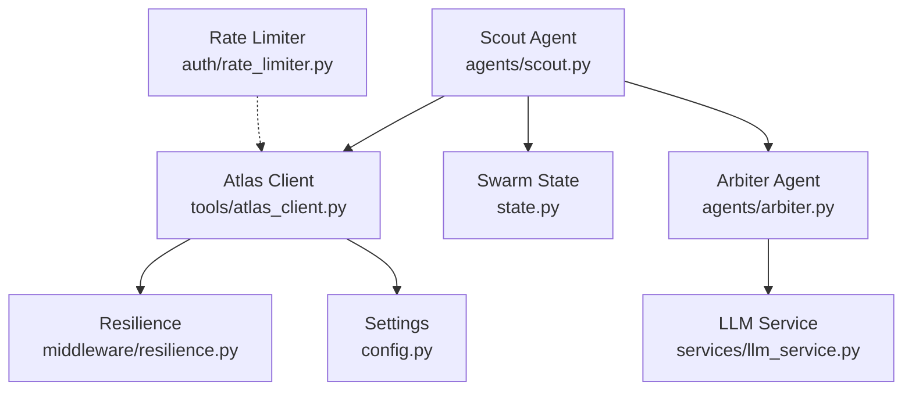
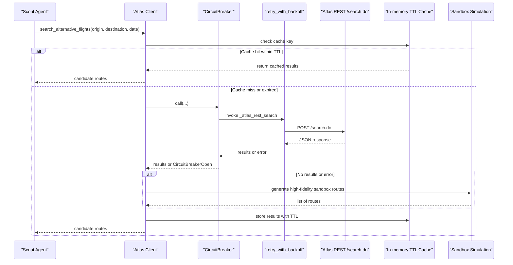
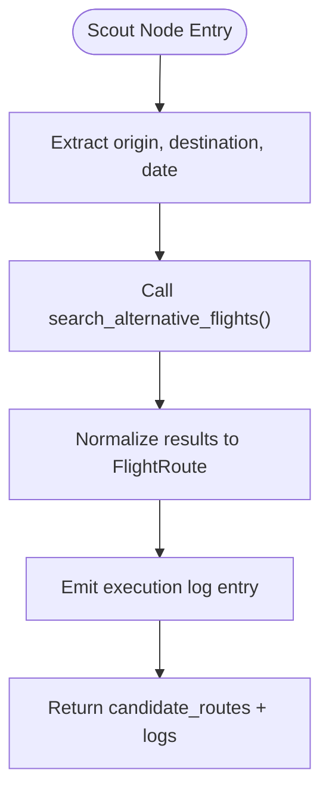
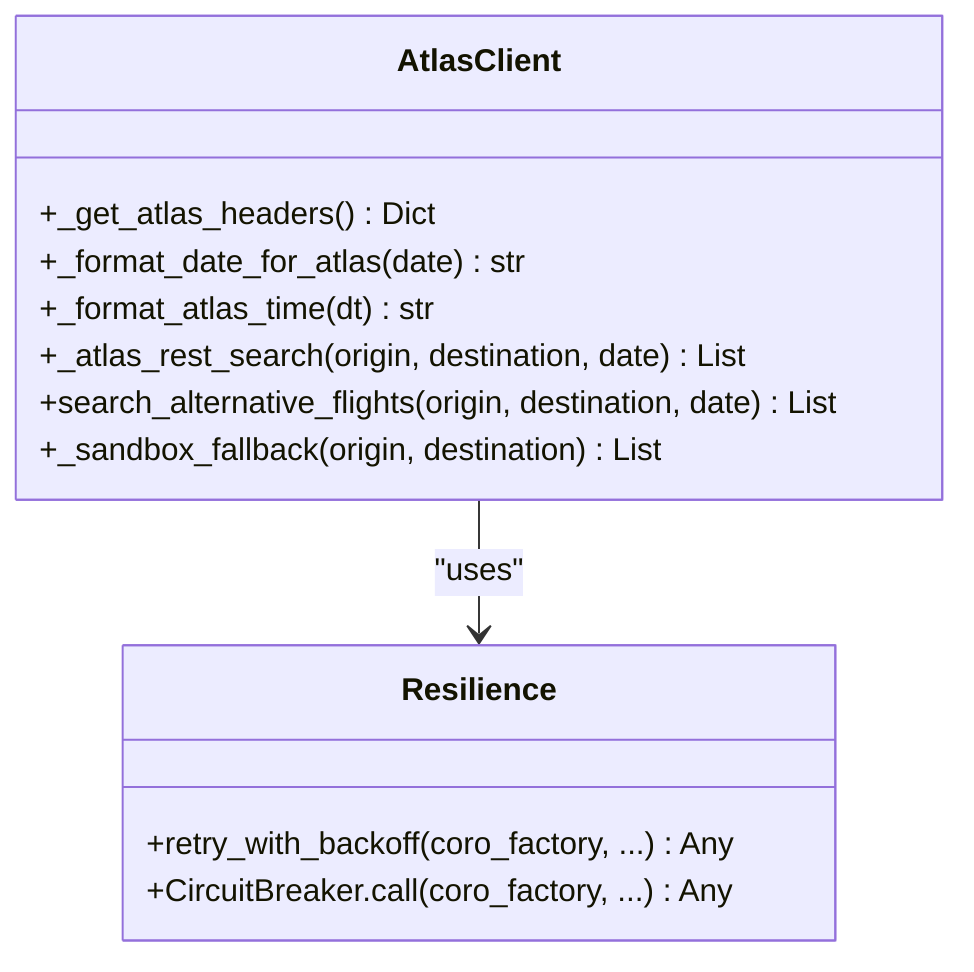
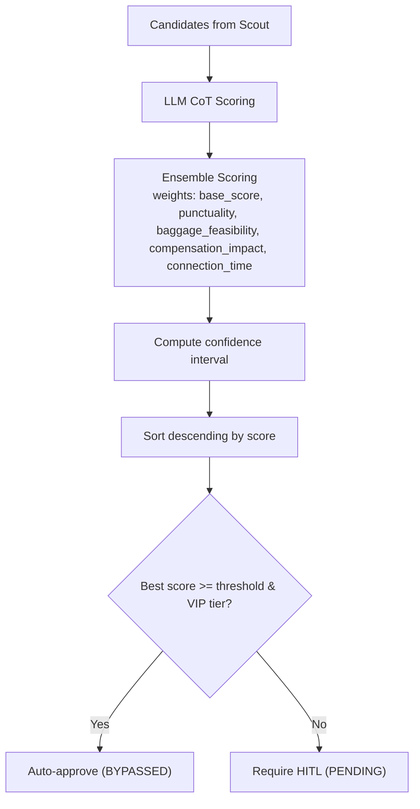
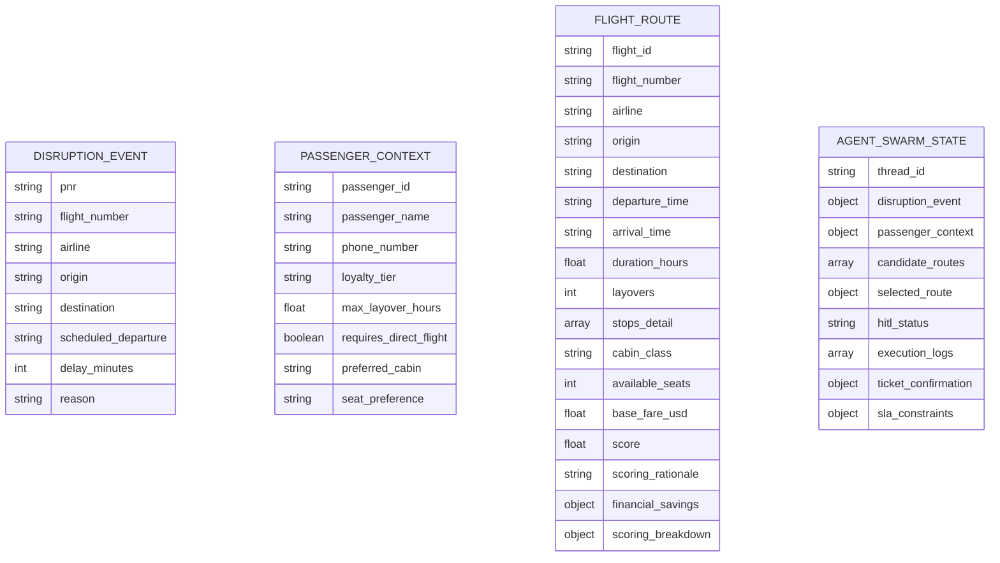
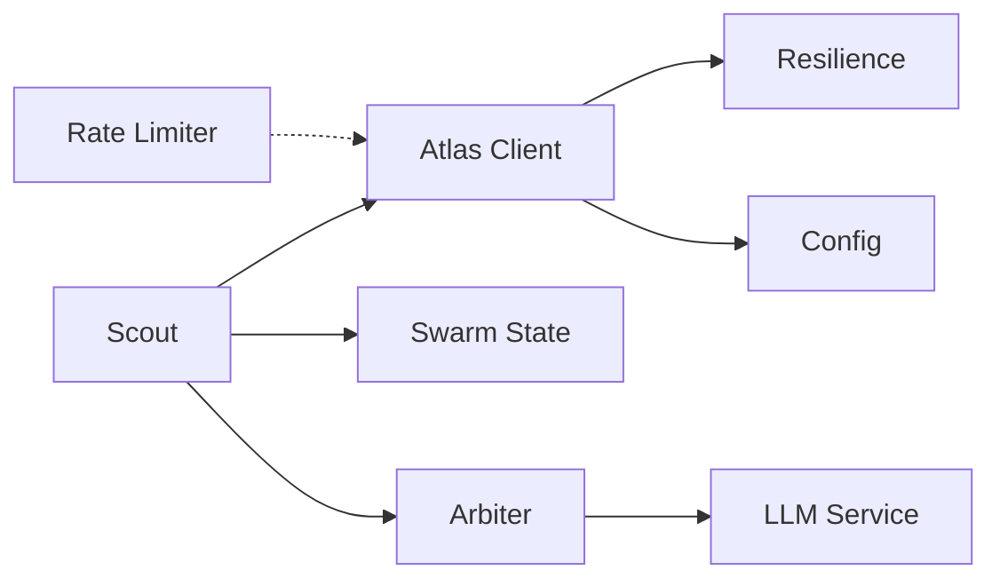

# Scout Agent

<cite>
**Referenced Files in This Document**
- [scout.py](file://travel-recovery-os/backend/agents/scout.py)
- [atlas_client.py](file://travel-recovery-os/backend/tools/atlas_client.py)
- [resilience.py](file://travel-recovery-os/backend/middleware/resilience.py)
- [config.py](file://travel-recovery-os/backend/config.py)
- [state.py](file://travel-recovery-os/backend/state.py)
- [arbiter.py](file://travel-recovery-os/backend/agents/arbiter.py)
- [llm_service.py](file://travel-recovery-os/backend/services/llm_service.py)
- [rate_limiter.py](file://travel-recovery-os/backend/auth/rate_limiter.py)
- [SKILL.md](file://atlas-api-integration-advisor (2)/atlas-api-integration-advisor/SKILL.md)
</cite>

## Table of Contents
1. [Introduction](#introduction)
2. [Project Structure](#project-structure)
3. [Core Components](#core-components)
4. [Architecture Overview](#architecture-overview)
5. [Detailed Component Analysis](#detailed-component-analysis)
6. [Dependency Analysis](#dependency-analysis)
7. [Performance Considerations](#performance-considerations)
8. [Troubleshooting Guide](#troubleshooting-guide)
9. [Conclusion](#conclusion)
10. [Appendices](#appendices)

## Introduction
This document explains the Scout agent responsible for alternative route discovery via Atlas GDS integration. It covers flight search algorithms, inventory filtering criteria, and route optimization strategies used by the system. It also documents Atlas API integration patterns, request/response handling, error recovery mechanisms, caching strategies, rate limiting, and fallback procedures when Atlas services are degraded.

## Project Structure
The Scout agent is part of a multi-agent travel recovery system. The key files involved in alternative route discovery and evaluation include:
- Scout agent: orchestrates Atlas searches and populates candidate routes into the swarm state.
- Atlas client: integrates with the official Atlas GDS REST endpoints, implements caching, retries, circuit breaking, and sandbox fallbacks.
- Resilience middleware: provides retry with backoff and circuit breaker primitives.
- Configuration: centralizes environment-based settings for Atlas endpoints and credentials.
- State schema: defines the shared data structures passed between agents.
- Arbiter agent: scores and ranks candidate routes using LLM-driven reasoning plus ensemble scoring.
- Rate limiter: sliding window rate limiter to protect downstream services.

**Diagram sources**
- [scout.py:32-86](file://travel-recovery-os/backend/agents/scout.py#L32-L86)
- [atlas_client.py:175-219](file://travel-recovery-os/backend/tools/atlas_client.py#L175-L219)
- [resilience.py:25-80](file://travel-recovery-os/backend/middleware/resilience.py#L25-L80)
- [config.py:63-71](file://travel-recovery-os/backend/config.py#L63-L71)
- [state.py:130-167](file://travel-recovery-os/backend/state.py#L130-L167)
- [arbiter.py:128-244](file://travel-recovery-os/backend/agents/arbiter.py#L128-L244)
- [llm_service.py:126-205](file://travel-recovery-os/backend/services/llm_service.py#L126-L205)
- [rate_limiter.py:41-99](file://travel-recovery-os/backend/auth/rate_limiter.py#L41-L99)

**Section sources**
- [scout.py:32-86](file://travel-recovery-os/backend/agents/scout.py#L32-L86)
- [atlas_client.py:175-219](file://travel-recovery-os/backend/tools/atlas_client.py#L175-L219)
- [resilience.py:25-80](file://travel-recovery-os/backend/middleware/resilience.py#L25-L80)
- [config.py:63-71](file://travel-recovery-os/backend/config.py#L63-L71)
- [state.py:130-167](file://travel-recovery-os/backend/state.py#L130-L167)
- [arbiter.py:128-244](file://travel-recovery-os/backend/agents/arbiter.py#L128-L244)
- [llm_service.py:126-205](file://travel-recovery-os/backend/services/llm_service.py#L126-L205)
- [rate_limiter.py:41-99](file://travel-recovery-os/backend/auth/rate_limiter.py#L41-L99)

## Core Components
- Scout agent node: extracts disruption context (origin, destination, date), calls Atlas search, normalizes results into candidate routes, and logs execution telemetry.
- Atlas client: performs live search via REST, caches results with TTL, applies retries and circuit breaking, and falls back to high-fidelity sandbox simulation if needed.
- Resilience layer: exponential backoff retry and circuit breaker states (CLOSED/OPEN/HALF_OPEN).
- Configuration: environment-driven settings for Atlas base URLs, credentials, and operational flags.
- Swarm state: typed schema carrying disruption events, passenger context, candidate routes, selected route, and logs across agents.
- Arbiter agent: evaluates candidates using LLM reasoning and ensemble scoring to rank and select optimal routes.
- Rate limiter: sliding window limiter to protect APIs from overload.

**Section sources**
- [scout.py:32-86](file://travel-recovery-os/backend/agents/scout.py#L32-L86)
- [atlas_client.py:175-219](file://travel-recovery-os/backend/tools/atlas_client.py#L175-L219)
- [resilience.py:25-80](file://travel-recovery-os/backend/middleware/resilience.py#L25-L80)
- [config.py:63-71](file://travel-recovery-os/backend/config.py#L63-L71)
- [state.py:130-167](file://travel-recovery-os/backend/state.py#L130-L167)
- [arbiter.py:128-244](file://travel-recovery-os/backend/agents/arbiter.py#L128-L244)
- [rate_limiter.py:41-99](file://travel-recovery-os/backend/auth/rate_limiter.py#L41-L99)

## Architecture Overview
The Scout agent initiates an alternative route search by calling the Atlas client. The client attempts a live REST search with resilience wrappers; on failure or empty results, it falls back to a calibrated sandbox simulation. Results are cached with TTL to reduce repeated calls. Candidate routes are normalized and returned to Scout, which injects them into the swarm state for Arbiter evaluation.

**Diagram sources**
- [atlas_client.py:175-219](file://travel-recovery-os/backend/tools/atlas_client.py#L175-L219)
- [atlas_client.py:82-167](file://travel-recovery-os/backend/tools/atlas_client.py#L82-L167)
- [resilience.py:25-80](file://travel-recovery-os/backend/middleware/resilience.py#L25-L80)
- [resilience.py:97-216](file://travel-recovery-os/backend/middleware/resilience.py#L97-L216)

**Section sources**
- [atlas_client.py:175-219](file://travel-recovery-os/backend/tools/atlas_client.py#L175-L219)
- [atlas_client.py:82-167](file://travel-recovery-os/backend/tools/atlas_client.py#L82-L167)
- [resilience.py:25-80](file://travel-recovery-os/backend/middleware/resilience.py#L25-L80)
- [resilience.py:97-216](file://travel-recovery-os/backend/middleware/resilience.py#L97-L216)

## Detailed Component Analysis

### Scout Agent Node
Responsibilities:
- Extract disruption event fields (origin, destination, scheduled departure).
- Call Atlas search to retrieve candidate routes.
- Normalize raw results into FlightRoute objects with placeholders for scoring.
- Emit execution logs for observability.

Key behaviors:
- Uses safe state accessors to handle different state representations.
- Logs counts and flight numbers for traceability.

**Diagram sources**
- [scout.py:32-86](file://travel-recovery-os/backend/agents/scout.py#L32-L86)

**Section sources**
- [scout.py:32-86](file://travel-recovery-os/backend/agents/scout.py#L32-L86)

### Atlas Client Integration
Responsibilities:
- Build headers and format dates per Atlas specification.
- Perform live REST search via /search.do with timeout and status checks.
- Normalize routing responses into consistent route objects.
- Implement in-memory TTL cache keyed by origin:destination:date.
- Wrap calls with circuit breaker and retry with backoff.
- Provide sandbox fallback when live search fails or returns no inventory.

Search algorithm highlights:
- Date normalization ensures future sandbox-compliant dates.
- Response validation enforces status == 0 and presence of routings.
- Normalization caps results and enriches fields like cabin class and availability.

Fallback behavior:
- On exceptions or empty results, generates high-fidelity sandbox routes with realistic schedules and fares.

**Diagram sources**
- [atlas_client.py:38-80](file://travel-recovery-os/backend/tools/atlas_client.py#L38-L80)
- [atlas_client.py:82-167](file://travel-recovery-os/backend/tools/atlas_client.py#L82-L167)
- [atlas_client.py:175-219](file://travel-recovery-os/backend/tools/atlas_client.py#L175-L219)
- [atlas_client.py:360-425](file://travel-recovery-os/backend/tools/atlas_client.py#L360-L425)
- [resilience.py:25-80](file://travel-recovery-os/backend/middleware/resilience.py#L25-L80)
- [resilience.py:97-216](file://travel-recovery-os/backend/middleware/resilience.py#L97-L216)

**Section sources**
- [atlas_client.py:38-80](file://travel-recovery-os/backend/tools/atlas_client.py#L38-L80)
- [atlas_client.py:82-167](file://travel-recovery-os/backend/tools/atlas_client.py#L82-L167)
- [atlas_client.py:175-219](file://travel-recovery-os/backend/tools/atlas_client.py#L175-L219)
- [atlas_client.py:360-425](file://travel-recovery-os/backend/tools/atlas_client.py#L360-L425)
- [resilience.py:25-80](file://travel-recovery-os/backend/middleware/resilience.py#L25-L80)
- [resilience.py:97-216](file://travel-recovery-os/backend/middleware/resilience.py#L97-L216)

### Route Optimization Strategies (Arbiter)
Responsibilities:
- Integrate LLM-driven CoT scoring with deterministic ensemble scoring.
- Compute multi-factor weighted score including punctuality, baggage feasibility, compensation impact, and connection time.
- Rank candidates and select best route; determine HITL bypass or pending based on loyalty tier and score thresholds.

Optimization logic:
- Weights combine base score (from LLM or deterministic engine) with domain-specific factors.
- Confidence intervals approximate uncertainty around final scores.
- Sorting yields top-ranked alternatives for rebooking decisions.

**Diagram sources**
- [arbiter.py:25-31](file://travel-recovery-os/backend/agents/arbiter.py#L25-L31)
- [arbiter.py:34-113](file://travel-recovery-os/backend/agents/arbiter.py#L34-L113)
- [arbiter.py:128-244](file://travel-recovery-os/backend/agents/arbiter.py#L128-L244)
- [llm_service.py:126-205](file://travel-recovery-os/backend/services/llm_service.py#L126-L205)

**Section sources**
- [arbiter.py:25-31](file://travel-recovery-os/backend/agents/arbiter.py#L25-L31)
- [arbiter.py:34-113](file://travel-recovery-os/backend/agents/arbiter.py#L34-L113)
- [arbiter.py:128-244](file://travel-recovery-os/backend/agents/arbiter.py#L128-L244)
- [llm_service.py:126-205](file://travel-recovery-os/backend/services/llm_service.py#L126-L205)

### Data Models and State Flow
- DisruptionEvent carries PNR, flight number, airline, origin, destination, scheduled departure, delay minutes, and reason.
- PassengerContext includes loyalty tier, constraints (max layover hours, direct flight preference), cabin preferences, and seat preferences.
- FlightRoute represents candidate routes with fields such as flight_id, flight_number, airline, times, duration, layovers, cabin_class, available_seats, base_fare_usd, score, scoring_rationale, financial_savings, and scoring_breakdown.
- AgentSwarmState aggregates these models and supports additive reducers for lists like candidate_routes and execution_logs.

**Diagram sources**
- [state.py:20-65](file://travel-recovery-os/backend/state.py#L20-L65)
- [state.py:130-167](file://travel-recovery-os/backend/state.py#L130-L167)

**Section sources**
- [state.py:20-65](file://travel-recovery-os/backend/state.py#L20-L65)
- [state.py:130-167](file://travel-recovery-os/backend/state.py#L130-L167)

## Dependency Analysis
- Scout depends on Atlas client for live inventory lookup and writes candidate routes into the swarm state consumed by Arbiter.
- Atlas client depends on resilience utilities for retries and circuit breaking, and configuration for endpoints and credentials.
- Arbiter depends on LLM service for CoT reasoning and uses ensemble scoring to refine rankings.
- Rate limiter can be applied at API boundaries to throttle requests to downstream services.

**Diagram sources**
- [scout.py:32-86](file://travel-recovery-os/backend/agents/scout.py#L32-L86)
- [atlas_client.py:175-219](file://travel-recovery-os/backend/tools/atlas_client.py#L175-L219)
- [resilience.py:25-80](file://travel-recovery-os/backend/middleware/resilience.py#L25-L80)
- [config.py:63-71](file://travel-recovery-os/backend/config.py#L63-L71)
- [state.py:130-167](file://travel-recovery-os/backend/state.py#L130-L167)
- [arbiter.py:128-244](file://travel-recovery-os/backend/agents/arbiter.py#L128-L244)
- [llm_service.py:126-205](file://travel-recovery-os/backend/services/llm_service.py#L126-L205)
- [rate_limiter.py:41-99](file://travel-recovery-os/backend/auth/rate_limiter.py#L41-L99)

**Section sources**
- [scout.py:32-86](file://travel-recovery-os/backend/agents/scout.py#L32-L86)
- [atlas_client.py:175-219](file://travel-recovery-os/backend/tools/atlas_client.py#L175-L219)
- [resilience.py:25-80](file://travel-recovery-os/backend/middleware/resilience.py#L25-L80)
- [config.py:63-71](file://travel-recovery-os/backend/config.py#L63-L71)
- [state.py:130-167](file://travel-recovery-os/backend/state.py#L130-L167)
- [arbiter.py:128-244](file://travel-recovery-os/backend/agents/arbiter.py#L128-L244)
- [llm_service.py:126-205](file://travel-recovery-os/backend/services/llm_service.py#L126-L205)
- [rate_limiter.py:41-99](file://travel-recovery-os/backend/auth/rate_limiter.py#L41-L99)

## Performance Considerations
- In-memory TTL cache: Reduces repeated Atlas calls for identical origin:destination:date queries within a short window, improving latency and reducing load.
- Circuit breaker: Prevents cascading failures by fast-failing when Atlas repeatedly errors, allowing quick fallback to sandbox simulation.
- Retry with backoff: Mitigates transient network issues and temporary server overloads.
- Result normalization: Limits processed results to a manageable set to avoid excessive downstream processing.
- Ensemble scoring: Combines multiple signals efficiently to produce robust rankings without heavy computation.

[No sources needed since this section provides general guidance]

## Troubleshooting Guide
Common issues and recovery mechanisms:
- Atlas search returns non-200 HTTP or non-zero status: The client raises errors that trigger fallback to sandbox simulation.
- Empty routings: Indicates no inventory; fallback provides high-fidelity simulated options.
- Circuit breaker open: Requests are rejected quickly; subsequent probes test recovery after cooldown.
- Daily quota exceeded: Follow recommended retry strategy and wait until next UTC day or request quota increase.
- Session/Routing expiration: Restart from search or verify steps as appropriate.
- Authentication failures: Validate credentials and endpoint configuration.

Operational tips:
- Monitor execution logs emitted by Scout and Arbiter nodes for route counts and decision outcomes.
- Use rate limiter to protect endpoints and avoid throttling during peak loads.
- Ensure Redis is available for distributed rate limiting if scaling beyond single-instance deployments.

**Section sources**
- [atlas_client.py:82-167](file://travel-recovery-os/backend/tools/atlas_client.py#L82-L167)
- [atlas_client.py:175-219](file://travel-recovery-os/backend/tools/atlas_client.py#L175-L219)
- [resilience.py:97-216](file://travel-recovery-os/backend/middleware/resilience.py#L97-L216)
- [SKILL.md:328-420](file://atlas-api-integration-advisor (2)/atlas-api-integration-advisor/SKILL.md#L328-L420)
- [rate_limiter.py:41-99](file://travel-recovery-os/backend/auth/rate_limiter.py#L41-L99)

## Conclusion
The Scout agent leverages Atlas GDS integration to discover alternative routes under disruption scenarios. It combines resilient API calls, caching, and fallbacks to ensure reliable operation even when Atlas services degrade. The resulting candidate routes are evaluated by the Arbiter using both LLM-driven reasoning and deterministic ensemble scoring to optimize for passenger SLAs and operational constraints. Rate limiting and circuit breaking further enhance stability and performance at scale.

[No sources needed since this section summarizes without analyzing specific files]

## Appendices

### Atlas API Integration Patterns
- Request headers include client ID and secret per Atlas specification.
- Search payload specifies trip type, passenger counts, origin/destination, date, currency, and request source.
- Responses must have status zero and contain routings; otherwise, errors are raised and handled via fallback.

**Section sources**
- [atlas_client.py:38-48](file://travel-recovery-os/backend/tools/atlas_client.py#L38-L48)
- [atlas_client.py:82-119](file://travel-recovery-os/backend/tools/atlas_client.py#L82-L119)
- [SKILL.md:328-420](file://atlas-api-integration-advisor (2)/atlas-api-integration-advisor/SKILL.md#L328-L420)

### Example Search Queries and Filtering
- Typical query parameters: origin, destination, travel date formatted per Atlas rules, currency, and request source.
- Filtering criteria:
  - Availability: only routings with positive inventory are considered.
  - Cabin class: first result may be Business; others Economy.
  - Layovers and stops: normalized into structured fields for downstream evaluation.
  - Duration and punctuality: enriched for scoring.

**Section sources**
- [atlas_client.py:82-167](file://travel-recovery-os/backend/tools/atlas_client.py#L82-L167)
- [state.py:46-65](file://travel-recovery-os/backend/state.py#L46-L65)

### Error Recovery Mechanisms
- Retry with exponential backoff reduces transient failures.
- Circuit breaker prevents overload during sustained outages.
- Sandbox fallback ensures continuity of service when live inventory is unavailable.

**Section sources**
- [resilience.py:25-80](file://travel-recovery-os/backend/middleware/resilience.py#L25-L80)
- [resilience.py:97-216](file://travel-recovery-os/backend/middleware/resilience.py#L97-L216)
- [atlas_client.py:175-219](file://travel-recovery-os/backend/tools/atlas_client.py#L175-L219)
- [atlas_client.py:360-425](file://travel-recovery-os/backend/tools/atlas_client.py#L360-L425)

### Caching Strategies
- In-memory TTL cache keyed by origin:destination:date reduces redundant calls.
- TTL window balances freshness with performance.

**Section sources**
- [atlas_client.py:170-219](file://travel-recovery-os/backend/tools/atlas_client.py#L170-L219)

### Rate Limiting
- Sliding window rate limiter protects downstream services.
- Supports Redis-backed or in-memory stores depending on deployment.

**Section sources**
- [rate_limiter.py:41-99](file://travel-recovery-os/backend/auth/rate_limiter.py#L41-L99)

### Fallback Procedures When Atlas Services Are Degraded
- If live search fails or returns no inventory, high-fidelity sandbox simulation provides realistic alternatives.
- Circuit breaker opens after repeated failures and transitions to half-open for probing recovery.

**Section sources**
- [atlas_client.py:175-219](file://travel-recovery-os/backend/tools/atlas_client.py#L175-L219)
- [atlas_client.py:360-425](file://travel-recovery-os/backend/tools/atlas_client.py#L360-L425)
- [resilience.py:97-216](file://travel-recovery-os/backend/middleware/resilience.py#L97-L216)