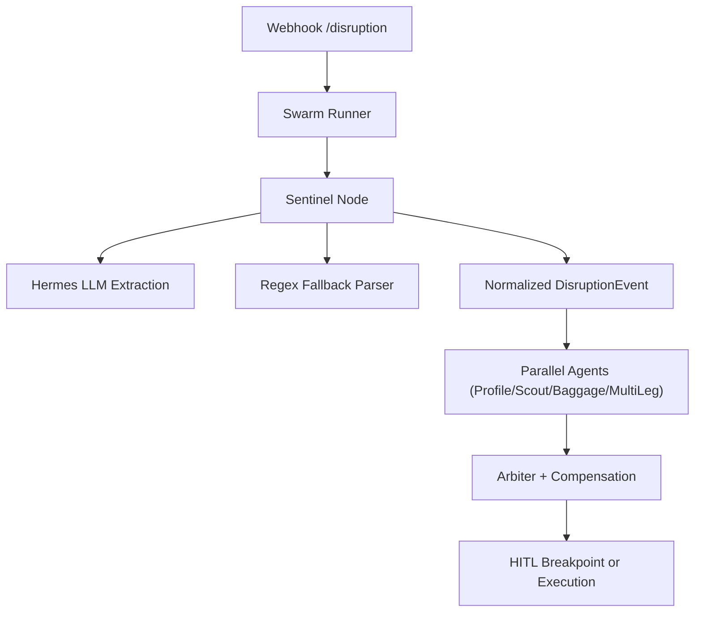
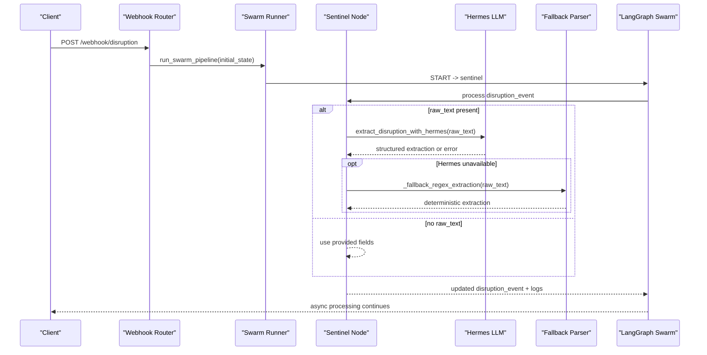
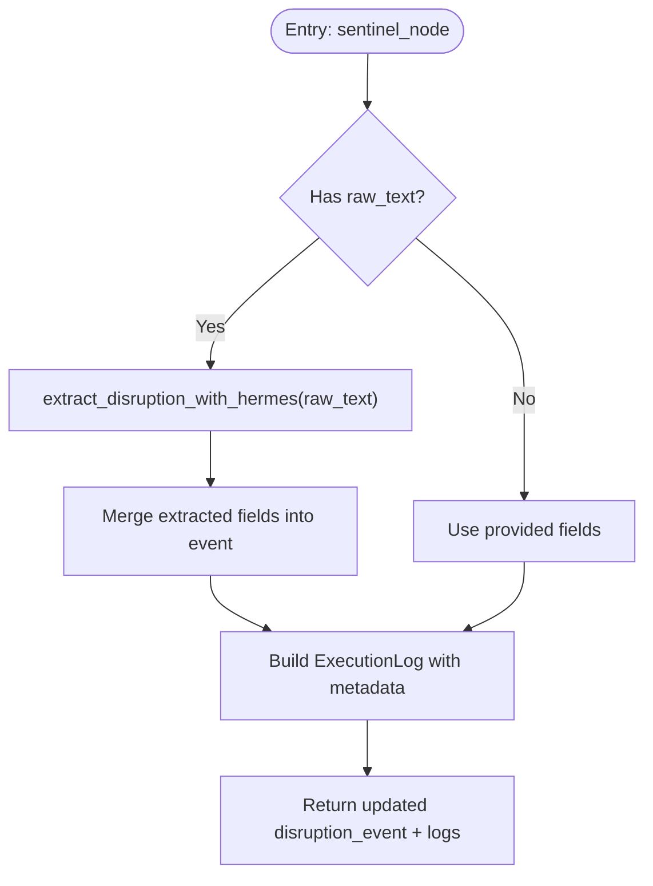
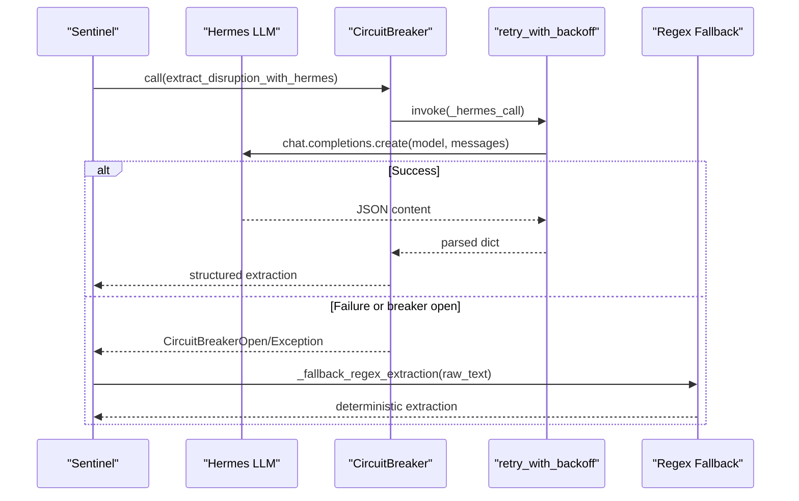
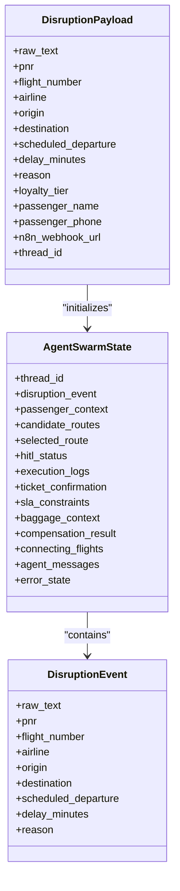
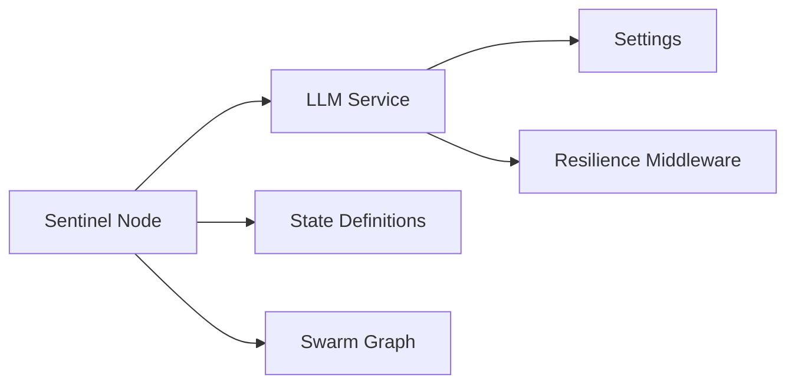

# Sentinel Agent

<cite>
**Referenced Files in This Document**
- [sentinel.py](file://travel-recovery-os/backend/agents/sentinel.py)
- [llm_service.py](file://travel-recovery-os/backend/services/llm_service.py)
- [webhooks.py](file://travel-recovery-os/backend/api/routers/webhooks.py)
- [state.py](file://travel-recovery-os/backend/state.py)
- [api_models.py](file://travel-recovery-os/backend/schemas/api_models.py)
- [resilience.py](file://travel-recovery-os/backend/middleware/resilience.py)
- [config.py](file://travel-recovery-os/backend/config.py)
- [swarm.py](file://travel-recovery-os/backend/swarm.py)
</cite>

## Table of Contents
1. [Introduction](#introduction)
2. [Project Structure](#project-structure)
3. [Core Components](#core-components)
4. [Architecture Overview](#architecture-overview)
5. [Detailed Component Analysis](#detailed-component-analysis)
6. [Dependency Analysis](#dependency-analysis)
7. [Performance Considerations](#performance-considerations)
8. [Troubleshooting Guide](#troubleshooting-guide)
9. [Conclusion](#conclusion)

## Introduction
This document explains the Sentinel agent, which intercepts raw disruption signals and normalizes them into a structured DisruptionEvent for downstream processing. When provided with unstructured text (e.g., NOTAMs or SMS alerts), Sentinel delegates extraction to the Hermes LLM service to produce a strict JSON schema. If Hermes is unavailable, deterministic regex-based fallback parsing ensures continuity. The normalized event then flows through the multi-agent swarm pipeline for route discovery, scoring, passenger consent handling, and ticketing.

## Project Structure
The Sentinel agent integrates with:
- Webhook ingestion that builds an initial state and triggers the swarm
- LLM orchestration for extraction and fallback parsing
- Resilience middleware for retries and circuit breaking
- Centralized configuration for endpoints and models
- LangGraph-based swarm graph that orchestrates subsequent agents

**Diagram sources**
- [webhooks.py:23-72](file://travel-recovery-os/backend/api/routers/webhooks.py#L23-L72)
- [swarm.py:162-227](file://travel-recovery-os/backend/swarm.py#L162-L227)
- [sentinel.py:34-90](file://travel-recovery-os/backend/agents/sentinel.py#L34-L90)
- [llm_service.py:34-120](file://travel-recovery-os/backend/services/llm_service.py#L34-L120)

**Section sources**
- [webhooks.py:23-72](file://travel-recovery-os/backend/api/routers/webhooks.py#L23-L72)
- [swarm.py:162-227](file://travel-recovery-os/backend/swarm.py#L162-L227)

## Core Components
- Sentinel node: Intercepts disruption events, optionally invokes Hermes for extraction, merges results, logs telemetry, and returns updated state.
- LLM service: Orchestrates Hermes calls with retry and circuit breaker; provides deterministic regex fallback when needed.
- Webhook router: Accepts payloads, constructs initial state, and starts the swarm asynchronously.
- State definitions: Typed schemas for DisruptionEvent, PassengerContext, FlightRoute, ExecutionLog, and the central AgentSwarmState.
- Resilience middleware: Exponential backoff retry and circuit breaker patterns for external services.
- Configuration: Environment-driven settings for Hermes, DeepSeek, n8n, Atlas, Redis, and observability.

**Section sources**
- [sentinel.py:34-90](file://travel-recovery-os/backend/agents/sentinel.py#L34-L90)
- [llm_service.py:34-120](file://travel-recovery-os/backend/services/llm_service.py#L34-L120)
- [webhooks.py:23-72](file://travel-recovery-os/backend/api/routers/webhooks.py#L23-L72)
- [state.py:20-167](file://travel-recovery-os/backend/state.py#L20-L167)
- [resilience.py:25-80](file://travel-recovery-os/backend/middleware/resilience.py#L25-L80)
- [config.py:29-116](file://travel-recovery-os/backend/config.py#L29-L116)

## Architecture Overview
The end-to-end flow begins at the webhook endpoint, which validates input, creates an initial state, and launches the swarm. The first step is the Sentinel node, which either uses structured fields or extracts from raw_text via Hermes. The resulting DisruptionEvent is merged into the state and passed to parallel agents for profile enrichment, route scouting, baggage evaluation, and optional multi-leg analysis. Arbiter consolidates inputs, compensation evaluates rights, and HITL may pause for passenger approval before final execution issues a ticket.

**Diagram sources**
- [webhooks.py:23-72](file://travel-recovery-os/backend/api/routers/webhooks.py#L23-L72)
- [swarm.py:162-227](file://travel-recovery-os/backend/swarm.py#L162-L227)
- [sentinel.py:34-90](file://travel-recovery-os/backend/agents/sentinel.py#L34-L90)
- [llm_service.py:34-120](file://travel-recovery-os/backend/services/llm_service.py#L34-L120)

## Detailed Component Analysis

### Sentinel Node
Responsibilities:
- Normalize incoming disruption_event, prioritizing extracted fields when raw_text is present
- Merge extracted values into the event with safe defaults
- Emit an ExecutionLog entry capturing parser engine and key fields
- Return updated state for downstream nodes

Key behaviors:
- If raw_text exists, call Hermes extraction and merge results into the event
- Maintain extraction metadata indicating whether structured ingestion or LLM was used
- Log critical fields including PNR, flight number, route, delay minutes, reason, and parser engine

**Diagram sources**
- [sentinel.py:34-90](file://travel-recovery-os/backend/agents/sentinel.py#L34-L90)

**Section sources**
- [sentinel.py:34-90](file://travel-recovery-os/backend/agents/sentinel.py#L34-L90)

### Hermes LLM Extraction and Fallback
Extraction:
- Sends a system prompt defining a strict JSON schema for disruption details
- Uses an OpenAI-compatible client configured via settings (base URL, model, timeout)
- Cleans markdown-wrapped responses and parses JSON
- Adds extracted_by metadata indicating the model used

Resilience:
- Wrapped with a circuit breaker and exponential backoff retries
- On failure or breaker open, falls back to deterministic regex extraction

Regex fallback:
- Extracts PNR-like tokens, flight numbers, and airport codes using pattern matching
- Assigns sensible defaults for missing fields
- Marks extracted_by to indicate deterministic parsing and includes error hint context

**Diagram sources**
- [llm_service.py:34-120](file://travel-recovery-os/backend/services/llm_service.py#L34-L120)
- [resilience.py:25-80](file://travel-recovery-os/backend/middleware/resilience.py#L25-L80)
- [resilience.py:97-215](file://travel-recovery-os/backend/middleware/resilience.py#L97-L215)

**Section sources**
- [llm_service.py:34-120](file://travel-recovery-os/backend/services/llm_service.py#L34-L120)
- [resilience.py:25-80](file://travel-recovery-os/backend/middleware/resilience.py#L25-L80)
- [resilience.py:97-215](file://travel-recovery-os/backend/middleware/resilience.py#L97-L215)

### Webhook Ingestion and Swarm Trigger
Ingestion:
- Validates payload against Pydantic models (supports both structured fields and raw_text)
- Builds initial AgentSwarmState with disruption_event and passenger_context
- Starts the swarm asynchronously and returns thread_id and stream_url

Swarm integration:
- The compiled LangGraph graph defines edges and conditional routing
- Sentinel is the first node; after it, parallel branches execute Profile, Scout, Baggage, and optionally MultiLeg
- Arbiter consolidates results; Compensation evaluates rights; HITL breakpoint pauses for passenger approval
- Execution node issues tickets via Atlas API upon approval or bypass

**Diagram sources**
- [api_models.py:5-79](file://travel-recovery-os/backend/schemas/api_models.py#L5-L79)
- [state.py:20-167](file://travel-recovery-os/backend/state.py#L20-L167)
- [webhooks.py:23-72](file://travel-recovery-os/backend/api/routers/webhooks.py#L23-L72)
- [swarm.py:162-227](file://travel-recovery-os/backend/swarm.py#L162-L227)

**Section sources**
- [webhooks.py:23-72](file://travel-recovery-os/backend/api/routers/webhooks.py#L23-L72)
- [swarm.py:162-227](file://travel-recovery-os/backend/swarm.py#L162-L227)
- [api_models.py:5-79](file://travel-recovery-os/backend/schemas/api_models.py#L5-L79)
- [state.py:20-167](file://travel-recovery-os/backend/state.py#L20-L167)

### Data Validation and Schemas
- Input validation: DisruptionPayload enforces field types and provides examples; minimal payloads are accepted with defaults
- State typing: DisruptionEvent and AgentSwarmState define expected fields and relationships across the workflow
- Consensus payload: Ensures required fields like thread_id and action for HITL decisions

Validation highlights:
- Optional raw_text enables flexible ingestion while maintaining structured defaults
- Thread IDs are auto-generated if omitted, enabling tracking and streaming
- Consensus webhooks validate presence of required fields and return appropriate errors

**Section sources**
- [api_models.py:5-134](file://travel-recovery-os/backend/schemas/api_models.py#L5-L134)
- [state.py:20-167](file://travel-recovery-os/backend/state.py#L20-L167)

### Error Handling and Fallback Strategies
- LLM failures: Circuit breaker opens after repeated failures; retries with exponential backoff reduce transient impact
- Fallback parsing: Deterministic regex extraction ensures continuity when Hermes is offline or misbehaving
- Graceful defaults: Missing fields receive sensible defaults to keep the pipeline moving
- Telemetry: Execution logs capture parser engine and status for observability

Error scenarios covered:
- Hermes endpoint timeouts or invalid responses
- Malformed JSON from LLM output
- Missing or inconsistent fields in raw text
- Circuit breaker states preventing further calls until cooldown

**Section sources**
- [llm_service.py:34-120](file://travel-recovery-os/backend/services/llm_service.py#L34-L120)
- [resilience.py:25-80](file://travel-recovery-os/backend/middleware/resilience.py#L25-L80)
- [resilience.py:97-215](file://travel-recovery-os/backend/middleware/resilience.py#L97-L215)

## Dependency Analysis
Sentinel depends on:
- LLM service for extraction and fallback parsing
- Resilience middleware for retries and circuit breaking
- Configuration for endpoints and models
- State definitions for typed data exchange
- Swarm graph for orchestration beyond Sentinel

Coupling and cohesion:
- Sentinel has low coupling to LLM specifics by delegating to llm_service
- Resilience patterns encapsulate failure handling, improving cohesion
- State schemas provide clear contracts between components

Potential circular dependencies:
- None observed; imports are layered (agents -> services -> middleware -> config)

External integrations:
- Hermes LLM via OpenAI-compatible client
- DeepSeek LLM used elsewhere in the stack (not directly by Sentinel)
- n8n and Atlas APIs used later in the swarm

**Diagram sources**
- [sentinel.py:34-90](file://travel-recovery-os/backend/agents/sentinel.py#L34-L90)
- [llm_service.py:34-120](file://travel-recovery-os/backend/services/llm_service.py#L34-L120)
- [config.py:29-116](file://travel-recovery-os/backend/config.py#L29-L116)
- [resilience.py:25-80](file://travel-recovery-os/backend/middleware/resilience.py#L25-L80)
- [state.py:20-167](file://travel-recovery-os/backend/state.py#L20-L167)
- [swarm.py:162-227](file://travel-recovery-os/backend/swarm.py#L162-L227)

**Section sources**
- [sentinel.py:34-90](file://travel-recovery-os/backend/agents/sentinel.py#L34-L90)
- [llm_service.py:34-120](file://travel-recovery-os/backend/services/llm_service.py#L34-L120)
- [config.py:29-116](file://travel-recovery-os/backend/config.py#L29-L116)
- [resilience.py:25-80](file://travel-recovery-os/backend/middleware/resilience.py#L25-L80)
- [state.py:20-167](file://travel-recovery-os/backend/state.py#L20-L167)
- [swarm.py:162-227](file://travel-recovery-os/backend/swarm.py#L162-L227)

## Performance Considerations
High-volume webhook processing:
- Asynchronous processing: Webhook handler spawns background tasks to avoid blocking requests
- Concurrency: Parallel fan-out to multiple agents reduces overall latency
- Timeouts: Hermes client uses short timeouts to prevent long waits
- Backpressure: Circuit breakers protect downstream services from overload

Optimization opportunities:
- Tune retry parameters and circuit breaker thresholds based on observed error rates
- Cache frequent extractions if identical raw_text appears often
- Batch or throttle inbound webhooks if necessary
- Monitor SSE streams and ensure efficient log serialization

[No sources needed since this section provides general guidance]

## Troubleshooting Guide
Common issues and resolutions:
- Hermes unavailable: Expect fallback to regex parser; check logs for extracted_by indicating deterministic parsing
- Malformed LLM response: Ensure JSON cleaning logic handles markdown wrappers; verify model output format
- Missing fields: Defaults are applied; inspect ExecutionLog data for inferred values
- Circuit breaker open: Wait for cooldown; investigate upstream errors; consider increasing failure threshold or adjusting cooldown
- Invalid payloads: Validate against DisruptionPayload; correct missing required fields for consensus webhooks

Diagnostic steps:
- Inspect execution_logs for node-level details and parser engine
- Check thread_id and stream_url returned by webhook to track progress
- Review resilience logs for retry attempts and breaker state transitions
- Verify configuration values for Hermes base URL, model, and keys

**Section sources**
- [llm_service.py:34-120](file://travel-recovery-os/backend/services/llm_service.py#L34-L120)
- [resilience.py:97-215](file://travel-recovery-os/backend/middleware/resilience.py#L97-L215)
- [webhooks.py:23-72](file://travel-recovery-os/backend/api/routers/webhooks.py#L23-L72)

## Conclusion
The Sentinel agent serves as the robust entry point for disruption interception, combining LLM-powered extraction with deterministic fallbacks to ensure reliability under varying conditions. It normalizes diverse inputs into a consistent DisruptionEvent, enabling downstream agents to operate on reliable data. With built-in resilience, observability, and clear state contracts, Sentinel supports high-volume, real-time travel recovery workflows while gracefully handling failures and maintaining operational continuity.