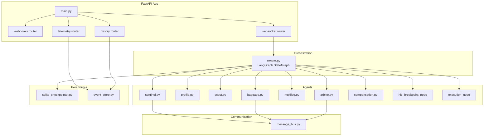
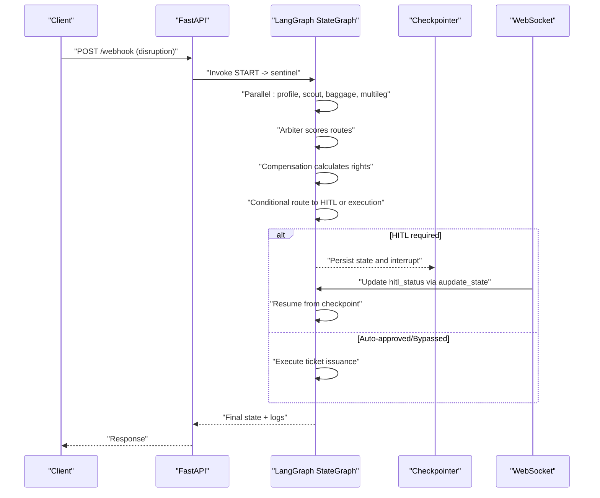
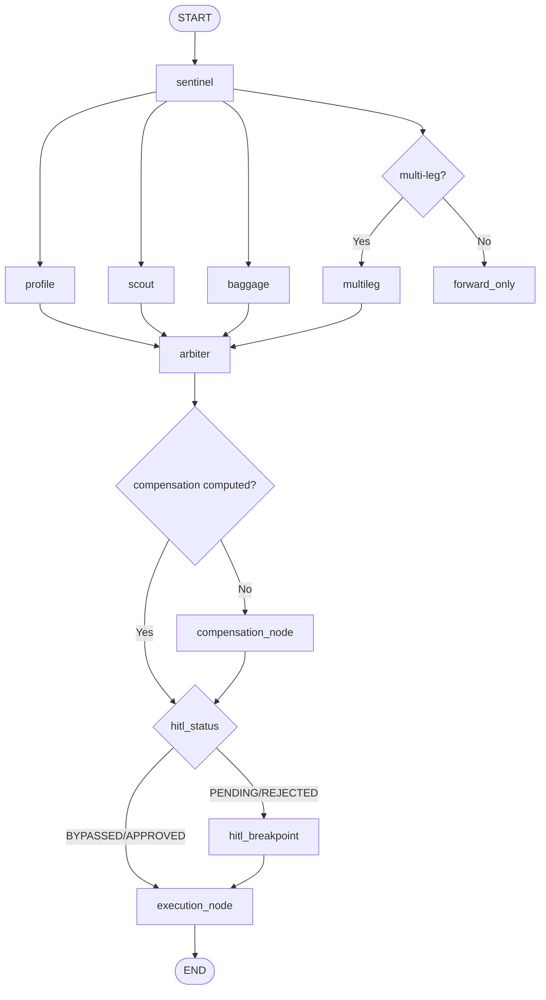
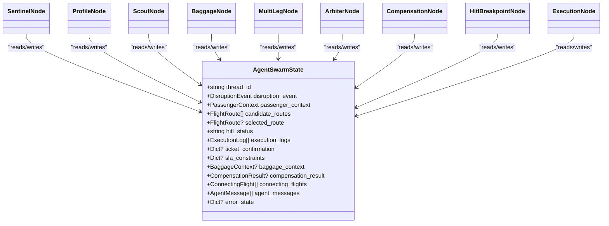
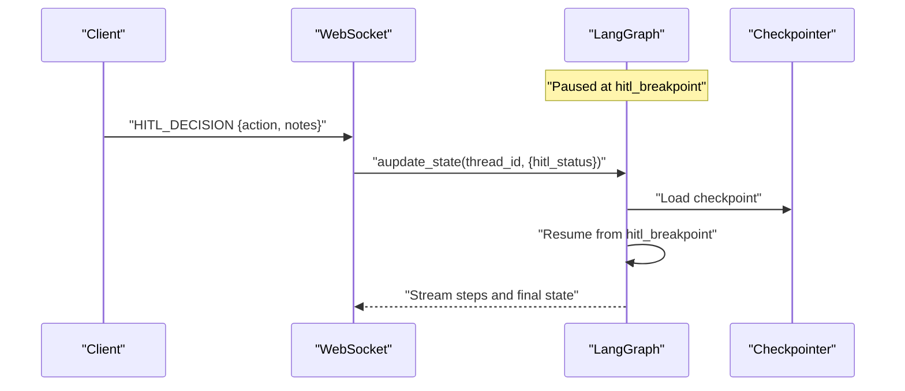
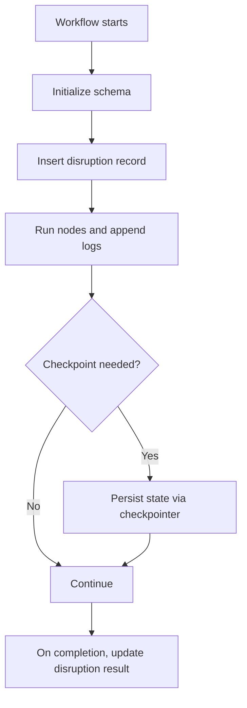
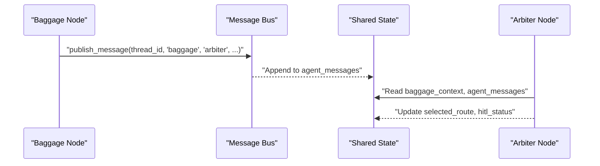
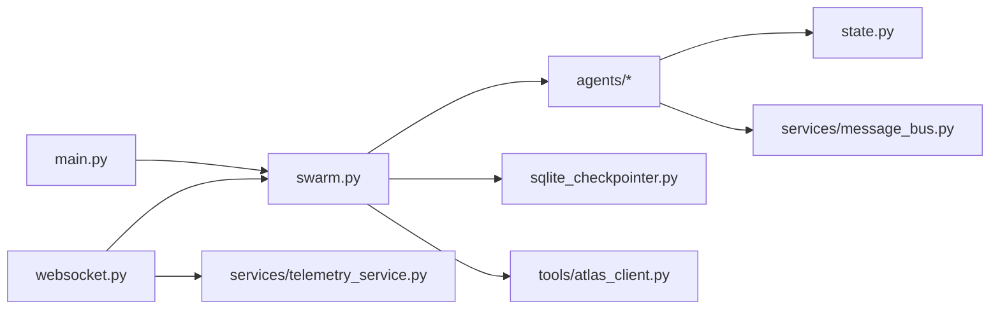

# State Management & Orchestration

<cite>
**Referenced Files in This Document**
- [state.py](file://travel-recovery-os/backend/state.py)
- [swarm.py](file://travel-recovery-os/backend/swarm.py)
- [main.py](file://travel-recovery-os/backend/main.py)
- [sentinel.py](file://travel-recovery-os/backend/agents/sentinel.py)
- [profile.py](file://travel-recovery-os/backend/agents/profile.py)
- [scout.py](file://travel-recovery-os/backend/agents/scout.py)
- [arbiter.py](file://travel-recovery-os/backend/agents/arbiter.py)
- [baggage.py](file://travel-recovery-os/backend/agents/baggage.py)
- [compensation.py](file://travel-recovery-os/backend/agents/compensation.py)
- [sqlite_checkpointer.py](file://travel-recovery-os/backend/store/sqlite_checkpointer.py)
- [event_store.py](file://travel-recovery-os/backend/store/event_store.py)
- [websocket.py](file://travel-recovery-os/backend/api/routers/websocket.py)
- [message_bus.py](file://travel-recovery-os/backend/services/message_bus.py)
</cite>

## Table of Contents
1. Introduction
2. Project Structure
3. Core Components
4. Architecture Overview
5. Detailed Component Analysis
6. Dependency Analysis
7. Performance Considerations
8. Troubleshooting Guide
9. Conclusion
10. Appendices

## Introduction
This document explains the centralized state management and orchestration patterns used by the multi-agent framework for automated travel disruption recovery. It focuses on:
- TypedDict-based state schemas that define the shared state across agents
- LangGraph StateGraph orchestration, including parallel execution, conditional routing, and human-in-the-loop (HITL) breakpoints
- Persistence via a durable checkpointer and event store
- Inter-agent communication through shared state fields and an in-memory message bus
- Concurrency handling, consistency guarantees, and recovery strategies
- Debugging, inspection, and migration approaches for evolving state schemas

## Project Structure
The system is organized around a FastAPI application that exposes webhooks, telemetry, history, and WebSocket endpoints. The core orchestration lives in a LangGraph StateGraph that coordinates specialized agents (Sentinel, Profile, Scout, Baggage, MultiLeg, Arbiter, Compensation, HITL Breakpoint, Execution). State persistence and event logging are provided by SQLite-backed components.

**Diagram sources**
- [main.py:22-108](file://travel-recovery-os/backend/main.py#L22-L108)
- [swarm.py:162-227](file://travel-recovery-os/backend/swarm.py#L162-L227)
- [websocket.py:21-195](file://travel-recovery-os/backend/api/routers/websocket.py#L21-L195)
- [sqlite_checkpointer.py:43-54](file://travel-recovery-os/backend/store/sqlite_checkpointer.py#L43-L54)
- [event_store.py:47-101](file://travel-recovery-os/backend/store/event_store.py#L47-L101)
- [message_bus.py:27-63](file://travel-recovery-os/backend/services/message_bus.py#L27-L63)

**Section sources**
- [main.py:22-108](file://travel-recovery-os/backend/main.py#L22-L108)
- [swarm.py:162-227](file://travel-recovery-os/backend/swarm.py#L162-L227)

## Core Components
- Central state schema: AgentSwarmState and related TypedDicts define the typed contract for all agent inputs and outputs. Fields use reducers (operator.add) to safely merge lists from parallel branches.
- Orchestration graph: A LangGraph StateGraph wires nodes and edges, enabling parallel fan-out/fan-in, conditional routing, and interruption at HITL breakpoint with checkpointing.
- Persistence: A checkpointer provides durable state across process restarts; an event store persists webhook events and disruption records for audit and analytics.
- Communication: Agents publish messages to a thread-scoped message bus and update shared state fields consumed by downstream agents.

Key responsibilities per component:
- Sentinel: Ingests and normalizes disruption signals, optionally extracting structured data from raw text using Hermes.
- Profile: Derives SLA constraints and financial profiles based on passenger loyalty tier and delay magnitude.
- Scout: Queries Atlas API for alternative routes and injects candidates into state.
- Baggage: Evaluates baggage transfer feasibility and estimates transfer times.
- MultiLeg: Analyzes connecting flights and connection viability.
- Arbiter: Scores candidate routes using LLM reasoning plus ensemble scoring across multiple criteria; sets HITL decision.
- Compensation: Calculates passenger rights compensation under applicable regulations.
- HITL Breakpoint: Pauses workflow until consensus is received via n8n or WebSocket.
- Execution: Issues ticket via Atlas API upon approval or bypass.

**Section sources**
- [state.py:20-167](file://travel-recovery-os/backend/state.py#L20-L167)
- [swarm.py:52-117](file://travel-recovery-os/backend/swarm.py#L52-L117)
- [swarm.py:162-227](file://travel-recovery-os/backend/swarm.py#L162-L227)
- [sentinel.py:34-91](file://travel-recovery-os/backend/agents/sentinel.py#L34-L91)
- [profile.py:58-127](file://travel-recovery-os/backend/agents/profile.py#L58-L127)
- [scout.py:32-87](file://travel-recovery-os/backend/agents/scout.py#L32-L87)
- [baggage.py:76-152](file://travel-recovery-os/backend/agents/baggage.py#L76-L152)
- [arbiter.py:128-244](file://travel-recovery-os/backend/agents/arbiter.py#L128-L244)
- [compensation.py:105-195](file://travel-recovery-os/backend/agents/compensation.py#L105-L195)
- [websocket.py:95-195](file://travel-recovery-os/backend/api/routers/websocket.py#L95-L195)

## Architecture Overview
The orchestration follows a deterministic yet flexible pipeline:
- Start -> Sentinel -> Parallel fan-out to Profile, Scout, Baggage, and conditionally MultiLeg -> Fan-in to Arbiter -> Compensation -> Conditional routing to HITL or Execution -> End.
- The graph is compiled with a checkpointer and interrupts before the HITL node to allow external consensus updates.

**Diagram sources**
- [swarm.py:162-227](file://travel-recovery-os/backend/swarm.py#L162-L227)
- [websocket.py:95-195](file://travel-recovery-os/backend/api/routers/websocket.py#L95-L195)
- [sqlite_checkpointer.py:43-54](file://travel-recovery-os/backend/store/sqlite_checkpointer.py#L43-L54)

## Detailed Component Analysis

### Central State Schema and Reducers
- AgentSwarmState defines the canonical state shape with typed fields for disruption_event, passenger_context, candidate_routes, selected_route, hitl_status, execution_logs, ticket_confirmation, sla_constraints, baggage_context, compensation_result, connecting_flights, agent_messages, and error_state.
- List fields use operator.add reducers to merge results from parallel branches without overwriting:
  - candidate_routes: aggregated from Scout
  - execution_logs: appended by each node for telemetry
  - connecting_flights: aggregated from MultiLeg
  - agent_messages: aggregated from inter-agent messages

Concurrency and consistency:
- LangGraph ensures atomic updates per node and merges list fields via reducers.
- Thread isolation is enforced by thread_id keys in state and message bus.

Versioning and migration:
- Optional fields enable backward-compatible schema evolution.
- New phases add optional TypedDicts (e.g., BaggageContext, CompensationResult, ConnectingFlight) without breaking existing flows.

**Section sources**
- [state.py:20-167](file://travel-recovery-os/backend/state.py#L20-L167)

### Orchestration Graph and Transitions
- build_swarm_graph constructs the workflow, registers nodes, adds edges, and compiles with a checkpointer and interrupt_before=["hitl_breakpoint"].
- Conditional routing functions:
  - route_after_arbiter: always goes to compensation first, then decides between HITL or execution based on hitl_status.
  - route_after_compensation: routes to execution if approved/bypassed, otherwise HITL.
  - route_disruption_type: spawns MultiLeg when disruption indicates connections/multi-leg.

**Diagram sources**
- [swarm.py:94-127](file://travel-recovery-os/backend/swarm.py#L94-L127)
- [swarm.py:162-227](file://travel-recovery-os/backend/swarm.py#L162-L227)

**Section sources**
- [swarm.py:94-127](file://travel-recovery-os/backend/swarm.py#L94-L127)
- [swarm.py:162-227](file://travel-recovery-os/backend/swarm.py#L162-L227)

### Agent Nodes and Shared State Updates
- Sentinel: Normalizes disruption_event and appends execution_logs.
- Profile: Computes sla_constraints and financial_profile; appends logs.
- Scout: Populates candidate_routes via Atlas API; appends logs.
- Baggage: Produces baggage_context and publishes agent_messages; appends logs.
- MultiLeg: Populates connecting_flights; appends logs.
- Arbiter: Reads sla_constraints, baggage_context, compensation_result, connecting_flights; computes ensemble scores; sets selected_route and hitl_status; appends logs.
- Compensation: Computes compensation_result; appends logs.
- HITL Breakpoint: Persists pause point; appends logs.
- Execution: Issues ticket and appends logs.

**Diagram sources**
- [state.py:130-167](file://travel-recovery-os/backend/state.py#L130-L167)
- [sentinel.py:34-91](file://travel-recovery-os/backend/agents/sentinel.py#L34-L91)
- [profile.py:58-127](file://travel-recovery-os/backend/agents/profile.py#L58-L127)
- [scout.py:32-87](file://travel-recovery-os/backend/agents/scout.py#L32-L87)
- [baggage.py:76-152](file://travel-recovery-os/backend/agents/baggage.py#L76-L152)
- [arbiter.py:128-244](file://travel-recovery-os/backend/agents/arbiter.py#L128-L244)
- [compensation.py:105-195](file://travel-recovery-os/backend/agents/compensation.py#L105-L195)
- [swarm.py:162-227](file://travel-recovery-os/backend/swarm.py#L162-L227)

**Section sources**
- [sentinel.py:34-91](file://travel-recovery-os/backend/agents/sentinel.py#L34-L91)
- [profile.py:58-127](file://travel-recovery-os/backend/agents/profile.py#L58-L127)
- [scout.py:32-87](file://travel-recovery-os/backend/agents/scout.py#L32-L87)
- [baggage.py:76-152](file://travel-recovery-os/backend/agents/baggage.py#L76-L152)
- [arbiter.py:128-244](file://travel-recovery-os/backend/agents/arbiter.py#L128-L244)
- [compensation.py:105-195](file://travel-recovery-os/backend/agents/compensation.py#L105-L195)

### Human-in-the-Loop and Resumption
- The graph interrupts before hitl_breakpoint and persists state via the checkpointer.
- WebSocket endpoint allows clients to send HITL decisions, which update state and resume the graph from the checkpoint.

**Diagram sources**
- [websocket.py:95-195](file://travel-recovery-os/backend/api/routers/websocket.py#L95-L195)
- [swarm.py:222-227](file://travel-recovery-os/backend/swarm.py#L222-L227)
- [sqlite_checkpointer.py:43-54](file://travel-recovery-os/backend/store/sqlite_checkpointer.py#L43-L54)

**Section sources**
- [websocket.py:95-195](file://travel-recovery-os/backend/api/routers/websocket.py#L95-L195)
- [swarm.py:222-227](file://travel-recovery-os/backend/swarm.py#L222-L227)

### Persistence and Event Store
- Checkpointer: Provides durable state for LangGraph; currently configured to MemorySaver for compatibility but designed to support AsyncSqliteSaver.
- Event Store: SQLite tables for n8n_events and disruptions with indexes; supports upserts, queries, and aggregate stats.

**Diagram sources**
- [event_store.py:47-101](file://travel-recovery-os/backend/store/event_store.py#L47-L101)
- [event_store.py:166-239](file://travel-recovery-os/backend/store/event_store.py#L166-L239)
- [sqlite_checkpointer.py:43-54](file://travel-recovery-os/backend/store/sqlite_checkpointer.py#L43-L54)

**Section sources**
- [event_store.py:47-101](file://travel-recovery-os/backend/store/event_store.py#L47-L101)
- [event_store.py:166-239](file://travel-recovery-os/backend/store/event_store.py#L166-L239)
- [sqlite_checkpointer.py:43-54](file://travel-recovery-os/backend/store/sqlite_checkpointer.py#L43-L54)

### Inter-Agent Communication
- Message Bus: Thread-scoped in-memory store with async lock for concurrency safety. Supports publish/get/clear operations and broadcast to "*".
- Shared State: agent_messages field aggregates messages; Arbiter can consume them indirectly via state fields like baggage_context and connecting_flights.

**Diagram sources**
- [message_bus.py:27-63](file://travel-recovery-os/backend/services/message_bus.py#L27-L63)
- [baggage.py:133-152](file://travel-recovery-os/backend/agents/baggage.py#L133-L152)
- [state.py:154-167](file://travel-recovery-os/backend/state.py#L154-L167)
- [arbiter.py:128-244](file://travel-recovery-os/backend/agents/arbiter.py#L128-L244)

**Section sources**
- [message_bus.py:27-63](file://travel-recovery-os/backend/services/message_bus.py#L27-L63)
- [baggage.py:133-152](file://travel-recovery-os/backend/agents/baggage.py#L133-L152)
- [arbiter.py:128-244](file://travel-recovery-os/backend/agents/arbiter.py#L128-L244)

## Dependency Analysis
- Orchestrator depends on agents and tools; agents depend on state schema and services.
- Persistence layer decouples state storage from computation.
- WebSocket integrates with the compiled graph to resume workflows after HITL decisions.

**Diagram sources**
- [main.py:22-108](file://travel-recovery-os/backend/main.py#L22-L108)
- [swarm.py:162-227](file://travel-recovery-os/backend/swarm.py#L162-L227)
- [websocket.py:21-195](file://travel-recovery-os/backend/api/routers/websocket.py#L21-L195)
- [message_bus.py:27-63](file://travel-recovery-os/backend/services/message_bus.py#L27-L63)

**Section sources**
- [swarm.py:162-227](file://travel-recovery-os/backend/swarm.py#L162-L227)
- [websocket.py:21-195](file://travel-recovery-os/backend/api/routers/websocket.py#L21-L195)

## Performance Considerations
- Parallel fan-out reduces latency by executing independent agents concurrently.
- List reducers efficiently merge outputs without full state copies per branch.
- SQLite WAL mode improves concurrent read/write performance for event store.
- Checkpointing introduces minimal overhead but enables resilience and resumption.
- WebSocket streaming avoids polling and reduces client-server load.

[No sources needed since this section provides general guidance]

## Troubleshooting Guide
- Inspect current state: Use WebSocket or telemetry endpoints to retrieve active session state and replay historical events for a thread_id.
- Validate checkpoints: Ensure the checkpointer is initialized and the data directory exists; verify SQLite file path configuration.
- Review logs: Each node appends execution_logs; aggregate these for step-by-step diagnostics.
- Handle errors: error_state field can capture per-node failures; event_store tracks webhook dispatch outcomes and errors.
- Resume failed workflows: Update hitl_status via WebSocket or API and resume from checkpoint.

**Section sources**
- [websocket.py:95-195](file://travel-recovery-os/backend/api/routers/websocket.py#L95-L195)
- [sqlite_checkpointer.py:31-54](file://travel-recovery-os/backend/store/sqlite_checkpointer.py#L31-L54)
- [event_store.py:107-160](file://travel-recovery-os/backend/store/event_store.py#L107-L160)
- [state.py:154-167](file://travel-recovery-os/backend/state.py#L154-L167)

## Conclusion
The framework uses a robust, typed, and reducer-enabled central state managed by LangGraph to coordinate multi-agent workflows for travel disruption recovery. Persistence via checkpointer and event store ensures durability and observability. Inter-agent communication leverages both shared state fields and a thread-safe message bus. HITL integration enables safe automation with human oversight. The design supports versioning through optional fields and provides clear debugging and recovery paths.

[No sources needed since this section summarizes without analyzing specific files]

## Appendices

### State Design Patterns and Versioning Strategies
- Optional fields: Allow phased rollout of new capabilities without breaking older clients or states.
- Reducers: Use operator.add for additive fields to ensure idempotent merging across parallel executions.
- Clear separation: Keep domain-specific contexts (e.g., BaggageContext, CompensationResult) isolated within the central state.

**Section sources**
- [state.py:81-167](file://travel-recovery-os/backend/state.py#L81-L167)

### Migration Approaches
- Backward compatibility: Introduce new optional fields and default behaviors in agents to handle missing data gracefully.
- Schema initialization: Event store uses CREATE TABLE IF NOT EXISTS and indexes to evolve storage safely.
- Checkpoint compatibility: Maintain stable field names and types to avoid checkpoint deserialization issues.

**Section sources**
- [event_store.py:47-101](file://travel-recovery-os/backend/store/event_store.py#L47-L101)
- [state.py:130-167](file://travel-recovery-os/backend/state.py#L130-L167)