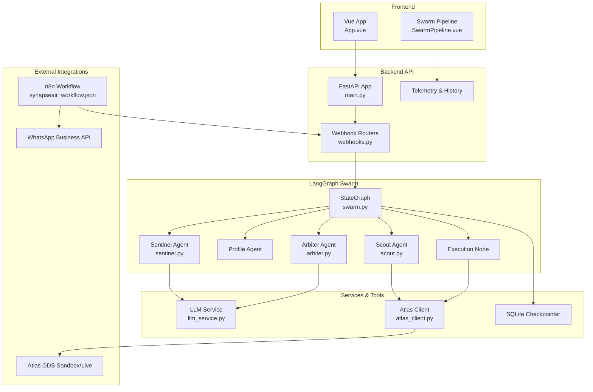
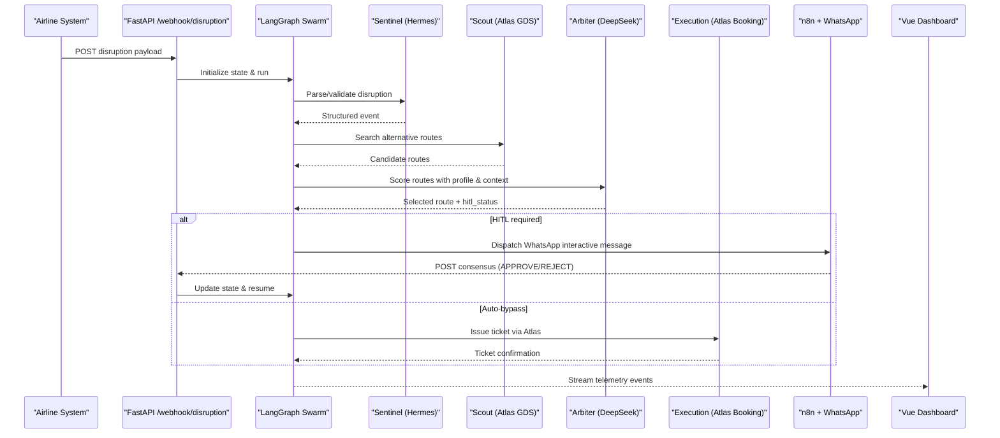
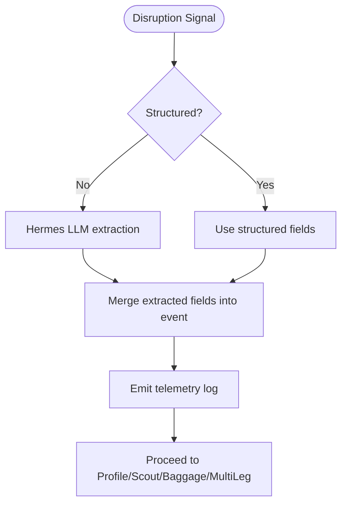
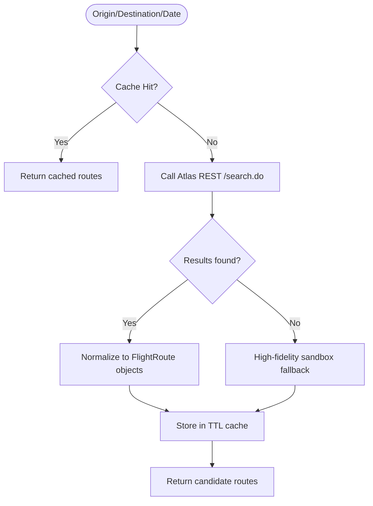
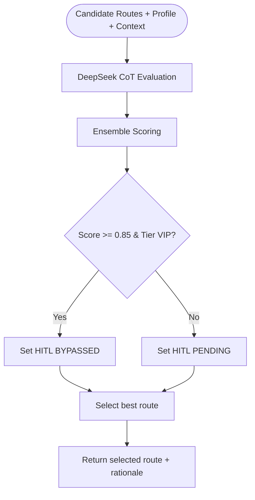
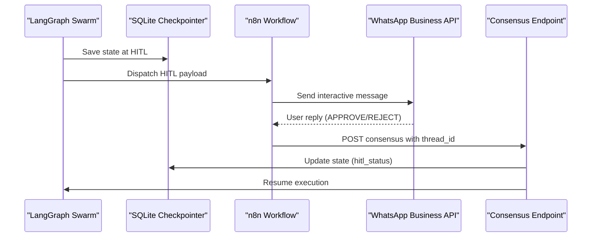
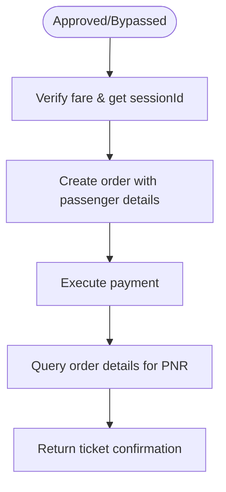
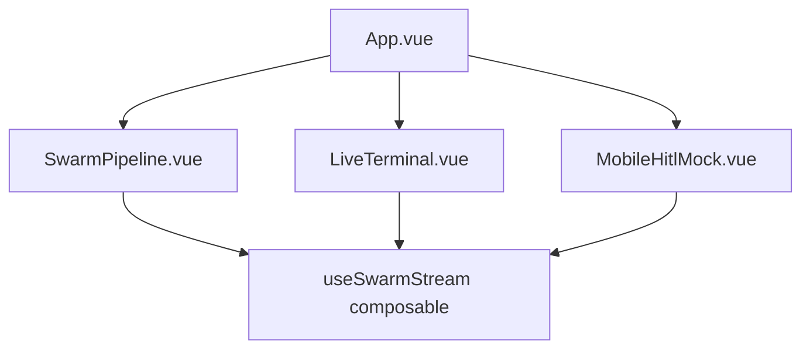
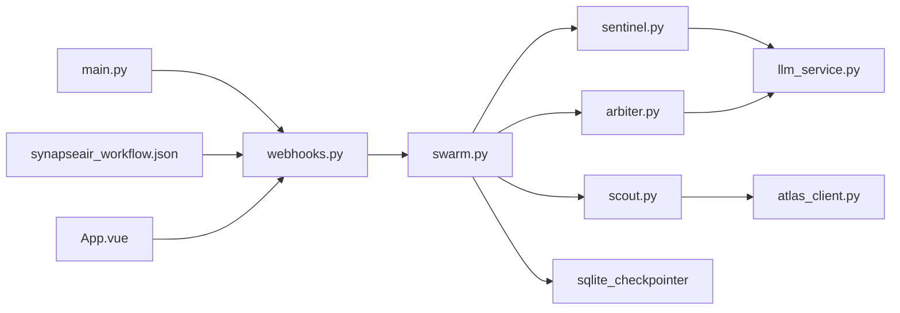

# Project Overview

<cite>
**Referenced Files in This Document**
- [README.md](file://travel-recovery-os/README.md)
- [blueprint.md](file://blueprint.md)
- [main.py](file://travel-recovery-os/backend/main.py)
- [swarm.py](file://travel-recovery-os/backend/swarm.py)
- [state.py](file://travel-recovery-os/backend/state.py)
- [sentinel.py](file://travel-recovery-os/backend/agents/sentinel.py)
- [scout.py](file://travel-recovery-os/backend/agents/scout.py)
- [arbiter.py](file://travel-recovery-os/backend/agents/arbiter.py)
- [llm_service.py](file://travel-recovery-os/backend/services/llm_service.py)
- [atlas_client.py](file://travel-recovery-os/backend/tools/atlas_client.py)
- [webhooks.py](file://travel-recovery-os/backend/api/routers/webhooks.py)
- [synapseair_workflow.json](file://travel-recovery-os/n8n/synapseair_workflow.json)
- [App.vue](file://travel-recovery-os/frontend/src/App.vue)
- [SwarmPipeline.vue](file://travel-recovery-os/frontend/src/components/SwarmPipeline.vue)
</cite>

## Table of Contents
1. Introduction
2. Project Structure
3. Core Components
4. Architecture Overview
5. Detailed Component Analysis
6. Dependency Analysis
7. Performance Considerations
8. Troubleshooting Guide
9. Conclusion

## Introduction
SynapseAir is an autonomous flight disruption recovery platform that intercepts cancellation or delay signals, evaluates passenger constraints, queries alternative routes via the Atlas GDS, and orchestrates human-in-the-loop rebooking through a WhatsApp integration powered by n8n. It uses a multi-agent LangGraph swarm to coordinate specialized agents for parsing disruptions, profiling passengers, searching inventory, scoring options, handling baggage and multi-leg connections, calculating compensation, and executing ticketing. The system provides a FastAPI backend and a Vue 3 frontend dashboard for real-time telemetry and operational control.

Key value propositions:
- For airlines: drastically reduces recovery time and cost per disrupted passenger, avoids regulatory fines, optimizes partner carrier usage, and automates end-to-end rebooking with zero-touch execution for eligible tiers.
- For passengers: near-instant rebooking with minimal friction via WhatsApp, transparent reasoning, and guaranteed protection of rights and baggage routing.

Core technologies:
- Orchestration: LangGraph StateGraph with durable SQLite checkpointing
- LLMs: DeepSeek V4 Flash for route reasoning; Hermes local model for unstructured text extraction
- GDS: Atlas GDS sandbox/live endpoints for search, verify, order, pay, and query
- Integration: n8n workflow for WhatsApp interactive messaging and consensus webhook forwarding
- Full-stack: FastAPI backend, Vue 3 frontend with real-time streaming (SSE/WebSocket)

**Section sources**
- [README.md:14-51](file://travel-recovery-os/README.md#L14-L51)
- [blueprint.md:5-15](file://blueprint.md#L5-L15)

## Project Structure
The repository implements a full-stack application:
- Backend: FastAPI app with routers for webhooks, telemetry, history, websocket, and system endpoints; LangGraph swarm orchestration; agent nodes; tools for Atlas GDS; services for LLM calls and message bus; resilient middleware; state definitions; checkpointer storage
- Frontend: Vue 3 dashboard with components for pipeline visualization, disruption simulation, recovery proposal display, mobile HITL mock, live terminal, route map, agent messages, and history analytics
- Workflow: n8n JSON workflow defines WhatsApp interactive message formatting and consensus forwarding back to SynapseAir

**Diagram sources**
- [main.py:40-108](file://travel-recovery-os/backend/main.py#L40-L108)
- [webhooks.py:14-72](file://travel-recovery-os/backend/api/routers/webhooks.py#L14-L72)
- [swarm.py:162-227](file://travel-recovery-os/backend/swarm.py#L162-L227)
- [sentinel.py:34-90](file://travel-recovery-os/backend/agents/sentinel.py#L34-L90)
- [scout.py:32-86](file://travel-recovery-os/backend/agents/scout.py#L32-L86)
- [arbiter.py:128-243](file://travel-recovery-os/backend/agents/arbiter.py#L128-L243)
- [llm_service.py:34-120](file://travel-recovery-os/backend/services/llm_service.py#L34-L120)
- [atlas_client.py:175-219](file://travel-recovery-os/backend/tools/atlas_client.py#L175-L219)
- [synapseair_workflow.json:1-81](file://travel-recovery-os/n8n/synapseair_workflow.json#L1-L81)
- [App.vue:1-219](file://travel-recovery-os/frontend/src/App.vue#L1-L219)
- [SwarmPipeline.vue:86-92](file://travel-recovery-os/frontend/src/components/SwarmPipeline.vue#L86-L92)

**Section sources**
- [blueprint.md:80-104](file://blueprint.md#L80-L104)
- [README.md:341-354](file://travel-recovery-os/README.md#L341-L354)

## Core Components
- Disruption ingestion and parsing: Sentinel agent uses Hermes to extract structured disruption data from raw text or validates structured payloads
- Passenger profiling: Rule-based SLA engine determines loyalty tier, cabin entitlement, direct-flight preference, and max layover tolerance
- Inventory discovery: Scout agent queries Atlas GDS for candidate routes across partner carriers
- Route scoring and decision: Arbiter agent performs multi-factor ensemble scoring using DeepSeek CoT reasoning plus deterministic fallbacks; decides HITL bypass or approval thresholds
- Compensation evaluation: Calculates passenger rights eligibility and amounts under EU261/DOT/MAS
- Ticketing execution: Issues e-tickets via Atlas GDS lifecycle (search, verify, order, pay, query)
- Human-in-the-loop: Durable checkpoint pause at HITL breakpoint; n8n sends WhatsApp interactive message; passenger reply resumes graph
- Real-time telemetry: SSE/WebSocket streams agent logs and state updates to the Vue dashboard

**Section sources**
- [sentinel.py:34-90](file://travel-recovery-os/backend/agents/sentinel.py#L34-L90)
- [state.py:130-167](file://travel-recovery-os/backend/state.py#L130-L167)
- [scout.py:32-86](file://travel-recovery-os/backend/agents/scout.py#L32-L86)
- [arbiter.py:128-243](file://travel-recovery-os/backend/agents/arbiter.py#L128-L243)
- [swarm.py:52-107](file://travel-recovery-os/backend/swarm.py#L52-L107)
- [webhooks.py:74-185](file://travel-recovery-os/backend/api/routers/webhooks.py#L74-L185)
- [atlas_client.py:222-357](file://travel-recovery-os/backend/tools/atlas_client.py#L222-L357)

## Architecture Overview
SynapseAir’s architecture centers on a LangGraph StateGraph that coordinates specialized agents in parallel and conditional flows. The flow begins with disruption ingestion, followed by parallel evaluation of profile, inventory, baggage, and multi-leg connectivity. The Arbiter synthesizes inputs into a scored recommendation, optionally bypassing HITL for high-tier passengers or prompting via WhatsApp for standard tiers. Upon approval or bypass, the Execution node issues tickets via Atlas GDS. All steps emit telemetry streamed to the frontend.

**Diagram sources**
- [webhooks.py:14-72](file://travel-recovery-os/backend/api/routers/webhooks.py#L14-L72)
- [swarm.py:162-227](file://travel-recovery-os/backend/swarm.py#L162-L227)
- [sentinel.py:34-90](file://travel-recovery-os/backend/agents/sentinel.py#L34-L90)
- [scout.py:32-86](file://travel-recovery-os/backend/agents/scout.py#L32-L86)
- [arbiter.py:128-243](file://travel-recovery-os/backend/agents/arbiter.py#L128-L243)
- [atlas_client.py:222-357](file://travel-recovery-os/backend/tools/atlas_client.py#L222-L357)
- [synapseair_workflow.json:1-81](file://travel-recovery-os/n8n/synapseair_workflow.json#L1-L81)

## Detailed Component Analysis

### Disruption Ingestion and Parsing (Sentinel + Hermes)
- Intercepts structured or unstructured disruption signals
- Uses Hermes to extract PNR, flight number, airline, origin/destination, delay minutes, and reason
- Emits telemetry and initializes LangGraph state for downstream agents

**Diagram sources**
- [sentinel.py:34-90](file://travel-recovery-os/backend/agents/sentinel.py#L34-L90)
- [llm_service.py:34-120](file://travel-recovery-os/backend/services/llm_service.py#L34-L120)

**Section sources**
- [sentinel.py:34-90](file://travel-recovery-os/backend/agents/sentinel.py#L34-L90)
- [llm_service.py:34-120](file://travel-recovery-os/backend/services/llm_service.py#L34-L120)

### Inventory Discovery (Scout + Atlas GDS)
- Queries Atlas GDS for alternative routes based on origin, destination, and travel date
- Normalizes results into candidate routes with attributes like cabin class, fare, punctuality rating, and availability
- Implements caching and fallback to high-fidelity sandbox when live inventory is unavailable

**Diagram sources**
- [atlas_client.py:175-219](file://travel-recovery-os/backend/tools/atlas_client.py#L175-L219)
- [atlas_client.py:360-425](file://travel-recovery-os/backend/tools/atlas_client.py#L360-L425)
- [scout.py:32-86](file://travel-recovery-os/backend/agents/scout.py#L32-L86)

**Section sources**
- [scout.py:32-86](file://travel-recovery-os/backend/agents/scout.py#L32-L86)
- [atlas_client.py:175-219](file://travel-recovery-os/backend/tools/atlas_client.py#L175-L219)

### Route Scoring and Decision (Arbiter + DeepSeek)
- Performs multi-factor ensemble scoring combining base score from DeepSeek with punctuality, baggage feasibility, compensation impact, and connection time
- Determines HITL bypass for high-tier passengers if score meets threshold; otherwise requires passenger consent
- Provides detailed rationale and confidence intervals for transparency

**Diagram sources**
- [arbiter.py:25-113](file://travel-recovery-os/backend/agents/arbiter.py#L25-L113)
- [arbiter.py:128-243](file://travel-recovery-os/backend/agents/arbiter.py#L128-L243)
- [llm_service.py:126-205](file://travel-recovery-os/backend/services/llm_service.py#L126-L205)

**Section sources**
- [arbiter.py:128-243](file://travel-recovery-os/backend/agents/arbiter.py#L128-L243)
- [llm_service.py:126-205](file://travel-recovery-os/backend/services/llm_service.py#L126-L205)

### Human-in-the-Loop and WhatsApp Integration (n8n)
- Pauses execution at HITL breakpoint with durable SQLite checkpoint
- n8n formats interactive WhatsApp message with accept/decline buttons
- Passenger reply forwarded to /api/webhook/consensus to update state and resume graph

**Diagram sources**
- [swarm.py:130-159](file://travel-recovery-os/backend/swarm.py#L130-L159)
- [synapseair_workflow.json:1-81](file://travel-recovery-os/n8n/synapseair_workflow.json#L1-L81)
- [webhooks.py:74-185](file://travel-recovery-os/backend/api/routers/webhooks.py#L74-L185)

**Section sources**
- [synapseair_workflow.json:1-81](file://travel-recovery-os/n8n/synapseair_workflow.json#L1-L81)
- [webhooks.py:74-185](file://travel-recovery-os/backend/api/routers/webhooks.py#L74-L185)

### Ticketing Execution (Atlas GDS Lifecycle)
- Executes search, verify, order, pay, and query to issue e-tickets and confirm PNR
- Includes resilience via circuit breakers and retries; falls back to high-fidelity sandbox when needed
- Returns ticket receipt including e-ticket number, seat assignment, and baggage transfer confirmation

**Diagram sources**
- [atlas_client.py:222-357](file://travel-recovery-os/backend/tools/atlas_client.py#L222-L357)

**Section sources**
- [atlas_client.py:222-357](file://travel-recovery-os/backend/tools/atlas_client.py#L222-L357)

### Frontend Dashboard (Vue 3)
- Displays KPIs, pipeline progress, disruption simulator, recovery proposal, WhatsApp mock chat, route map, agent messages, and live terminal
- Connects to backend telemetry streams for real-time visibility into agent decisions and state changes

**Diagram sources**
- [App.vue:1-219](file://travel-recovery-os/frontend/src/App.vue#L1-L219)
- [SwarmPipeline.vue:86-92](file://travel-recovery-os/frontend/src/components/SwarmPipeline.vue#L86-L92)

**Section sources**
- [App.vue:1-219](file://travel-recovery-os/frontend/src/App.vue#L1-L219)

## Dependency Analysis
- Backend depends on LangGraph for stateful orchestration, OpenAI-compatible clients for LLM calls, httpx for Atlas GDS REST, and SQLite for durable checkpoints
- Agents depend on shared state schema and services for LLM and tools for external integrations
- Frontend depends on Vue 3 ecosystem and consumes backend telemetry endpoints
- n8n workflow bridges WhatsApp Business API to backend consensus endpoint

**Diagram sources**
- [main.py:40-108](file://travel-recovery-os/backend/main.py#L40-L108)
- [webhooks.py:14-72](file://travel-recovery-os/backend/api/routers/webhooks.py#L14-L72)
- [swarm.py:162-227](file://travel-recovery-os/backend/swarm.py#L162-L227)
- [sentinel.py:34-90](file://travel-recovery-os/backend/agents/sentinel.py#L34-L90)
- [scout.py:32-86](file://travel-recovery-os/backend/agents/scout.py#L32-L86)
- [arbiter.py:128-243](file://travel-recovery-os/backend/agents/arbiter.py#L128-L243)
- [llm_service.py:34-120](file://travel-recovery-os/backend/services/llm_service.py#L34-L120)
- [atlas_client.py:175-219](file://travel-recovery-os/backend/tools/atlas_client.py#L175-L219)
- [synapseair_workflow.json:1-81](file://travel-recovery-os/n8n/synapseair_workflow.json#L1-L81)
- [App.vue:1-219](file://travel-recovery-os/frontend/src/App.vue#L1-L219)

**Section sources**
- [state.py:130-167](file://travel-recovery-os/backend/state.py#L130-L167)
- [swarm.py:162-227](file://travel-recovery-os/backend/swarm.py#L162-L227)

## Performance Considerations
- Average swarm speed targets sub-5-second resolution with high zero-touch rate for eligible tiers
- Caching of Atlas search results reduces repeated latency
- Circuit breakers and retry logic protect against transient LLM/GDS failures
- Parallel fan-out of Profile, Scout, Baggage, and MultiLeg minimizes end-to-end latency
- Deterministic fallbacks ensure continuity when LLMs are unavailable

[No sources needed since this section provides general guidance]

## Troubleshooting Guide
- If disruption parsing fails, Hermes may fall back to regex extraction; inspect logs for parser engine and error hints
- If Atlas GDS search returns no inventory, the system uses a calibrated sandbox fallback; verify environment credentials and base URLs
- If HITL breakpoint does not resume, ensure n8n forwards consensus correctly to /api/webhook/consensus with valid thread_id
- Frontend telemetry stream should receive consistent events; check CORS configuration and SSE/WebSocket endpoints

**Section sources**
- [llm_service.py:99-120](file://travel-recovery-os/backend/services/llm_service.py#L99-L120)
- [atlas_client.py:211-219](file://travel-recovery-os/backend/tools/atlas_client.py#L211-L219)
- [webhooks.py:84-185](file://travel-recovery-os/backend/api/routers/webhooks.py#L84-L185)
- [main.py:74-99](file://travel-recovery-os/backend/main.py#L74-L99)

## Conclusion
SynapseAir delivers an enterprise-grade, autonomous flight disruption recovery system that significantly reduces recovery time and cost while protecting passenger rights and ensuring seamless baggage routing. By combining a multi-agent LangGraph swarm, advanced LLM reasoning, live GDS inventory, and a frictionless WhatsApp HITL channel, it offers measurable ROI for airlines and superior experiences for passengers during IROPS events.

[No sources needed since this section summarizes without analyzing specific files]