# Agent Orchestration System

<cite>
**Referenced Files in This Document**
- [swarm.py](file://travel-recovery-os/backend/swarm.py)
- [state.py](file://travel-recovery-os/backend/state.py)
- [sentinel.py](file://travel-recovery-os/backend/agents/sentinel.py)
- [profile.py](file://travel-recovery-os/backend/agents/profile.py)
- [scout.py](file://travel-recovery-os/backend/agents/scout.py)
- [baggage.py](file://travel-recovery-os/backend/agents/baggage.py)
- [multileg.py](file://travel-recovery-os/backend/agents/multileg.py)
- [arbiter.py](file://travel-recovery-os/backend/agents/arbiter.py)
- [compensation.py](file://travel-recovery-os/backend/agents/compensation.py)
- [sqlite_checkpointer.py](file://travel-recovery-os/backend/store/sqlite_checkpointer.py)
- [swarm_runner.py](file://travel-recovery-os/backend/services/swarm_runner.py)
- [atlas_client.py](file://travel-recovery-os/backend/tools/atlas_client.py)
- [main.py](file://travel-recovery-os/backend/main.py)
</cite>

## Table of Contents
1. [Introduction](#introduction)
2. [Project Structure](#project-structure)
3. [Core Components](#core-components)
4. [Architecture Overview](#architecture-overview)
5. [Detailed Component Analysis](#detailed-component-analysis)
6. [Dependency Analysis](#dependency-analysis)
7. [Performance Considerations](#performance-considerations)
8. [Troubleshooting Guide](#troubleshooting-guide)
9. [Conclusion](#conclusion)
10. [Appendices](#appendices)

## Introduction
This document explains the LangGraph StateGraph-based agent orchestration system for automated travel disruption recovery. The workflow starts with a Sentinel agent that parses and validates disruption signals, then executes Profile, Scout, Baggage, and MultiLeg agents in parallel to gather passenger constraints, alternative routes, baggage feasibility, and multi-leg connection viability. An Arbiter agent aggregates results, scores candidates, and decides whether human-in-the-loop approval is required. A Compensation agent calculates passenger rights and eligibility. Finally, an Execution node issues tickets via the Atlas GDS API. The graph uses durable checkpointing (SQLite-backed or memory fallback), conditional routing, and resilient execution with per-node error handling and graceful degradation.

## Project Structure
The orchestration lives under backend:
- Graph definition and compilation: swarm.py
- Central state schema: state.py
- Agents: sentinel.py, profile.py, scout.py, baggage.py, multileg.py, arbiter.py, compensation.py
- Durable checkpointer: sqlite_checkpointer.py
- Runner and telemetry: services/swarm_runner.py
- External integrations: tools/atlas_client.py
- Application entrypoint and routers: main.py

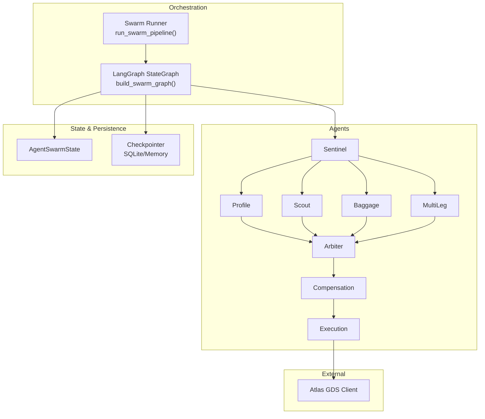

**Diagram sources**
- [swarm.py:162-227](file://travel-recovery-os/backend/swarm.py#L162-L227)
- [state.py:130-167](file://travel-recovery-os/backend/state.py#L130-L167)
- [sqlite_checkpointer.py:43-54](file://travel-recovery-os/backend/store/sqlite_checkpointer.py#L43-L54)
- [atlas_client.py:175-219](file://travel-recovery-os/backend/tools/atlas_client.py#L175-L219)

**Section sources**
- [swarm.py:162-227](file://travel-recovery-os/backend/swarm.py#L162-L227)
- [state.py:130-167](file://travel-recovery-os/backend/state.py#L130-L167)
- [sqlite_checkpointer.py:43-54](file://travel-recovery-os/backend/store/sqlite_checkpointer.py#L43-L54)
- [swarm_runner.py:36-216](file://travel-recovery-os/backend/services/swarm_runner.py#L36-L216)

## Core Components
- AgentSwarmState: Central typed state carrying disruption_event, passenger_context, candidate_routes, selected_route, hitl_status, execution_logs, ticket_confirmation, sla_constraints, baggage_context, compensation_result, connecting_flights, agent_messages, and error_state. Uses additive reducers for lists to merge outputs from parallel branches.
- Graph Topology: START → Sentinel → parallel Profile, Scout, Baggage, MultiLeg → Arbiter → Compensation → HITL/Execution → END. Conditional edges route based on hitl_status and compensation_result.
- Checkpointer: SQLite-backed durable persistence with memory fallback when dependencies are missing.
- Runner: Orchestrates streaming execution, emits telemetry, persists history, handles HITL pause/resume, and tracks per-node errors with retry limits.

**Section sources**
- [state.py:20-167](file://travel-recovery-os/backend/state.py#L20-L167)
- [swarm.py:162-227](file://travel-recovery-os/backend/swarm.py#L162-L227)
- [sqlite_checkpointer.py:43-54](file://travel-recovery-os/backend/store/sqlite_checkpointer.py#L43-L54)
- [swarm_runner.py:36-216](file://travel-recovery-os/backend/services/swarm_runner.py#L36-L216)

## Architecture Overview
The system implements a resilient, event-driven pipeline:
- Ingestion and parsing by Sentinel using Hermes LLM function calling to extract structured disruption data from raw text.
- Parallel analysis:
  - Profile derives SLA constraints and financial arbitrage metrics based on loyalty tier and delay magnitude.
  - Scout queries Atlas GDS for alternative routes and returns candidate flights.
  - Baggage evaluates interline agreements, special items, and transfer time estimates.
  - MultiLeg analyzes connection viability against minimum connection times at transfer airports.
- Arbiter performs ensemble scoring combining DeepSeek reasoning with deterministic factors (punctuality, baggage feasibility, compensation impact, connection time). It sets hitl_status and selects best route.
- Compensation determines jurisdiction-specific passenger rights and eligibility.
- Execution issues tickets via Atlas GDS; if not bypassed/approved, the graph pauses at HITL breakpoint until passenger consent arrives via n8n/WhatsApp.

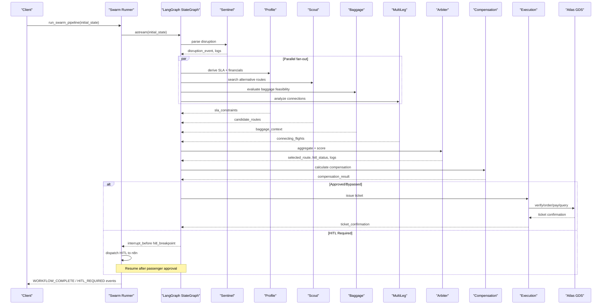

**Diagram sources**
- [swarm.py:162-227](file://travel-recovery-os/backend/swarm.py#L162-L227)
- [swarm_runner.py:36-216](file://travel-recovery-os/backend/services/swarm_runner.py#L36-L216)
- [atlas_client.py:222-357](file://travel-recovery-os/backend/tools/atlas_client.py#L222-L357)

## Detailed Component Analysis

### Sentinel Agent: Disruption Parsing and Validation
- Parses raw unstructured text via Hermes LLM function calling to produce a structured DisruptionEvent.
- Validates PNR, flight number, origin/destination, delay minutes, and reason.
- Emits telemetry logs and initializes the flow by returning updated disruption_event.

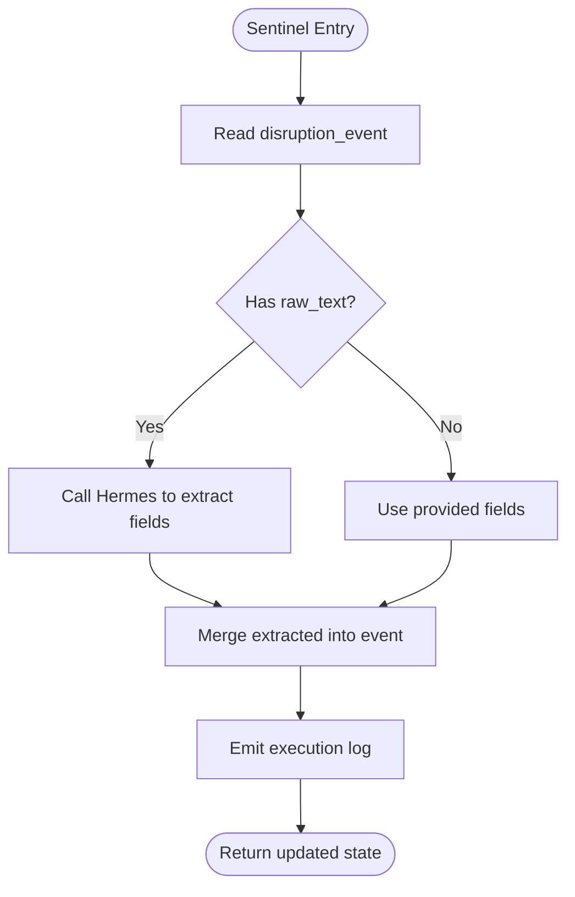

**Diagram sources**
- [sentinel.py:34-90](file://travel-recovery-os/backend/agents/sentinel.py#L34-L90)

**Section sources**
- [sentinel.py:34-90](file://travel-recovery-os/backend/agents/sentinel.py#L34-L90)

### Profile Agent: SLA and Financial Arbitrage
- Derives dynamic SLA rules based on loyalty tier and delay magnitude.
- Computes financial arbitrage metrics (airline savings, hotel penalty avoided, SLA liability).
- Returns sla_constraints used by Arbiter to filter/rank routes.

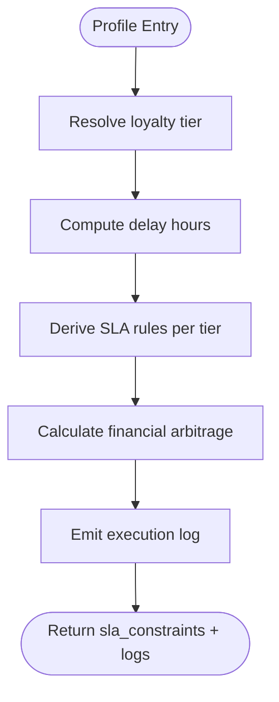

**Diagram sources**
- [profile.py:17-126](file://travel-recovery-os/backend/agents/profile.py#L17-L126)

**Section sources**
- [profile.py:17-126](file://travel-recovery-os/backend/agents/profile.py#L17-L126)

### Scout Agent: Alternative Route Discovery
- Queries Atlas GDS for alternative flights between origin and destination on the travel date.
- Normalizes results into FlightRoute objects and injects them into candidate_routes.
- Emits telemetry with route counts and details.

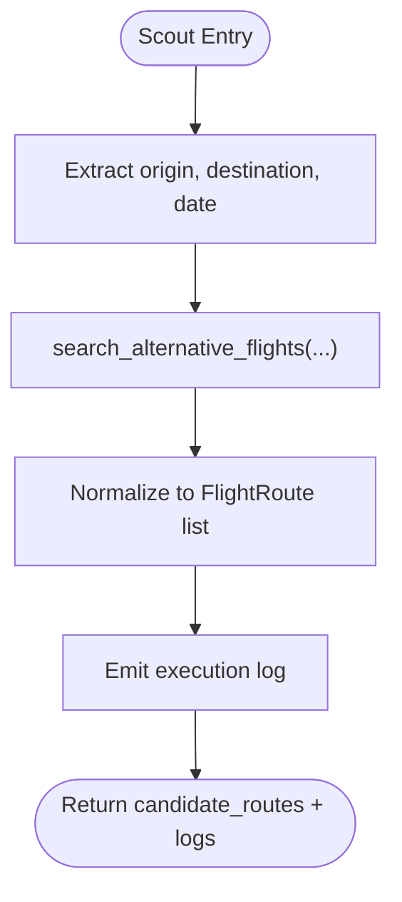

**Diagram sources**
- [scout.py:32-86](file://travel-recovery-os/backend/agents/scout.py#L32-L86)
- [atlas_client.py:175-219](file://travel-recovery-os/backend/tools/atlas_client.py#L175-L219)

**Section sources**
- [scout.py:32-86](file://travel-recovery-os/backend/agents/scout.py#L32-L86)
- [atlas_client.py:175-219](file://travel-recovery-os/backend/tools/atlas_client.py#L175-L219)

### Baggage Agent: Transfer Feasibility
- Evaluates checked bags and special items based on passenger loyalty tier.
- Checks interline agreements and estimates transfer time overhead.
- Publishes AgentMessage to inform Arbiter about baggage feasibility.

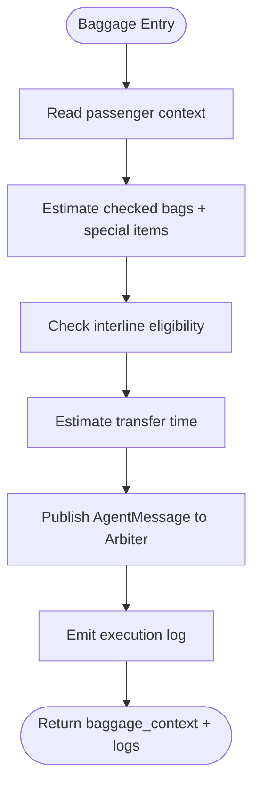

**Diagram sources**
- [baggage.py:76-151](file://travel-recovery-os/backend/agents/baggage.py#L76-L151)

**Section sources**
- [baggage.py:76-151](file://travel-recovery-os/backend/agents/baggage.py#L76-L151)

### MultiLeg Agent: Connection Viability
- Analyzes potential missed connections based on delay and minimum connection times at transfer airports.
- Produces ConnectingFlight entries and publishes AgentMessage indicating need for multi-leg rebooking.

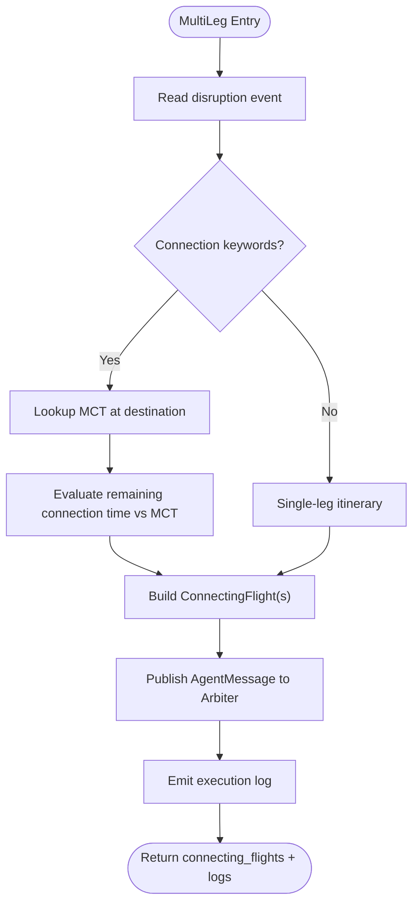

**Diagram sources**
- [multileg.py:96-167](file://travel-recovery-os/backend/agents/multileg.py#L96-L167)

**Section sources**
- [multileg.py:96-167](file://travel-recovery-os/backend/agents/multileg.py#L96-L167)

### Arbiter Agent: Decision and Scoring
- Aggregates candidate_routes, baggage_context, compensation_result, and connecting_flights.
- Performs ensemble scoring with weights across base_score, punctuality, baggage_feasibility, compensation_impact, and connection_time.
- Sets selected_route and hitl_status; high-scoring elite tiers may auto-approve bypass.

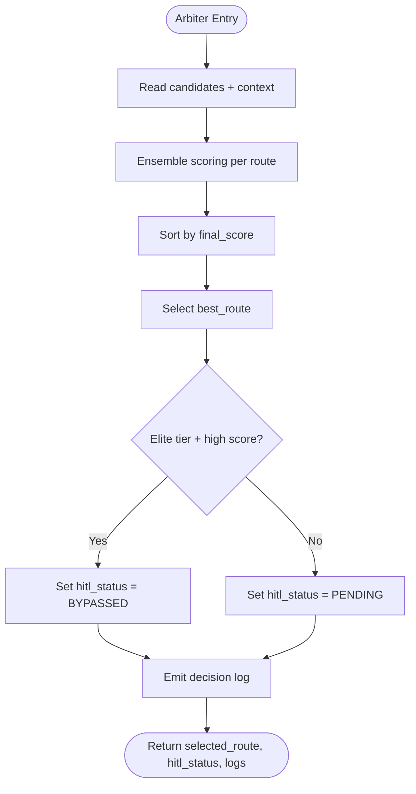

**Diagram sources**
- [arbiter.py:128-243](file://travel-recovery-os/backend/agents/arbiter.py#L128-L243)

**Section sources**
- [arbiter.py:128-243](file://travel-recovery-os/backend/agents/arbiter.py#L128-L243)

### Compensation Agent: Passenger Rights Calculation
- Determines applicable regulation (EU261, DOT, MAS) based on route and airline.
- Calculates eligibility and amount considering extraordinary circumstances and thresholds.
- Emits detailed logs and returns compensation_result.

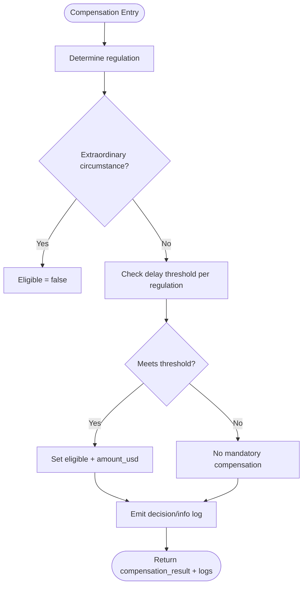

**Diagram sources**
- [compensation.py:105-194](file://travel-recovery-os/backend/agents/compensation.py#L105-L194)

**Section sources**
- [compensation.py:105-194](file://travel-recovery-os/backend/agents/compensation.py#L105-L194)

### Execution Node: Ticket Issuance
- Issues a rebooked ticket via Atlas GDS when a selected_route exists and HITL status allows execution.
- Emits success/error logs and returns ticket_confirmation.

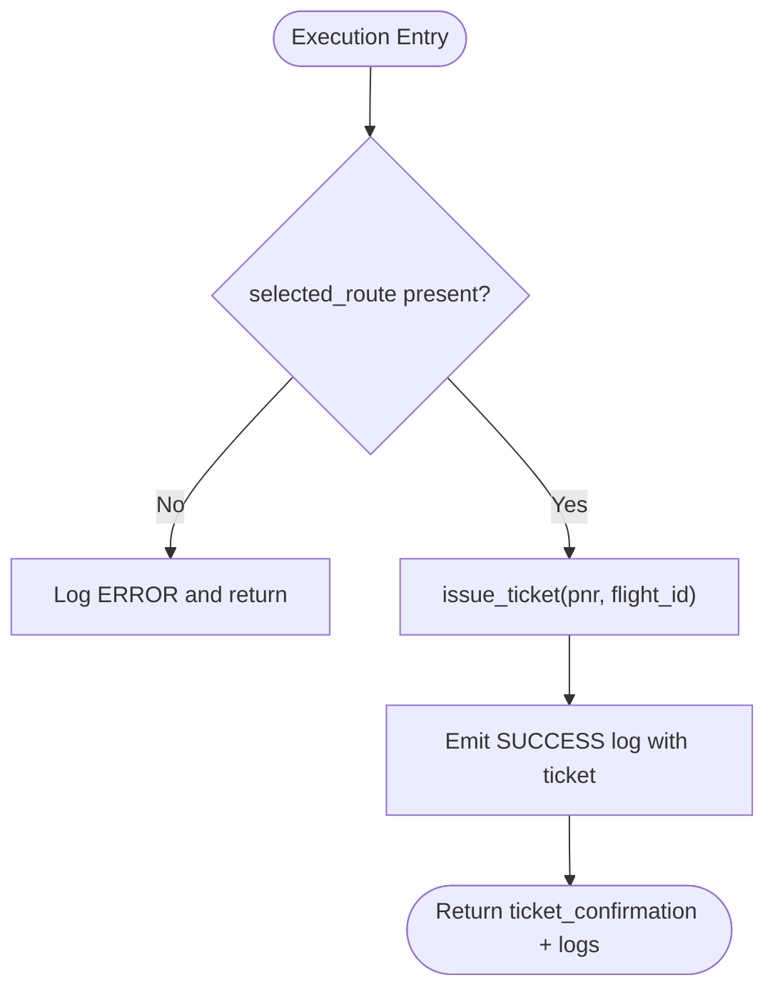

**Diagram sources**
- [swarm.py:52-91](file://travel-recovery-os/backend/swarm.py#L52-L91)
- [atlas_client.py:334-357](file://travel-recovery-os/backend/tools/atlas_client.py#L334-L357)

**Section sources**
- [swarm.py:52-91](file://travel-recovery-os/backend/swarm.py#L52-L91)
- [atlas_client.py:334-357](file://travel-recovery-os/backend/tools/atlas_client.py#L334-L357)

### Graph Compilation, Nodes, Edges, and Flow Control
- build_swarm_graph registers nodes, defines edges, and compiles with a checkpointer and interrupt_before=["hitl_breakpoint"].
- Conditional routing functions:
  - route_after_arbiter: Always goes through compensation first; then routes to execution or HITL based on hitl_status.
  - route_after_compensation: Routes to execution if approved/bypassed; otherwise to HITL.
  - route_disruption_type: Chooses whether to spawn MultiLeg based on disruption keywords.

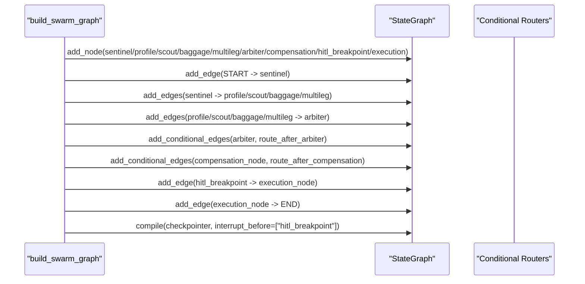

**Diagram sources**
- [swarm.py:162-227](file://travel-recovery-os/backend/swarm.py#L162-L227)

**Section sources**
- [swarm.py:162-227](file://travel-recovery-os/backend/swarm.py#L162-L227)

### State Management Patterns
- AgentSwarmState centralizes all cross-agent data with annotated additive reducers for lists (candidate_routes, execution_logs, connecting_flights, agent_messages).
- Each agent returns partial updates merged into the global state by LangGraph.
- Thread isolation via thread_id enables concurrent workflows and durable checkpoints.

**Section sources**
- [state.py:130-167](file://travel-recovery-os/backend/state.py#L130-L167)

### Durable Checkpointing with SQLite
- Checkpointer module provides a singleton checkpointer and provider name.
- Uses AsyncSqliteSaver when available; falls back to MemorySaver for compatibility.
- Ensures graph state survives process restarts and supports resume at breakpoints.

**Section sources**
- [sqlite_checkpointer.py:43-54](file://travel-recovery-os/backend/store/sqlite_checkpointer.py#L43-L54)

### Human-in-the-Loop Breakpoint Handling
- Graph interrupts before hitl_breakpoint node.
- Runner detects interruption, dispatches HITL request to n8n with passenger context and selected route, and broadcasts HITL_REQUIRED event.
- Upon approval or bypass, execution resumes to issue ticket.

**Section sources**
- [swarm.py:130-159](file://travel-recovery-os/backend/swarm.py#L130-L159)
- [swarm_runner.py:133-176](file://travel-recovery-os/backend/services/swarm_runner.py#L133-L176)

## Dependency Analysis
Key dependencies and coupling:
- swarm.py depends on agents, state, tools, and store modules to define and compile the graph.
- Agents depend on state types and external services (LLM, Atlas GDS).
- Runner depends on swarm graph, telemetry, event store, and resilience utilities.
- Atlas client integrates with external GDS and includes circuit breaker and retry logic.

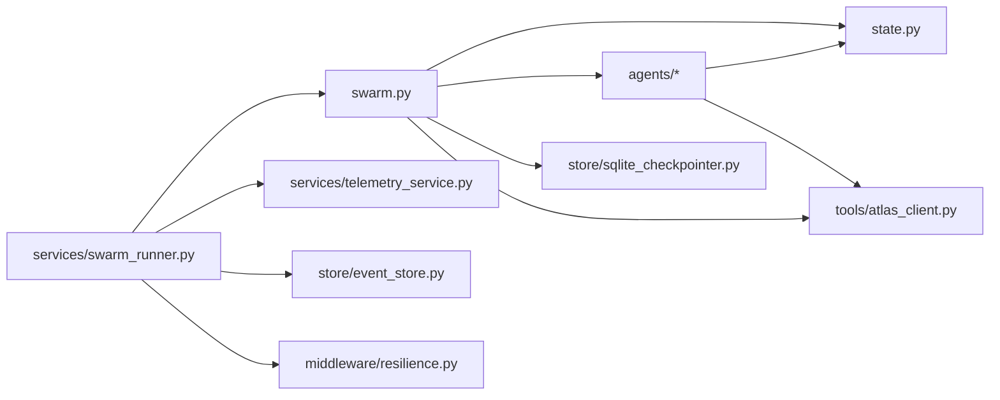

**Diagram sources**
- [swarm.py:162-227](file://travel-recovery-os/backend/swarm.py#L162-L227)
- [swarm_runner.py:36-216](file://travel-recovery-os/backend/services/swarm_runner.py#L36-L216)
- [atlas_client.py:175-219](file://travel-recovery-os/backend/tools/atlas_client.py#L175-L219)

**Section sources**
- [swarm.py:162-227](file://travel-recovery-os/backend/swarm.py#L162-L227)
- [swarm_runner.py:36-216](file://travel-recovery-os/backend/services/swarm_runner.py#L36-L216)
- [atlas_client.py:175-219](file://travel-recovery-os/backend/tools/atlas_client.py#L175-L219)

## Performance Considerations
- Parallel fan-out reduces end-to-end latency by executing Profile, Scout, Baggage, and MultiLeg concurrently.
- Additive reducers efficiently merge outputs without full state copies.
- Atlas client caches search results for 5 minutes to reduce repeated calls.
- Circuit breaker and retry_with_backoff protect against transient GDS failures.
- Ensemble scoring is lightweight and deterministic post-LLM evaluation.

[No sources needed since this section provides general guidance]

## Troubleshooting Guide
Common issues and strategies:
- Missing routing identifier: Atlas verify step fails if no routingIdentifier; ensure search returns routings or fallback sandbox is used.
- No candidate routes: Scout may return empty results; fallback sandbox generates realistic options.
- HITL loop: If graph remains paused, verify n8n webhook delivery and resume with approved/bypassed status.
- Per-node errors: Runner tracks retries per node and broadcasts errors; escalate after exceeding MAX_NODE_RETRIES.
- Checkpoint persistence: Ensure SQLite directory exists; environment variable SYNAPSEAIR_CHECKPOINT_DB controls path.

**Section sources**
- [atlas_client.py:222-357](file://travel-recovery-os/backend/tools/atlas_client.py#L222-L357)
- [swarm_runner.py:96-123](file://travel-recovery-os/backend/services/swarm_runner.py#L96-L123)
- [sqlite_checkpointer.py:37-54](file://travel-recovery-os/backend/store/sqlite_checkpointer.py#L37-L54)

## Conclusion
The LangGraph StateGraph-based orchestration delivers a robust, scalable, and transparent travel disruption recovery system. Sentinel ensures reliable ingestion, parallel agents enrich decision inputs, Arbiter synthesizes multi-factor scoring, Compensation enforces passenger rights, and Execution automates ticketing. Durable checkpointing and HITL breakpoints enable resilient operations with human oversight when necessary. The design balances automation with safety, providing clear telemetry and graceful degradation paths.

[No sources needed since this section summarizes without analyzing specific files]

## Appendices

### Graph Compilation Example Reference
- Build and compile the graph with nodes, edges, conditional routing, and checkpointing configuration.

**Section sources**
- [swarm.py:162-227](file://travel-recovery-os/backend/swarm.py#L162-L227)

### Node Registration and Edge Definitions Reference
- Node registration and edge wiring for parallel execution and convergence at Arbiter.

**Section sources**
- [swarm.py:171-195](file://travel-recovery-os/backend/swarm.py#L171-L195)

### Conditional Routing Logic Reference
- Conditional routers determine flow after Arbiter and Compensation based on hitl_status and compensation_result.

**Section sources**
- [swarm.py:94-127](file://travel-recovery-os/backend/swarm.py#L94-L127)

### Execution Flow Control Reference
- Streaming execution, interruption handling, and completion broadcasting.

**Section sources**
- [swarm_runner.py:36-216](file://travel-recovery-os/backend/services/swarm_runner.py#L36-L216)