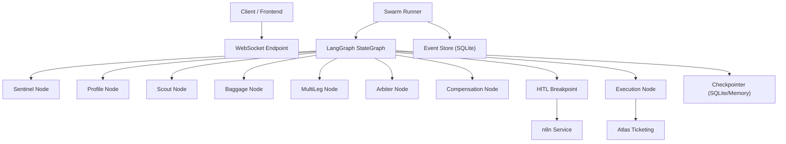
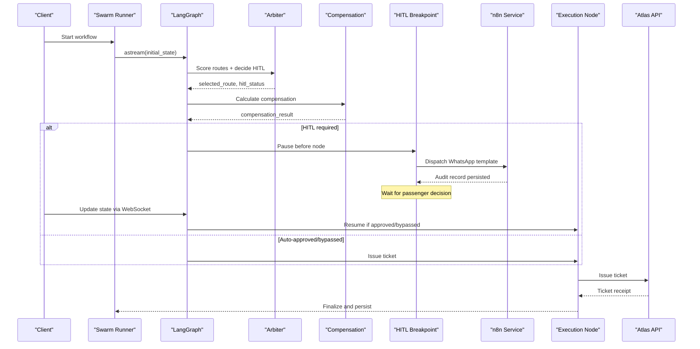
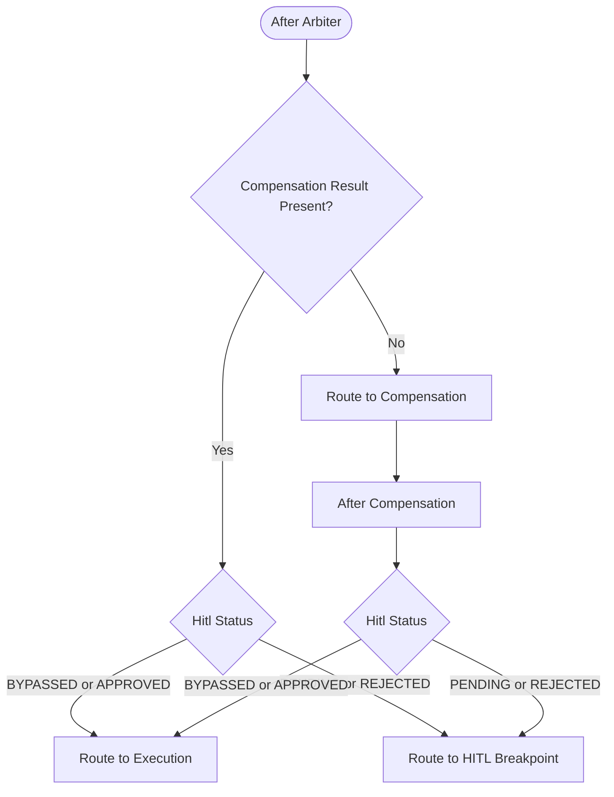
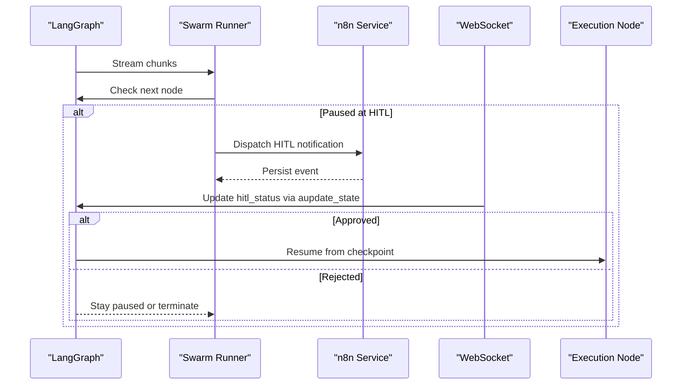
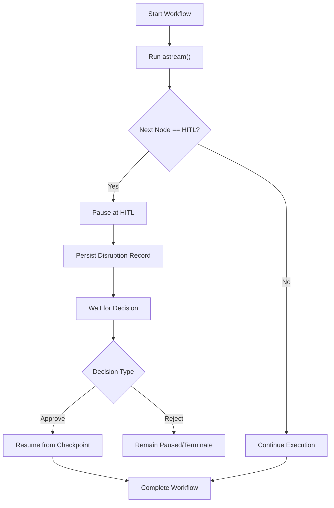
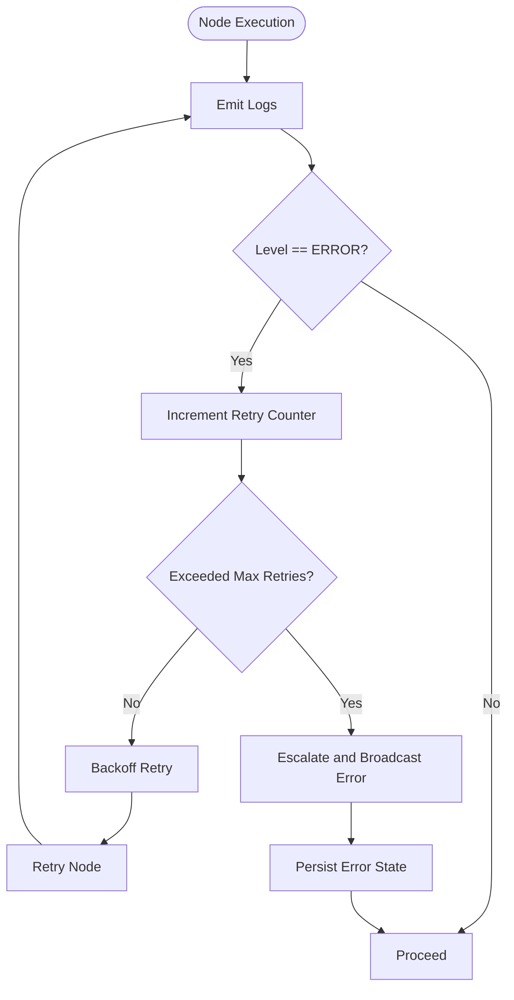
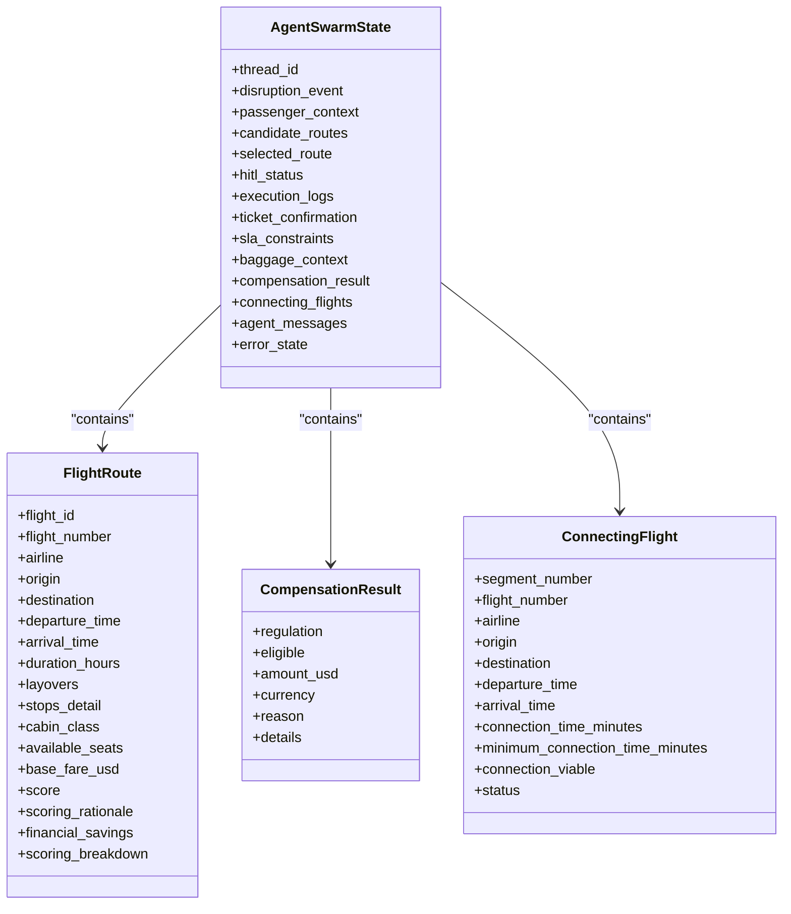
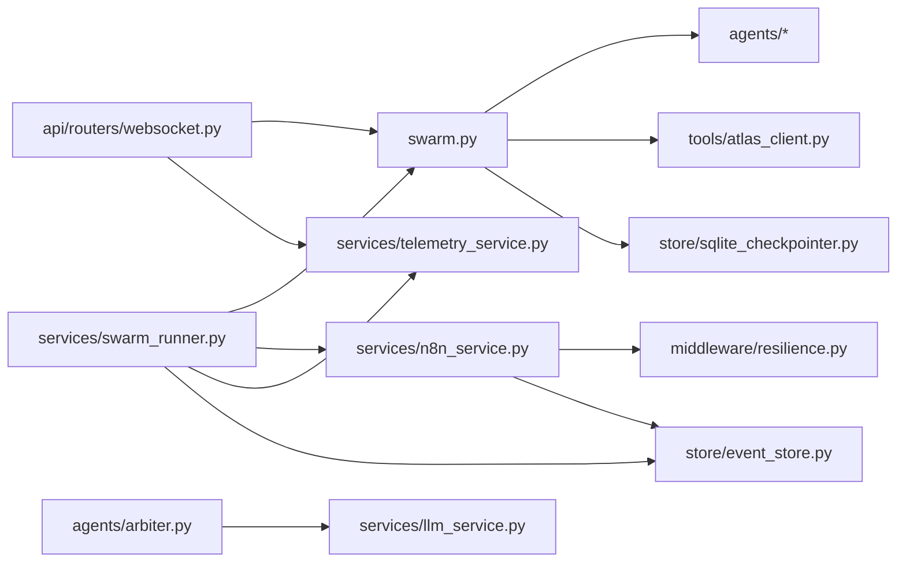

# Execution Control & Flow Management

<cite>
**Referenced Files in This Document**
- [swarm.py](file://travel-recovery-os/backend/swarm.py)
- [state.py](file://travel-recovery-os/backend/state.py)
- [swarm_runner.py](file://travel-recovery-os/backend/services/swarm_runner.py)
- [arbiter.py](file://travel-recovery-os/backend/agents/arbiter.py)
- [sentinel.py](file://travel-recovery-os/backend/agents/sentinel.py)
- [sqlite_checkpointer.py](file://travel-recovery-os/backend/store/sqlite_checkpointer.py)
- [event_store.py](file://travel-recovery-os/backend/store/event_store.py)
- [n8n_service.py](file://travel-recovery-os/backend/services/n8n_service.py)
- [resilience.py](file://travel-recovery-os/backend/middleware/resilience.py)
- [websocket.py](file://travel-recovery-os/backend/api/routers/websocket.py)
</cite>

## Table of Contents
1. Introduction
2. Project Structure
3. Core Components
4. Architecture Overview
5. Detailed Component Analysis
6. Dependency Analysis
7. Performance Considerations
8. Troubleshooting Guide
9. Conclusion

## Introduction
This document explains the execution control mechanisms that coordinate a multi-agent travel disruption recovery workflow. It focuses on:
- Conditional routing functions that direct flow based on agent outputs and state
- Human-in-the-loop (HITL) breakpoints with durable pause/resume
- Workflow interruption and resumption across distributed components
- Error handling strategies to maintain integrity during distributed agent processing

The system uses a LangGraph StateGraph to orchestrate agents, persists checkpoints for durability, and integrates external systems (n8n WhatsApp gateway, Atlas ticketing API) with resilience patterns.

## Project Structure
At a high level:
- The graph is defined and compiled in the swarm module, which wires nodes, edges, and conditional routing
- A runner executes the graph, streams telemetry, handles HITL pauses, and updates persistent records
- Agents perform specialized tasks (interception, scoring, compensation, baggage, multi-leg)
- External integrations are wrapped with retry and circuit breaker patterns
- A WebSocket endpoint enables bidirectional HITL decisions and resume flows
- SQLite stores both checkpoints and an audit trail for events and disruptions

**Diagram sources**
- [swarm.py:162-227](file://travel-recovery-os/backend/swarm.py#L162-L227)
- [swarm_runner.py:36-216](file://travel-recovery-os/backend/services/swarm_runner.py#L36-L216)
- [n8n_service.py:51-202](file://travel-recovery-os/backend/services/n8n_service.py#L51-L202)
- [event_store.py:47-101](file://travel-recovery-os/backend/store/event_store.py#L47-L101)
- [sqlite_checkpointer.py:43-54](file://travel-recovery-os/backend/store/sqlite_checkpointer.py#L43-L54)

**Section sources**
- [swarm.py:162-227](file://travel-recovery-os/backend/swarm.py#L162-L227)
- [swarm_runner.py:36-216](file://travel-recovery-os/backend/services/swarm_runner.py#L36-L216)

## Core Components
- State schema defines the central data model shared by all nodes and services
- Swarm graph defines nodes, edges, and conditional routing logic
- Runner orchestrates execution, streaming, error detection, and persistence
- Arbiter computes ensemble scores and determines HITL bypass/approval thresholds
- n8n service dispatches HITL notifications and records durable audit trails
- Resilience middleware provides retry with backoff and circuit breakers
- WebSocket endpoint supports real-time HITL decisions and graph resume
- Event store persists disruption lifecycle and webhook interactions

**Section sources**
- [state.py:130-167](file://travel-recovery-os/backend/state.py#L130-L167)
- [swarm.py:162-227](file://travel-recovery-os/backend/swarm.py#L162-L227)
- [swarm_runner.py:36-216](file://travel-recovery-os/backend/services/swarm_runner.py#L36-L216)
- [arbiter.py:128-244](file://travel-recovery-os/backend/agents/arbiter.py#L128-L244)
- [n8n_service.py:51-202](file://travel-recovery-os/backend/services/n8n_service.py#L51-L202)
- [resilience.py:25-80](file://travel-recovery-os/backend/middleware/resilience.py#L25-L80)
- [websocket.py:21-195](file://travel-recovery-os/backend/api/routers/websocket.py#L21-L195)
- [event_store.py:166-239](file://travel-recovery-os/backend/store/event_store.py#L166-L239)

## Architecture Overview
The workflow begins with a disruption signal intercepted by the sentinel node, then fans out to parallel agents (profile, scout, baggage, and optionally multi-leg). Their outputs converge at the arbiter, which scores candidates and decides whether HITL is required. If needed, the graph pauses at the HITL breakpoint, sends a message via n8n, and waits for passenger consent. On approval or bypass, execution proceeds to issue a ticket; otherwise it remains paused or terminates with an error.

**Diagram sources**
- [swarm.py:94-127](file://travel-recovery-os/backend/swarm.py#L94-L127)
- [swarm.py:130-160](file://travel-recovery-os/backend/swarm.py#L130-L160)
- [swarm_runner.py:133-198](file://travel-recovery-os/backend/services/swarm_runner.py#L133-L198)
- [n8n_service.py:51-202](file://travel-recovery-os/backend/services/n8n_service.py#L51-L202)
- [websocket.py:95-195](file://travel-recovery-os/backend/api/routers/websocket.py#L95-L195)

## Detailed Component Analysis

### Conditional Routing Functions
- route_after_arbiter: Routes first to compensation calculation, then to HITL or execution depending on hitl_status and presence of compensation result
- route_after_compensation: Routes to execution if status is BYPASSED or APPROVED; otherwise to HITL
- route_disruption_type: Chooses whether to spawn the multi-leg agent based on disruption keywords

These functions read the current state and return the next node name, enabling dynamic branching without hard-coded paths.

**Diagram sources**
- [swarm.py:94-127](file://travel-recovery-os/backend/swarm.py#L94-L127)

**Section sources**
- [swarm.py:94-127](file://travel-recovery-os/backend/swarm.py#L94-L127)

### Human-in-the-Loop Breakpoints
- The graph compiles with interrupt_before set to the HITL breakpoint node
- When reached, the runner detects the pause, dispatches a WhatsApp notification via n8n, and persists partial results
- The client can send a HITL decision via WebSocket; the server updates the graph state and resumes execution if approved

**Diagram sources**
- [swarm.py:222-227](file://travel-recovery-os/backend/swarm.py#L222-L227)
- [swarm_runner.py:133-176](file://travel-recovery-os/backend/services/swarm_runner.py#L133-L176)
- [n8n_service.py:51-202](file://travel-recovery-os/backend/services/n8n_service.py#L51-L202)
- [websocket.py:95-195](file://travel-recovery-os/backend/api/routers/websocket.py#L95-L195)

**Section sources**
- [swarm.py:222-227](file://travel-recovery-os/backend/swarm.py#L222-L227)
- [swarm_runner.py:133-176](file://travel-recovery-os/backend/services/swarm_runner.py#L133-L176)
- [websocket.py:95-195](file://travel-recovery-os/backend/api/routers/websocket.py#L95-L195)

### Workflow Interruption and Resumption
- Durable checkpointer ensures state survives process restarts; currently configured to use memory saver but designed to support SQLite-based persistence
- On HITL pause, the runner persists disruption details and emits telemetry
- On approval, the graph resumes using the same thread_id, continuing from the checkpoint until completion

**Diagram sources**
- [sqlite_checkpointer.py:43-54](file://travel-recovery-os/backend/store/sqlite_checkpointer.py#L43-L54)
- [swarm_runner.py:133-198](file://travel-recovery-os/backend/services/swarm_runner.py#L133-L198)
- [websocket.py:143-195](file://travel-recovery-os/backend/api/routers/websocket.py#L143-L195)

**Section sources**
- [sqlite_checkpointer.py:43-54](file://travel-recovery-os/backend/store/sqlite_checkpointer.py#L43-L54)
- [swarm_runner.py:133-198](file://travel-recovery-os/backend/services/swarm_runner.py#L133-L198)
- [websocket.py:143-195](file://travel-recovery-os/backend/api/routers/websocket.py#L143-L195)

### Error Handling Strategies
- Per-node error detection: The runner tracks errors emitted by nodes and increments retry counters
- Max retries per node: Exceeding the threshold triggers escalation and telemetry
- Circuit breakers: External calls (LLM, Atlas, n8n) are protected by circuit breakers to avoid cascading failures
- Retry with backoff: Transient failures are retried with exponential backoff and jitter
- Persistent error state: Errors are recorded in the disruption record for observability

**Diagram sources**
- [swarm_runner.py:96-124](file://travel-recovery-os/backend/services/swarm_runner.py#L96-L124)
- [resilience.py:25-80](file://travel-recovery-os/backend/middleware/resilience.py#L25-L80)
- [resilience.py:97-213](file://travel-recovery-os/backend/middleware/resilience.py#L97-L213)
- [event_store.py:206-239](file://travel-recovery-os/backend/store/event_store.py#L206-L239)

**Section sources**
- [swarm_runner.py:96-124](file://travel-recovery-os/backend/services/swarm_runner.py#L96-L124)
- [resilience.py:25-80](file://travel-recovery-os/backend/middleware/resilience.py#L25-L80)
- [resilience.py:97-213](file://travel-recovery-os/backend/middleware/resilience.py#L97-L213)
- [event_store.py:206-239](file://travel-recovery-os/backend/store/event_store.py#L206-L239)

### Complex Decision Trees and Integrity Maintenance
- Arbiter computes ensemble scores combining base score, punctuality, baggage feasibility, compensation impact, and connection time
- Confidence intervals and scoring breakdowns provide transparency and risk bounds
- Loyalty tier and score thresholds determine automatic bypass or HITL requirement
- State fields aggregate candidate routes and connecting flights via additive reducers, ensuring consistent merging across parallel branches
- Execution logs accumulate per node, providing a complete audit trail for each step

**Diagram sources**
- [state.py:20-167](file://travel-recovery-os/backend/state.py#L20-L167)

**Section sources**
- [arbiter.py:25-113](file://travel-recovery-os/backend/agents/arbiter.py#L25-L113)
- [arbiter.py:128-244](file://travel-recovery-os/backend/agents/arbiter.py#L128-L244)
- [state.py:130-167](file://travel-recovery-os/backend/state.py#L130-L167)

## Dependency Analysis
Key dependencies and coupling:
- Swarm depends on agents, tools, and checkpointer to build and compile the graph
- Runner depends on swarm graph, n8n service, telemetry, and event store
- Arbiter depends on LLM service and state models
- n8n service depends on resilience middleware and event store
- WebSocket endpoint depends on swarm graph and telemetry manager
- Event store provides persistence for both webhook events and disruption records

**Diagram sources**
- [swarm.py:162-227](file://travel-recovery-os/backend/swarm.py#L162-L227)
- [swarm_runner.py:36-216](file://travel-recovery-os/backend/services/swarm_runner.py#L36-L216)
- [arbiter.py:128-244](file://travel-recovery-os/backend/agents/arbiter.py#L128-L244)
- [n8n_service.py:51-202](file://travel-recovery-os/backend/services/n8n_service.py#L51-L202)
- [websocket.py:21-195](file://travel-recovery-os/backend/api/routers/websocket.py#L21-L195)

**Section sources**
- [swarm.py:162-227](file://travel-recovery-os/backend/swarm.py#L162-L227)
- [swarm_runner.py:36-216](file://travel-recovery-os/backend/services/swarm_runner.py#L36-L216)
- [n8n_service.py:51-202](file://travel-recovery-os/backend/services/n8n_service.py#L51-L202)
- [websocket.py:21-195](file://travel-recovery-os/backend/api/routers/websocket.py#L21-L195)

## Performance Considerations
- Parallel fan-out reduces latency by executing profile, scout, baggage, and multi-leg concurrently
- Ensemble scoring consolidates multiple signals into a single decision metric, minimizing downstream complexity
- Circuit breakers prevent overload on external services and improve overall throughput under failure conditions
- Additive reducers merge lists efficiently across branches, avoiding expensive recomputation
- Streaming telemetry keeps clients updated without blocking execution

[No sources needed since this section provides general guidance]

## Troubleshooting Guide
Common issues and diagnostics:
- HITL not resuming: Verify WebSocket connection and ensure hitl_status is updated correctly; confirm graph state retrieval succeeds
- n8n dispatch failures: Check circuit breaker state and retry logs; inspect event store for HTTP responses and errors
- Node errors exceeding retries: Review execution logs for repeated errors; consider adjusting max retries or fixing upstream dependencies
- No active session: Ensure thread_id matches the original workflow run; confirm checkpoint exists and is accessible

**Section sources**
- [websocket.py:95-195](file://travel-recovery-os/backend/api/routers/websocket.py#L95-L195)
- [n8n_service.py:127-182](file://travel-recovery-os/backend/services/n8n_service.py#L127-L182)
- [swarm_runner.py:96-124](file://travel-recovery-os/backend/services/swarm_runner.py#L96-L124)
- [event_store.py:107-160](file://travel-recovery-os/backend/store/event_store.py#L107-L160)

## Conclusion
The system implements robust execution control through conditional routing, durable HITL breakpoints, and resilient integration patterns. The LangGraph StateGraph coordinates complex decision trees with transparent scoring and confidence bounds, while per-node error handling and circuit breakers preserve integrity across distributed agent processing. Persistence via SQLite ensures workflows can be interrupted and resumed reliably, and real-time communication via WebSocket enables responsive human oversight.

[No sources needed since this section summarizes without analyzing specific files]