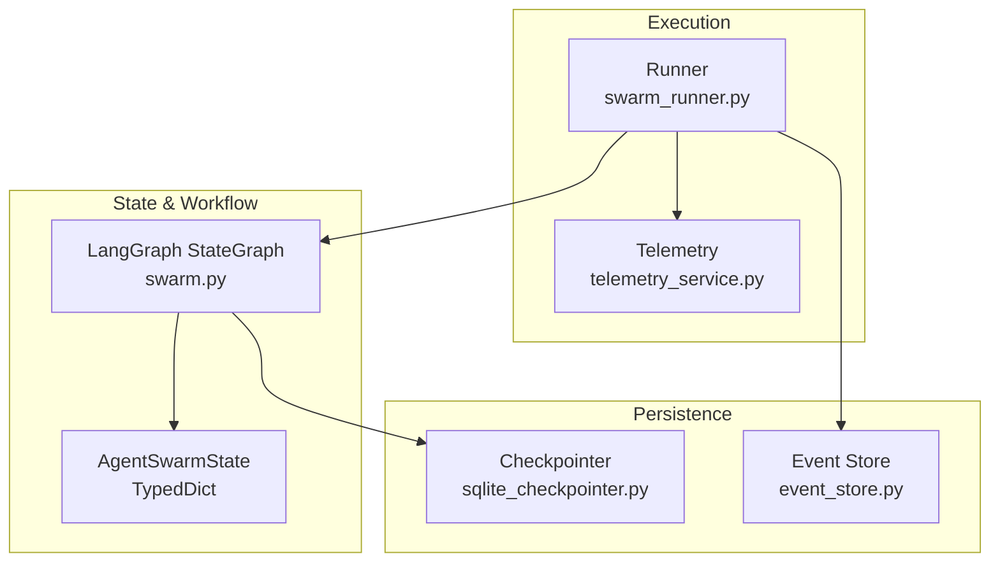
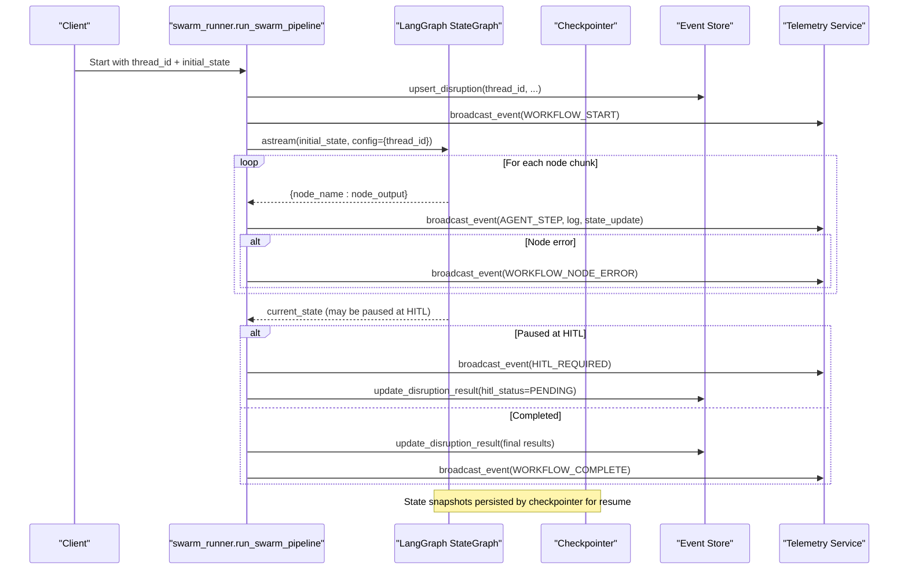
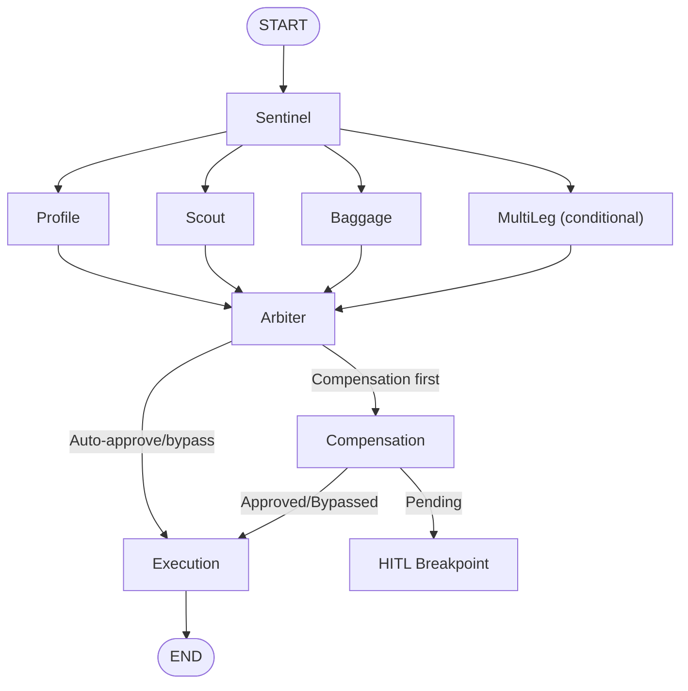
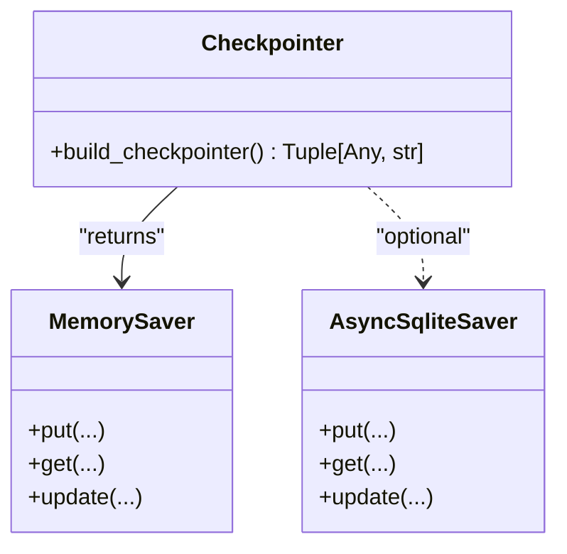
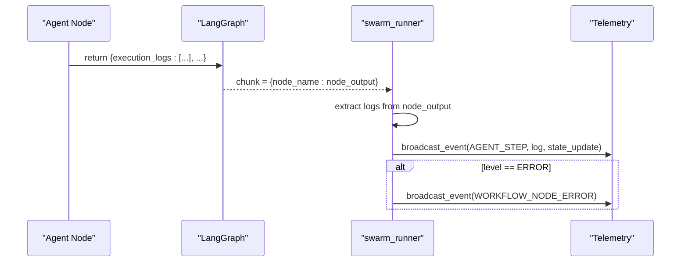
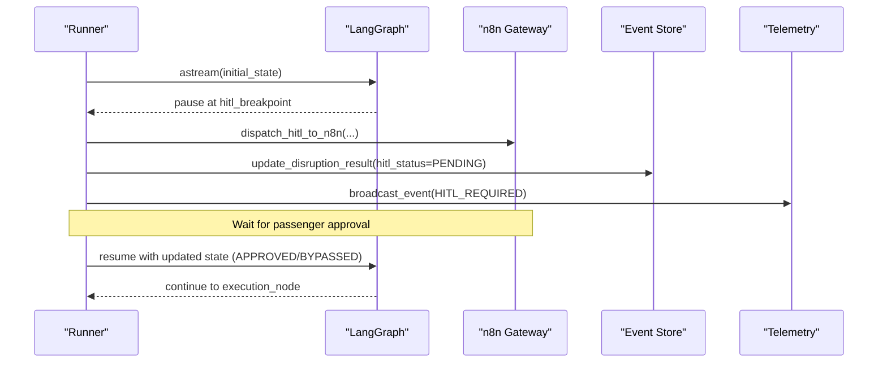
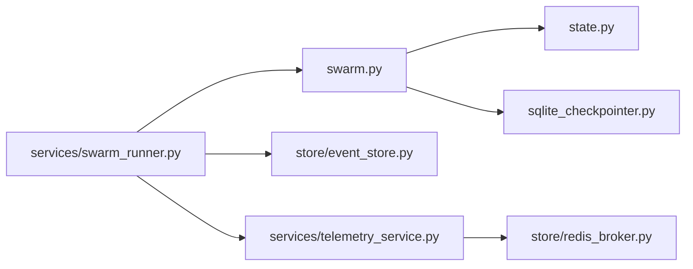

# State Management & Persistence

<cite>
**Referenced Files in This Document**
- [state.py](file://travel-recovery-os/backend/state.py)
- [swarm.py](file://travel-recovery-os/backend/swarm.py)
- [sqlite_checkpointer.py](file://travel-recovery-os/backend/store/sqlite_checkpointer.py)
- [event_store.py](file://travel-recovery-os/backend/store/event_store.py)
- [swarm_runner.py](file://travel-recovery-os/backend/services/swarm_runner.py)
- [telemetry_service.py](file://travel-recovery-os/backend/services/telemetry_service.py)
- [redis_broker.py](file://travel-recovery-os/backend/store/redis_broker.py)
</cite>

## Table of Contents
1. [Introduction](#introduction)
2. [Project Structure](#project-structure)
3. [Core Components](#core-components)
4. [Architecture Overview](#architecture-overview)
5. [Detailed Component Analysis](#detailed-component-analysis)
6. [Dependency Analysis](#dependency-analysis)
7. [Performance Considerations](#performance-considerations)
8. [Troubleshooting Guide](#troubleshooting-guide)
9. [Conclusion](#conclusion)

## Introduction
This document explains the state management architecture for the multi-agent travel recovery system, focusing on:
- The central AgentSwarmState typed dictionary that carries execution context across agents and boundaries
- Execution logging patterns used to stream telemetry during agent runs
- Durable checkpointing with SQLite to persist graph state across process restarts
- How state is serialized, how checkpoints are created and restored, and how execution context is maintained through human-in-the-loop pauses and resumption

## Project Structure
The state and persistence logic spans several modules:
- State schema and types are defined centrally
- The LangGraph workflow composes nodes and edges using the shared state
- A checkpointer abstraction provides durable state storage (SQLite or memory fallback)
- An event store persists disruption history and webhook audit trails
- A runner orchestrates execution, emits telemetry, and handles interruptions
- Telemetry services broadcast real-time events to clients

**Diagram sources**
- [state.py:130-167](file://travel-recovery-os/backend/state.py#L130-L167)
- [swarm.py:162-227](file://travel-recovery-os/backend/swarm.py#L162-L227)
- [sqlite_checkpointer.py:43-54](file://travel-recovery-os/backend/store/sqlite_checkpointer.py#L43-L54)
- [event_store.py:47-101](file://travel-recovery-os/backend/store/event_store.py#L47-L101)
- [swarm_runner.py:36-74](file://travel-recovery-os/backend/services/swarm_runner.py#L36-L74)
- [telemetry_service.py:45-68](file://travel-recovery-os/backend/services/telemetry_service.py#L45-L68)

**Section sources**
- [state.py:130-167](file://travel-recovery-os/backend/state.py#L130-L167)
- [swarm.py:162-227](file://travel-recovery-os/backend/swarm.py#L162-L227)
- [sqlite_checkpointer.py:43-54](file://travel-recovery-os/backend/store/sqlite_checkpointer.py#L43-L54)
- [event_store.py:47-101](file://travel-recovery-os/backend/store/event_store.py#L47-L101)
- [swarm_runner.py:36-74](file://travel-recovery-os/backend/services/swarm_runner.py#L36-L74)
- [telemetry_service.py:45-68](file://travel-recovery-os/backend/services/telemetry_service.py#L45-L68)

## Core Components
- AgentSwarmState: Central typed dictionary carrying all execution context, including thread_id, disruption_event, passenger_context, candidate_routes, selected_route, hitl_status, execution_logs, ticket_confirmation, sla_constraints, baggage_context, compensation_result, connecting_flights, agent_messages, and error_state. Some fields use additive reducers to merge results from parallel branches.
- LangGraph workflow: Composes nodes (sentinel, profile, scout, baggage, multileg, arbiter, compensation_node, hitl_breakpoint, execution_node) and defines conditional routing and interrupts before the HITL breakpoint.
- Checkpointer: Abstraction that can be backed by SQLite (for durability) or MemorySaver (fallback). It stores graph state snapshots keyed by thread_id so execution can resume after restarts.
- Event store: SQLite-backed tables for n8n webhook events and disruption records, enabling historical dashboards and auditability.
- Runner: Orchestrates streaming execution, per-node error handling, and updates persistent records at key milestones. Also dispatches HITL workflows when paused.
- Telemetry: Real-time SSE broadcasting with PII masking and Redis-backed pub/sub with in-memory fallback.

**Section sources**
- [state.py:20-167](file://travel-recovery-os/backend/state.py#L20-L167)
- [swarm.py:162-227](file://travel-recovery-os/backend/swarm.py#L162-L227)
- [sqlite_checkpointer.py:43-54](file://travel-recovery-os/backend/store/sqlite_checkpointer.py#L43-L54)
- [event_store.py:47-101](file://travel-recovery-os/backend/store/event_store.py#L47-L101)
- [swarm_runner.py:36-74](file://travel-recovery-os/backend/services/swarm_runner.py#L36-L74)
- [telemetry_service.py:23-68](file://travel-recovery-os/backend/services/telemetry_service.py#L23-L68)

## Architecture Overview
The system uses LangGraph to manage a multi-agent workflow over a shared state. Each node reads/writes fields in AgentSwarmState. The runner streams node outputs via SSE while persisting disruption lifecycle events. The checkpointer ensures state survives process restarts and supports pausing/resuming at the HITL breakpoint.

**Diagram sources**
- [swarm_runner.py:36-216](file://travel-recovery-os/backend/services/swarm_runner.py#L36-L216)
- [swarm.py:162-227](file://travel-recovery-os/backend/swarm.py#L162-L227)
- [event_store.py:166-239](file://travel-recovery-os/backend/store/event_store.py#L166-L239)
- [telemetry_service.py:45-68](file://travel-recovery-os/backend/services/telemetry_service.py#L45-L68)

## Detailed Component Analysis

### AgentSwarmState: Typed Dictionary and Reducers
- Purpose: Centralized schema for all cross-agent data, ensuring consistent access and type safety.
- Key fields:
  - thread_id: Unique identifier for session and checkpointing
  - disruption_event, passenger_context: Inputs describing the disruption and passenger constraints
  - candidate_routes, connecting_flights, agent_messages: Additive lists merged via operator.add across parallel branches
  - selected_route, ticket_confirmation: Outputs of decision and execution nodes
  - hitl_status: Controls routing to HITL or execution
  - execution_logs: Additive list of structured logs emitted by nodes
  - sla_constraints, baggage_context, compensation_result: Domain-specific outputs
  - error_state: Per-run error tracking
- Complexity:
  - List fields use additive reducers; merging grows linearly with number of appended items.
  - Optional fields allow partial state evolution across nodes.

**Section sources**
- [state.py:20-167](file://travel-recovery-os/backend/state.py#L20-L167)

### LangGraph Workflow and Execution Context
- Nodes: sentinel, profile, scout, baggage, multileg, arbiter, compensation_node, hitl_breakpoint, execution_node
- Edges:
  - START -> sentinel
  - Parallel fan-out to profile, scout, baggage, multileg
  - Fan-in to arbiter
  - Conditional routing from arbiter to compensation_node, execution_node, or hitl_breakpoint
  - From compensation_node to execution_node or hitl_breakpoint
  - From hitl_breakpoint to execution_node
- Interrupt: Configured to pause before hitl_breakpoint, enabling external approval flows
- Serialization: LangGraph serializes AgentSwarmState into its internal representation and persists it via the configured checkpointer

**Diagram sources**
- [swarm.py:162-227](file://travel-recovery-os/backend/swarm.py#L162-L227)

**Section sources**
- [swarm.py:162-227](file://travel-recovery-os/backend/swarm.py#L162-L227)

### Durable Checkpointing with SQLite
- Abstraction: build_checkpointer returns a checkpointer instance and provider name. Currently returns MemorySaver for compatibility; environment-driven path exists for SQLite.
- Configuration: SQLITE_DB_PATH defaults to a data directory under backend/data/checkpoints.sqlite
- Usage: Compiled graph is created with interrupt_before=["hitl_breakpoint"], enabling durable pause/resume semantics
- Behavior:
  - On astream/aget_state/aupdate_state, LangGraph persists state snapshots keyed by thread_id
  - After process restart, the same thread_id allows resuming from the last saved state

**Diagram sources**
- [sqlite_checkpointer.py:43-54](file://travel-recovery-os/backend/store/sqlite_checkpointer.py#L43-L54)

**Section sources**
- [sqlite_checkpointer.py:10-54](file://travel-recovery-os/backend/store/sqlite_checkpointer.py#L10-L54)
- [swarm.py:222-227](file://travel-recovery-os/backend/swarm.py#L222-L227)

### Execution Logging Patterns
- Structured logs: Each node emits ExecutionLog entries with timestamp, node, agent_name, level, message, and data
- Aggregation: execution_logs is an additive list field in AgentSwarmState; each node appends its logs
- Streaming: The runner extracts logs from node outputs and broadcasts them via telemetry service as AGENT_STEP events
- Error signaling: Nodes set level="ERROR" to trigger retry tracking and escalation in the runner

**Diagram sources**
- [swarm_runner.py:71-131](file://travel-recovery-os/backend/services/swarm_runner.py#L71-L131)
- [state.py:67-75](file://travel-recovery-os/backend/state.py#L67-L75)

**Section sources**
- [state.py:67-75](file://travel-recovery-os/backend/state.py#L67-L75)
- [swarm_runner.py:71-131](file://travel-recovery-os/backend/services/swarm_runner.py#L71-L131)

### Human-in-the-Loop Pause and Resume
- Interrupt: The compiled graph interrupts before hitl_breakpoint
- Runner behavior:
  - Detects pause via current_state.next containing "hitl_breakpoint"
  - Dispatches HITL request to n8n (WhatsApp gateway) with relevant context
  - Persists intermediate results and status to event store
  - Emits HITL_REQUIRED telemetry
- Resume: When external approval arrives, the runner resumes the graph with updated state (e.g., hitl_status set to APPROVED or BYPASSED), which routes to execution_node

**Diagram sources**
- [swarm.py:130-159](file://travel-recovery-os/backend/swarm.py#L130-L159)
- [swarm_runner.py:133-176](file://travel-recovery-os/backend/services/swarm_runner.py#L133-L176)

**Section sources**
- [swarm.py:130-159](file://travel-recovery-os/backend/swarm.py#L130-L159)
- [swarm_runner.py:133-176](file://travel-recovery-os/backend/services/swarm_runner.py#L133-L176)

### State Serialization and Persistence Across Boundaries
- In-memory state: AgentSwarmState is passed between nodes and streamed to the runner
- Persistent state:
  - Checkpointer: Stores graph state snapshots keyed by thread_id; enables resume after restarts
  - Event store: Persists disruption lifecycle and webhook audit trails for history and analytics
  - Telemetry: Broadcasts masked events to clients; optionally persisted via Redis broker with in-memory fallback
- Thread isolation: thread_id scopes all state, events, and checkpoints

**Section sources**
- [sqlite_checkpointer.py:31-54](file://travel-recovery-os/backend/store/sqlite_checkpointer.py#L31-L54)
- [event_store.py:166-239](file://travel-recovery-os/backend/store/event_store.py#L166-L239)
- [telemetry_service.py:45-68](file://travel-recovery-os/backend/services/telemetry_service.py#L45-L68)
- [redis_broker.py:1-200](file://travel-recovery-os/backend/store/redis_broker.py#L1-L200)

## Dependency Analysis
- swarm.py depends on:
  - state.AgentSwarmState and ExecutionLog
  - Agents (sentinel, profile, scout, baggage, multileg, arbiter, compensation)
  - sqlite_checkpointer.checkpointer and checkpointer_provider
  - tools.atlas_client.issue_ticket
- swarm_runner.py depends on:
  - swarm.swarm_graph
  - services.n8n_service.dispatch_hitl_to_n8n
  - services.telemetry_service.broadcast_event
  - store.event_store.upsert_disruption/update_disruption_result
  - middleware.resilience.retry_with_backoff
- telemetry_service.py delegates to redis_broker for pub/sub and history, with WebSocket integration

**Diagram sources**
- [swarm.py:16-37](file://travel-recovery-os/backend/swarm.py#L16-L37)
- [swarm_runner.py:11-16](file://travel-recovery-os/backend/services/swarm_runner.py#L11-L16)
- [telemetry_service.py:13-20](file://travel-recovery-os/backend/services/telemetry_service.py#L13-L20)

**Section sources**
- [swarm.py:16-37](file://travel-recovery-os/backend/swarm.py#L16-L37)
- [swarm_runner.py:11-16](file://travel-recovery-os/backend/services/swarm_runner.py#L11-L16)
- [telemetry_service.py:13-20](file://travel-recovery-os/backend/services/telemetry_service.py#L13-L20)

## Performance Considerations
- Additive reducers on large lists (candidate_routes, execution_logs, agent_messages) grow with each append; consider pagination or truncation strategies if lists become very large
- SQLite journal mode WAL improves concurrency for event_store; ensure checkpoint DB also uses appropriate settings when enabled
- Redis-backed telemetry reduces memory pressure vs in-memory queues; fallback ensures availability
- Per-node retry limits prevent runaway retries; tune MAX_NODE_RETRIES based on workload characteristics

[No sources needed since this section provides general guidance]

## Troubleshooting Guide
- No route selected for ticketing:
  - Symptom: Execution node logs an error indicating no selected_route
  - Action: Inspect arbiter output and candidate_routes; verify scoring and SLA constraints
- Exceeded max retries:
  - Symptom: WORKFLOW_NODE_ERROR with retry_count exceeding limit
  - Action: Investigate failing node logs; adjust retry policy or fix upstream dependency
- HITL required but not resumed:
  - Symptom: Workflow remains paused at HITL_BREAKPOINT
  - Action: Verify n8n webhook delivery and state update; ensure resume call includes correct thread_id and updated hitl_status
- Checkpoint not found after restart:
  - Symptom: New run starts from scratch instead of resuming
  - Action: Confirm thread_id matches previous run; verify checkpointer configuration and database path

**Section sources**
- [swarm.py:52-91](file://travel-recovery-os/backend/swarm.py#L52-L91)
- [swarm_runner.py:96-124](file://travel-recovery-os/backend/services/swarm_runner.py#L96-L124)
- [swarm_runner.py:133-176](file://travel-recovery-os/backend/services/swarm_runner.py#L133-L176)
- [sqlite_checkpointer.py:31-54](file://travel-recovery-os/backend/store/sqlite_checkpointer.py#L31-L54)

## Conclusion
The system’s state management centers on a well-defined AgentSwarmState that carries execution context across agents and boundaries. Execution logs provide rich, structured telemetry streamed to clients. Durable checkpointing via LangGraph’s checkpointer (with SQLite support) ensures state survives process restarts and supports human-in-the-loop pause/resume. The event store and telemetry services add persistence and real-time visibility, enabling robust operation and observability across complex multi-agent workflows.

[No sources needed since this section summarizes without analyzing specific files]