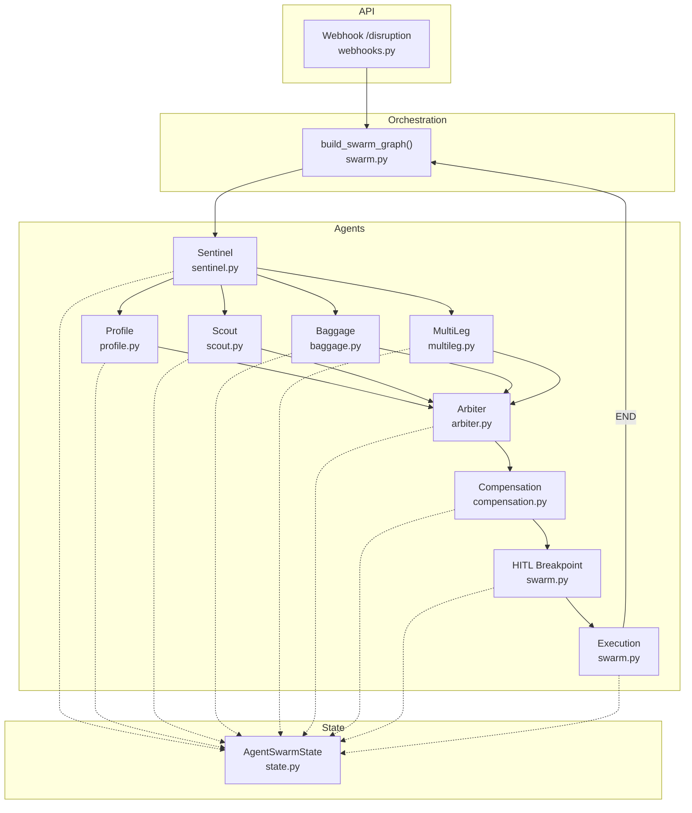
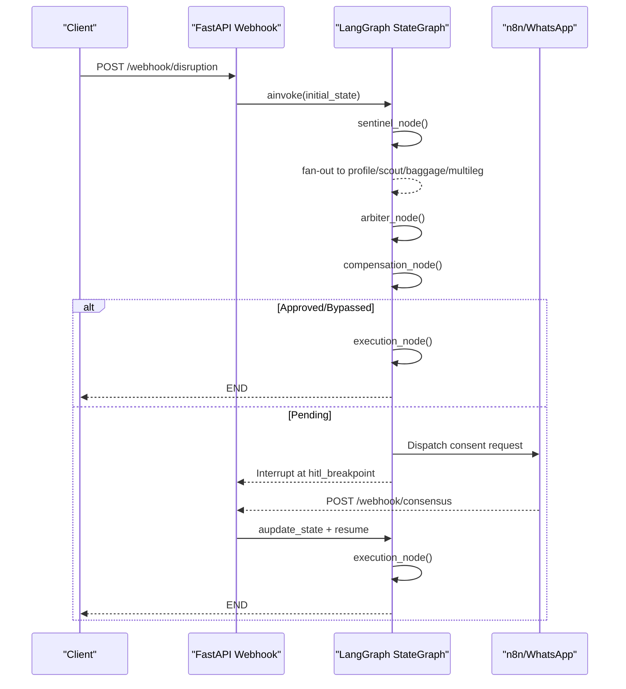
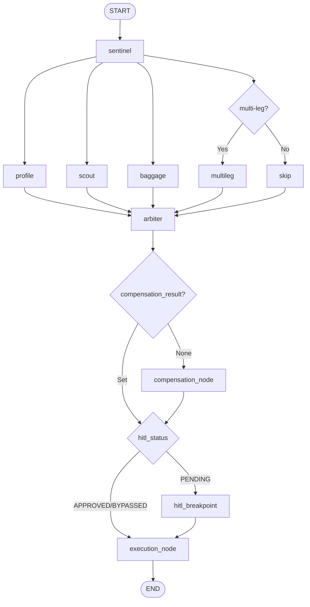
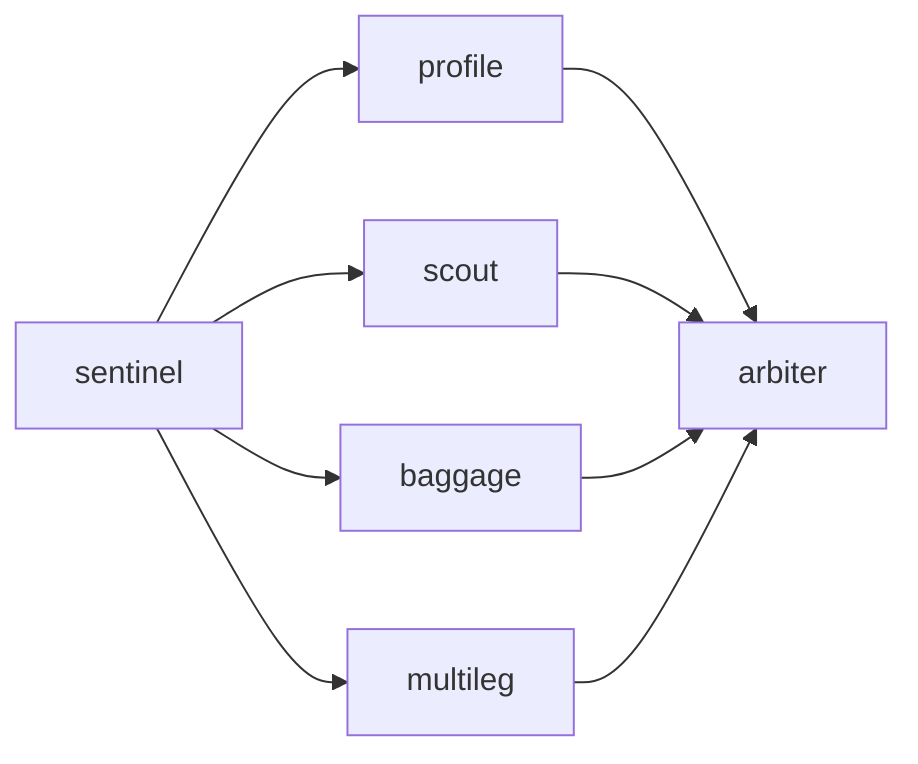
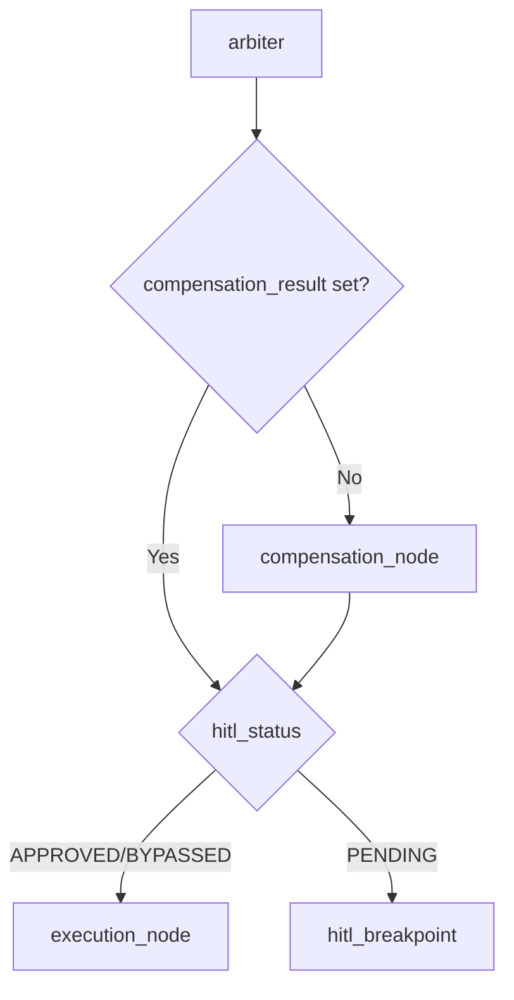
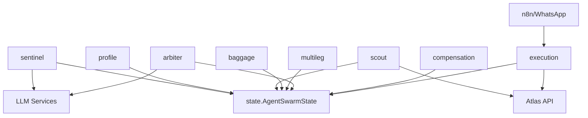

# Workflow Topology & Graph Design

<cite>
**Referenced Files in This Document**
- [swarm.py](file://travel-recovery-os/backend/swarm.py)
- [state.py](file://travel-recovery-os/backend/state.py)
- [sentinel.py](file://travel-recovery-os/backend/agents/sentinel.py)
- [profile.py](file://travel-recovery-os/backend/agents/profile.py)
- [scout.py](file://travel-recovery-os/backend/agents/scout.py)
- [baggage.py](file://travel-recovery-os/backend/agents/baggage.py)
- [multileg.py](file://travel-recovery-os/backend/agents/multileg.py)
- [arbiter.py](file://travel-recovery-os/backend/agents/arbiter.py)
- [compensation.py](file://travel-recovery-os/backend/agents/compensation.py)
- [webhooks.py](file://travel-recovery-os/backend/api/routers/webhooks.py)
</cite>

## Table of Contents
1. [Introduction](#introduction)
2. [Project Structure](#project-structure)
3. [Core Components](#core-components)
4. [Architecture Overview](#architecture-overview)
5. [Detailed Component Analysis](#detailed-component-analysis)
6. [Dependency Analysis](#dependency-analysis)
7. [Performance Considerations](#performance-considerations)
8. [Troubleshooting Guide](#troubleshooting-guide)
9. [Conclusion](#conclusion)

## Introduction
This document explains the LangGraph StateGraph workflow topology used by the Travel Recovery OS to autonomously recover from flight disruptions. It covers node registration, edge definitions, conditional routing, and the fan-out/fan-in pattern that enables parallel agent execution. It also details each agent’s role and how the graph handles different disruption scenarios, including multi-leg connections, baggage constraints, compensation eligibility, and human-in-the-loop approval.

## Project Structure
The workflow is defined and orchestrated in a central module that registers nodes, wires edges, and compiles the graph with durable checkpointing and an interrupt before the HITL breakpoint. Agents are implemented as independent modules that read and write fields in a shared state schema. The FastAPI webhook layer ingests disruption events, initializes the initial state, and resumes the graph after passenger consent.

**Diagram sources**
- [swarm.py:162-227](file://travel-recovery-os/backend/swarm.py#L162-L227)
- [state.py:130-167](file://travel-recovery-os/backend/state.py#L130-L167)
- [webhooks.py:14-72](file://travel-recovery-os/backend/api/routers/webhooks.py#L14-L72)

**Section sources**
- [swarm.py:162-227](file://travel-recovery-os/backend/swarm.py#L162-L227)
- [state.py:130-167](file://travel-recovery-os/backend/state.py#L130-L167)
- [webhooks.py:14-72](file://travel-recovery-os/backend/api/routers/webhooks.py#L14-L72)

## Core Components
- State schema: A single typed state object carries all context across agents (disruption event, passenger profile, candidate routes, selected route, compensation result, connecting flights, logs, etc.).
- Nodes: Each agent is a node that reads/writes specific fields in the state.
- Edges: Static edges define the base flow; conditional edges implement branching based on state.
- Checkpointer and interrupts: The compiled graph persists state and pauses at the HITL breakpoint until passenger consent is received.

Key responsibilities:
- Sentinel: Ingests and normalizes disruption signals (structured or raw text).
- Profile: Derives SLA constraints and financial liability metrics per loyalty tier.
- Scout: Queries external inventory for alternative routes.
- Baggage: Evaluates transfer feasibility and time impact.
- MultiLeg: Analyzes connection viability and missed connections.
- Arbiter: Scores candidates using ensemble logic and decides HITL bypass/approval.
- Compensation: Calculates passenger rights and eligible amounts.
- Execution: Issues final ticket via external API.

**Section sources**
- [state.py:20-167](file://travel-recovery-os/backend/state.py#L20-L167)
- [swarm.py:162-227](file://travel-recovery-os/backend/swarm.py#L162-L227)

## Architecture Overview
The graph implements a classic fan-out/fan-in pattern:
- Fan-out: After Sentinel, multiple agents run in parallel (Profile, Scout, Baggage, and conditionally MultiLeg).
- Fan-in: All branches converge at Arbiter, which aggregates results and makes decisions.
- Conditional routing: From Arbiter to Compensation and then to either HITL or Execution based on state flags.

**Diagram sources**
- [webhooks.py:14-72](file://travel-recovery-os/backend/api/routers/webhooks.py#L14-L72)
- [webhooks.py:74-185](file://travel-recovery-os/backend/api/routers/webhooks.py#L74-L185)
- [swarm.py:94-117](file://travel-recovery-os/backend/swarm.py#L94-L117)
- [swarm.py:130-159](file://travel-recovery-os/backend/swarm.py#L130-L159)
- [swarm.py:162-227](file://travel-recovery-os/backend/swarm.py#L162-L227)

## Detailed Component Analysis

### Graph Construction and Routing
- Node registration: All agents are registered as nodes in the StateGraph.
- Edges:
  - START → sentinel
  - sentinel → profile, scout, baggage, multileg (fan-out)
  - profile, scout, baggage, multileg → arbiter (fan-in)
  - arbiter → compensation (conditional)
  - compensation → execution or hitl_breakpoint (conditional)
  - hitl_breakpoint → execution (resume path)
  - execution → END
- Conditional routing functions:
  - route_after_arbiter: Always goes to compensation first; then routes to execution if bypassed/approved, otherwise to HITL.
  - route_after_compensation: Routes to execution if bypassed/approved, otherwise to HITL.
  - route_disruption_type: Determines whether to spawn MultiLeg based on keywords in disruption reason/text.

**Diagram sources**
- [swarm.py:162-227](file://travel-recovery-os/backend/swarm.py#L162-L227)
- [swarm.py:119-127](file://travel-recovery-os/backend/swarm.py#L119-L127)
- [swarm.py:94-117](file://travel-recovery-os/backend/swarm.py#L94-L117)

**Section sources**
- [swarm.py:162-227](file://travel-recovery-os/backend/swarm.py#L162-L227)
- [swarm.py:94-117](file://travel-recovery-os/backend/swarm.py#L94-L117)
- [swarm.py:119-127](file://travel-recovery-os/backend/swarm.py#L119-L127)

### Agent Roles and Data Flow

#### Sentinel
- Purpose: Normalize disruption input (structured JSON or raw text), extract key fields, and initialize the workflow.
- State writes: disruption_event, execution_logs.

**Section sources**
- [sentinel.py:34-90](file://travel-recovery-os/backend/agents/sentinel.py#L34-L90)

#### Profile
- Purpose: Compute SLA constraints and financial liability metrics based on passenger loyalty tier and delay magnitude.
- State writes: sla_constraints, execution_logs.

**Section sources**
- [profile.py:58-126](file://travel-recovery-os/backend/agents/profile.py#L58-L126)

#### Scout
- Purpose: Query external inventory for alternative routes and populate candidate_routes.
- State writes: candidate_routes, execution_logs.

**Section sources**
- [scout.py:32-86](file://travel-recovery-os/backend/agents/scout.py#L32-L86)

#### Baggage
- Purpose: Evaluate checked baggage transfer feasibility, interline agreements, special items, and estimated transfer time.
- State writes: baggage_context, agent_messages, execution_logs.

**Section sources**
- [baggage.py:76-151](file://travel-recovery-os/backend/agents/baggage.py#L76-L151)

#### MultiLeg
- Purpose: Detect multi-leg disruptions, evaluate minimum connection times, and determine if downstream segments are viable.
- State writes: connecting_flights, agent_messages, execution_logs.

**Section sources**
- [multileg.py:96-167](file://travel-recovery-os/backend/agents/multileg.py#L96-L167)

#### Arbiter
- Purpose: Score candidate routes using ensemble logic combining base scores, punctuality, baggage feasibility, compensation impact, and connection time; decide HITL bypass/approval.
- State writes: candidate_routes (scored), selected_route, hitl_status, execution_logs.

**Section sources**
- [arbiter.py:128-243](file://travel-recovery-os/backend/agents/arbiter.py#L128-L243)

#### Compensation
- Purpose: Calculate passenger rights and eligible compensation under applicable regulations (EU261/DOT/MAS) considering extraordinary circumstances.
- State writes: compensation_result, execution_logs.

**Section sources**
- [compensation.py:105-194](file://travel-recovery-os/backend/agents/compensation.py#L105-L194)

#### Execution
- Purpose: Issue final rebooked ticket via external API when approved or bypassed.
- State writes: ticket_confirmation, execution_logs.

**Section sources**
- [swarm.py:52-91](file://travel-recovery-os/backend/swarm.py#L52-L91)

### Fan-Out/Fan-In Pattern
- Fan-out: After sentinel, profile, scout, baggage, and optionally multileg execute concurrently. This maximizes throughput and reduces latency by overlapping I/O-bound operations (e.g., external API calls).
- Fan-in: All branches merge at arbiter, which aggregates outputs to make a consolidated decision.

**Diagram sources**
- [swarm.py:182-195](file://travel-recovery-os/backend/swarm.py#L182-L195)

**Section sources**
- [swarm.py:182-195](file://travel-recovery-os/backend/swarm.py#L182-L195)

### Conditional Routing Functions
- route_after_arbiter: Ensures compensation evaluation always runs; then routes to execution if bypassed/approved, otherwise to HITL.
- route_after_compensation: Routes to execution if bypassed/approved, otherwise to HITL.
- route_disruption_type: Spawns multileg only when disruption mentions connections or multi-leg keywords.

**Diagram sources**
- [swarm.py:94-117](file://travel-recovery-os/backend/swarm.py#L94-L117)

**Section sources**
- [swarm.py:94-117](file://travel-recovery-os/backend/swarm.py#L94-L117)

### Disruption Scenarios and Handling
- Single-leg disruption: Profile, Scout, Baggage run; MultiLeg may be skipped depending on route type; Arbiter scores and decides; Compensation evaluates rights; Execution issues ticket if approved.
- Multi-leg disruption: MultiLeg analyzes connection viability; Arbiter factors in connection risk; Compensation applies; Execution proceeds upon approval.
- Extraordinary circumstances: Compensation marks ineligible; Arbiter may still proceed based on score and policy; Execution proceeds if approved.
- Human-in-the-loop: If not bypassed/approved, graph pauses at HITL; passenger consent via n8n/WhatsApp updates state and resumes execution.

**Section sources**
- [multileg.py:43-81](file://travel-recovery-os/backend/agents/multileg.py#L43-L81)
- [compensation.py:82-90](file://travel-recovery-os/backend/agents/compensation.py#L82-L90)
- [webhooks.py:74-185](file://travel-recovery-os/backend/api/routers/webhooks.py#L74-L185)

## Dependency Analysis
- Centralized state: All agents depend on the shared AgentSwarmState schema for reading inputs and writing outputs.
- External integrations:
  - Atlas API: Used by Scout for inventory search and by Execution for ticket issuance.
  - LLM services: Sentinel uses Hermes for extraction; Arbiter uses DeepSeek for scoring and reasoning.
  - n8n/WhatsApp: Used for HITL consent collection and resuming the graph.
- Coupling:
  - Low coupling between agents via state; high cohesion within each agent’s responsibility.
  - Conditional edges introduce minimal coupling through well-defined state keys (hitl_status, compensation_result).

**Diagram sources**
- [state.py:130-167](file://travel-recovery-os/backend/state.py#L130-L167)
- [scout.py:32-86](file://travel-recovery-os/backend/agents/scout.py#L32-L86)
- [swarm.py:52-91](file://travel-recovery-os/backend/swarm.py#L52-L91)
- [sentinel.py:34-90](file://travel-recovery-os/backend/agents/sentinel.py#L34-L90)
- [arbiter.py:128-243](file://travel-recovery-os/backend/agents/arbiter.py#L128-L243)
- [webhooks.py:74-185](file://travel-recovery-os/backend/api/routers/webhooks.py#L74-L185)

**Section sources**
- [state.py:130-167](file://travel-recovery-os/backend/state.py#L130-L167)
- [scout.py:32-86](file://travel-recovery-os/backend/agents/scout.py#L32-L86)
- [swarm.py:52-91](file://travel-recovery-os/backend/swarm.py#L52-L91)
- [sentinel.py:34-90](file://travel-recovery-os/backend/agents/sentinel.py#L34-L90)
- [arbiter.py:128-243](file://travel-recovery-os/backend/agents/arbiter.py#L128-L243)
- [webhooks.py:74-185](file://travel-recovery-os/backend/api/routers/webhooks.py#L74-L185)

## Performance Considerations
- Parallelism: Fan-out ensures I/O-bound tasks (LLM parsing, inventory search, baggage analysis, connection analysis) run concurrently, reducing overall latency.
- Conditional spawning: MultiLeg is only invoked when relevant, avoiding unnecessary work.
- Ensemble scoring: Arbiter computes a weighted composite score efficiently; confidence intervals provide robustness against variance.
- Checkpointing: Durable checkpointer allows safe pausing/resuming without recomputation, improving resilience and user experience during HITL waits.

[No sources needed since this section provides general guidance]

## Troubleshooting Guide
- No candidate route selected: Execution node logs an error if selected_route is missing; verify Scout output and Arbiter scoring.
- HITL stuck: Ensure consensus endpoint updates hitl_status and resumes the graph; confirm n8n integration and thread_id correctness.
- Compensation misclassification: Verify jurisdiction detection and extraordinary circumstance checks; adjust thresholds if needed.
- Multi-leg false positives/negatives: Review keyword matching in route type detection and MCT calculations.

**Section sources**
- [swarm.py:52-91](file://travel-recovery-os/backend/swarm.py#L52-L91)
- [webhooks.py:74-185](file://travel-recovery-os/backend/api/routers/webhooks.py#L74-L185)
- [compensation.py:82-90](file://travel-recovery-os/backend/agents/compensation.py#L82-L90)
- [multileg.py:43-81](file://travel-recovery-os/backend/agents/multileg.py#L43-L81)

## Conclusion
The LangGraph StateGraph implements a robust, scalable workflow for travel disruption recovery. Its fan-out/fan-in design enables parallel processing of specialized agents, while conditional routing and durable checkpointing support flexible, resilient handling of diverse scenarios. The architecture cleanly separates concerns, leverages external services judiciously, and integrates human oversight where necessary to ensure passenger satisfaction and regulatory compliance.