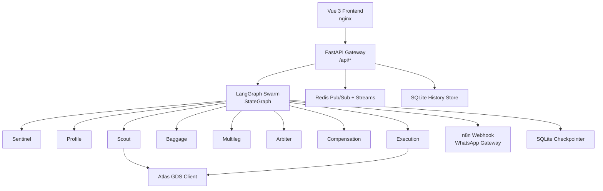
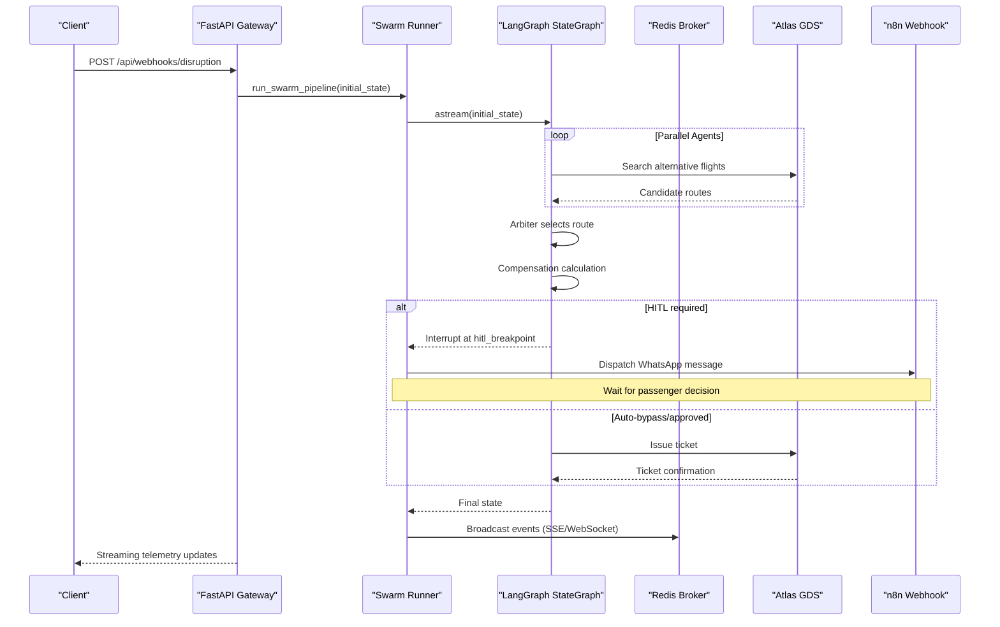
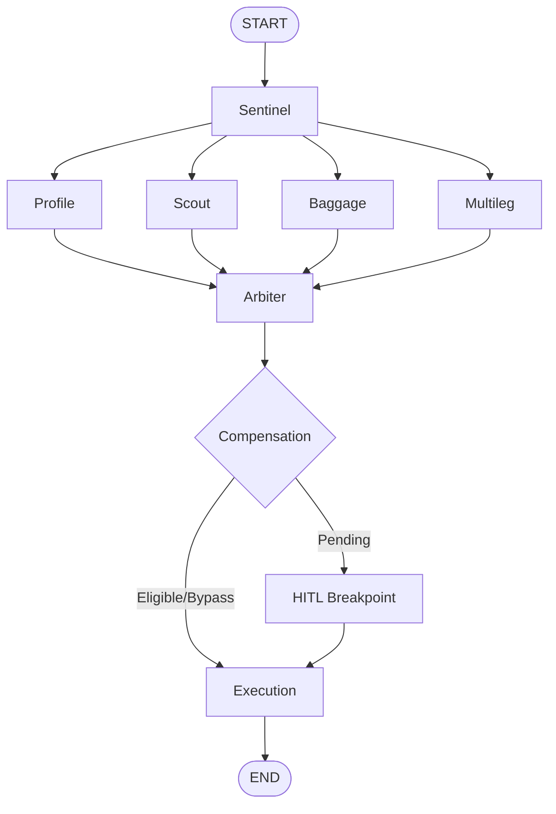
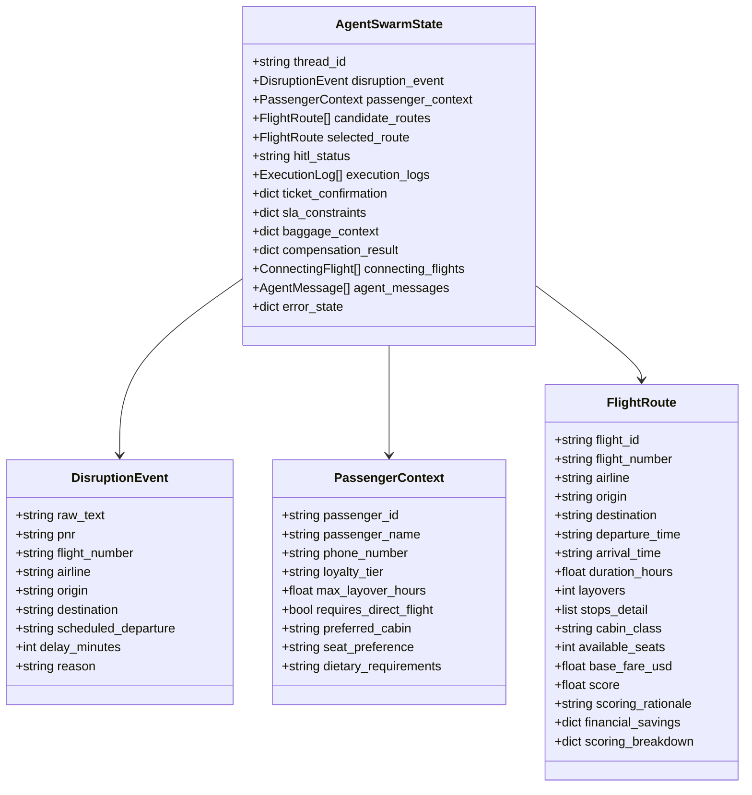
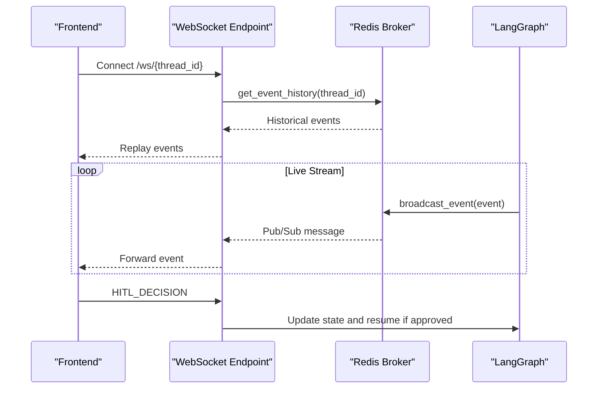
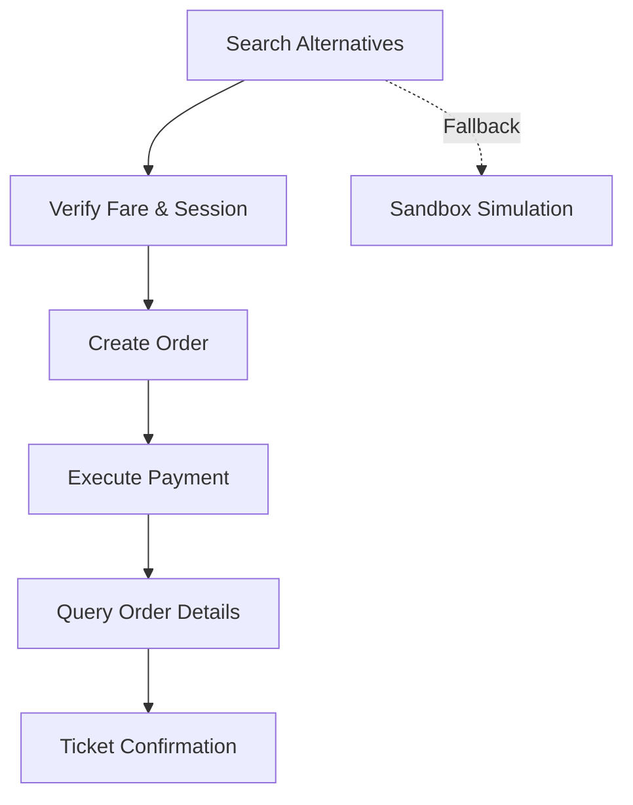
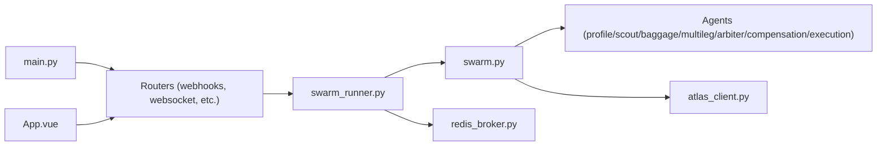

# Architecture Overview

<cite>
**Referenced Files in This Document**
- [main.py](file://travel-recovery-os/backend/main.py)
- [swarm.py](file://travel-recovery-os/backend/swarm.py)
- [state.py](file://travel-recovery-os/backend/state.py)
- [config.py](file://travel-recovery-os/backend/config.py)
- [webhooks.py](file://travel-recovery-os/backend/api/routers/webhooks.py)
- [websocket.py](file://travel-recovery-os/backend/api/routers/websocket.py)
- [swarm_runner.py](file://travel-recovery-os/backend/services/swarm_runner.py)
- [redis_broker.py](file://travel-recovery-os/backend/store/redis_broker.py)
- [atlas_client.py](file://travel-recovery-os/backend/tools/atlas_client.py)
- [App.vue](file://travel-recovery-os/frontend/src/App.vue)
- [docker-compose.yml](file://travel-recovery-os/docker-compose.yml)
- [Dockerfile (backend)](file://travel-recovery-os/backend/Dockerfile)
- [Dockerfile (frontend)](file://travel-recovery-os/frontend/Dockerfile)
</cite>

## Table of Contents
1. Introduction
2. Project Structure
3. Core Components
4. Architecture Overview
5. Detailed Component Analysis
6. Dependency Analysis
7. Performance Considerations
8. Troubleshooting Guide
9. Conclusion

## Introduction
SynapseAir is an autonomous, multi-agent flight disruption recovery system that ingests disruptions and orchestrates specialized agents to evaluate alternatives, calculate compensation, obtain passenger consent when required, and execute rebooking via a GDS. The system uses an event-driven microservices architecture with a FastAPI gateway, LangGraph StateGraph-based orchestration, real-time telemetry over WebSocket/SSE backed by Redis, and a Vue 3 dashboard for operators and passengers.

## Project Structure
The repository is organized into clear layers:
- Gateway layer: FastAPI application exposing REST endpoints for webhooks, telemetry, history, and WebSocket streaming.
- Orchestration layer: LangGraph StateGraph defining the agent workflow, state schema, and durable checkpointing.
- Agent processing layer: Specialized nodes (Sentinel, Profile, Scout, Baggage, Multileg, Arbiter, Compensation, Execution).
- External integration layer: Atlas GDS client for search and ticketing; n8n webhook integration for WhatsApp HITL.
- Persistence and messaging: SQLite checkpointer for graph state; Redis-backed event bus for SSE/WebSocket fan-out; SQLite for history.
- Frontend dashboard: Vue 3 app served by nginx, consuming APIs and streaming events.
- Containerization: Docker Compose composes backend, frontend, Redis, and n8n services.

**Diagram sources**
- [main.py:40-113](file://travel-recovery-os/backend/main.py#L40-L113)
- [swarm.py:162-227](file://travel-recovery-os/backend/swarm.py#L162-L227)
- [redis_broker.py:86-179](file://travel-recovery-os/backend/store/redis_broker.py#L86-L179)
- [atlas_client.py:175-219](file://travel-recovery-os/backend/tools/atlas_client.py#L175-L219)
- [docker-compose.yml:3-71](file://travel-recovery-os/docker-compose.yml#L3-L71)

**Section sources**
- [main.py:40-113](file://travel-recovery-os/backend/main.py#L40-L113)
- [docker-compose.yml:3-71](file://travel-recovery-os/docker-compose.yml#L3-L71)

## Core Components
- FastAPI Gateway: Mounts routers for webhooks, telemetry, history, websocket, and health checks; configures CORS for the Vue frontend.
- LangGraph Swarm: Defines nodes and edges for parallel evaluation, conditional routing, HITL breakpoint, and execution.
- State Schema: Central TypedDict capturing disruption event, passenger context, candidate routes, selected route, compensation, baggage context, and logs.
- Event Bus: Redis-backed pub/sub and streams for real-time SSE/WebSocket fan-out with in-memory fallback.
- External Integrations: Atlas GDS client for search and ticketing; n8n webhook dispatch for WhatsApp HITL.
- Frontend Dashboard: Vue 3 components orchestrating UI, streaming, and HITL interactions.

**Section sources**
- [swarm.py:162-227](file://travel-recovery-os/backend/swarm.py#L162-L227)
- [state.py:130-167](file://travel-recovery-os/backend/state.py#L130-L167)
- [redis_broker.py:86-179](file://travel-recovery-os/backend/store/redis_broker.py#L86-L179)
- [atlas_client.py:175-219](file://travel-recovery-os/backend/tools/atlas_client.py#L175-L219)
- [App.vue:1-219](file://travel-recovery-os/frontend/src/App.vue#L1-L219)

## Architecture Overview
High-level design emphasizes separation of concerns:
- Gateway Layer: Stateless HTTP entrypoints, auth, rate limiting, and middleware.
- Orchestration Layer: LangGraph StateGraph with durable checkpoints and interrupt points for HITL.
- Integration Layer: GDS and messaging gateways abstracted behind clients and services.
- Data Layer: Redis for real-time messaging; SQLite for persistence and checkpointing.
- Presentation Layer: Vue 3 SPA with WebSocket/SSE consumption and interactive controls.

**Diagram sources**
- [webhooks.py:14-72](file://travel-recovery-os/backend/api/routers/webhooks.py#L14-L72)
- [swarm_runner.py:36-216](file://travel-recovery-os/backend/services/swarm_runner.py#L36-L216)
- [swarm.py:162-227](file://travel-recovery-os/backend/swarm.py#L162-L227)
- [atlas_client.py:222-357](file://travel-recovery-os/backend/tools/atlas_client.py#L222-L357)
- [redis_broker.py:86-179](file://travel-recovery-os/backend/store/redis_broker.py#L86-L179)

## Detailed Component Analysis

### FastAPI Gateway Layer
- Mounts routers for webhooks, telemetry, history, websocket, and tests (non-production).
- Configures CORS for local and configured frontend origins.
- Provides health endpoint and lifecycle hooks for logging/tracing setup and shutdown.

Key responsibilities:
- Ingest disruption payloads and return thread_id for tracking.
- Handle consensus webhooks to resume or stop workflows.
- Expose WebSocket endpoint for bidirectional telemetry and HITL decisions.

**Section sources**
- [main.py:40-113](file://travel-recovery-os/backend/main.py#L40-L113)
- [webhooks.py:14-72](file://travel-recovery-os/backend/api/routers/webhooks.py#L14-L72)
- [webhooks.py:74-185](file://travel-recovery-os/backend/api/routers/webhooks.py#L74-L185)
- [websocket.py:21-93](file://travel-recovery-os/backend/api/routers/websocket.py#L21-L93)

### LangGraph StateGraph Orchestration
- Builds a workflow with START -> Sentinel -> parallel Profile/Scout/Baggage/Multileg -> Arbiter -> Compensation -> HITL/Execution -> END.
- Uses conditional routing based on state fields (e.g., compensation_result, hitl_status).
- Compiles with a durable SQLite checkpointer and interrupts before the HITL breakpoint node.

**Diagram sources**
- [swarm.py:162-227](file://travel-recovery-os/backend/swarm.py#L162-L227)

**Section sources**
- [swarm.py:162-227](file://travel-recovery-os/backend/swarm.py#L162-L227)

### State Schema and Data Model
- Central state captures disruption event, passenger context, candidate routes, selected route, compensation result, baggage context, connecting flights, agent messages, and error state.
- Uses annotated lists with additive reducers for merging results from parallel branches.

**Diagram sources**
- [state.py:20-167](file://travel-recovery-os/backend/state.py#L20-L167)

**Section sources**
- [state.py:20-167](file://travel-recovery-os/backend/state.py#L20-L167)

### Real-Time Communication Patterns
- Redis broker provides persistent event streams per thread and pub/sub channels for live fan-out to connected clients.
- Graceful fallback to in-memory queues when Redis is unavailable.
- WebSocket endpoint replays historical events and supports HITL decisions.

**Diagram sources**
- [websocket.py:21-93](file://travel-recovery-os/backend/api/routers/websocket.py#L21-L93)
- [redis_broker.py:86-179](file://travel-recovery-os/backend/store/redis_broker.py#L86-L179)

**Section sources**
- [websocket.py:21-93](file://travel-recovery-os/backend/api/routers/websocket.py#L21-L93)
- [redis_broker.py:86-179](file://travel-recovery-os/backend/store/redis_broker.py#L86-L179)

### External Integration Layer
- Atlas GDS client implements search, verify, order, pay, and query flows with circuit breaker and retry logic; includes sandbox fallback for resilience.
- n8n service dispatches HITL messages to WhatsApp and receives consensus webhooks to resume workflows.

**Diagram sources**
- [atlas_client.py:175-219](file://travel-recovery-os/backend/tools/atlas_client.py#L175-L219)
- [atlas_client.py:222-357](file://travel-recovery-os/backend/tools/atlas_client.py#L222-L357)

**Section sources**
- [atlas_client.py:175-219](file://travel-recovery-os/backend/tools/atlas_client.py#L175-L219)
- [atlas_client.py:222-357](file://travel-recovery-os/backend/tools/atlas_client.py#L222-L357)

### Frontend Dashboard
- Vue 3 application composed of modular components: pipeline tracker, disruption simulator, recovery proposal, mobile HITL mock, route map, agent messages, live terminal, and history dashboard.
- Consumes WebSocket/SSE streams and triggers HITL decisions from the UI.

**Section sources**
- [App.vue:1-219](file://travel-recovery-os/frontend/src/App.vue#L1-L219)

## Dependency Analysis
- Gateway depends on routers and middleware; routers depend on swarm runner and state models.
- Swarm runner depends on LangGraph graph, n8n service, telemetry, and event store.
- Redis broker decouples event publishing from consumers; used by both API and runner.
- Atlas client abstracts GDS calls; used by scout/execution paths.
- Frontend depends on backend APIs and WebSocket endpoints.

**Diagram sources**
- [main.py:40-113](file://travel-recovery-os/backend/main.py#L40-L113)
- [webhooks.py:14-72](file://travel-recovery-os/backend/api/routers/webhooks.py#L14-L72)
- [swarm_runner.py:36-216](file://travel-recovery-os/backend/services/swarm_runner.py#L36-L216)
- [swarm.py:162-227](file://travel-recovery-os/backend/swarm.py#L162-L227)
- [redis_broker.py:86-179](file://travel-recovery-os/backend/store/redis_broker.py#L86-L179)
- [atlas_client.py:175-219](file://travel-recovery-os/backend/tools/atlas_client.py#L175-L219)
- [App.vue:1-219](file://travel-recovery-os/frontend/src/App.vue#L1-L219)

**Section sources**
- [main.py:40-113](file://travel-recovery-os/backend/main.py#L40-L113)
- [swarm_runner.py:36-216](file://travel-recovery-os/backend/services/swarm_runner.py#L36-L216)

## Performance Considerations
- Parallel agent evaluation reduces time-to-first-route; additive reducers merge results efficiently.
- Redis-backed event bus scales fan-out to multiple clients with low latency; in-memory fallback ensures availability.
- Atlas client caching avoids repeated searches within short windows; circuit breakers prevent cascading failures.
- SQLite checkpointer enables durable state across interruptions without heavy infrastructure.

[No sources needed since this section provides general guidance]

## Troubleshooting Guide
Common issues and mitigations:
- Redis unavailability: System falls back to in-memory queues; ensure USE_REDIS flag and connectivity are configured correctly.
- Missing environment variables: Production validator warns about missing secrets and keys; configure .env files per environment.
- Workflow errors: Errors are persisted and broadcast; inspect event history and final state for diagnostics.
- Atlas API failures: Circuit breaker and retries mitigate transient errors; sandbox fallback provides continuity.

**Section sources**
- [redis_broker.py:42-62](file://travel-recovery-os/backend/store/redis_broker.py#L42-L62)
- [config.py:92-112](file://travel-recovery-os/backend/config.py#L92-L112)
- [swarm_runner.py:200-216](file://travel-recovery-os/backend/services/swarm_runner.py#L200-L216)
- [atlas_client.py:197-219](file://travel-recovery-os/backend/tools/atlas_client.py#L197-L219)

## Conclusion
SynapseAir combines an event-driven microservices architecture with LangGraph-based orchestration to deliver rapid, resilient, and compliant flight disruption recovery. The separation between gateway, orchestration, integration, and presentation layers enables scalability and maintainability, while Redis and SQLite provide robust real-time and durable state management. The system’s design supports zero-touch resolution for eligible cases and seamless human-in-the-loop workflows when necessary, culminating in automated ticket issuance through Atlas GDS.

[No sources needed since this section summarizes without analyzing specific files]