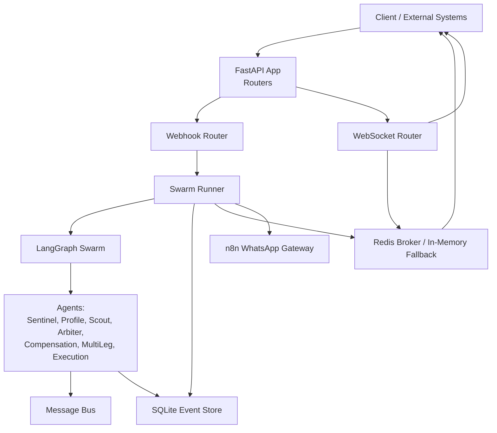
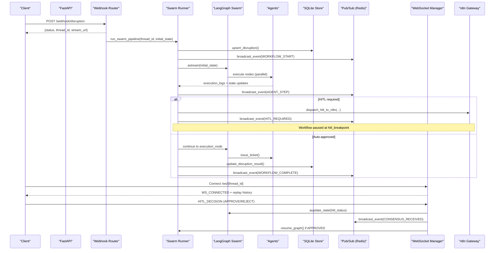
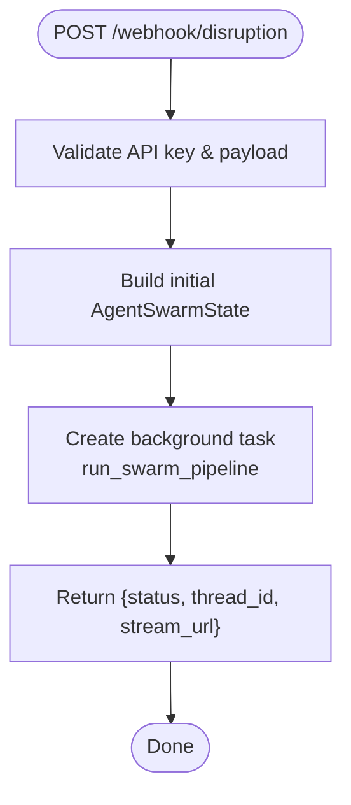
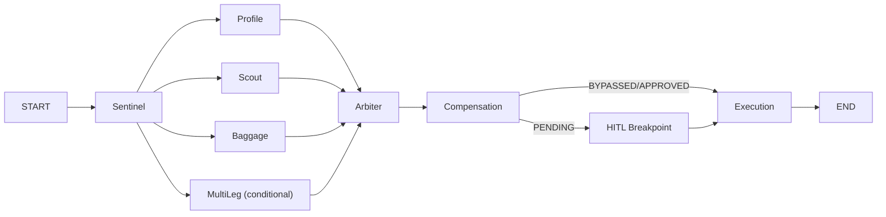
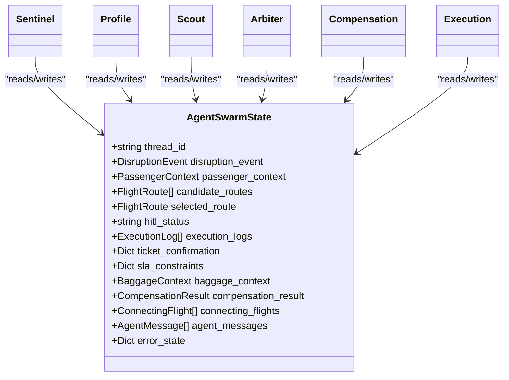
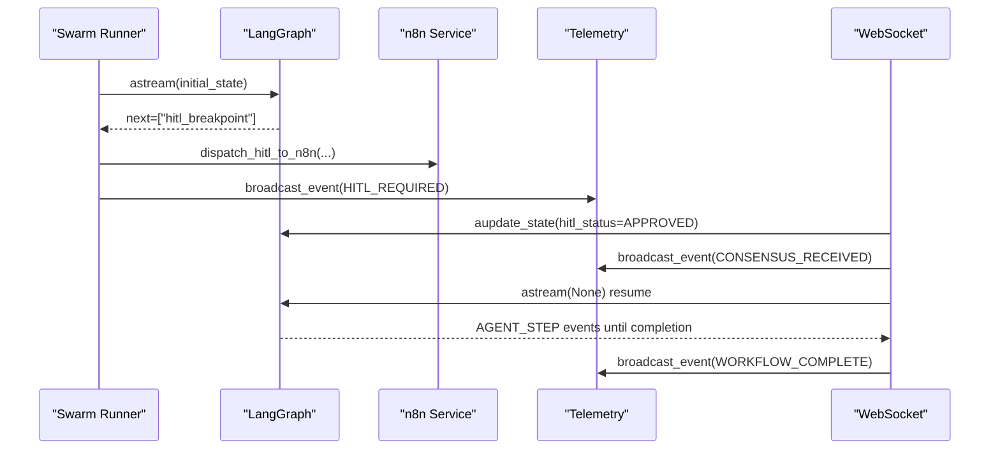
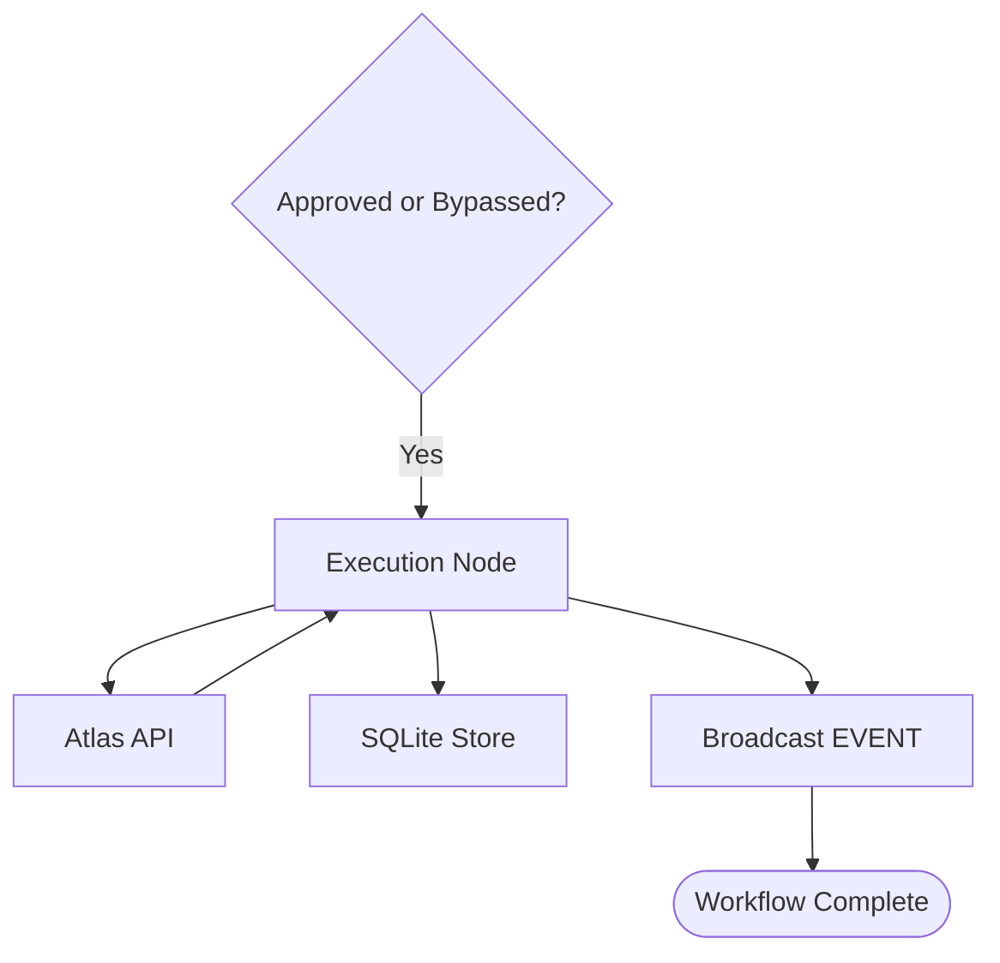
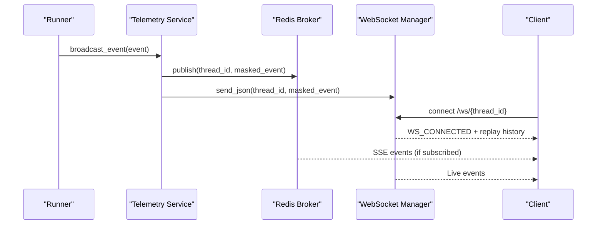
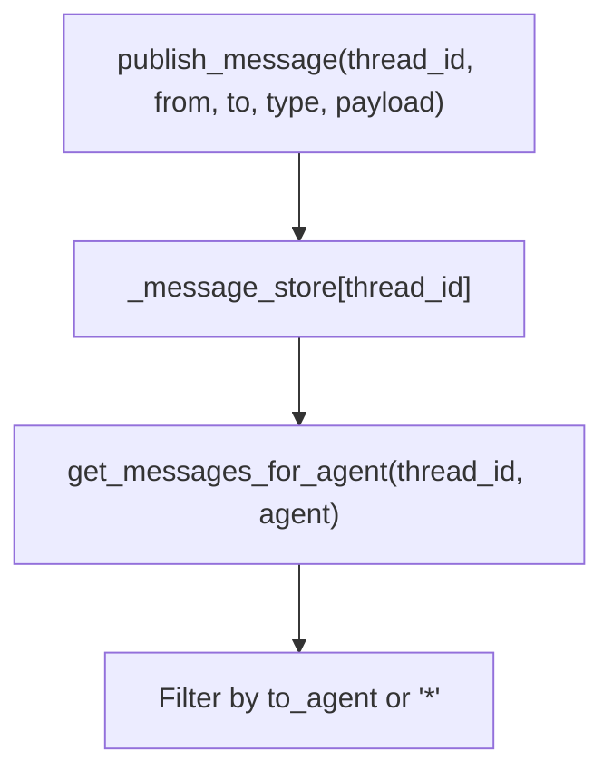
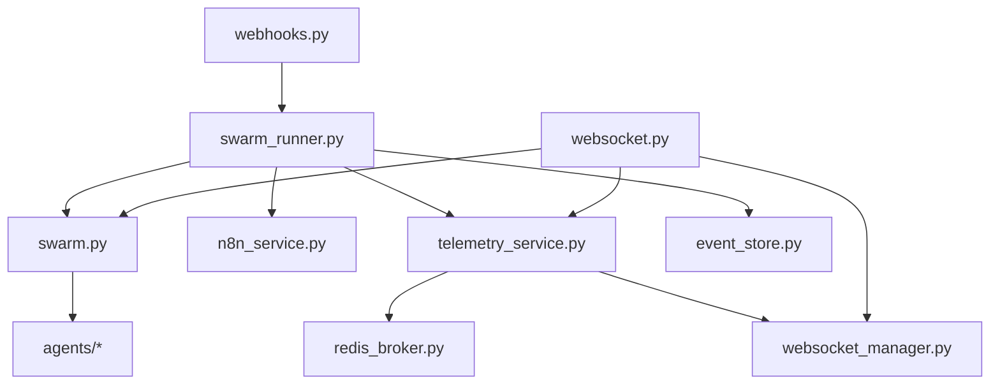

# Data Flow & Processing Pipeline

<cite>
**Referenced Files in This Document**
- [main.py](file://backend/main.py)
- [webhooks.py](file://backend/api/routers/webhooks.py)
- [websocket.py](file://backend/api/routers/websocket.py)
- [swarm.py](file://backend/swarm.py)
- [swarm_runner.py](file://backend/services/swarm_runner.py)
- [telemetry_service.py](file://backend/services/telemetry_service.py)
- [websocket_manager.py](file://backend/services/websocket_manager.py)
- [message_bus.py](file://backend/services/message_bus.py)
- [state.py](file://backend/state.py)
- [event_store.py](file://backend/store/event_store.py)
- [sentinel.py](file://backend/agents/sentinel.py)
- [profile.py](file://backend/agents/profile.py)
- [scout.py](file://backend/agents/scout.py)
- [arbiter.py](file://backend/agents/arbiter.py)
- [n8n_service.py](file://backend/services/n8n_service.py)
</cite>

## Table of Contents
1. [Introduction](#introduction)
2. [Project Structure](#project-structure)
3. [Core Components](#core-components)
4. [Architecture Overview](#architecture-overview)
5. [Detailed Component Analysis](#detailed-component-analysis)
6. [Dependency Analysis](#dependency-analysis)
7. [Performance Considerations](#performance-considerations)
8. [Troubleshooting Guide](#troubleshooting-guide)
9. [Conclusion](#conclusion)

## Introduction
This document explains the end-to-end data flow pipeline for flight disruption recovery: from webhook ingestion through structured event processing, parallel agent execution, decision aggregation, and final ticket issuance. It covers message passing patterns, real-time streaming via WebSocket and Server-Sent Events (SSE), and state transformations across processing stages. The system uses a LangGraph-based swarm to orchestrate specialized agents, with durable checkpoints and human-in-the-loop (HITL) approval flows.

## Project Structure
The backend exposes HTTP endpoints for webhooks and telemetry, orchestrates a multi-agent workflow, persists events, and streams live updates to clients. Key modules include:
- API layer: Webhook ingestion, WebSocket endpoint, telemetry routes
- Swarm orchestration: LangGraph graph definition and compiled graph
- Services: Swarm runner, telemetry broadcaster, n8n gateway, message bus
- Agents: Sentinel, Profile, Scout, Arbiter, plus compensation and multi-leg support
- Storage: SQLite event store and Redis-backed pub/sub for SSE

**Diagram sources**
- [main.py:104-108](file://backend/main.py#L104-L108)
- [webhooks.py:14-72](file://backend/api/routers/webhooks.py#L14-L72)
- [websocket.py:21-92](file://backend/api/routers/websocket.py#L21-L92)
- [swarm_runner.py:36-216](file://backend/services/swarm_runner.py#L36-L216)
- [swarm.py:162-231](file://backend/swarm.py#L162-L231)
- [telemetry_service.py:45-68](file://backend/services/telemetry_service.py#L45-L68)
- [event_store.py:166-239](file://backend/store/event_store.py#L166-L239)
- [n8n_service.py:51-202](file://backend/services/n8n_service.py#L51-L202)

**Section sources**
- [main.py:22-128](file://backend/main.py#L22-L128)

## Core Components
- Webhook ingestion: Accepts structured or raw disruption payloads, constructs initial state, and triggers background swarm execution.
- Swarm runner: Executes the LangGraph workflow, emits telemetry, handles per-node errors, persists results, and manages HITL pause/resume.
- LangGraph swarm: Defines nodes and edges for parallel fan-out, arbiter scoring, compensation, HITL breakpoint, and execution.
- Telemetry and streaming: Broadcasts masked events to SSE (via Redis broker) and WebSocket connections; replays history on connect.
- Message bus: Lightweight in-memory inter-agent messaging with thread-scoped storage.
- Persistence: SQLite stores disruption records and n8n webhook audit logs.
- n8n integration: Dispatches HITL notifications and receives consensus callbacks.

**Section sources**
- [webhooks.py:14-72](file://backend/api/routers/webhooks.py#L14-L72)
- [swarm_runner.py:36-216](file://backend/services/swarm_runner.py#L36-L216)
- [swarm.py:162-231](file://backend/swarm.py#L162-L231)
- [telemetry_service.py:23-68](file://backend/services/telemetry_service.py#L23-L68)
- [message_bus.py:27-108](file://backend/services/message_bus.py#L27-L108)
- [event_store.py:166-239](file://backend/store/event_store.py#L166-L239)
- [n8n_service.py:51-202](file://backend/services/n8n_service.py#L51-L202)

## Architecture Overview
The pipeline starts at the webhook router, which validates input, builds an initial AgentSwarmState, and launches the swarm runner as a background task. The runner executes the LangGraph graph, emitting telemetry events that are broadcast via SSE and WebSocket. Parallel agents compute SLA constraints, discover alternative routes, evaluate baggage feasibility, and assess multi-leg connections. The Arbiter aggregates inputs into a scored recommendation and decides whether to auto-approve or require HITL. If HITL is required, the workflow pauses, dispatches a WhatsApp notification via n8n, and resumes upon passenger approval. Finally, the execution node issues a ticket via the Atlas API and completes the workflow.

**Diagram sources**
- [webhooks.py:14-72](file://backend/api/routers/webhooks.py#L14-L72)
- [swarm_runner.py:36-216](file://backend/services/swarm_runner.py#L36-L216)
- [swarm.py:162-231](file://backend/swarm.py#L162-L231)
- [websocket.py:21-92](file://backend/api/routers/websocket.py#L21-L92)
- [telemetry_service.py:45-68](file://backend/services/telemetry_service.py#L45-L68)
- [n8n_service.py:51-202](file://backend/services/n8n_service.py#L51-L202)
- [event_store.py:166-239](file://backend/store/event_store.py#L166-L239)

## Detailed Component Analysis

### Webhook Ingestion and Initial State Construction
- Validates API key and payload, constructs DisruptionEvent and PassengerContext, initializes AgentSwarmState with thread_id, candidate_routes, selected_route, hitl_status, execution_logs, and ticket_confirmation fields.
- Launches background task to run the swarm pipeline and returns immediate status with stream URL for client tracking.

**Diagram sources**
- [webhooks.py:14-72](file://backend/api/routers/webhooks.py#L14-L72)

**Section sources**
- [webhooks.py:14-72](file://backend/api/routers/webhooks.py#L14-L72)

### Swarm Orchestration and Parallel Agent Execution
- The LangGraph graph fans out from Sentinel to Profile, Scout, Baggage, and optionally MultiLeg in parallel, then converges at Arbiter.
- Arbiter computes ensemble scores using inputs from all branches and sets hitl_status based on confidence and loyalty tier.
- Compensation node evaluates passenger rights before HITL routing.

**Diagram sources**
- [swarm.py:162-231](file://backend/swarm.py#L162-L231)

**Section sources**
- [swarm.py:162-231](file://backend/swarm.py#L162-L231)

### Agent-Level Data Transformations
- Sentinel: Parses or validates disruption signals; may use Hermes LLM to extract structured fields from raw text.
- Profile: Derives SLA constraints and financial liability metrics based on loyalty tier and delay magnitude.
- Scout: Queries Atlas API for alternative routes and injects candidates into state.
- Arbiter: Scores routes with DeepSeek reasoning and multi-factor ensemble; determines HITL bypass or requirement.
- Compensation: Calculates passenger rights eligibility and amounts.
- Execution: Issues ticket via Atlas API when approved or bypassed.

**Diagram sources**
- [state.py:130-167](file://backend/state.py#L130-L167)
- [sentinel.py:34-91](file://backend/agents/sentinel.py#L34-L91)
- [profile.py:58-127](file://backend/agents/profile.py#L58-L127)
- [scout.py:32-87](file://backend/agents/scout.py#L32-L87)
- [arbiter.py:128-244](file://backend/agents/arbiter.py#L128-L244)

**Section sources**
- [sentinel.py:34-91](file://backend/agents/sentinel.py#L34-L91)
- [profile.py:58-127](file://backend/agents/profile.py#L58-L127)
- [scout.py:32-87](file://backend/agents/scout.py#L32-L87)
- [arbiter.py:128-244](file://backend/agents/arbiter.py#L128-L244)

### Decision Aggregation and HITL Flow
- Arbiter aggregates inputs and sets hitl_status. If not auto-approved, the workflow pauses at the HITL breakpoint.
- The runner dispatches a WhatsApp template via n8n and broadcasts HITL_REQUIRED.
- Consensus can be received via webhook or WebSocket; upon approval, the graph resumes to finalize ticketing.

**Diagram sources**
- [swarm_runner.py:133-176](file://backend/services/swarm_runner.py#L133-L176)
- [websocket.py:95-195](file://backend/api/routers/websocket.py#L95-L195)
- [n8n_service.py:51-202](file://backend/services/n8n_service.py#L51-L202)
- [telemetry_service.py:45-68](file://backend/services/telemetry_service.py#L45-L68)

**Section sources**
- [swarm_runner.py:133-176](file://backend/services/swarm_runner.py#L133-L176)
- [websocket.py:95-195](file://backend/api/routers/websocket.py#L95-L195)

### Ticket Issuance and Finalization
- Once approved or bypassed, the execution node calls the Atlas API to issue a ticket and writes confirmation to state.
- The runner updates the SQLite disruption record with final results and broadcasts WORKFLOW_COMPLETE.

**Diagram sources**
- [swarm.py:52-91](file://backend/swarm.py#L52-L91)
- [swarm_runner.py:177-198](file://backend/services/swarm_runner.py#L177-L198)
- [event_store.py:206-239](file://backend/store/event_store.py#L206-L239)

**Section sources**
- [swarm.py:52-91](file://backend/swarm.py#L52-L91)
- [swarm_runner.py:177-198](file://backend/services/swarm_runner.py#L177-L198)

### Real-Time Streaming: SSE and WebSocket
- Telemetry service masks PII and publishes events to Redis pub/sub and WebSocket manager.
- WebSocket endpoint accepts connections, replays historical events, and handles HITL decisions.
- SSE-compatible subscriptions are supported via Redis fallback listeners.

**Diagram sources**
- [telemetry_service.py:23-68](file://backend/services/telemetry_service.py#L23-L68)
- [websocket_manager.py:16-75](file://backend/services/websocket_manager.py#L16-L75)
- [websocket.py:21-92](file://backend/api/routers/websocket.py#L21-L92)

**Section sources**
- [telemetry_service.py:23-68](file://backend/services/telemetry_service.py#L23-L68)
- [websocket_manager.py:16-75](file://backend/services/websocket_manager.py#L16-L75)
- [websocket.py:21-92](file://backend/api/routers/websocket.py#L21-L92)

### Inter-Agent Messaging
- The message bus provides thread-scoped publish/subscribe for agent-to-agent communication, supporting direct messages and broadcasts.
- Useful for coordinating complex interactions between agents such as Baggage and MultiLeg during evaluation.

**Diagram sources**
- [message_bus.py:27-108](file://backend/services/message_bus.py#L27-L108)

**Section sources**
- [message_bus.py:27-108](file://backend/services/message_bus.py#L27-L108)

## Dependency Analysis
- Webhook router depends on dependencies verification, schemas, state, swarm runner, swarm graph, and telemetry.
- Swarm runner depends on swarm graph, n8n service, telemetry, event store, and resilience middleware.
- Swarm graph composes agents and tools, compiles with checkpointer and interrupt points.
- Telemetry service depends on Redis broker and WebSocket manager.
- WebSocket router depends on websocket manager, telemetry, and swarm graph.
- n8n service depends on settings, resilience, and event store.

**Diagram sources**
- [webhooks.py:14-72](file://backend/api/routers/webhooks.py#L14-L72)
- [swarm_runner.py:36-216](file://backend/services/swarm_runner.py#L36-L216)
- [swarm.py:162-231](file://backend/swarm.py#L162-L231)
- [telemetry_service.py:45-68](file://backend/services/telemetry_service.py#L45-L68)
- [websocket.py:21-92](file://backend/api/routers/websocket.py#L21-L92)
- [n8n_service.py:51-202](file://backend/services/n8n_service.py#L51-L202)

**Section sources**
- [webhooks.py:14-72](file://backend/api/routers/webhooks.py#L14-L72)
- [swarm_runner.py:36-216](file://backend/services/swarm_runner.py#L36-L216)
- [swarm.py:162-231](file://backend/swarm.py#L162-L231)
- [telemetry_service.py:45-68](file://backend/services/telemetry_service.py#L45-L68)
- [websocket.py:21-92](file://backend/api/routers/websocket.py#L21-L92)
- [n8n_service.py:51-202](file://backend/services/n8n_service.py#L51-L202)

## Performance Considerations
- Parallel fan-out reduces overall latency by executing independent agents concurrently.
- Per-node retry logic prevents transient failures from halting workflows; escalation occurs after exceeding max retries.
- Redis-backed pub/sub enables scalable event distribution; in-memory fallback ensures availability when Redis is down.
- SQLite persistence with WAL mode supports concurrent reads/writes for event logs and disruption records.
- PII masking minimizes exposure of sensitive data in streamed events.

[No sources needed since this section provides general guidance]

## Troubleshooting Guide
- Missing active session: When resuming from HITL, ensure the thread exists; otherwise, a 404 is returned.
- Node errors: Errors are captured in execution_logs and broadcast as WORKFLOW_NODE_ERROR; check retry counts and escalate if exceeded.
- WebSocket issues: Invalid JSON or unknown message types return WS_ERROR; verify client message format.
- n8n dispatch failures: Circuit breaker and retries log errors; inspect SQLite n8n_events table for details.
- Event history: Use get_event_history to replay past events for a thread; confirm Redis subscription or fallback listeners.

**Section sources**
- [webhooks.py:84-105](file://backend/api/routers/webhooks.py#L84-L105)
- [websocket.py:54-92](file://backend/api/routers/websocket.py#L54-L92)
- [swarm_runner.py:96-124](file://backend/services/swarm_runner.py#L96-L124)
- [n8n_service.py:127-182](file://backend/services/n8n_service.py#L127-L182)
- [telemetry_service.py:56-68](file://backend/services/telemetry_service.py#L56-L68)

## Conclusion
The pipeline integrates robust ingestion, parallel agent processing, resilient decision-making, and real-time streaming to deliver automated travel disruption recovery. With durable checkpoints, HITL support, and comprehensive telemetry, the system ensures transparency, reliability, and scalability across diverse operational scenarios.

[No sources needed since this section summarizes without analyzing specific files]