# Parallel Agent Processing

<cite>
**Referenced Files in This Document**
- [swarm.py](file://backend/swarm.py)
- [state.py](file://backend/state.py)
- [sentinel.py](file://backend/agents/sentinel.py)
- [profile.py](file://backend/agents/profile.py)
- [scout.py](file://backend/agents/scout.py)
- [baggage.py](file://backend/agents/baggage.py)
- [multileg.py](file://backend/agents/multileg.py)
- [arbiter.py](file://backend/agents/arbiter.py)
- [compensation.py](file://backend/agents/compensation.py)
- [telemetry_service.py](file://backend/services/telemetry_service.py)
- [main.py](file://backend/main.py)
</cite>

## Table of Contents
1. Introduction
2. Project Structure
3. Core Components
4. Architecture Overview
5. Detailed Component Analysis
6. Dependency Analysis
7. Performance Considerations
8. Troubleshooting Guide
9. Conclusion

## Introduction
This document explains the parallel execution model where Profile, Scout, Baggage, and MultiLeg agents run concurrently after Sentinel initialization. It details how results are aggregated, conflict resolution strategies, performance optimization techniques for concurrent agent execution, LangGraph StateGraph compilation, node dependencies, state sharing mechanisms, agent communication patterns, error handling, and monitoring individual agent performance metrics.

## Project Structure
The system is organized around a LangGraph-based multi-agent workflow:
- Agents implement specialized nodes that read and write to a shared state schema.
- The orchestrator compiles a StateGraph with explicit edges defining sequential and parallel phases.
- Telemetry services stream execution logs and events to clients.

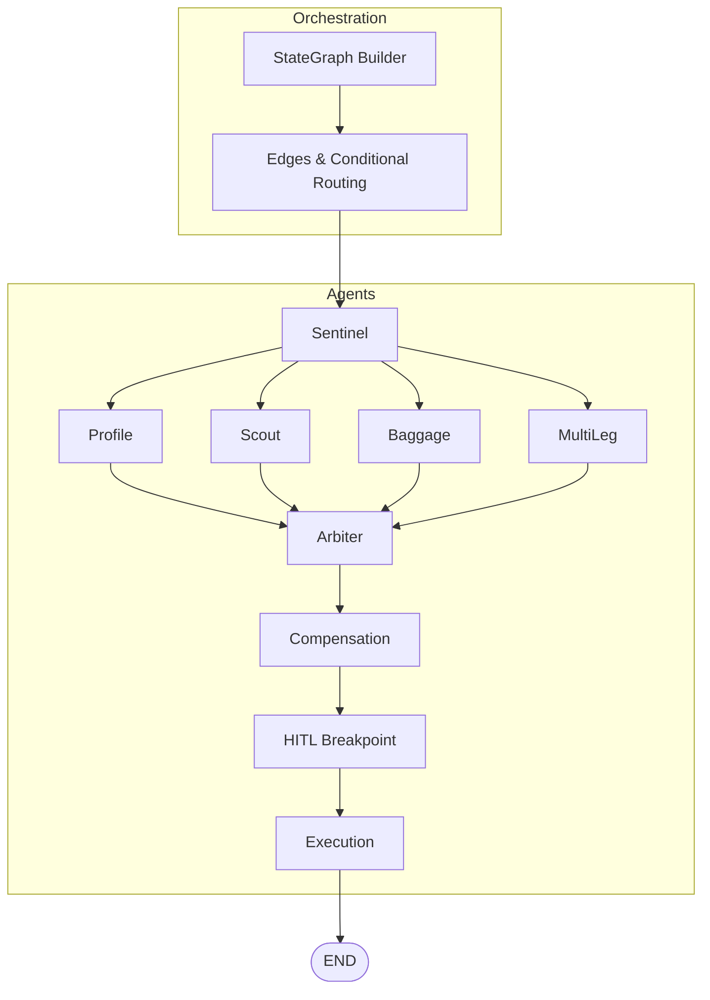

**Diagram sources**
- [swarm.py:162-227](file://backend/swarm.py#L162-L227)

**Section sources**
- [swarm.py:162-227](file://backend/swarm.py#L162-L227)
- [state.py:130-167](file://backend/state.py#L130-L167)

## Core Components
- Sentinel: Ingests disruption signals, optionally extracts structured data via Hermes LLM, and emits telemetry.
- Profile: Derives SLA constraints and financial liability based on passenger loyalty tier and delay magnitude.
- Scout: Queries external inventory (Atlas API) for alternative routes and injects candidates into shared state.
- Baggage: Evaluates interline baggage transfer feasibility and estimates transfer time; publishes messages for Arbiter.
- MultiLeg: Analyzes connecting flight viability using minimum connection times and notifies Arbiter about missed connections.
- Arbiter: Scores candidate routes using ensemble metrics combining base scores, baggage feasibility, compensation impact, and connection viability; selects best route and determines HITL status.
- Compensation: Calculates passenger rights and compensation eligibility under applicable regulations.
- Execution: Issues final ticketing via Atlas API when approved or bypassed.

Key state fields used across agents include disruption_event, passenger_context, sla_constraints, candidate_routes, baggage_context, connecting_flights, agent_messages, compensation_result, selected_route, execution_logs, and thread_id.

**Section sources**
- [sentinel.py:34-90](file://backend/agents/sentinel.py#L34-L90)
- [profile.py:58-126](file://backend/agents/profile.py#L58-L126)
- [scout.py:32-86](file://backend/agents/scout.py#L32-L86)
- [baggage.py:76-151](file://backend/agents/baggage.py#L76-L151)
- [multileg.py:96-167](file://backend/agents/multileg.py#L96-L167)
- [arbiter.py:128-243](file://backend/agents/arbiter.py#L128-L243)
- [compensation.py:105-194](file://backend/agents/compensation.py#L105-L194)
- [state.py:130-167](file://backend/state.py#L130-L167)

## Architecture Overview
The workflow begins at START, proceeds through Sentinel, then fans out to Profile, Scout, Baggage, and MultiLeg in parallel. All four branches converge at Arbiter, which aggregates their outputs and makes decisions. Compensation runs next, followed by a Human-in-the-Loop breakpoint if required, and finally Execution issues the ticket.

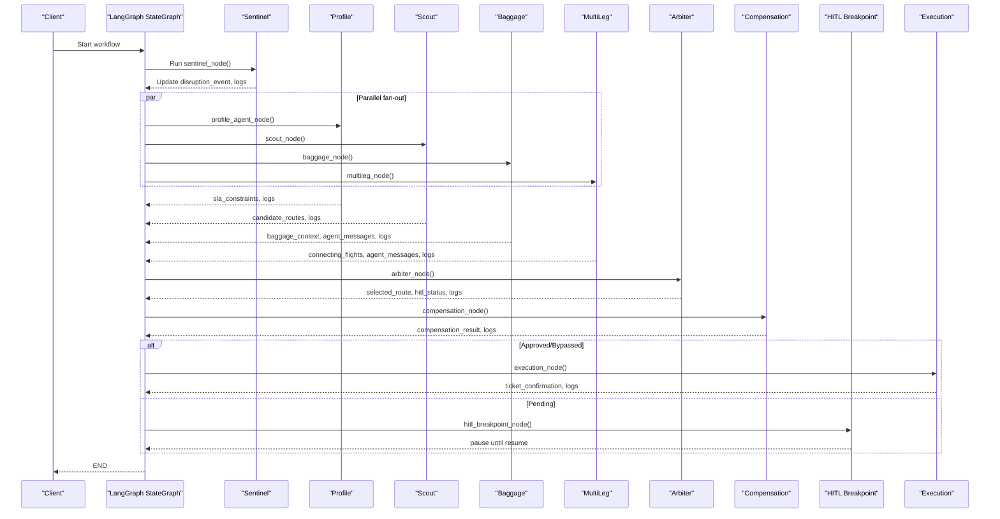

**Diagram sources**
- [swarm.py:162-227](file://backend/swarm.py#L162-L227)
- [arbiter.py:128-243](file://backend/agents/arbiter.py#L128-L243)
- [compensation.py:105-194](file://backend/agents/compensation.py#L105-L194)

## Detailed Component Analysis

### Sentinel Node
- Purpose: Intercept raw disruption signals, optionally extract structured fields via Hermes LLM, validate payload, and emit telemetry.
- State interactions: Reads disruption_event, writes execution_logs.
- Error handling: Gracefully handles missing fields and defaults to safe values.

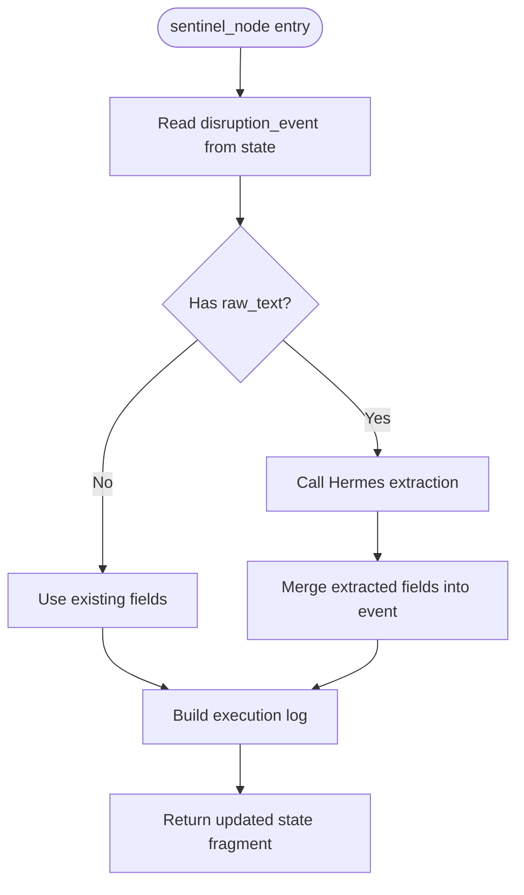

**Diagram sources**
- [sentinel.py:34-90](file://backend/agents/sentinel.py#L34-L90)

**Section sources**
- [sentinel.py:34-90](file://backend/agents/sentinel.py#L34-L90)

### Profile Node
- Purpose: Compute SLA constraints and financial liability based on loyalty tier and delay magnitude.
- State interactions: Reads passenger_context and disruption_event; writes sla_constraints and execution_logs.
- Conflict resolution: Tier-specific rules define max layovers, cabin preference, auto-approve flags, and minimum carrier ratings.

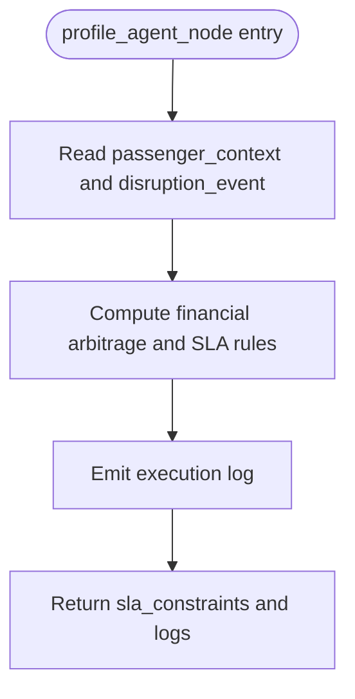

**Diagram sources**
- [profile.py:58-126](file://backend/agents/profile.py#L58-L126)

**Section sources**
- [profile.py:58-126](file://backend/agents/profile.py#L58-L126)

### Scout Node
- Purpose: Discover alternative routes via Atlas API and populate candidate_routes.
- State interactions: Reads disruption_event; writes candidate_routes and execution_logs.
- Performance note: External API call latency is mitigated by running in parallel with other agents.

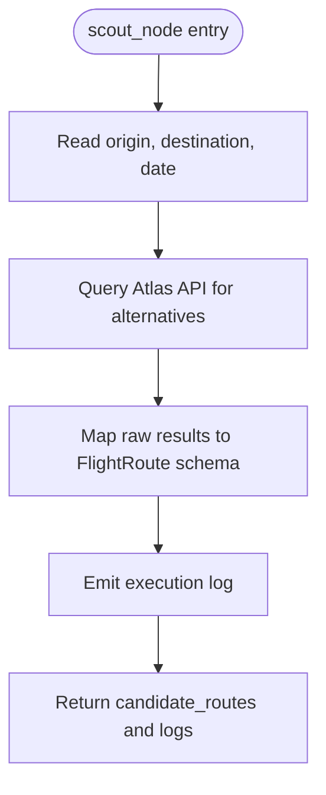

**Diagram sources**
- [scout.py:32-86](file://backend/agents/scout.py#L32-L86)

**Section sources**
- [scout.py:32-86](file://backend/agents/scout.py#L32-L86)

### Baggage Node
- Purpose: Evaluate checked baggage transfer feasibility, interline agreements, special items, and transfer time.
- State interactions: Reads passenger_context and disruption_event; writes baggage_context, agent_messages, and execution_logs.
- Communication pattern: Publishes a notification message to Arbiter containing baggage transfer insights.

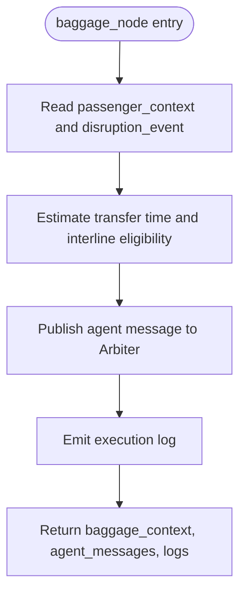

**Diagram sources**
- [baggage.py:76-151](file://backend/agents/baggage.py#L76-L151)

**Section sources**
- [baggage.py:76-151](file://backend/agents/baggage.py#L76-L151)

### MultiLeg Node
- Purpose: Assess connecting flight disruptions using minimum connection times per airport and notify Arbiter about viability.
- State interactions: Reads disruption_event; writes connecting_flights, agent_messages, and execution_logs.
- Communication pattern: Publishes a notification indicating whether rebooking must handle multi-leg segments.

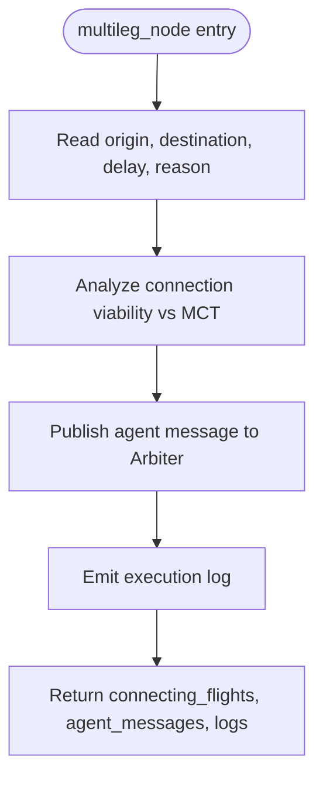

**Diagram sources**
- [multileg.py:96-167](file://backend/agents/multileg.py#L96-L167)

**Section sources**
- [multileg.py:96-167](file://backend/agents/multileg.py#L96-L167)

### Arbiter Node
- Purpose: Aggregate inputs from Profile, Scout, Baggage, and MultiLeg; score candidates using an ensemble model; select best route; determine HITL status.
- State interactions: Reads candidate_routes, sla_constraints, baggage_context, compensation_result, connecting_flights; writes selected_route, hitl_status, and execution_logs.
- Conflict resolution: Uses weighted scoring across punctuality, baggage feasibility, compensation impact, and connection time; overrides HITL decision based on confidence thresholds and loyalty tier.

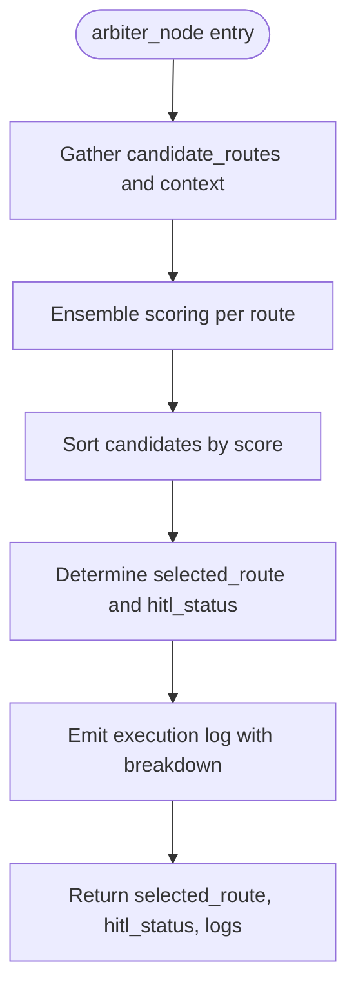

**Diagram sources**
- [arbiter.py:128-243](file://backend/agents/arbiter.py#L128-L243)

**Section sources**
- [arbiter.py:128-243](file://backend/agents/arbiter.py#L128-L243)

### Compensation Node
- Purpose: Calculate passenger rights and compensation eligibility under EU261, DOT, or MAS regulations.
- State interactions: Reads disruption_event and passenger_context; writes compensation_result and execution_logs.
- Conflict resolution: Applies jurisdiction rules and extraordinary circumstance checks to determine eligibility and amount.

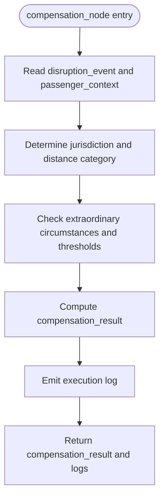

**Diagram sources**
- [compensation.py:105-194](file://backend/agents/compensation.py#L105-L194)

**Section sources**
- [compensation.py:105-194](file://backend/agents/compensation.py#L105-L194)

### Execution Node
- Purpose: Issue final ticket via Atlas API once approved or bypassed.
- State interactions: Reads selected_route and disruption_event; writes ticket_confirmation and execution_logs.
- Error handling: Logs error if no selected route exists.

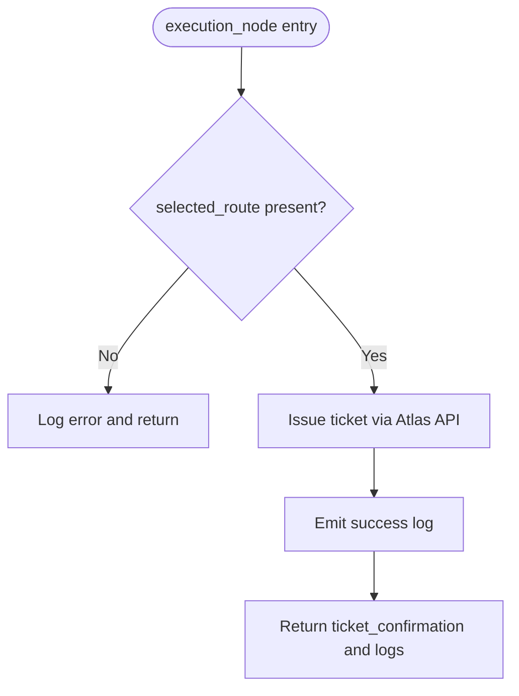

**Diagram sources**
- [swarm.py:52-91](file://backend/swarm.py#L52-L91)

**Section sources**
- [swarm.py:52-91](file://backend/swarm.py#L52-L91)

## Dependency Analysis
- LangGraph StateGraph defines explicit edges that enforce parallel execution after Sentinel and convergence at Arbiter.
- Shared state fields enable loose coupling between agents; additive reducers merge lists like candidate_routes, execution_logs, connecting_flights, and agent_messages.
- Conditional routing ensures Compensation runs before HITL/Execution decisions.

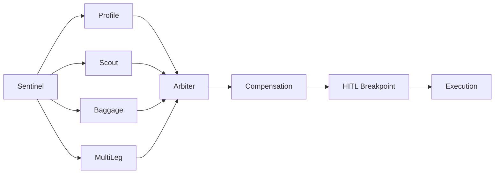

**Diagram sources**
- [swarm.py:162-227](file://backend/swarm.py#L162-L227)

**Section sources**
- [swarm.py:162-227](file://backend/state.py:130-167)(file://backend/state.py#L130-L167)

## Performance Considerations
- Parallel fan-out: Profile, Scout, Baggage, and MultiLeg execute concurrently to minimize total latency.
- Additive reducers: Lists such as candidate_routes, execution_logs, connecting_flights, and agent_messages are merged efficiently without contention.
- External calls: Scout’s Atlas API query runs in parallel with other agents; consider timeouts and retries in production.
- Decision gating: Arbiter consolidates results and applies deterministic scoring to reduce downstream complexity.
- Telemetry streaming: Real-time SSE/WebSocket broadcasting enables live monitoring without blocking workflow execution.

[No sources needed since this section provides general guidance]

## Troubleshooting Guide
- Missing selected_route: Execution node logs an error if no route was selected; verify Arbiter scoring and candidate availability.
- No candidate routes: Scout may return zero results; check Atlas API connectivity and input parameters (origin, destination, date).
- Baggage conflicts: If interline eligibility is false, Arbiter penalizes routes accordingly; review baggage_context and adjust expectations.
- Connection viability: MultiLeg may detect missed connections; ensure MCT thresholds align with operational policies.
- Compensation eligibility: Extraordinary circumstances can exempt airlines; confirm jurisdiction and delay thresholds.
- Monitoring: Use telemetry endpoints to subscribe to thread events and inspect execution_logs for each node.

**Section sources**
- [swarm.py:52-91](file://backend/swarm.py#L52-L91)
- [telemetry_service.py:45-79](file://backend/services/telemetry_service.py#L45-L79)

## Conclusion
The system implements a robust parallel execution model using LangGraph StateGraph to coordinate specialized agents. Sentinel initializes the workflow, while Profile, Scout, Baggage, and MultiLeg run concurrently to gather constraints, inventory, baggage feasibility, and connection viability. Arbiter aggregates these inputs using a weighted ensemble scoring approach to resolve conflicts and select optimal routes. Compensation and HITL steps ensure regulatory compliance and passenger consent before final execution. Telemetry services provide real-time visibility into agent performance and outcomes.

[No sources needed since this section summarizes without analyzing specific files]