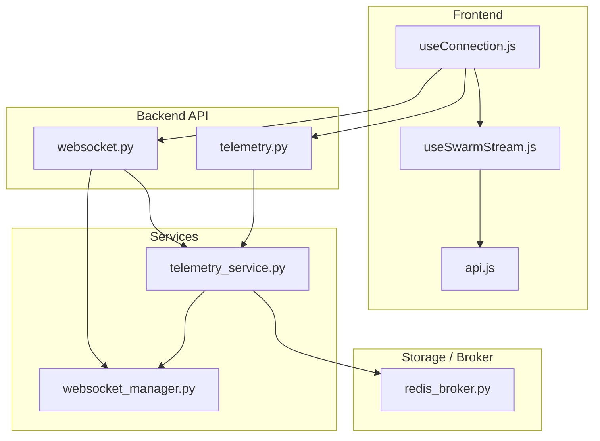
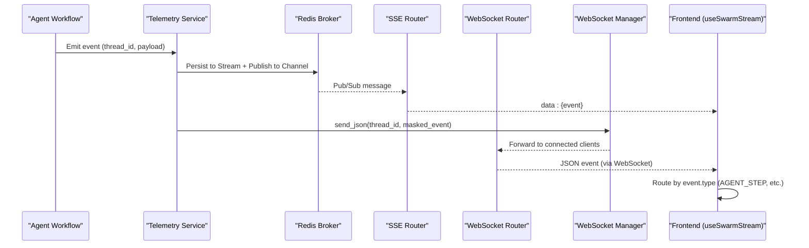
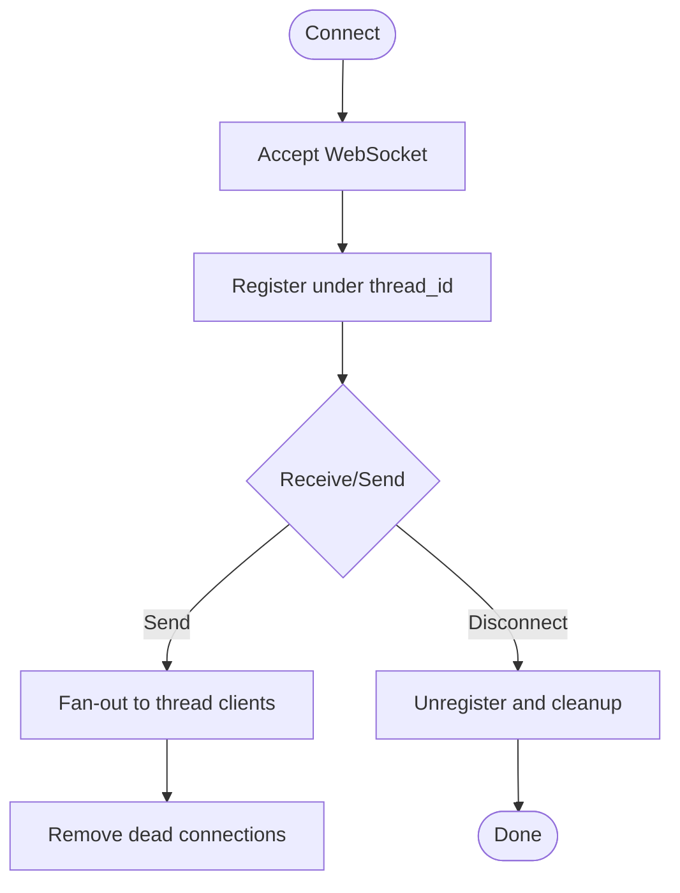
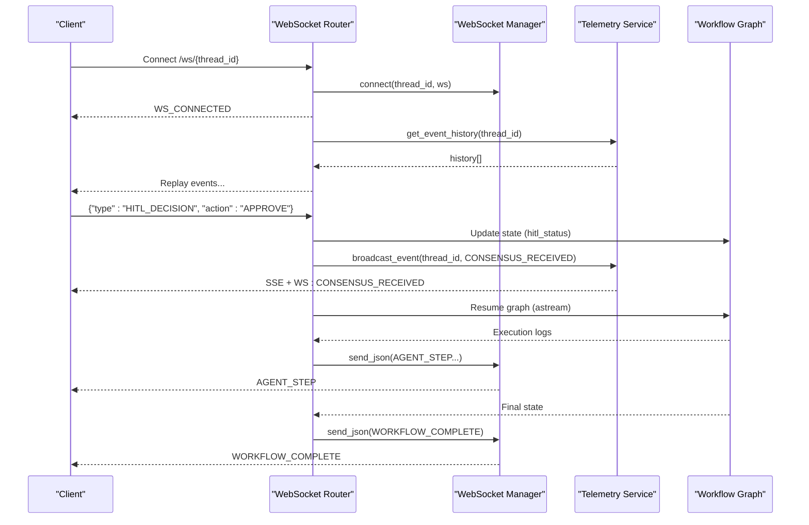
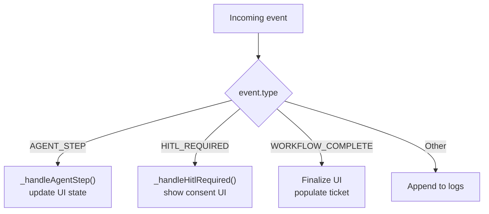
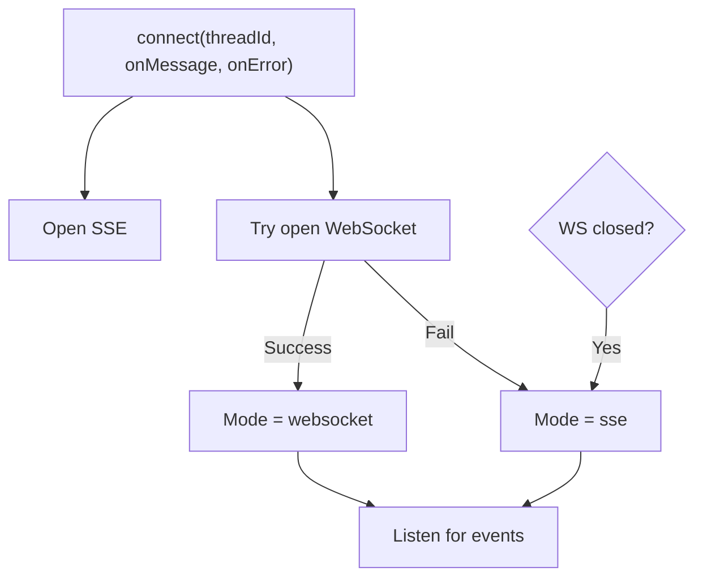
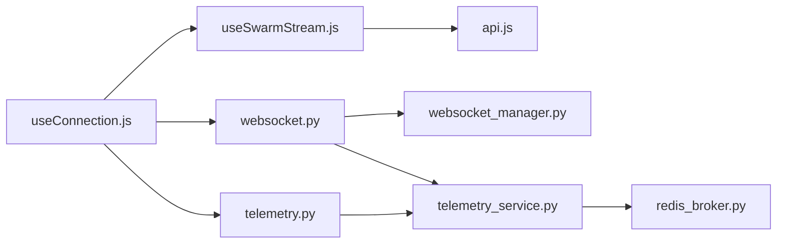

# Real-time Streaming & Telemetry

<cite>
**Referenced Files in This Document**
- [websocket_manager.py](file://backend/services/websocket_manager.py)
- [websocket.py](file://backend/api/routers/websocket.py)
- [telemetry_service.py](file://backend/services/telemetry_service.py)
- [redis_broker.py](file://backend/store/redis_broker.py)
- [telemetry.py](file://backend/api/routers/telemetry.py)
- [useConnection.js](file://frontend/src/composables/useConnection.js)
- [useSwarmStream.js](file://frontend/src/composables/useSwarmStream.js)
- [api.js](file://frontend/src/services/api.js)
</cite>

## Table of Contents
1. Introduction
2. Project Structure
3. Core Components
4. Architecture Overview
5. Detailed Component Analysis
6. Dependency Analysis
7. Performance Considerations
8. Troubleshooting Guide
9. Conclusion

## Introduction
This document explains the real-time communication infrastructure for streaming telemetry and enabling human-in-the-loop (HITL) decisions. It covers:
- WebSocket connections for bidirectional control and event delivery
- Server-Sent Events (SSE) for high-frequency telemetry streaming with Redis-backed persistence
- Client-side event handling, connection management, retry behavior, and debugging
- The broadcast_event function, WebSocket manager lifecycle, and key event types: AGENT_STEP, CONSENSUS_RECEIVED, WORKFLOW_COMPLETE

The system is designed to support high-frequency updates while maintaining reliability through durable event history and robust fallbacks.

## Project Structure
Real-time features are implemented across backend services, API routers, a Redis-backed event bus, and frontend composables that manage transport and state.



**Diagram sources**
- [websocket.py:21-92](file://backend/api/routers/websocket.py#L21-L92)
- [telemetry.py:11-46](file://backend/api/routers/telemetry.py#L11-L46)
- [websocket_manager.py:16-70](file://backend/services/websocket_manager.py#L16-L70)
- [telemetry_service.py:23-68](file://backend/services/telemetry_service.py#L23-L68)
- [redis_broker.py:86-179](file://backend/store/redis_broker.py#L86-L179)
- [useConnection.js:24-98](file://frontend/src/composables/useConnection.js#L24-L98)
- [useSwarmStream.js:64-280](file://frontend/src/composables/useSwarmStream.js#L64-L280)
- [api.js:1-21](file://frontend/src/services/api.js#L1-L21)

**Section sources**
- [websocket.py:21-92](file://backend/api/routers/websocket.py#L21-L92)
- [telemetry.py:11-46](file://backend/api/routers/telemetry.py#L11-L46)
- [websocket_manager.py:16-70](file://backend/services/websocket_manager.py#L16-L70)
- [telemetry_service.py:23-68](file://backend/services/telemetry_service.py#L23-L68)
- [redis_broker.py:86-179](file://backend/store/redis_broker.py#L86-L179)
- [useConnection.js:24-98](file://frontend/src/composables/useConnection.js#L24-L98)
- [useSwarmStream.js:64-280](file://frontend/src/composables/useSwarmStream.js#L64-L280)
- [api.js:1-21](file://frontend/src/services/api.js#L1-L21)

## Core Components
- WebSocket Manager: Tracks per-thread connections, sends JSON messages to all clients on a thread, and cleans up dead connections.
- WebSocket Router: Accepts client connections, replays historical events, handles HITL decisions, and resumes workflows upon approval.
- Telemetry Service: Masks PII, broadcasts events via Redis pub/sub and streams, and also fans out to active WebSocket connections.
- Redis Broker: Provides durable event history (Redis Streams) and real-time fan-out (Pub/Sub), with in-memory fallback when Redis is unavailable.
- SSE Router: Streams events to clients using text/event-stream, replays history first, and keeps connections alive with periodic keep-alives.
- Frontend Transport (useConnection.js): Opens both SSE and WebSocket; routes incoming events to consumers; supports sending HITL decisions over WebSocket.
- Frontend Orchestrator (useSwarmStream.js): Manages UI state, interprets event types (AGENT_STEP, HITL_REQUIRED, WORKFLOW_COMPLETE), and coordinates start/stop flows.

**Section sources**
- [websocket_manager.py:16-70](file://backend/services/websocket_manager.py#L16-L70)
- [websocket.py:21-195](file://backend/api/routers/websocket.py#L21-L195)
- [telemetry_service.py:23-68](file://backend/services/telemetry_service.py#L23-L68)
- [redis_broker.py:86-179](file://backend/store/redis_broker.py#L86-L179)
- [telemetry.py:11-46](file://backend/api/routers/telemetry.py#L11-L46)
- [useConnection.js:24-98](file://frontend/src/composables/useConnection.js#L24-L98)
- [useSwarmStream.js:98-280](file://frontend/src/composables/useSwarmStream.js#L98-L280)

## Architecture Overview
End-to-end flow from agent execution to client display:



**Diagram sources**
- [telemetry_service.py:45-53](file://backend/services/telemetry_service.py#L45-L53)
- [redis_broker.py:86-120](file://backend/store/redis_broker.py#L86-L120)
- [telemetry.py:17-46](file://backend/api/routers/telemetry.py#L17-L46)
- [websocket_manager.py:42-60](file://backend/services/websocket_manager.py#L42-L60)
- [websocket.py:21-92](file://backend/api/routers/websocket.py#L21-L92)
- [useSwarmStream.js:98-125](file://frontend/src/composables/useSwarmStream.js#L98-L125)

## Detailed Component Analysis

### WebSocket Manager Lifecycle
- Connect: Accepts and registers a WebSocket per thread_id; supports multiple clients per thread.
- Disconnect: Removes a client and cleans up empty thread sets.
- Send JSON: Fan-out to all clients for a thread; detects and removes dead connections.
- Broadcast: Sends to all threads (global broadcast).
- Metrics: Exposes connection counts and active threads.



**Diagram sources**
- [websocket_manager.py:26-60](file://backend/services/websocket_manager.py#L26-L60)

**Section sources**
- [websocket_manager.py:16-70](file://backend/services/websocket_manager.py#L16-L70)

### WebSocket Endpoint and HITL Flow
- Accepts /ws/{thread_id}, sends WS_CONNECTED, replays history, listens for client messages.
- Handles PING/PONG and HITL_DECISION; updates workflow state and resumes execution if approved.
- Emits CONSENSUS_RECEIVED and WORKFLOW_COMPLETE events during resume.



**Diagram sources**
- [websocket.py:21-195](file://backend/api/routers/websocket.py#L21-L195)
- [telemetry_service.py:45-53](file://backend/services/telemetry_service.py#L45-L53)

**Section sources**
- [websocket.py:21-195](file://backend/api/routers/websocket.py#L21-L195)

### SSE Telemetry Stream
- GET /stream/{thread_id} subscribes to a queue, replays history, then streams live events with keep-alive every 15 seconds.
- Uses Redis-backed pub/sub for fan-out and streams for durability; falls back to in-memory queues/history when Redis is unavailable.

```mermaid
flowchart TD
A["GET /stream/{thread_id}"] --> B["subscribe(thread_id)"]
B --> C["get_event_history(thread_id)"]
C --> D["Yield history events"]
D --> E{"Loop"}
E --> |queue.get(timeout=15s)| F["Yield event data"]
E --> |Timeout| G["Yield keep-alive"]
F --> E
G --> E
E --> |Disconnect| H["unsubscribe and close"]
```

**Diagram sources**
- [telemetry.py:17-46](file://backend/api/routers/telemetry.py#L17-L46)
- [redis_broker.py:123-179](file://backend/store/redis_broker.py#L123-L179)

**Section sources**
- [telemetry.py:17-46](file://backend/api/routers/telemetry.py#L17-L46)
- [redis_broker.py:123-179](file://backend/store/redis_broker.py#L123-L179)

### Event Types and Client Handling
Key server-emitted event types:
- AGENT_STEP: Emitted during workflow execution steps; includes node name, log, and optional state_update.
- CONSENSUS_RECEIVED: Emitted after a HITL decision is processed; includes action and notes.
- WORKFLOW_COMPLETE: Emitted when the workflow finishes; may include ticket or ticket_confirmation.

Frontend routing:
- useSwarmStream.js parses events and updates UI state based on type.
- AGENT_STEP updates active agent, candidate routes, proposed solution, and step timings.
- HITL_REQUIRED triggers user consent UI; resolveHitl sends HITL_DECISION via WebSocket and posts consensus via REST for durability.
- WORKFLOW_COMPLETE finalizes UI state and populates ticket receipt.



**Diagram sources**
- [useSwarmStream.js:98-280](file://frontend/src/composables/useSwarmStream.js#L98-L280)
- [websocket.py:116-188](file://backend/api/routers/websocket.py#L116-L188)

**Section sources**
- [useSwarmStream.js:98-280](file://frontend/src/composables/useSwarmStream.js#L98-L280)
- [websocket.py:116-188](file://backend/api/routers/websocket.py#L116-L188)

### Connection Management and Retry Logic
- Primary transport: SSE for continuous telemetry; secondary: WebSocket for bidirectional HITL.
- useConnection.js opens both transports; if WebSocket fails or closes, it remains on SSE mode.
- No automatic reconnection loop is implemented in useConnection.js; errors are surfaced via onError callbacks. For production, consider adding exponential backoff retries around connect() calls at the component level.



**Diagram sources**
- [useConnection.js:24-98](file://frontend/src/composables/useConnection.js#L24-L98)

**Section sources**
- [useConnection.js:24-98](file://frontend/src/composables/useConnection.js#L24-L98)

### PII Masking and Data Safety
- Telemetry service masks sensitive fields (e.g., phone_number, passenger_name) before broadcasting to ensure privacy.
- Applies masking to nested state_update payloads where applicable.

**Section sources**
- [telemetry_service.py:23-42](file://backend/services/telemetry_service.py#L23-L42)

## Dependency Analysis
High-level dependencies among components:



**Diagram sources**
- [useConnection.js:24-98](file://frontend/src/composables/useConnection.js#L24-L98)
- [useSwarmStream.js:64-280](file://frontend/src/composables/useSwarmStream.js#L64-L280)
- [api.js:1-21](file://frontend/src/services/api.js#L1-L21)
- [websocket.py:21-92](file://backend/api/routers/websocket.py#L21-L92)
- [telemetry.py:17-46](file://backend/api/routers/telemetry.py#L17-L46)
- [websocket_manager.py:16-70](file://backend/services/websocket_manager.py#L16-L70)
- [telemetry_service.py:45-68](file://backend/services/telemetry_service.py#L45-L68)
- [redis_broker.py:86-179](file://backend/store/redis_broker.py#L86-L179)

**Section sources**
- [websocket.py:21-92](file://backend/api/routers/websocket.py#L21-L92)
- [telemetry.py:17-46](file://backend/api/routers/telemetry.py#L17-L46)
- [websocket_manager.py:16-70](file://backend/services/websocket_manager.py#L16-L70)
- [telemetry_service.py:45-68](file://backend/services/telemetry_service.py#L45-L68)
- [redis_broker.py:86-179](file://backend/store/redis_broker.py#L86-L179)
- [useConnection.js:24-98](file://frontend/src/composables/useConnection.js#L24-L98)
- [useSwarmStream.js:64-280](file://frontend/src/composables/useSwarmStream.js#L64-L280)
- [api.js:1-21](file://frontend/src/services/api.js#L1-L21)

## Performance Considerations
- High-frequency updates:
  - SSE uses Redis Pub/Sub for efficient fan-out and Redis Streams for durable replay with bounded length (maxlen=500) and TTL-based expiry to limit memory usage.
  - WebSocket fan-out copies the connection set per send and removes dead connections to avoid blocking.
- Keep-alives:
  - SSE endpoint yields keep-alive every 15 seconds to maintain long-lived connections through proxies and browsers.
- PII masking:
  - Per-event masking ensures safe broadcasting without impacting throughput significantly.
- Backpressure and resilience:
  - Redis unavailability gracefully falls back to in-memory queues/history to keep the system operational.
  - Errors in event parsing or network issues are handled locally to prevent stream crashes.

[No sources needed since this section provides general guidance]

## Troubleshooting Guide
- Verify connectivity:
  - Check browser console for SSE and WebSocket errors; use Network tab to confirm /stream/{thread_id} and /ws/{thread_id}.
- Inspect events:
  - Use the browser’s DevTools to view SSE frames and WebSocket messages.
  - Confirm event.type values: AGENT_STEP, CONSENSUS_RECEIVED, WORKFLOW_COMPLETE.
- Validate backend health:
  - Call GET /threads/{thread_id}/state to inspect current LangGraph checkpointer state for a thread.
- Debug Redis:
  - Ensure Redis is reachable and USE_REDIS is enabled; otherwise, the system falls back to in-memory mode.
- Common issues:
  - Non-JSON packets: Frontend logs warnings; verify producer payloads.
  - Dead WebSocket connections: Backend automatically cleans them up; reconnect if necessary.
  - Missing history: If Redis is down, history is served from in-memory store; restarts may clear it.

**Section sources**
- [telemetry.py:48-71](file://backend/api/routers/telemetry.py#L48-L71)
- [redis_broker.py:42-62](file://backend/store/redis_broker.py#L42-L62)
- [websocket_manager.py:42-60](file://backend/services/websocket_manager.py#L42-L60)
- [useConnection.js:47-82](file://frontend/src/composables/useConnection.js#L47-L82)

## Conclusion
The real-time streaming infrastructure combines SSE for reliable telemetry delivery and WebSocket for bidirectional HITL interactions. Redis-backed persistence ensures durability and replayability, while the WebSocket manager enables efficient fan-out to multiple clients per thread. The frontend orchestrates event routing and UI state transitions, providing a responsive experience even under high-frequency updates. For production deployments, consider adding explicit reconnection logic in the client layer and monitoring Redis availability to optimize performance and resilience.

[No sources needed since this section summarizes without analyzing specific files]