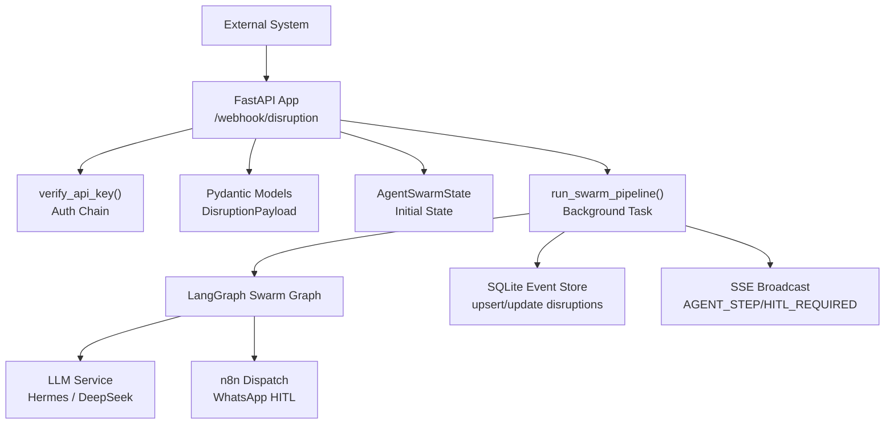
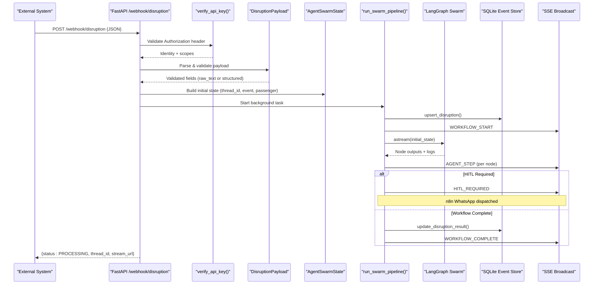
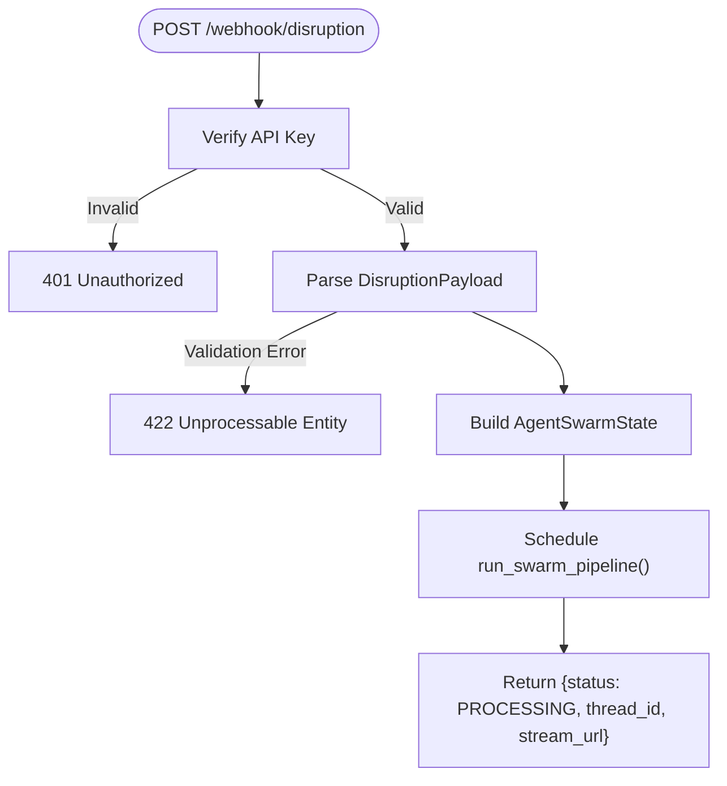
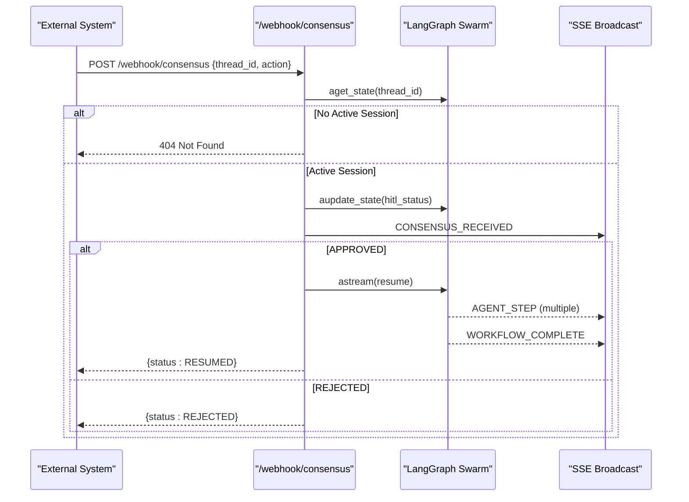
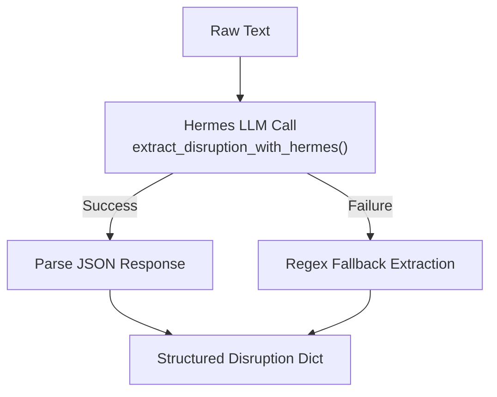
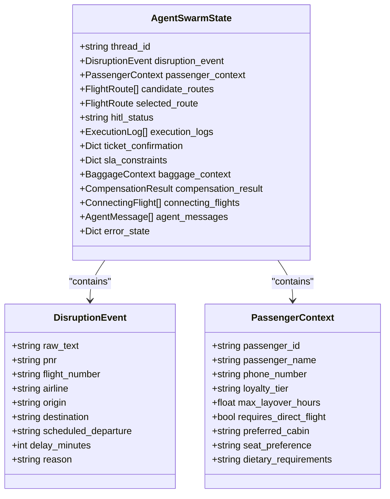
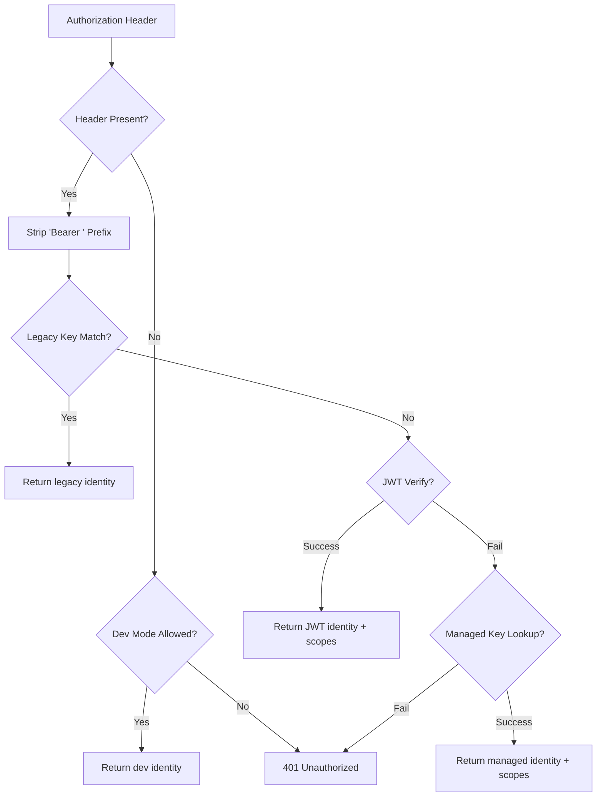
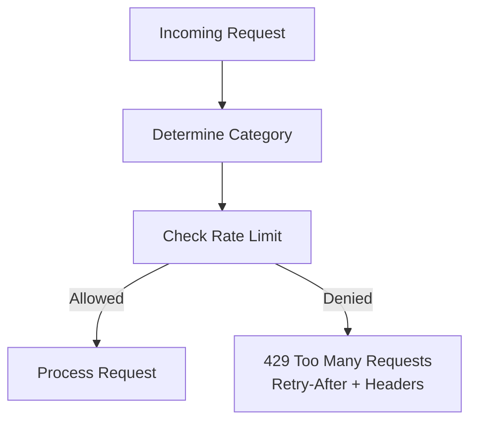
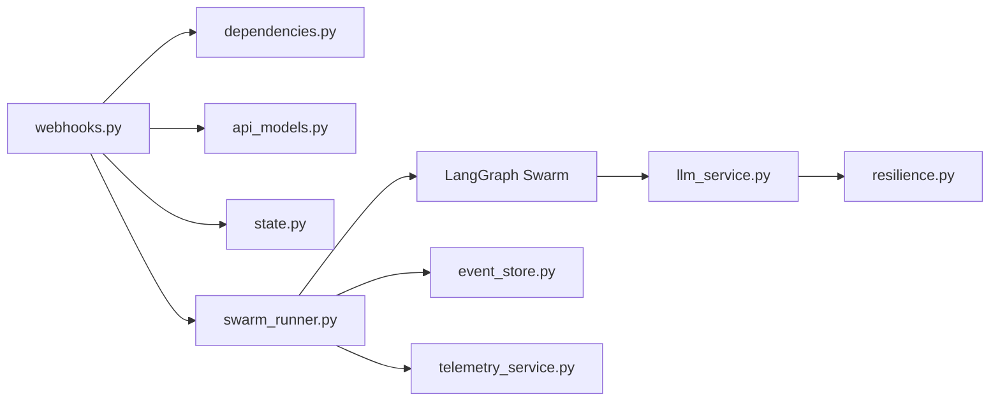

# Webhook Ingestion & Event Processing

<cite>
**Referenced Files in This Document**
- [webhooks.py](file://travel-recovery-os/backend/api/routers/webhooks.py)
- [dependencies.py](file://travel-recovery-os/backend/api/dependencies.py)
- [api_models.py](file://travel-recovery-os/backend/schemas/api_models.py)
- [state.py](file://travel-recovery-os/backend/state.py)
- [swarm_runner.py](file://travel-recovery-os/backend/services/swarm_runner.py)
- [llm_service.py](file://travel-recovery-os/backend/services/llm_service.py)
- [event_store.py](file://travel-recovery-os/backend/store/event_store.py)
- [rate_limiter.py](file://travel-recovery-os/backend/auth/rate_limiter.py)
- [resilience.py](file://travel-recovery-os/backend/middleware/resilience.py)
- [main.py](file://travel-recovery-os/backend/main.py)
</cite>

## Table of Contents
1. [Introduction](#introduction)
2. [Project Structure](#project-structure)
3. [Core Components](#core-components)
4. [Architecture Overview](#architecture-overview)
5. [Detailed Component Analysis](#detailed-component-analysis)
6. [Dependency Analysis](#dependency-analysis)
7. [Performance Considerations](#performance-considerations)
8. [Troubleshooting Guide](#troubleshooting-guide)
9. [Conclusion](#conclusion)
10. [Appendices](#appendices)

## Introduction
This document explains the end-to-end webhook ingestion pipeline for flight disruption notifications. It covers HTTP endpoint handling, payload validation, raw text parsing via Hermes LLM, structured event creation, background swarm processing, error handling for malformed payloads, rate limiting, and security validation of incoming webhooks. It also documents the disruption webhook that accepts both structured JSON and raw text formats, validates API keys, creates an initial AgentSwarmState, and triggers background processing via run_swarm_pipeline. Examples of valid payloads, error responses, and integration patterns are included to help external systems send flight disruption notifications reliably.

## Project Structure
The webhook ingestion pipeline is implemented as a FastAPI application with modular components:
- HTTP endpoints for disruption ingestion and consensus (HITL)
- Authentication and authorization via API key or JWT
- Rate limiting per category
- Pydantic models for payload validation
- State definitions for the multi-agent swarm
- Background execution of the LangGraph-based swarm pipeline
- LLM orchestration for raw text parsing and route scoring
- Persistent storage for disruption history and audit logs
- Resilience utilities (retry and circuit breaker)

**Diagram sources**
- [webhooks.py:14-72](file://travel-recovery-os/backend/api/routers/webhooks.py#L14-L72)
- [dependencies.py:25-78](file://travel-recovery-os/backend/api/dependencies.py#L25-L78)
- [api_models.py:5-78](file://travel-recovery-os/backend/schemas/api_models.py#L5-L78)
- [state.py:130-167](file://travel-recovery-os/backend/state.py#L130-L167)
- [swarm_runner.py:36-216](file://travel-recovery-os/backend/services/swarm_runner.py#L36-L216)
- [llm_service.py:34-120](file://travel-recovery-os/backend/services/llm_service.py#L34-L120)
- [event_store.py:166-239](file://travel-recovery-os/backend/store/event_store.py#L166-L239)

**Section sources**
- [main.py:40-108](file://travel-recovery-os/backend/main.py#L40-L108)
- [webhooks.py:12-72](file://travel-recovery-os/backend/api/routers/webhooks.py#L12-L72)

## Core Components
- Disruption Webhook Endpoint: Accepts structured or raw-text disruption events, validates API keys, constructs initial state, and starts background swarm processing.
- Consensus Webhook Endpoint: Processes passenger decisions (APPROVE/REJECT), updates swarm state, resumes workflow if approved, and streams telemetry.
- Payload Validation: Pydantic models define expected fields and defaults; missing fields use sensible defaults to support partial inputs.
- Raw Text Parsing: Hermes LLM extracts structured disruption data from unstructured messages; deterministic fallback ensures resilience.
- Background Swarm Execution: run_swarm_pipeline orchestrates agent nodes, persists records, emits SSE telemetry, handles HITL breakpoints, and finalizes outcomes.
- Security: Multi-mode authentication supports legacy static keys, JWT tokens, and managed API keys; scope checks available via dependency factory.
- Rate Limiting: Sliding window limiter protects endpoints by category; Redis-backed with in-memory fallback.

**Section sources**
- [webhooks.py:14-185](file://travel-recovery-os/backend/api/routers/webhooks.py#L14-L185)
- [api_models.py:5-134](file://travel-recovery-os/backend/schemas/api_models.py#L5-L134)
- [llm_service.py:34-120](file://travel-recovery-os/backend/services/llm_service.py#L34-L120)
- [swarm_runner.py:36-216](file://travel-recovery-os/backend/services/swarm_runner.py#L36-L216)
- [dependencies.py:25-96](file://travel-recovery-os/backend/api/dependencies.py#L25-L96)
- [rate_limiter.py:15-124](file://travel-recovery-os/backend/auth/rate_limiter.py#L15-L124)

## Architecture Overview
The disruption ingestion flow begins at the HTTP endpoint, proceeds through authentication and validation, builds an initial state, and dispatches background processing. The swarm executes agent nodes, may pause for human-in-the-loop approval, and completes with ticket issuance or escalation. Telemetry is streamed via SSE for real-time visibility.

**Diagram sources**
- [webhooks.py:14-72](file://travel-recovery-os/backend/api/routers/webhooks.py#L14-L72)
- [dependencies.py:25-78](file://travel-recovery-os/backend/api/dependencies.py#L25-L78)
- [api_models.py:5-78](file://travel-recovery-os/backend/schemas/api_models.py#L5-L78)
- [state.py:130-167](file://travel-recovery-os/backend/state.py#L130-L167)
- [swarm_runner.py:36-216](file://travel-recovery-os/backend/services/swarm_runner.py#L36-L216)
- [event_store.py:166-239](file://travel-recovery-os/backend/store/event_store.py#L166-L239)

## Detailed Component Analysis

### Disruption Webhook Endpoint
- Purpose: Accepts flight disruption notifications in either structured JSON or raw text, validates API keys, constructs initial state, and triggers background swarm processing.
- Behavior:
  - Validates Authorization header via verify_api_key().
  - Parses payload using DisruptionPayload model; defaults fill missing fields.
  - Builds AgentSwarmState with thread_id, disruption_event, passenger_context, and initial flags.
  - Schedules run_swarm_pipeline as a background task and returns immediate acknowledgment with thread_id and stream URL.
- Error Handling:
  - Missing or invalid API key returns 401 Unauthorized.
  - Malformed JSON or invalid fields return validation errors from Pydantic.
- Integration Pattern:
  - External systems can send either structured fields (pnr, flight_number, origin, destination, etc.) or raw_text for AI parsing.
  - Optional n8n_webhook_url overrides global configuration for HITL messaging.

**Diagram sources**
- [webhooks.py:14-72](file://travel-recovery-os/backend/api/routers/webhooks.py#L14-L72)
- [dependencies.py:25-78](file://travel-recovery-os/backend/api/dependencies.py#L25-L78)
- [api_models.py:5-78](file://travel-recovery-os/backend/schemas/api_models.py#L5-L78)

**Section sources**
- [webhooks.py:14-72](file://travel-recovery-os/backend/api/routers/webhooks.py#L14-L72)
- [api_models.py:5-78](file://travel-recovery-os/backend/schemas/api_models.py#L5-L78)
- [dependencies.py:25-78](file://travel-recovery-os/backend/api/dependencies.py#L25-L78)

### Consensus Webhook Endpoint
- Purpose: Receives passenger decisions (APPROVE/REJECT) and resumes or stops the recovery workflow.
- Behavior:
  - Validates API key and loads current swarm state by thread_id.
  - Updates hitl_status based on action; broadcasts consensus event.
  - If APPROVED, resumes graph streaming and emits step-by-step telemetry until completion.
  - If REJECTED, returns status indicating workflow stopped.
- Error Handling:
  - Returns 404 if no active session found for thread_id.
  - Emits WORKFLOW_ERROR events on resume failures.

**Diagram sources**
- [webhooks.py:74-185](file://travel-recovery-os/backend/api/routers/webhooks.py#L74-L185)

**Section sources**
- [webhooks.py:74-185](file://travel-recovery-os/backend/api/routers/webhooks.py#L74-L185)

### Raw Text Parsing with Hermes LLM
- Purpose: Extract structured disruption details from unstructured airline alerts, SMS, or operational messages.
- Behavior:
  - Calls Hermes LLM with a strict JSON schema prompt; cleans markdown artifacts; parses result.
  - Wrapped with retry_with_backoff and circuit breaker for resilience.
  - Falls back to deterministic regex extraction when Hermes is unavailable or fails.
- Output: Structured dict with pnr, flight_number, airline, origin, destination, delay_minutes, reason, severity, extracted_by.

**Diagram sources**
- [llm_service.py:34-120](file://travel-recovery-os/backend/services/llm_service.py#L34-L120)
- [resilience.py:25-80](file://travel-recovery-os/backend/middleware/resilience.py#L25-L80)

**Section sources**
- [llm_service.py:34-120](file://travel-recovery-os/backend/services/llm_service.py#L34-L120)
- [resilience.py:25-80](file://travel-recovery-os/backend/middleware/resilience.py#L25-L80)

### Structured Event Creation and Background Processing
- Purpose: Create initial AgentSwarmState and execute the multi-agent swarm pipeline asynchronously.
- Behavior:
  - Persists disruption start record to SQLite for history dashboard.
  - Emits WORKFLOW_START telemetry.
  - Streams agent steps, detects errors, tracks retries per node, and escalates after max retries.
  - Handles HITL breakpoint: dispatches to n8n WhatsApp gateway, updates disruption record with PENDING status.
  - On completion, updates disruption record with final results and emits WORKFLOW_COMPLETE.
  - Catches exceptions, persists error state, and emits WORKFLOW_ERROR telemetry.

**Diagram sources**
- [state.py:20-167](file://travel-recovery-os/backend/state.py#L20-L167)

**Section sources**
- [swarm_runner.py:36-216](file://travel-recovery-os/backend/services/swarm_runner.py#L36-L216)
- [state.py:130-167](file://travel-recovery-os/backend/state.py#L130-L167)
- [event_store.py:166-239](file://travel-recovery-os/backend/store/event_store.py#L166-L239)

### Security Validation of Incoming Webhooks
- Authentication Modes:
  - Legacy static key match against configured secret.
  - JWT Bearer token verification (if available).
  - Managed API key lookup via APIKeyManager (supports scopes and expiration).
- Scope Checking: Dependency factory enforces required scopes for sensitive operations.
- Development Mode: Allows local requests without auth unless REQUIRE_AUTH is set or environment is production.

**Diagram sources**
- [dependencies.py:25-78](file://travel-recovery-os/backend/api/dependencies.py#L25-L78)
- [api_keys.py:32-73](file://travel-recovery-os/backend/auth/api_keys.py#L32-L73)

**Section sources**
- [dependencies.py:25-96](file://travel-recovery-os/backend/api/dependencies.py#L25-L96)
- [api_keys.py:32-73](file://travel-recovery-os/backend/auth/api_keys.py#L32-L73)

### Rate Limiting
- Categories: Distinct limits for webhook, consensus, history, stream, system, and default.
- Implementation: Sliding window using Redis sorted sets with in-memory fallback when Redis is unavailable.
- Behavior: Returns 429 Too Many Requests with Retry-After and rate limit headers when exceeded.

**Diagram sources**
- [rate_limiter.py:15-124](file://travel-recovery-os/backend/auth/rate_limiter.py#L15-L124)
- [dependencies.py:103-130](file://travel-recovery-os/backend/api/dependencies.py#L103-L130)

**Section sources**
- [rate_limiter.py:15-124](file://travel-recovery-os/backend/auth/rate_limiter.py#L15-L124)
- [dependencies.py:103-130](file://travel-recovery-os/backend/api/dependencies.py#L103-L130)

## Dependency Analysis
- Endpoints depend on authentication dependencies and Pydantic models for validation.
- Background tasks depend on swarm runner, which depends on LangGraph swarm, LLM service, event store, and telemetry broadcast.
- LLM service depends on resilience utilities (retry and circuit breakers) and configuration settings.
- Event store provides persistent history and analytics for disruptions and webhook dispatches.

**Diagram sources**
- [webhooks.py:1-185](file://travel-recovery-os/backend/api/routers/webhooks.py#L1-L185)
- [dependencies.py:1-130](file://travel-recovery-os/backend/api/dependencies.py#L1-L130)
- [api_models.py:1-134](file://travel-recovery-os/backend/schemas/api_models.py#L1-L134)
- [state.py:1-167](file://travel-recovery-os/backend/state.py#L1-L167)
- [swarm_runner.py:1-216](file://travel-recovery-os/backend/services/swarm_runner.py#L1-L216)
- [llm_service.py:1-279](file://travel-recovery-os/backend/services/llm_service.py#L1-L279)
- [event_store.py:1-335](file://travel-recovery-os/backend/store/event_store.py#L1-L335)
- [resilience.py:1-244](file://travel-recovery-os/backend/middleware/resilience.py#L1-L244)

**Section sources**
- [webhooks.py:1-185](file://travel-recovery-os/backend/api/routers/webhooks.py#L1-L185)
- [swarm_runner.py:1-216](file://travel-recovery-os/backend/services/swarm_runner.py#L1-L216)
- [llm_service.py:1-279](file://travel-recovery-os/backend/services/llm_service.py#L1-L279)

## Performance Considerations
- Background Processing: Disruption ingestion returns immediately; heavy lifting runs asynchronously to reduce latency.
- Rate Limiting: Protects endpoints from abuse; configure categories and limits based on traffic patterns.
- LLM Resilience: Circuit breakers and retries prevent cascading failures; fallback parsers ensure continuity.
- Storage: SQLite with WAL mode improves concurrency; indexes optimize query performance for history and analytics.
- Streaming: SSE telemetry enables real-time monitoring without blocking request/response cycles.

[No sources needed since this section provides general guidance]

## Troubleshooting Guide
- 401 Unauthorized: Missing or invalid API key; verify Authorization header format and credentials.
- 422 Unprocessable Entity: Invalid or malformed payload; check field types and required values.
- 429 Too Many Requests: Rate limit exceeded; respect Retry-After header and throttle requests.
- 404 Not Found: No active session for thread_id; ensure thread_id matches an ongoing workflow.
- Workflow Errors: Check WORKFLOW_ERROR telemetry and persisted error_state in disruption records.
- HITL Issues: Confirm n8n webhook URL and connectivity; review HITL_REQUIRED events and WhatsApp delivery receipts.

**Section sources**
- [webhooks.py:14-185](file://travel-recovery-os/backend/api/routers/webhooks.py#L14-L185)
- [dependencies.py:25-130](file://travel-recovery-os/backend/api/dependencies.py#L25-L130)
- [swarm_runner.py:36-216](file://travel-recovery-os/backend/services/swarm_runner.py#L36-L216)
- [event_store.py:166-335](file://travel-recovery-os/backend/store/event_store.py#L166-L335)

## Conclusion
The webhook ingestion pipeline provides a robust, secure, and scalable mechanism for processing flight disruption notifications. It supports flexible input formats, resilient LLM parsing, structured event creation, background swarm processing, and comprehensive telemetry. With strong authentication, rate limiting, and error handling, it enables reliable integration for external systems sending disruption alerts.

[No sources needed since this section summarizes without analyzing specific files]

## Appendices

### Valid Payload Structures
- Structured JSON Example:
  - Fields: pnr, flight_number, airline, origin, destination, scheduled_departure, delay_minutes, reason, loyalty_tier, passenger_name, passenger_phone, n8n_webhook_url, thread_id
  - Defaults are applied for optional fields to support partial inputs.
- Raw Text Example:
  - Free-form message containing disruption details; Hermes LLM extracts structured fields automatically.

**Section sources**
- [api_models.py:5-78](file://travel-recovery-os/backend/schemas/api_models.py#L5-L78)
- [llm_service.py:34-120](file://travel-recovery-os/backend/services/llm_service.py#L34-L120)

### Error Responses
- 401 Unauthorized: Missing or invalid API key.
- 422 Unprocessable Entity: Validation errors for malformed or invalid payloads.
- 429 Too Many Requests: Rate limit exceeded with Retry-After header.
- 404 Not Found: No active session for thread_id in consensus endpoint.

**Section sources**
- [dependencies.py:25-130](file://travel-recovery-os/backend/api/dependencies.py#L25-L130)
- [webhooks.py:14-185](file://travel-recovery-os/backend/api/routers/webhooks.py#L14-L185)
- [rate_limiter.py:15-124](file://travel-recovery-os/backend/auth/rate_limiter.py#L15-L124)

### Integration Patterns for External Systems
- Send POST to /webhook/disruption with Authorization header containing API key or JWT.
- Provide either structured fields or raw_text; include n8n_webhook_url if overriding global config.
- Use returned thread_id to subscribe to /stream/{thread_id} for real-time telemetry.
- For HITL decisions, POST to /webhook/consensus with thread_id and action (APPROVE/REJECT).
- Handle rate limiting by respecting Retry-After and adjusting request frequency.

**Section sources**
- [webhooks.py:14-185](file://travel-recovery-os/backend/api/routers/webhooks.py#L14-L185)
- [dependencies.py:25-130](file://travel-recovery-os/backend/api/dependencies.py#L25-L130)
- [rate_limiter.py:15-124](file://travel-recovery-os/backend/auth/rate_limiter.py#L15-L124)