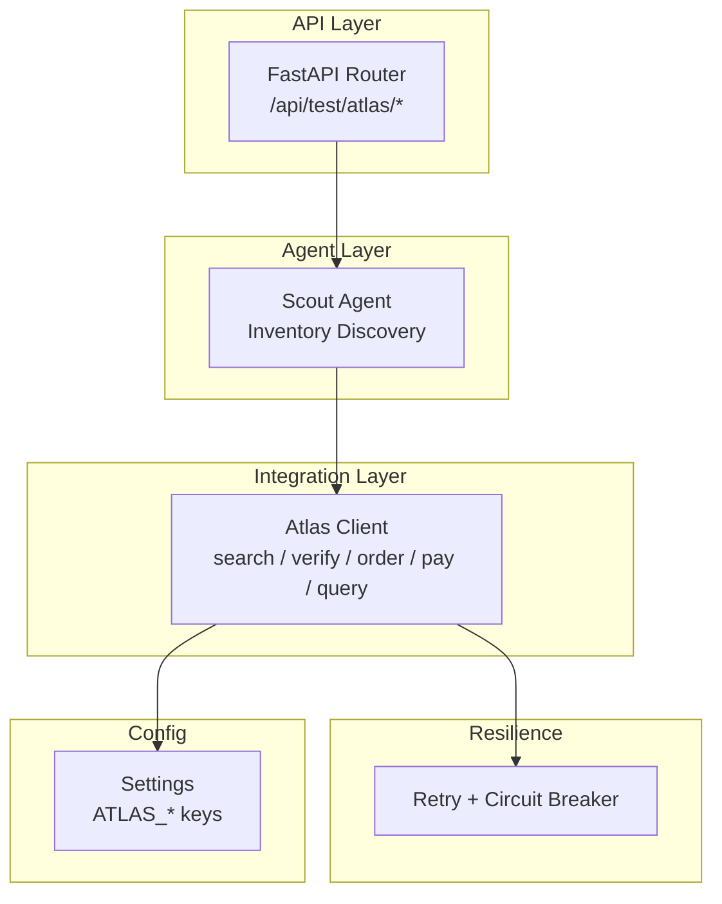
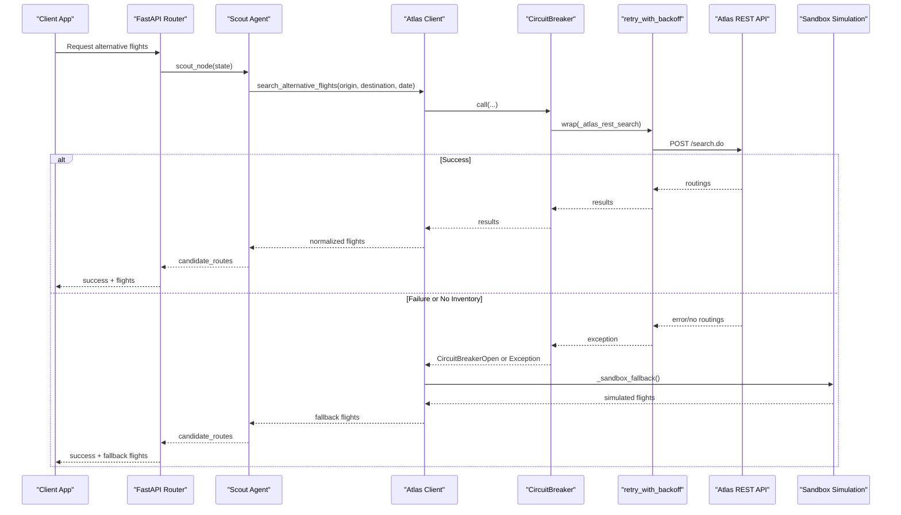
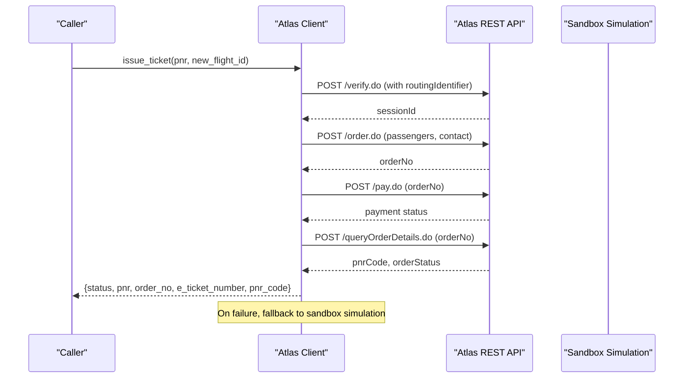
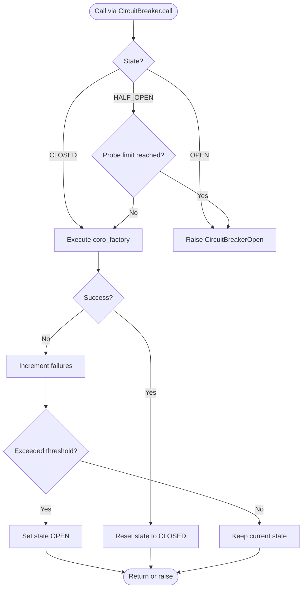
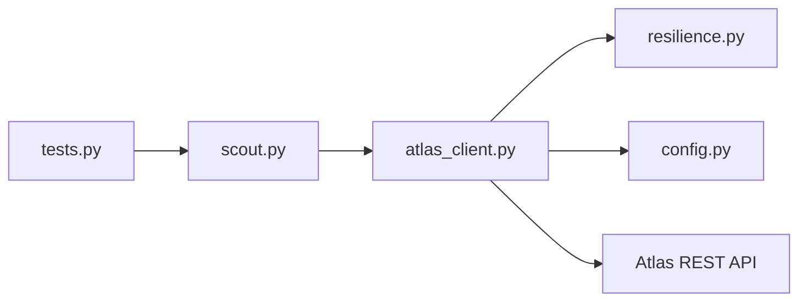

# Atlas GDS Integration

<cite>
**Referenced Files in This Document**
- [atlas_client.py](file://travel-recovery-os/backend/tools/atlas_client.py)
- [resilience.py](file://travel-recovery-os/backend/middleware/resilience.py)
- [config.py](file://travel-recovery-os/backend/config.py)
- [SKILL.md](file://atlas-api-integration-advisor (2)/atlas-api-integration-advisor/SKILL.md)
- [flow-quick-reference.md](file://atlas-api-integration-advisor (2)/atlas-api-integration-advisor/references/flow-quick-reference.md)
- [integration-scenarios.md](file://atlas-api-integration-advisor (2)/atlas-api-integration-advisor/references/integration-scenarios.md)
- [scout.py](file://travel-recovery-os/backend/agents/scout.py)
- [tests.py](file://travel-recovery-os/backend/api/routers/tests.py)
</cite>

## Table of Contents
1. Introduction
2. Project Structure
3. Core Components
4. Architecture Overview
5. Detailed Component Analysis
6. Dependency Analysis
7. Performance Considerations
8. Troubleshooting Guide
9. Conclusion

## Introduction
This document explains the Atlas GDS integration used by the system to perform end-to-end flight booking operations via the official Atlas REST API. It covers authentication, request/response patterns, error recovery, circuit breaker behavior, and fallback to a high-fidelity sandbox simulation when live services are unavailable. It also documents the complete booking lifecycle: search, verify, order, pay, and query, along with PNR management and e-ticket generation. In-memory caching for flight searches, retry with exponential backoff, and graceful degradation are included.

## Project Structure
The integration is implemented as an asynchronous client that calls Atlas endpoints, wrapped with resilience primitives and configuration-driven credentials. An agent orchestrates discovery using this client, and test routes expose simple HTTP endpoints to exercise the flow.

**Diagram sources**
- [tests.py:19-40](file://travel-recovery-os/backend/api/routers/tests.py#L19-L40)
- [scout.py:32-87](file://travel-recovery-os/backend/agents/scout.py#L32-L87)
- [atlas_client.py:175-219](file://travel-recovery-os/backend/tools/atlas_client.py#L175-L219)
- [resilience.py:25-80](file://travel-recovery-os/backend/middleware/resilience.py#L25-L80)
- [config.py:63-70](file://travel-recovery-os/backend/config.py#L63-L70)

**Section sources**
- [tests.py:19-40](file://travel-recovery-os/backend/api/routers/tests.py#L19-L40)
- [scout.py:32-87](file://travel-recovery-os/backend/agents/scout.py#L32-L87)
- [atlas_client.py:175-219](file://travel-recovery-os/backend/tools/atlas_client.py#L175-L219)
- [resilience.py:25-80](file://travel-recovery-os/backend/middleware/resilience.py#L25-L80)
- [config.py:63-70](file://travel-recovery-os/backend/config.py#L63-L70)

## Core Components
- Atlas REST client: Implements search, verify, order, pay, and query flows against Atlas endpoints with gzip-enabled requests and strict headers.
- Resilience layer: Provides retry with exponential backoff and a three-state circuit breaker (CLOSED/OPEN/HALF_OPEN).
- Configuration: Centralized settings for Atlas environment, base URLs, and credentials.
- Scout agent: Invokes the client to discover alternative flights based on disruption context.
- Test endpoints: Expose simple routes to trigger search and ticketing flows for validation.

Key responsibilities:
- Authentication via x-atlas-client-id and x-atlas-client-secret headers.
- Normalization of responses into consistent structures for downstream use.
- Fallback to calibrated sandbox data when live inventory is unavailable or services fail.
- TTL-based in-memory cache for repeated flight searches.

**Section sources**
- [atlas_client.py:38-48](file://travel-recovery-os/backend/tools/atlas_client.py#L38-L48)
- [atlas_client.py:82-167](file://travel-recovery-os/backend/tools/atlas_client.py#L82-L167)
- [atlas_client.py:170-219](file://travel-recovery-os/backend/tools/atlas_client.py#L170-L219)
- [resilience.py:25-80](file://travel-recovery-os/backend/middleware/resilience.py#L25-L80)
- [resilience.py:97-215](file://travel-recovery-os/backend/middleware/resilience.py#L97-L215)
- [config.py:63-70](file://travel-recovery-os/backend/config.py#L63-L70)
- [scout.py:32-87](file://travel-recovery-os/backend/agents/scout.py#L32-L87)
- [tests.py:19-40](file://travel-recovery-os/backend/api/routers/tests.py#L19-L40)

## Architecture Overview
The system integrates with Atlas through a resilient client that supports both live sandbox and production endpoints. The Scout agent triggers search; results are cached briefly and normalized. Booking execution follows the standard Flow A: search → verify → order → pay → query. When live services fail or return no inventory, the client falls back to a high-fidelity sandbox simulation to keep the pipeline functional.

**Diagram sources**
- [tests.py:19-30](file://travel-recovery-os/backend/api/routers/tests.py#L19-L30)
- [scout.py:32-87](file://travel-recovery-os/backend/agents/scout.py#L32-L87)
- [atlas_client.py:175-219](file://travel-recovery-os/backend/tools/atlas_client.py#L175-L219)
- [atlas_client.py:82-167](file://travel-recovery-os/backend/tools/atlas_client.py#L82-L167)
- [resilience.py:25-80](file://travel-recovery-os/backend/middleware/resilience.py#L25-L80)
- [resilience.py:97-215](file://travel-recovery-os/backend/middleware/resilience.py#L97-L215)

## Detailed Component Analysis

### Atlas Client: Search, Verify, Order, Pay, Query
- Authentication: Builds headers with client ID and secret from settings.
- Search: Calls /search.do with normalized payload and gzip header; normalizes up to four routings into a consistent structure including routingIdentifier and ancillary support flags.
- Issue Ticketing: Executes verify → order → pay → queryOrderDetails in sequence, handling session and order identifiers, and returns issued status with PNR and e-ticket number.
- Fallback: If live search fails or returns no inventory, uses a calibrated sandbox simulation to provide realistic flight options.

**Diagram sources**
- [atlas_client.py:222-331](file://travel-recovery-os/backend/tools/atlas_client.py#L222-L331)
- [atlas_client.py:334-357](file://travel-recovery-os/backend/tools/atlas_client.py#L334-L357)

**Section sources**
- [atlas_client.py:38-48](file://travel-recovery-os/backend/tools/atlas_client.py#L38-L48)
- [atlas_client.py:82-167](file://travel-recovery-os/backend/tools/atlas_client.py#L82-L167)
- [atlas_client.py:170-219](file://travel-recovery-os/backend/tools/atlas_client.py#L170-L219)
- [atlas_client.py:222-331](file://travel-recovery-os/backend/tools/atlas_client.py#L222-L331)
- [atlas_client.py:334-357](file://travel-recovery-os/backend/tools/atlas_client.py#L334-L357)

### Resilience: Retry with Exponential Backoff and Circuit Breaker
- Retry: Wraps async coroutine factories, applies exponential backoff with jitter, logs attempts, and raises last exception after exhausting retries.
- Circuit Breaker: Three-state machine (CLOSED/OPEN/HALF_OPEN), fast-fails when open, transitions to half-open after cooldown, allows probe calls, and resets on success.
- Pre-built breakers: Includes dedicated instances for Atlas and other services.

**Diagram sources**
- [resilience.py:25-80](file://travel-recovery-os/backend/middleware/resilience.py#L25-L80)
- [resilience.py:97-215](file://travel-recovery-os/backend/middleware/resilience.py#L97-L215)

**Section sources**
- [resilience.py:25-80](file://travel-recovery-os/backend/middleware/resilience.py#L25-L80)
- [resilience.py:97-215](file://travel-recovery-os/backend/middleware/resilience.py#L97-L215)

### Configuration: Atlas Credentials and Base URLs
- Settings include environment profile, Atlas mode (sandbox/production), client ID/secret, base URLs for search and transaction endpoints, and optional API key.
- Production warnings alert missing critical keys.

**Section sources**
- [config.py:63-70](file://travel-recovery-os/backend/config.py#L63-L70)
- [config.py:93-113](file://travel-recovery-os/backend/config.py#L93-L113)

### Scout Agent: Inventory Discovery
- Reads disruption event context (origin, destination, scheduled departure).
- Calls search_alternative_flights to retrieve candidates and injects them into swarm state with metadata for scoring.

**Section sources**
- [scout.py:32-87](file://travel-recovery-os/backend/agents/scout.py#L32-L87)

### Test Endpoints: Quick Validation
- GET /api/test/atlas/search: Triggers search and returns normalized flights with provider metadata.
- POST /api/test/atlas/ticket: Triggers automated ticket issuance and returns receipt.

**Section sources**
- [tests.py:19-40](file://travel-recovery-os/backend/api/routers/tests.py#L19-L40)

## Dependency Analysis
The integration depends on:
- FastAPI router exposing test endpoints.
- Scout agent invoking the Atlas client.
- Atlas client depending on resilience utilities and configuration.
- External Atlas REST API endpoints for search, verify, order, pay, and query.

**Diagram sources**
- [tests.py:19-40](file://travel-recovery-os/backend/api/routers/tests.py#L19-L40)
- [scout.py:32-87](file://travel-recovery-os/backend/agents/scout.py#L32-L87)
- [atlas_client.py:175-219](file://travel-recovery-os/backend/tools/atlas_client.py#L175-L219)
- [resilience.py:25-80](file://travel-recovery-os/backend/middleware/resilience.py#L25-L80)
- [config.py:63-70](file://travel-recovery-os/backend/config.py#L63-L70)

**Section sources**
- [tests.py:19-40](file://travel-recovery-os/backend/api/routers/tests.py#L19-L40)
- [scout.py:32-87](file://travel-recovery-os/backend/agents/scout.py#L32-L87)
- [atlas_client.py:175-219](file://travel-recovery-os/backend/tools/atlas_client.py#L175-L219)
- [resilience.py:25-80](file://travel-recovery-os/backend/middleware/resilience.py#L25-L80)
- [config.py:63-70](file://travel-recovery-os/backend/config.py#L63-L70)

## Performance Considerations
- In-memory TTL cache: Flight search results are cached per route/date for a short window to reduce external calls and improve latency.
- Gzip compression: Requests include Accept-Encoding: gzip to reduce payload size on search.
- Circuit breaker: Prevents cascading failures and reduces load during outages.
- Retry with jitter: Avoids thundering herd and improves transient error recovery.
- Timeout tuning: HTTP clients use reasonable timeouts to avoid hanging requests.

[No sources needed since this section provides general guidance]

## Troubleshooting Guide
Common issues and resolutions:
- Authentication failures: Ensure x-atlas-client-id and x-atlas-client-secret headers are set correctly from settings. Check environment variables and base URL binding (sandbox vs production).
- Missing parameters or validation errors: Validate request payloads per endpoint specifications; ensure required fields like tripType, passenger details, and dates are present and formatted correctly.
- Session/Routing expiration: Re-run search or verify to obtain fresh identifiers before proceeding to order/pay.
- Availability changes: Restart from search if availability changed; re-verify pricing before resubmitting orders.
- Payment timeout: Use regenerate order flow to recreate order without repeating search/verify/order steps, then retry payment.
- Daily quota exceeded: Wait until next UTC day or request quota increase; implement caching and rate limiting strategies.
- System/internal errors: Log and escalate persistent 9999 errors; monitor circuit breaker state and adjust thresholds/cooldowns as needed.

Operational tips:
- Monitor circuit breaker states and logs for early detection of upstream instability.
- Cache search results aggressively within TTL to minimize API usage.
- Implement robust retry logic with exponential backoff and jitter for transient errors.
- Validate environment configuration carefully before going live; ensure separate search and transaction base URLs in production.

**Section sources**
- [SKILL.md:307-343](file://atlas-api-integration-advisor (2)/atlas-api-integration-advisor/SKILL.md#L307-L343)
- [SKILL.md:347-412](file://atlas-api-integration-advisor (2)/atlas-api-integration-advisor/SKILL.md#L347-L412)
- [SKILL.md:416-465](file://atlas-api-integration-advisor (2)/atlas-api-integration-advisor/SKILL.md#L416-L465)
- [integration-scenarios.md:89-131](file://atlas-api-integration-advisor (2)/atlas-api-integration-advisor/references/integration-scenarios.md#L89-L131)

## Conclusion
The Atlas GDS integration provides a robust, resilient pathway to execute the full booking lifecycle via the official Atlas REST API. It combines authenticated requests, structured response normalization, circuit breaking, retry with backoff, and a high-fidelity sandbox fallback to ensure continuity under adverse conditions. With in-memory caching and clear operational guidance, the system balances performance and reliability while supporting PNR management and e-ticket generation. Proper configuration and monitoring are essential for smooth operation in both sandbox and production environments.

[No sources needed since this section summarizes without analyzing specific files]