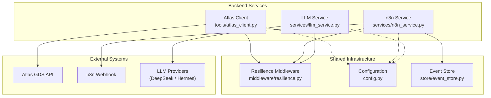
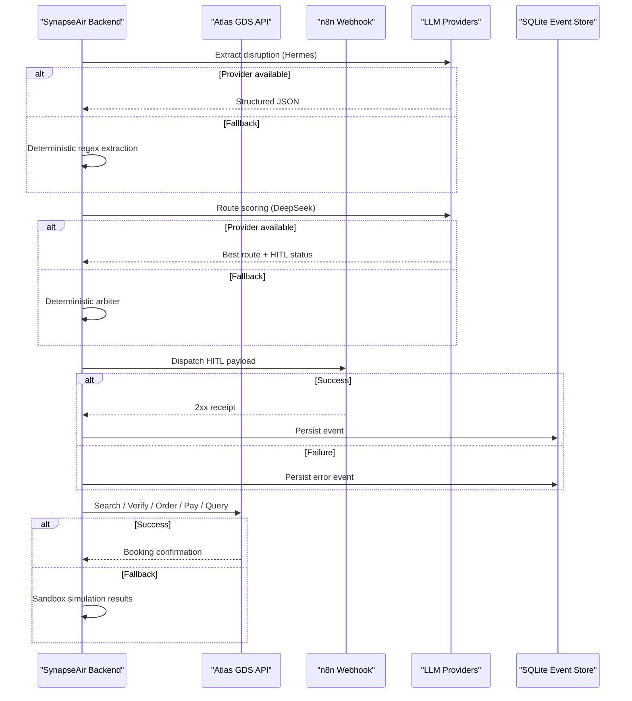
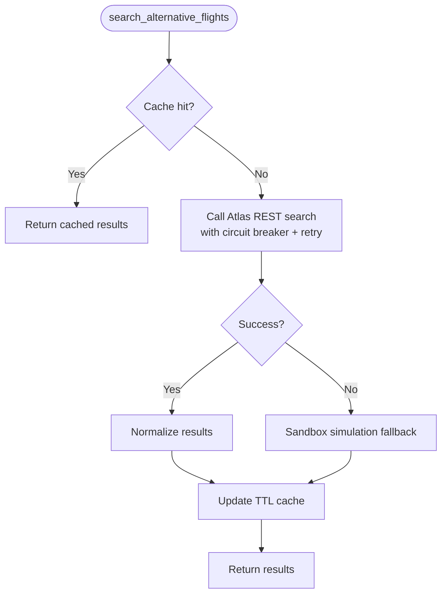
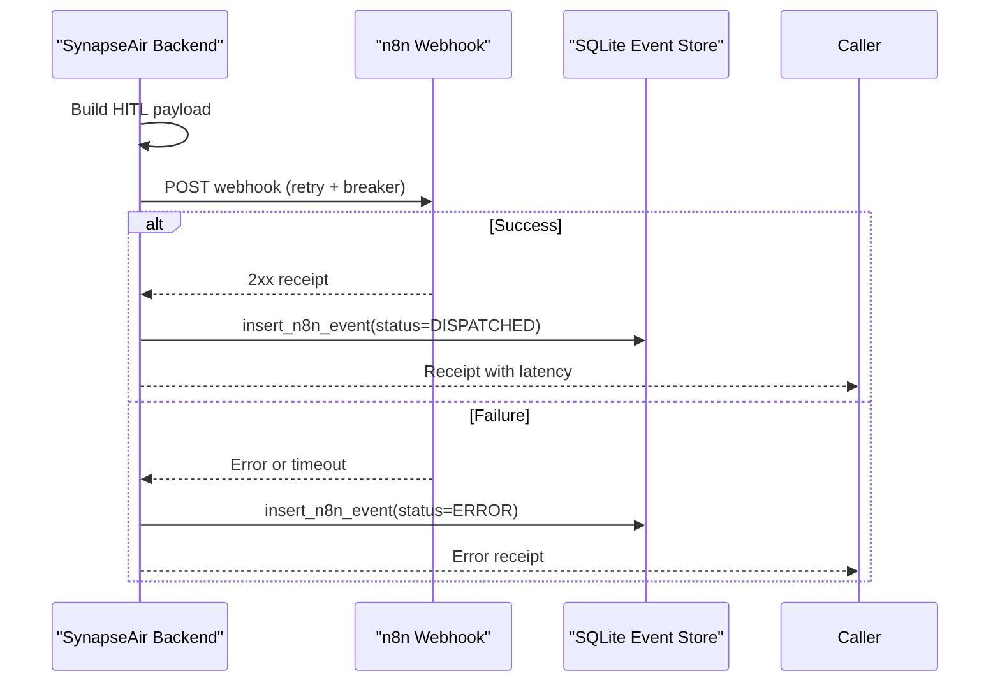
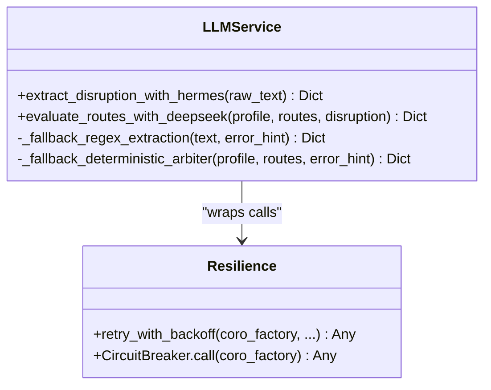
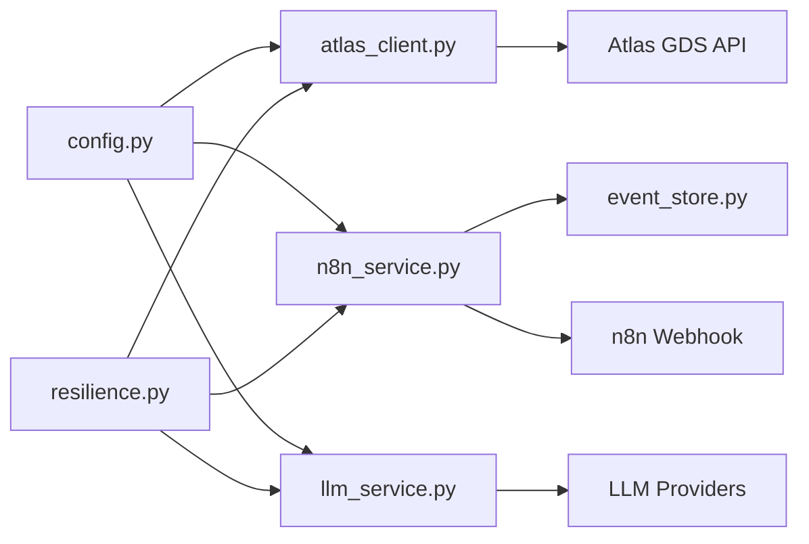

# External Integrations Architecture

<cite>
**Referenced Files in This Document**
- [atlas_client.py](file://travel-recovery-os/backend/tools/atlas_client.py)
- [n8n_service.py](file://travel-recovery-os/backend/services/n8n_service.py)
- [llm_service.py](file://travel-recovery-os/backend/services/llm_service.py)
- [resilience.py](file://travel-recovery-os/backend/middleware/resilience.py)
- [config.py](file://travel-recovery-os/backend/config.py)
- [event_store.py](file://travel-recovery-os/backend/store/event_store.py)
- [synapseair_workflow.json](file://travel-recovery-os/n8n/synapseair_workflow.json)
- [main.py](file://travel-recovery-os/backend/main.py)
</cite>

## Table of Contents
1. [Introduction](#introduction)
2. [Project Structure](#project-structure)
3. [Core Components](#core-components)
4. [Architecture Overview](#architecture-overview)
5. [Detailed Component Analysis](#detailed-component-analysis)
6. [Dependency Analysis](#dependency-analysis)
7. [Performance Considerations](#performance-considerations)
8. [Troubleshooting Guide](#troubleshooting-guide)
9. [Conclusion](#conclusion)

## Introduction
This document describes the external integration architecture for the Travel Recovery OS, focusing on three pillars:
- Atlas GDS API client for live flight search and ticketing
- n8n workflow engine integration for Human-in-the-Loop (HITL) WhatsApp interactions
- LLM provider abstraction layer for disruption parsing and route scoring

It explains integration patterns, error handling strategies, fallback mechanisms, configuration management, and how the system maintains resilience when external services are unavailable or degraded.

## Project Structure
The external integrations are implemented as modular services with shared resilience primitives and centralized configuration:
- Atlas GDS client under tools
- n8n webhook relay and passenger assistant under services
- LLM orchestration (DeepSeek and Hermes) under services
- Shared resilience middleware (retry + circuit breaker)
- Centralized settings via Pydantic BaseSettings
- Durable event store for auditability

**Diagram sources**
- [atlas_client.py:1-427](file://travel-recovery-os/backend/tools/atlas_client.py#L1-L427)
- [n8n_service.py:1-257](file://travel-recovery-os/backend/services/n8n_service.py#L1-L257)
- [llm_service.py:1-279](file://travel-recovery-os/backend/services/llm_service.py#L1-L279)
- [resilience.py:1-244](file://travel-recovery-os/backend/middleware/resilience.py#L1-L244)
- [config.py:1-116](file://travel-recovery-os/backend/config.py#L1-L116)
- [event_store.py:1-335](file://travel-recovery-os/backend/store/event_store.py#L1-L335)

**Section sources**
- [main.py:1-128](file://travel-recovery-os/backend/main.py#L1-L128)
- [config.py:1-116](file://travel-recovery-os/backend/config.py#L1-L116)

## Core Components
- Atlas GDS API client: Implements live search, verify/order/pay/query lifecycle, with caching and sandbox fallback.
- n8n service: Formats HITL payloads, dispatches to n8n webhooks, persists events, and provides a passenger chat assistant with LLM fallbacks.
- LLM service: Orchestrates DeepSeek (route scoring) and Hermes (disruption extraction), with deterministic fallbacks when providers are down.
- Resilience middleware: Provides retry with exponential backoff and circuit breakers per external dependency.
- Configuration: Centralized environment-driven settings for all third-party endpoints and credentials.
- Event store: SQLite-backed durable audit trail for n8n interactions and disruption history.

**Section sources**
- [atlas_client.py:1-427](file://travel-recovery-os/backend/tools/atlas_client.py#L1-L427)
- [n8n_service.py:1-257](file://travel-recovery-os/backend/services/n8n_service.py#L1-L257)
- [llm_service.py:1-279](file://travel-recovery-os/backend/services/llm_service.py#L1-L279)
- [resilience.py:1-244](file://travel-recovery-os/backend/middleware/resilience.py#L1-L244)
- [config.py:1-116](file://travel-recovery-os/backend/config.py#L1-L116)
- [event_store.py:1-335](file://travel-recovery-os/backend/store/event_store.py#L1-L335)

## Architecture Overview
The system integrates with three external systems using consistent resilience patterns:
- Atlas GDS: Live REST calls wrapped by circuit breaker and retry; falls back to high-fidelity sandbox simulation if no inventory or API is unavailable.
- n8n: HTTP webhook dispatch with retry and circuit breaker; durable SQLite logging; simulated internal relay when target URL is not configured.
- LLM providers: OpenAI-compatible clients for DeepSeek and Hermes; circuit breaker + retry; deterministic fallbacks for both extraction and route scoring.

**Diagram sources**
- [llm_service.py:34-96](file://travel-recovery-os/backend/services/llm_service.py#L34-L96)
- [llm_service.py:126-205](file://travel-recovery-os/backend/services/llm_service.py#L126-L205)
- [n8n_service.py:51-182](file://travel-recovery-os/backend/services/n8n_service.py#L51-L182)
- [atlas_client.py:175-219](file://travel-recovery-os/backend/tools/atlas_client.py#L175-L219)
- [atlas_client.py:222-357](file://travel-recovery-os/backend/tools/atlas_client.py#L222-L357)
- [event_store.py:107-160](file://travel-recovery-os/backend/store/event_store.py#L107-L160)

## Detailed Component Analysis

### Atlas GDS API Client
Responsibilities:
- Live search via REST endpoint with normalized response mapping
- Full booking lifecycle: verify, order, pay, query order details
- In-memory TTL cache for repeated searches
- Circuit breaker and retry wrapping for resilience
- High-fidelity sandbox fallback when live API fails or has no inventory

Integration patterns:
- Uses an async HTTP client with gzip and strict headers
- Separate base URLs for search vs transaction endpoints
- Generates unique identifiers to avoid duplicate bookings

Error handling and fallbacks:
- Raises specific runtime errors on non-200 or non-zero status responses
- Catches exceptions from circuit breaker and retries
- Falls back to calibrated sandbox simulation returning realistic flight data

Configuration:
- Reads client ID, secret, base URLs, and environment mode from centralized settings

**Diagram sources**
- [atlas_client.py:175-219](file://travel-recovery-os/backend/tools/atlas_client.py#L175-L219)
- [atlas_client.py:82-167](file://travel-recovery-os/backend/tools/atlas_client.py#L82-L167)
- [atlas_client.py:360-425](file://travel-recovery-os/backend/tools/atlas_client.py#L360-L425)

**Section sources**
- [atlas_client.py:1-427](file://travel-recovery-os/backend/tools/atlas_client.py#L1-L427)
- [config.py:62-69](file://travel-recovery-os/backend/config.py#L62-L69)

### n8n Workflow Engine Integration
Responsibilities:
- Format and dispatch HITL notifications to n8n webhooks
- Record durable audit entries in SQLite for every dispatch attempt
- Provide a conversational passenger assistant that can call LLMs or return contextual replies

Integration patterns:
- Builds WhatsApp Business API interactive message envelopes
- Supports custom n8n webhook URL and consensus callback URL
- Wraps dispatch with circuit breaker and retry

Error handling and fallbacks:
- On success, records status, latency, and truncated response body
- On failure, records error and status “ERROR”
- If no real webhook URL is provided, simulates success internally for development

Configuration:
- Reads webhook URLs, consensus callback, and optional API key from settings

**Diagram sources**
- [n8n_service.py:51-182](file://travel-recovery-os/backend/services/n8n_service.py#L51-L182)
- [event_store.py:107-160](file://travel-recovery-os/backend/store/event_store.py#L107-L160)

**Section sources**
- [n8n_service.py:1-257](file://travel-recovery-os/backend/services/n8n_service.py#L1-L257)
- [event_store.py:1-335](file://travel-recovery-os/backend/store/event_store.py#L1-L335)
- [config.py:56-60](file://travel-recovery-os/backend/config.py#L56-L60)

### LLM Provider Abstraction Layer
Responsibilities:
- Disruption extraction via Hermes (OpenAI-compatible local endpoint)
- Route scoring and decision rationale via DeepSeek
- Deterministic fallbacks when LLMs are unavailable or misconfigured

Integration patterns:
- Uses AsyncOpenAI clients with configurable base URLs and models
- Enforces strict JSON output schemas for structured results
- Applies circuit breaker and retry per provider

Error handling and fallbacks:
- Hermes: Regex-based extraction fallback when endpoint fails
- DeepSeek: Deterministic arbiter scoring based on loyalty tier, cabin class, layovers, and duration constraints
- Graceful degradation ensures continuity even without LLM access

Configuration:
- Reads model names, base URLs, and API keys from settings
- Validates production requirements and warns about missing keys

**Diagram sources**
- [llm_service.py:34-96](file://travel-recovery-os/backend/services/llm_service.py#L34-L96)
- [llm_service.py:126-205](file://travel-recovery-os/backend/services/llm_service.py#L126-L205)
- [resilience.py:25-80](file://travel-recovery-os/backend/middleware/resilience.py#L25-L80)
- [resilience.py:97-213](file://travel-recovery-os/backend/middleware/resilience.py#L97-L213)

**Section sources**
- [llm_service.py:1-279](file://travel-recovery-os/backend/services/llm_service.py#L1-L279)
- [config.py:46-54](file://travel-recovery-os/backend/config.py#L46-L54)

### Resilience Middleware
Provides reusable primitives for robust external integrations:
- Retry with exponential backoff and jitter to reduce thundering herd
- Circuit breaker with CLOSED/OPEN/HALF_OPEN states and per-service thresholds
- Pre-configured breakers for Atlas, n8n, DeepSeek, and Hermes

Key behaviors:
- Fast-fails when circuit is OPEN to protect downstream systems
- Allows single probe in HALF_OPEN to test recovery
- Logs detailed warnings/errors for observability

**Section sources**
- [resilience.py:1-244](file://travel-recovery-os/backend/middleware/resilience.py#L1-L244)

### Configuration Management
Centralized settings via Pydantic BaseSettings:
- Environment-specific .env files loaded automatically
- Strongly typed fields with defaults and validators
- Production validation warnings for missing critical keys

External service configuration:
- DeepSeek: API key, base URL, model name
- Hermes: API base, key, model
- n8n: API URL, key, webhook URL, consensus callback
- Atlas: environment mode, client credentials, base URLs for search and transactions

**Section sources**
- [config.py:1-116](file://travel-recovery-os/backend/config.py#L1-L116)

## Dependency Analysis
The following diagram shows how components depend on each other and on external systems:

**Diagram sources**
- [config.py:1-116](file://travel-recovery-os/backend/config.py#L1-L116)
- [atlas_client.py:1-427](file://travel-recovery-os/backend/tools/atlas_client.py#L1-L427)
- [n8n_service.py:1-257](file://travel-recovery-os/backend/services/n8n_service.py#L1-L257)
- [llm_service.py:1-279](file://travel-recovery-os/backend/services/llm_service.py#L1-L279)
- [resilience.py:1-244](file://travel-recovery-os/backend/middleware/resilience.py#L1-L244)
- [event_store.py:1-335](file://travel-recovery-os/backend/store/event_store.py#L1-L335)

**Section sources**
- [resilience.py:218-243](file://travel-recovery-os/backend/middleware/resilience.py#L218-L243)
- [config.py:46-69](file://travel-recovery-os/backend/config.py#L46-L69)

## Performance Considerations
- Atlas search uses an in-memory TTL cache to minimize redundant API calls and provide near-instant repeat lookups.
- HTTP timeouts are set conservatively to balance responsiveness and reliability.
- Retry backoff includes jitter to prevent synchronized retries across instances.
- Circuit breakers reduce load on degraded services and improve overall throughput by fast-failing when necessary.
- SQLite event store uses WAL mode and indexes for efficient reads and writes during high traffic.

[No sources needed since this section provides general guidance]

## Troubleshooting Guide
Common issues and diagnostics:
- Atlas API failures: Check circuit breaker state and logs; verify base URLs and credentials; inspect fallback behavior to sandbox simulation.
- n8n webhook dispatch errors: Review persisted events in SQLite for status, latency, and error messages; ensure webhook URL and consensus callback are reachable.
- LLM provider outages: Confirm API keys and base URLs; observe fallback to deterministic parsers and arbiter; check logs for circuit breaker transitions.

Operational tips:
- Use health endpoint to validate service readiness.
- Monitor logs for circuit breaker warnings and retry attempts.
- Inspect event store tables for end-to-end audit trails of HITL flows.

**Section sources**
- [main.py:119-122](file://travel-recovery-os/backend/main.py#L119-L122)
- [resilience.py:69-80](file://travel-recovery-os/backend/middleware/resilience.py#L69-L80)
- [event_store.py:107-160](file://travel-recovery-os/backend/store/event_store.py#L107-L160)

## Conclusion
The system implements a resilient, layered approach to external integrations:
- Atlas GDS client provides live search and ticketing with robust fallbacks
- n8n integration enables reliable HITL workflows with durable auditing
- LLM abstraction supports advanced reasoning with deterministic fallbacks
- Shared resilience primitives ensure graceful degradation and recovery
- Centralized configuration simplifies deployment and environment management

Together, these patterns maintain operational continuity even when external services are unavailable or degraded.

[No sources needed since this section summarizes without analyzing specific files]