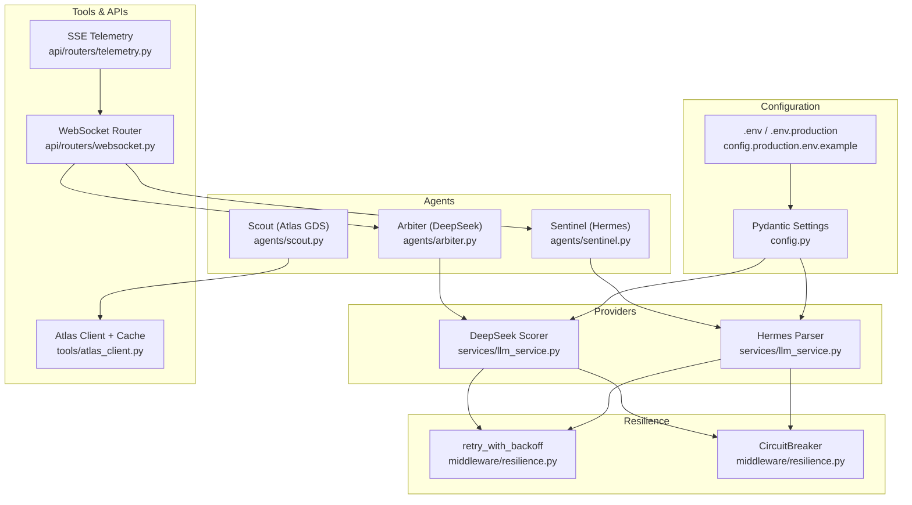
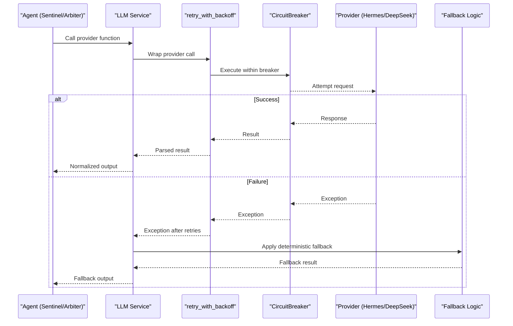
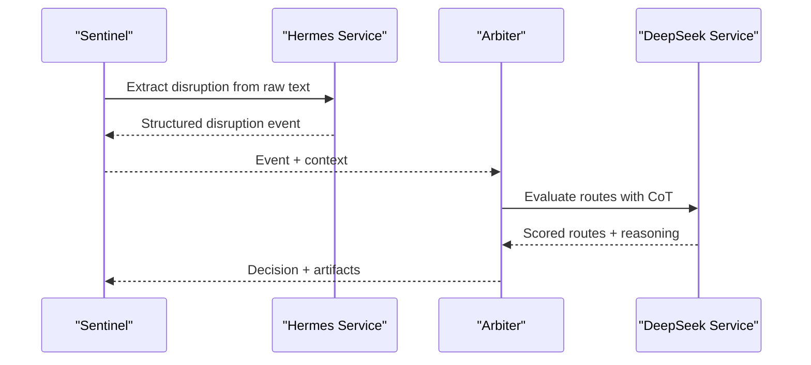
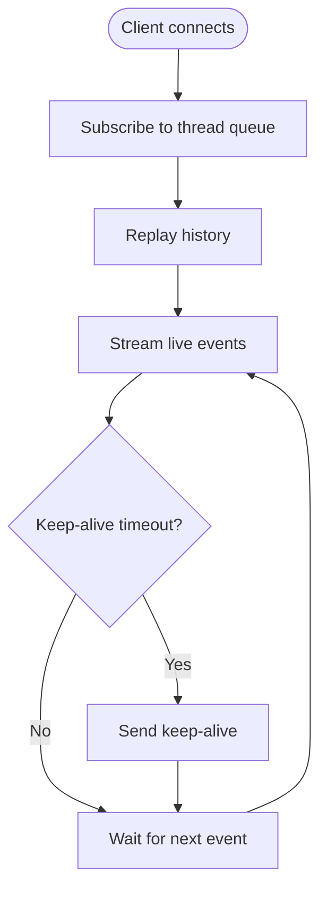
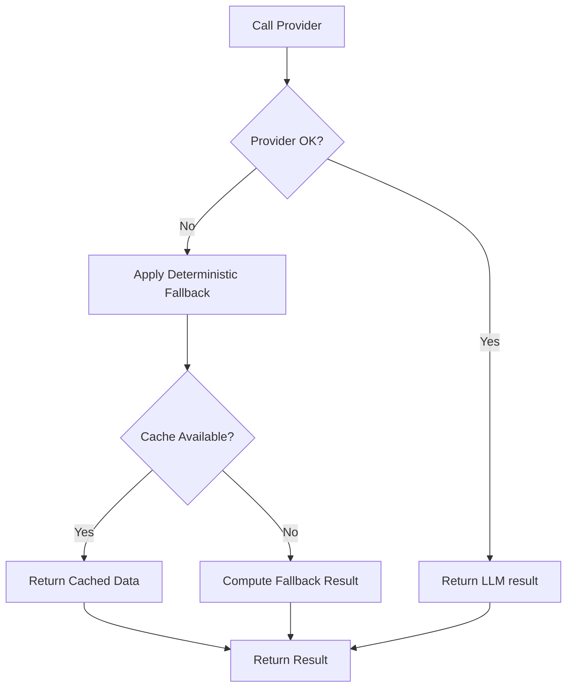
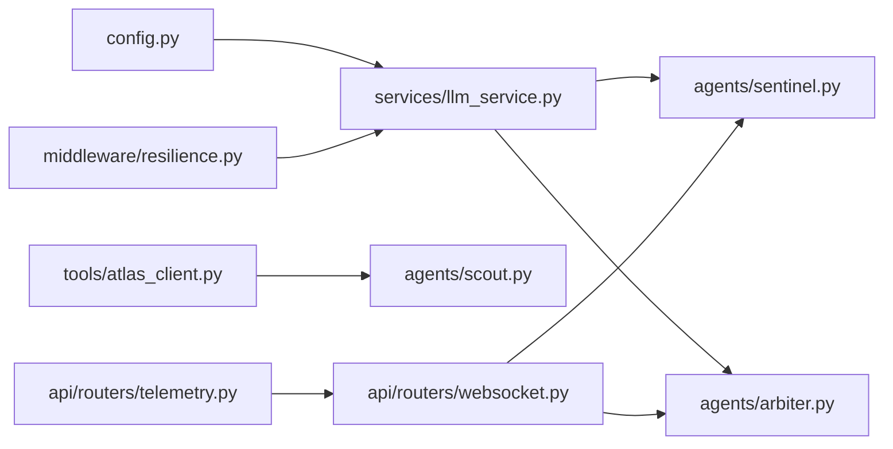

# LLM Provider Abstraction

<cite>
**Referenced Files in This Document**
- [llm_service.py](file://travel-recovery-os/backend/services/llm_service.py)
- [config.py](file://travel-recovery-os/backend/config.py)
- [resilience.py](file://travel-recovery-os/backend/middleware/resilience.py)
- [sentinel.py](file://travel-recovery-os/backend/agents/sentinel.py)
- [arbiter.py](file://travel-recovery-os/backend/agents/arbiter.py)
- [scout.py](file://travel-recovery-os/backend/agents/scout.py)
- [atlas_client.py](file://travel-recovery-os/backend/tools/atlas_client.py)
- [websocket.py](file://travel-recovery-os/backend/api/routers/websocket.py)
- [telemetry.py](file://travel-recovery-os/backend/api/routers/telemetry.py)
- [rate_limiter.py](file://travel-recovery-os/backend/auth/rate_limiter.py)
- [config.production.env.example](file://travel-recovery-os/backend/config.production.env.example)
</cite>

## Table of Contents
1. [Introduction](#introduction)
2. [Project Structure](#project-structure)
3. [Core Components](#core-components)
4. [Architecture Overview](#architecture-overview)
5. [Detailed Component Analysis](#detailed-component-analysis)
6. [Dependency Analysis](#dependency-analysis)
7. [Performance Considerations](#performance-considerations)
8. [Troubleshooting Guide](#troubleshooting-guide)
9. [Conclusion](#conclusion)
10. [Appendices](#appendices)

## Introduction
This document explains the LLM provider abstraction layer that unifies multiple AI models, including DeepSeek and Hermes local models, behind a consistent interface. It covers configuration via Pydantic settings, prompt engineering patterns, response parsing, fallback strategies (automatic switching and cached responses), rate limiting, cost optimization, performance monitoring, streaming integration with the agent system, and best practices for prompt design across providers.

## Project Structure
The LLM abstraction is implemented under backend/services and integrates with agents, middleware, and API layers:
- Configuration: centralized environment-driven settings using Pydantic BaseSettings.
- Providers: DeepSeek (reasoning/scoring) and Hermes (function calling/parsing).
- Resilience: retry with backoff and circuit breakers per provider.
- Agents: Sentinel uses Hermes to parse disruptions; Arbiter uses DeepSeek to score routes.
- Tools: Atlas client provides flight inventory with TTL caching.
- Streaming: WebSocket and SSE telemetry expose real-time agent steps.

**Diagram sources**
- [config.py:29-61](file://travel-recovery-os/backend/config.py#L29-L61)
- [config.production.env.example:14-23](file://travel-recovery-os/backend/config.production.env.example#L14-L23)
- [llm_service.py:34-83](file://travel-recovery-os/backend/services/llm_service.py#L34-L83)
- [llm_service.py:170-190](file://travel-recovery-os/backend/services/llm_service.py#L170-L190)
- [resilience.py:25-80](file://travel-recovery-os/backend/middleware/resilience.py#L25-L80)
- [resilience.py:97-216](file://travel-recovery-os/backend/middleware/resilience.py#L97-L216)
- [sentinel.py:34-90](file://travel-recovery-os/backend/agents/sentinel.py#L34-L90)
- [arbiter.py:128-158](file://travel-recovery-os/backend/agents/arbiter.py#L128-L158)
- [scout.py:32-86](file://travel-recovery-os/backend/agents/scout.py#L32-L86)
- [atlas_client.py:175-195](file://travel-recovery-os/backend/tools/atlas_client.py#L175-L195)
- [websocket.py:148-175](file://travel-recovery-os/backend/api/routers/websocket.py#L148-L175)
- [telemetry.py:11-46](file://travel-recovery-os/backend/api/routers/telemetry.py#L11-L46)

**Section sources**
- [config.py:29-61](file://travel-recovery-os/backend/config.py#L29-L61)
- [config.production.env.example:14-23](file://travel-recovery-os/backend/config.production.env.example#L14-L23)
- [llm_service.py:34-83](file://travel-recovery-os/backend/services/llm_service.py#L34-L83)
- [llm_service.py:170-190](file://travel-recovery-os/backend/services/llm_service.py#L170-L190)
- [resilience.py:25-80](file://travel-recovery-os/backend/middleware/resilience.py#L25-L80)
- [resilience.py:97-216](file://travel-recovery-os/backend/middleware/resilience.py#L97-L216)
- [sentinel.py:34-90](file://travel-recovery-os/backend/agents/sentinel.py#L34-L90)
- [arbiter.py:128-158](file://travel-recovery-os/backend/agents/arbiter.py#L128-L158)
- [scout.py:32-86](file://travel-recovery-os/backend/agents/scout.py#L32-L86)
- [atlas_client.py:175-195](file://travel-recovery-os/backend/tools/atlas_client.py#L175-L195)
- [websocket.py:148-175](file://travel-recovery-os/backend/api/routers/websocket.py#L148-L175)
- [telemetry.py:11-46](file://travel-recovery-os/backend/api/routers/telemetry.py#L11-L46)

## Core Components
- Provider configuration: Pydantic BaseSettings loads environment variables and .env files per profile (development/staging/production). Keys include model names, base URLs, and API keys for both DeepSeek and Hermes.
- Provider implementations:
  - Hermes: OpenAI-compatible client configured to a local or remote endpoint for function calling and JSON extraction from raw operational text.
  - DeepSeek: OpenAI-compatible client used for chain-of-thought reasoning and multi-criteria route scoring.
- Resilience: Each provider call is wrapped with retry_with_backoff and a dedicated CircuitBreaker instance (hermes_breaker, deepseek_breaker). On failure, deterministic fallbacks are applied (regex extraction for Hermes; deterministic scoring for DeepSeek).
- Agent integration:
  - Sentinel invokes Hermes to parse disruption signals into structured events.
  - Arbiter invokes DeepSeek to score candidate routes and produce reasoning traces and HITL decisions.
- Caching: Atlas client includes an in-memory TTL cache for flight searches to reduce external calls and latency.
- Streaming: WebSocket router emits agent step logs; SSE telemetry streams live events to clients.

**Section sources**
- [config.py:29-61](file://travel-recovery-os/backend/config.py#L29-L61)
- [llm_service.py:34-83](file://travel-recovery-os/backend/services/llm_service.py#L34-L83)
- [llm_service.py:170-190](file://travel-recovery-os/backend/services/llm_service.py#L170-L190)
- [resilience.py:25-80](file://travel-recovery-os/backend/middleware/resilience.py#L25-L80)
- [resilience.py:221-243](file://travel-recovery-os/backend/middleware/resilience.py#L221-L243)
- [sentinel.py:34-90](file://travel-recovery-os/backend/agents/sentinel.py#L34-L90)
- [arbiter.py:128-158](file://travel-recovery-os/backend/agents/arbiter.py#L128-L158)
- [atlas_client.py:175-195](file://travel-recovery-os/backend/tools/atlas_client.py#L175-L195)
- [websocket.py:148-175](file://travel-recovery-os/backend/api/routers/websocket.py#L148-L175)
- [telemetry.py:11-46](file://travel-recovery-os/backend/api/routers/telemetry.py#L11-L46)

## Architecture Overview
The abstraction exposes two primary async functions:
- extract_disruption_with_hermes(raw_text): Parses unstructured text into structured disruption data using Hermes.
- evaluate_routes_with_deepseek(profile, candidates, disruption): Scores candidate routes using DeepSeek CoT reasoning.

Both functions use OpenAI-compatible clients configured via settings, apply resilience wrappers, and return normalized results with metadata indicating the engine and provenance.

**Diagram sources**
- [llm_service.py:34-83](file://travel-recovery-os/backend/services/llm_service.py#L34-L83)
- [llm_service.py:170-190](file://travel-recovery-os/backend/services/llm_service.py#L170-L190)
- [resilience.py:25-80](file://travel-recovery-os/backend/middleware/resilience.py#L25-L80)
- [resilience.py:97-216](file://travel-recovery-os/backend/middleware/resilience.py#L97-L216)

## Detailed Component Analysis

### Provider Configuration System (Pydantic Settings)
- Centralized Settings class defines environment-specific fields for DeepSeek and Hermes, including base URLs, model names, and API keys.
- Environment file selection based on profile ensures correct credentials per deployment stage.
- Validation and defaults provide safe operation when optional keys are missing.

Best practices:
- Use separate .env files per environment.
- Validate required keys at startup in production.
- Keep secrets out of code; rely on environment injection.

**Section sources**
- [config.py:29-61](file://travel-recovery-os/backend/config.py#L29-L61)
- [config.production.env.example:14-23](file://travel-recovery-os/backend/config.production.env.example#L14-L23)

### Hermes Provider: Function Calling and Parsing
- Uses AsyncOpenAI client with base_url and api_key from settings.
- Sends system and user prompts to extract structured JSON from raw operational text.
- Cleans markdown-wrapped JSON before parsing.
- Adds extracted_by metadata to indicate the parser engine.
- Wrapped with retry and circuit breaker; falls back to regex-based extraction if unavailable.

Prompt engineering notes:
- System prompt instructs strict JSON schema adherence.
- Low temperature encourages deterministic outputs.

Response parsing:
- Strips markdown fences and parses JSON.
- Returns normalized dict with metadata.

**Section sources**
- [llm_service.py:34-83](file://travel-recovery-os/backend/services/llm_service.py#L34-L83)
- [resilience.py:221-243](file://travel-recovery-os/backend/middleware/resilience.py#L221-L243)

### DeepSeek Provider: Reasoning and Scoring
- Uses AsyncOpenAI client configured with DeepSeek base URL and model name.
- Sends system prompt and user payload (JSON) to perform chain-of-thought evaluation and scoring.
- Cleans markdown-wrapped JSON and parses result.
- Adds engine metadata indicating model used.
- Wrapped with retry and circuit breaker; falls back to deterministic scoring when unavailable.

Prompt engineering notes:
- System prompt emphasizes multi-criteria evaluation and transparent rationale.
- Low temperature balances creativity with reliability.

**Section sources**
- [llm_service.py:170-190](file://travel-recovery-os/backend/services/llm_service.py#L170-L190)
- [resilience.py:221-243](file://travel-recovery-os/backend/middleware/resilience.py#L221-L243)

### Agent Integration: Sentinel and Arbiter
- Sentinel:
  - Invokes Hermes to parse raw disruption text into structured event fields.
  - Emits execution logs with parser metadata.
- Arbiter:
  - Invokes DeepSeek to score candidate routes with weighted criteria.
  - Produces reasoning trace, HITL decision, and WhatsApp copy for passenger communication.

**Diagram sources**
- [sentinel.py:34-90](file://travel-recovery-os/backend/agents/sentinel.py#L34-L90)
- [llm_service.py:34-83](file://travel-recovery-os/backend/services/llm_service.py#L34-L83)
- [arbiter.py:128-158](file://travel-recovery-os/backend/agents/arbiter.py#L128-L158)
- [llm_service.py:170-190](file://travel-recovery-os/backend/services/llm_service.py#L170-L190)

**Section sources**
- [sentinel.py:34-90](file://travel-recovery-os/backend/agents/sentinel.py#L34-L90)
- [arbiter.py:128-158](file://travel-recovery-os/backend/agents/arbiter.py#L128-L158)

### Streaming Responses and Real-Time Telemetry
- WebSocket router processes node-level logs and emits structured events to clients.
- SSE telemetry endpoint replays historical events then streams live events with keep-alive pings.
- Frontend composable consumes these streams to update UI state and display agent progress.

**Diagram sources**
- [websocket.py:148-175](file://travel-recovery-os/backend/api/routers/websocket.py#L148-L175)
- [telemetry.py:11-46](file://travel-recovery-os/backend/api/routers/telemetry.py#L11-L46)

**Section sources**
- [websocket.py:148-175](file://travel-recovery-os/backend/api/routers/websocket.py#L148-L175)
- [telemetry.py:11-46](file://travel-recovery-os/backend/api/routers/telemetry.py#L11-L46)

### Fallback Strategies and Cached Responses
- Automatic switching:
  - If Hermes is unavailable, regex-based extraction returns a best-effort structured event.
  - If DeepSeek is unavailable, deterministic scoring computes scores without LLM reasoning.
- Cached responses:
  - Atlas client caches flight search results in memory with TTL to avoid repeated external calls.

**Diagram sources**
- [llm_service.py:34-83](file://travel-recovery-os/backend/services/llm_service.py#L34-L83)
- [llm_service.py:170-190](file://travel-recovery-os/backend/services/llm_service.py#L170-L190)
- [atlas_client.py:175-195](file://travel-recovery-os/backend/tools/atlas_client.py#L175-L195)

**Section sources**
- [llm_service.py:34-83](file://travel-recovery-os/backend/services/llm_service.py#L34-L83)
- [llm_service.py:170-190](file://travel-recovery-os/backend/services/llm_service.py#L170-L190)
- [atlas_client.py:175-195](file://travel-recovery-os/backend/tools/atlas_client.py#L175-L195)

## Dependency Analysis
- llm_service.py depends on:
  - config.Settings for provider endpoints and keys.
  - middleware.resilience for retry and circuit breaker instances.
  - openai.AsyncOpenAI for provider calls.
- sentinel.py depends on llm_service.extract_disruption_with_hermes.
- arbiter.py depends on llm_service.evaluate_routes_with_deepseek.
- scout.py depends on tools.atlas_client for inventory lookup.
- websocket.py and telemetry.py depend on message bus and swarm graph to stream events.

**Diagram sources**
- [config.py:29-61](file://travel-recovery-os/backend/config.py#L29-L61)
- [llm_service.py:34-83](file://travel-recovery-os/backend/services/llm_service.py#L34-L83)
- [resilience.py:221-243](file://travel-recovery-os/backend/middleware/resilience.py#L221-L243)
- [sentinel.py:34-90](file://travel-recovery-os/backend/agents/sentinel.py#L34-L90)
- [arbiter.py:128-158](file://travel-recovery-os/backend/agents/arbiter.py#L128-L158)
- [scout.py:32-86](file://travel-recovery-os/backend/agents/scout.py#L32-L86)
- [atlas_client.py:175-195](file://travel-recovery-os/backend/tools/atlas_client.py#L175-L195)
- [websocket.py:148-175](file://travel-recovery-os/backend/api/routers/websocket.py#L148-L175)
- [telemetry.py:11-46](file://travel-recovery-os/backend/api/routers/telemetry.py#L11-L46)

**Section sources**
- [llm_service.py:34-83](file://travel-recovery-os/backend/services/llm_service.py#L34-L83)
- [llm_service.py:170-190](file://travel-recovery-os/backend/services/llm_service.py#L170-L190)
- [sentinel.py:34-90](file://travel-recovery-os/backend/agents/sentinel.py#L34-L90)
- [arbiter.py:128-158](file://travel-recovery-os/backend/agents/arbiter.py#L128-L158)
- [scout.py:32-86](file://travel-recovery-os/backend/agents/scout.py#L32-L86)
- [atlas_client.py:175-195](file://travel-recovery-os/backend/tools/atlas_client.py#L175-L195)
- [websocket.py:148-175](file://travel-recovery-os/backend/api/routers/websocket.py#L148-L175)
- [telemetry.py:11-46](file://travel-recovery-os/backend/api/routers/telemetry.py#L11-L46)

## Performance Considerations
- Rate limiting:
  - Global rate limiter supports Redis-backed or in-memory sliding windows; can be extended to protect LLM endpoints by category.
- Cost optimization:
  - Prefer Hermes for lightweight parsing tasks; reserve DeepSeek for complex reasoning.
  - Use low temperatures to reduce token churn and improve determinism.
  - Cache frequent queries (e.g., flight searches) with TTL to minimize external calls.
- Monitoring:
  - Emit execution logs per agent step; stream via WebSocket and SSE for observability.
  - Track provider health via system status endpoints and telemetry streams.

[No sources needed since this section provides general guidance]

## Troubleshooting Guide
Common issues and resolutions:
- Provider unreachable:
  - Check circuit breaker state and cooldown; verify base URLs and API keys in settings.
  - Inspect logs for retry attempts and last error messages.
- Parsing failures:
  - Ensure system prompts enforce strict JSON output; validate model responses for markdown fences.
  - Confirm fallback logic executed and returned usable structures.
- High latency:
  - Reduce concurrency or increase timeouts cautiously; enable caching where applicable.
  - Monitor SSE/WS streams for dropped connections and adjust keep-alive intervals.

**Section sources**
- [resilience.py:25-80](file://travel-recovery-os/backend/middleware/resilience.py#L25-L80)
- [resilience.py:97-216](file://travel-recovery-os/backend/middleware/resilience.py#L97-L216)
- [llm_service.py:34-83](file://travel-recovery-os/backend/services/llm_service.py#L34-L83)
- [llm_service.py:170-190](file://travel-recovery-os/backend/services/llm_service.py#L170-L190)
- [websocket.py:148-175](file://travel-recovery-os/backend/api/routers/websocket.py#L148-L175)
- [telemetry.py:11-46](file://travel-recovery-os/backend/api/routers/telemetry.py#L11-L46)

## Conclusion
The LLM provider abstraction delivers a resilient, unified interface for multiple AI models. It combines robust configuration, prompt engineering, response parsing, fallback strategies, caching, rate limiting, and streaming telemetry to support reliable, observable, and cost-effective operations across providers. By following the documented best practices, teams can extend the system with new providers while maintaining consistency and reliability.

[No sources needed since this section summarizes without analyzing specific files]

## Appendices

### Example: Configuring Different Providers
- Set environment variables for DeepSeek and Hermes endpoints and models.
- Use separate .env profiles per environment to manage credentials safely.

**Section sources**
- [config.production.env.example:14-23](file://travel-recovery-os/backend/config.production.env.example#L14-L23)
- [config.py:29-61](file://travel-recovery-os/backend/config.py#L29-L61)

### Example: Implementing Custom Prompts
- For Hermes: Define a system prompt that enforces a strict JSON schema for disruption extraction.
- For DeepSeek: Define a system prompt that outlines multi-criteria scoring rules and requires a reasoning trace.

**Section sources**
- [llm_service.py:34-83](file://travel-recovery-os/backend/services/llm_service.py#L34-L83)
- [llm_service.py:170-190](file://travel-recovery-os/backend/services/llm_service.py#L170-L190)

### Example: Handling Various Response Formats
- Clean markdown-wrapped JSON before parsing.
- Add metadata fields (extracted_by, engine) to track provenance.

**Section sources**
- [llm_service.py:34-83](file://travel-recovery-os/backend/services/llm_service.py#L34-L83)
- [llm_service.py:170-190](file://travel-recovery-os/backend/services/llm_service.py#L170-L190)

### Best Practices for Prompt Design Across Providers
- Enforce deterministic outputs with low temperature and explicit schemas.
- Provide clear system instructions for role, constraints, and output format.
- Include examples in prompts to guide model behavior.
- Validate outputs server-side and fall back to deterministic logic when necessary.

[No sources needed since this section provides general guidance]