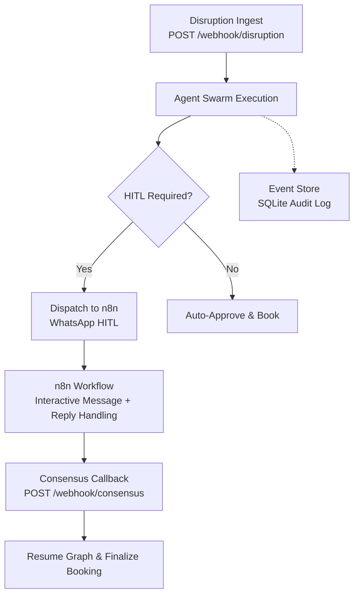
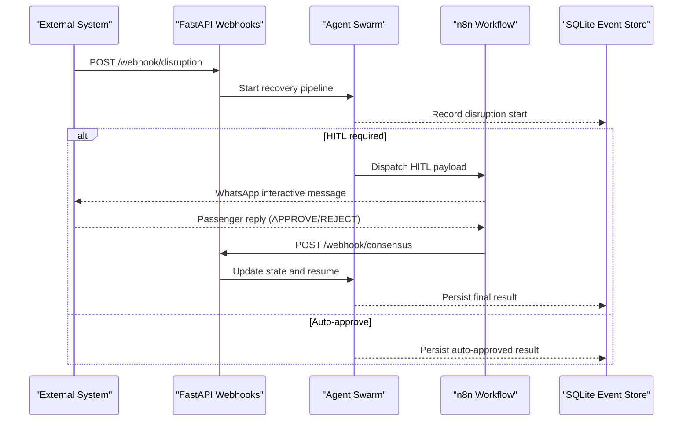
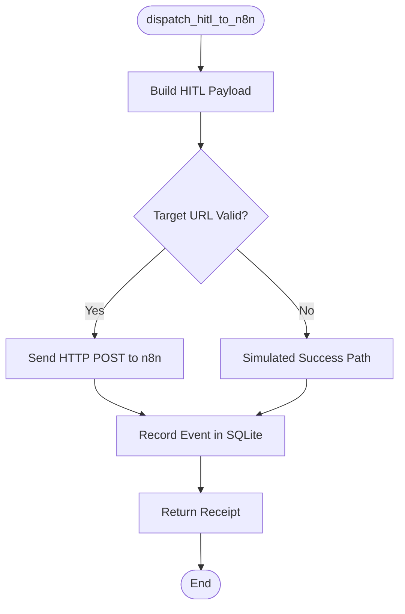
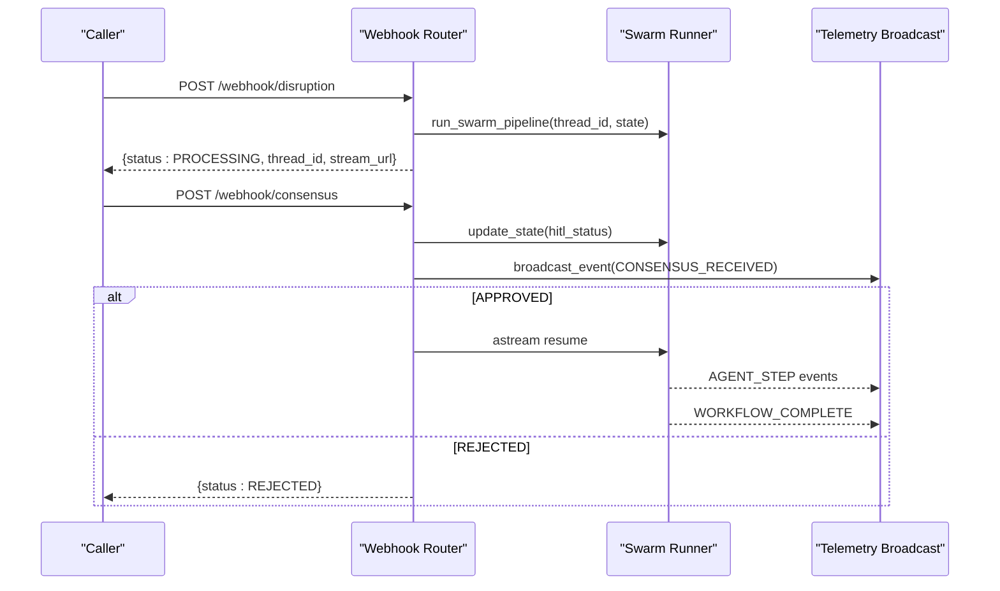
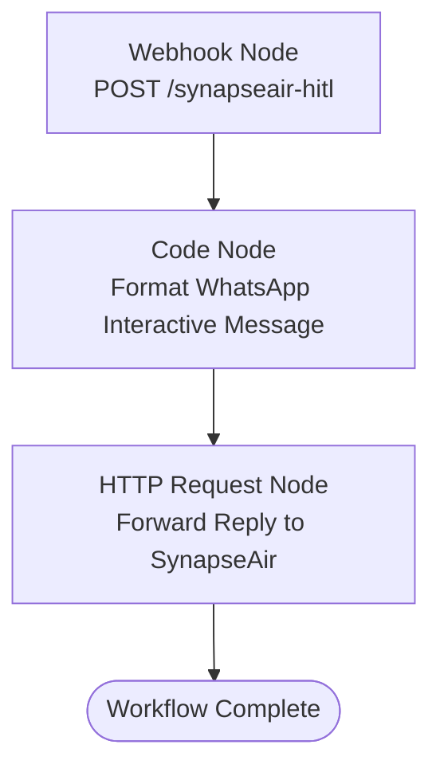
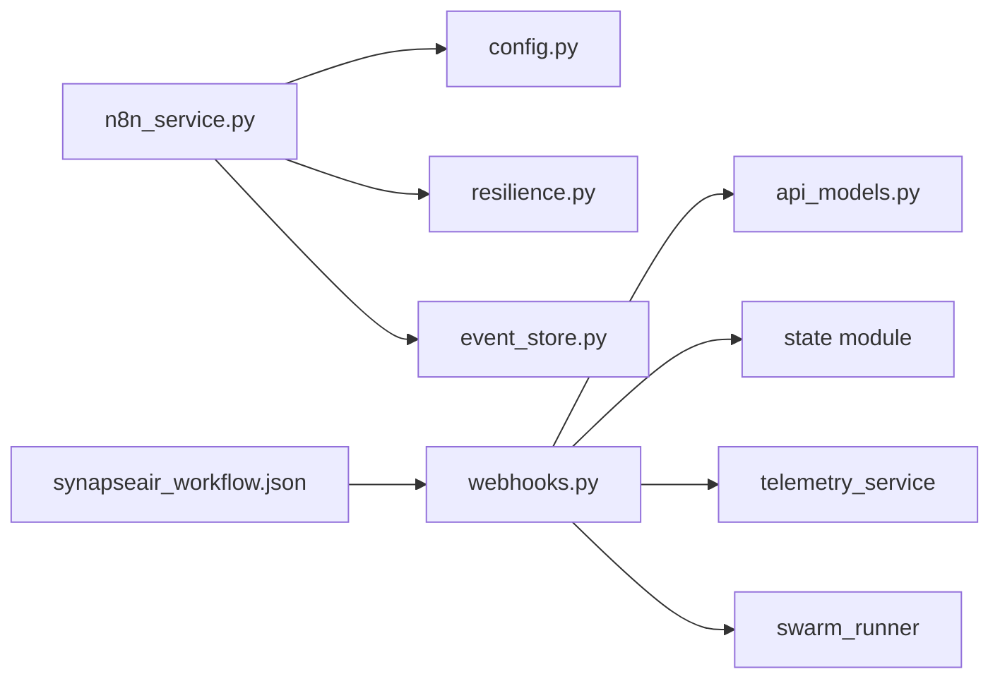

# n8n Workflow Integration

<cite>
**Referenced Files in This Document**
- [n8n_service.py](file://travel-recovery-os/backend/services/n8n_service.py)
- [webhooks.py](file://travel-recovery-os/backend/api/routers/webhooks.py)
- [synapseair_workflow.json](file://travel-recovery-os/n8n/synapseair_workflow.json)
- [config.py](file://travel-recovery-os/backend/config.py)
- [api_models.py](file://travel-recovery-os/backend/schemas/api_models.py)
- [resilience.py](file://travel-recovery-os/backend/middleware/resilience.py)
- [event_store.py](file://travel-recovery-os/backend/store/event_store.py)
- [README.md](file://travel-recovery-os/README.md)
</cite>

## Table of Contents
1. [Introduction](#introduction)
2. [Project Structure](#project-structure)
3. [Core Components](#core-components)
4. [Architecture Overview](#architecture-overview)
5. [Detailed Component Analysis](#detailed-component-analysis)
6. [Dependency Analysis](#dependency-analysis)
7. [Performance Considerations](#performance-considerations)
8. [Troubleshooting Guide](#troubleshooting-guide)
9. [Conclusion](#conclusion)
10. [Appendices](#appendices)

## Introduction
This document explains the human-in-the-loop (HITL) workflow integration between the agent system and the n8n automation engine. It covers how disruption events trigger WhatsApp messaging, approval workflows, and notifications; how payloads are structured; how responses are handled; and how to customize and extend the system for different business scenarios and communication channels.

## Project Structure
The integration spans backend services, API webhooks, configuration, resilience utilities, event persistence, and an n8n workflow definition:
- Backend service orchestrates HITL dispatch to n8n with retry and circuit breaker protection and persists audit logs.
- Webhook endpoints ingest disruptions and process passenger consensus decisions.
- Configuration centralizes webhook URLs and environment-specific settings.
- Resilience middleware provides retry with backoff and a circuit breaker pattern.
- Event store records durable audit trails for all n8n interactions.
- n8n workflow defines the WhatsApp interactive message flow and consensus forwarding.

**Diagram sources**
- [webhooks.py:14-72](file://travel-recovery-os/backend/api/routers/webhooks.py#L14-L72)
- [n8n_service.py:51-202](file://travel-recovery-os/backend/services/n8n_service.py#L51-L202)
- [synapseair_workflow.json:1-80](file://travel-recovery-os/n8n/synapseair_workflow.json#L1-L80)
- [event_store.py:47-101](file://travel-recovery-os/backend/store/event_store.py#L47-L101)

**Section sources**
- [webhooks.py:14-72](file://travel-recovery-os/backend/api/routers/webhooks.py#L14-L72)
- [n8n_service.py:51-202](file://travel-recovery-os/backend/services/n8n_service.py#L51-L202)
- [synapseair_workflow.json:1-80](file://travel-recovery-os/n8n/synapseair_workflow.json#L1-L80)
- [event_store.py:47-101](file://travel-recovery-os/backend/store/event_store.py#L47-L101)

## Core Components
- n8n Service: Formats HITL payloads, sends them to n8n webhooks, handles errors, and persists events.
- Webhook Endpoints: Accept disruption events and passenger consensus decisions; resume or stop workflows accordingly.
- Configuration: Centralizes n8n webhook URLs and callback endpoints.
- Resilience: Provides retry with exponential backoff and circuit breaker for external calls.
- Event Store: SQLite-based audit trail for n8n interactions and disruption history.

Key responsibilities:
- Build standardized payloads for WhatsApp interactive messages.
- Ensure reliable delivery with retries and circuit breaking.
- Capture end-to-end execution logs for observability.
- Provide clear response handling for approvals and rejections.

**Section sources**
- [n8n_service.py:51-202](file://travel-recovery-os/backend/services/n8n_service.py#L51-L202)
- [webhooks.py:14-185](file://travel-recovery-os/backend/api/routers/webhooks.py#L14-L185)
- [config.py:56-61](file://travel-recovery-os/backend/config.py#L56-L61)
- [resilience.py:25-80](file://travel-recovery-os/backend/middleware/resilience.py#L25-L80)
- [resilience.py:97-213](file://travel-recovery-os/backend/middleware/resilience.py#L97-L213)
- [event_store.py:107-160](file://travel-recovery-os/backend/store/event_store.py#L107-L160)

## Architecture Overview
The system integrates with n8n to deliver WhatsApp interactive messages and collect passenger decisions via a consensus webhook. The flow includes:
- Disruption ingestion triggers multi-agent processing.
- If HITL is required, the system dispatches a structured payload to n8n.
- n8n formats a WhatsApp interactive message and sets up reply handling.
- Passenger replies are forwarded back to the backend via a consensus webhook.
- The backend updates state and resumes the workflow to finalize booking or stop it based on the decision.

**Diagram sources**
- [webhooks.py:14-72](file://travel-recovery-os/backend/api/routers/webhooks.py#L14-L72)
- [webhooks.py:74-185](file://travel-recovery-os/backend/api/routers/webhooks.py#L74-L185)
- [n8n_service.py:51-202](file://travel-recovery-os/backend/services/n8n_service.py#L51-L202)
- [synapseair_workflow.json:1-80](file://travel-recovery-os/n8n/synapseair_workflow.json#L1-L80)
- [event_store.py:107-160](file://travel-recovery-os/backend/store/event_store.py#L107-L160)

## Detailed Component Analysis

### n8n Service: HITL Dispatch and Assistant
- Builds a standardized payload including passenger context, disruption details, WhatsApp template content, and consensus callback instructions.
- Sends the payload to n8n using HTTP with timeout and captures latency and response body.
- Wraps dispatch with retry and circuit breaker to handle transient failures and protect against cascading issues.
- Persists each interaction to SQLite for audit and troubleshooting.
- Provides a conversational assistant function for passenger questions with LLM fallbacks and contextual replies.

**Diagram sources**
- [n8n_service.py:51-202](file://travel-recovery-os/backend/services/n8n_service.py#L51-L202)
- [event_store.py:107-160](file://travel-recovery-os/backend/store/event_store.py#L107-L160)

**Section sources**
- [n8n_service.py:51-202](file://travel-recovery-os/backend/services/n8n_service.py#L51-L202)
- [n8n_service.py:208-257](file://travel-recovery-os/backend/services/n8n_service.py#L208-L257)

### Webhook Endpoints: Disruption Ingestion and Consensus Processing
- Disruption endpoint accepts structured or raw text inputs, constructs initial state, and starts the swarm asynchronously.
- Consensus endpoint receives passenger decisions, updates graph state, broadcasts telemetry, and resumes workflow if approved; otherwise stops.
- Both endpoints enforce API key verification and return consistent status codes and messages.

**Diagram sources**
- [webhooks.py:14-72](file://travel-recovery-os/backend/api/routers/webhooks.py#L14-L72)
- [webhooks.py:74-185](file://travel-recovery-os/backend/api/routers/webhooks.py#L74-L185)

**Section sources**
- [webhooks.py:14-72](file://travel-recovery-os/backend/api/routers/webhooks.py#L14-L72)
- [webhooks.py:74-185](file://travel-recovery-os/backend/api/routers/webhooks.py#L74-L185)

### n8n Workflow Definition: WhatsApp Interactive Message Flow
- Defines a webhook node that receives HITL payloads from the backend.
- Formats a WhatsApp interactive message with buttons for quick replies.
- Forwards passenger replies back to the backend consensus endpoint with action and notes.

**Diagram sources**
- [synapseair_workflow.json:1-80](file://travel-recovery-os/n8n/synapseair_workflow.json#L1-L80)

**Section sources**
- [synapseair_workflow.json:1-80](file://travel-recovery-os/n8n/synapseair_workflow.json#L1-L80)

### Configuration: Webhook URLs and Environment Settings
- Centralizes n8n webhook URL and consensus callback URL.
- Supports environment profiles and validation warnings for production readiness.
- Allows per-disruption override of n8n webhook URL via payload.

**Section sources**
- [config.py:56-61](file://travel-recovery-os/backend/config.py#L56-L61)
- [api_models.py:71-74](file://travel-recovery-os/backend/schemas/api_models.py#L71-L74)

### Resilience: Retry and Circuit Breaker
- Retry with exponential backoff reduces transient failure impact.
- Circuit breaker protects downstream systems by fast-failing after repeated errors and recovering gradually.
- Pre-built breakers include one for n8n webhook calls.

**Section sources**
- [resilience.py:25-80](file://travel-recovery-os/backend/middleware/resilience.py#L25-L80)
- [resilience.py:97-213](file://travel-recovery-os/backend/middleware/resilience.py#L97-L213)
- [resilience.py:218-244](file://travel-recovery-os/backend/middleware/resilience.py#L218-L244)

### Event Store: Audit Trail and History
- SQLite tables capture n8n webhook events and disruption lifecycle data.
- Provides functions to insert events, query by thread, and retrieve aggregated stats.
- Ensures durability across restarts and supports monitoring dashboards.

**Section sources**
- [event_store.py:47-101](file://travel-recovery-os/backend/store/event_store.py#L47-L101)
- [event_store.py:107-160](file://travel-recovery-os/backend/store/event_store.py#L107-L160)
- [event_store.py:166-239](file://travel-recovery-os/backend/store/event_store.py#L166-L239)
- [event_store.py:242-335](file://travel-recovery-os/backend/store/event_store.py#L242-L335)

## Dependency Analysis
The integration relies on several modules with clear boundaries:
- n8n_service depends on config, resilience, and event_store to send and record HITL dispatches.
- webhooks depend on schemas, state, swarm runner, and telemetry to manage workflow execution and real-time updates.
- synapseair_workflow.json defines the external n8n flow that bridges WhatsApp and backend consensus.
- resilience provides reusable patterns used across services.
- event_store underpins observability and historical analysis.

**Diagram sources**
- [n8n_service.py:1-26](file://travel-recovery-os/backend/services/n8n_service.py#L1-L26)
- [webhooks.py:1-11](file://travel-recovery-os/backend/api/routers/webhooks.py#L1-L11)
- [synapseair_workflow.json:1-80](file://travel-recovery-os/n8n/synapseair_workflow.json#L1-L80)

**Section sources**
- [n8n_service.py:1-26](file://travel-recovery-os/backend/services/n8n_service.py#L1-L26)
- [webhooks.py:1-11](file://travel-recovery-os/backend/api/routers/webhooks.py#L1-L11)
- [synapseair_workflow.json:1-80](file://travel-recovery-os/n8n/synapseair_workflow.json#L1-L80)

## Performance Considerations
- Use timeouts for HTTP calls to prevent blocking long-running requests.
- Apply retry with jitter to avoid thundering herds during outages.
- Configure circuit breaker thresholds appropriate for your n8n capacity.
- Keep payloads minimal to reduce network overhead.
- Persist only necessary fields to keep SQLite operations efficient.
- Stream telemetry events to frontends without blocking core flows.

[No sources needed since this section provides general guidance]

## Troubleshooting Guide
Common issues and resolutions:
- n8n unreachable or slow:
  - Check circuit breaker state and adjust thresholds/cooldown.
  - Verify retry configuration and ensure target URL is correct.
  - Inspect SQLite event log for error details and latency.
- No active session for consensus:
  - Ensure thread_id matches an existing swarm session.
  - Confirm that the disruption was ingested and swarm started.
- WhatsApp interactive message not received:
  - Validate n8n workflow activation and webhook path.
  - Confirm Meta Business API connectivity and phone number formatting.
- Observability gaps:
  - Query event store for recent n8n events and filter by thread_id.
  - Use telemetry streams to monitor step-by-step progress.

**Section sources**
- [resilience.py:97-213](file://travel-recovery-os/backend/middleware/resilience.py#L97-L213)
- [event_store.py:107-160](file://travel-recovery-os/backend/store/event_store.py#L107-L160)
- [webhooks.py:74-185](file://travel-recovery-os/backend/api/routers/webhooks.py#L74-L185)

## Conclusion
The n8n integration enables robust, user-friendly HITL workflows for flight disruption recovery. By combining structured payloads, resilient dispatch, durable auditing, and clear consensus handling, the system delivers fast, transparent passenger experiences while maintaining operational reliability. Customization points include extending message templates, adding new communication channels, and tuning resilience parameters to match deployment characteristics.

[No sources needed since this section summarizes without analyzing specific files]

## Appendices

### Webhook Endpoints and Payloads
- Disruption ingestion:
  - Endpoint: POST /webhook/disruption
  - Purpose: Ingest flight disruption and initiate recovery swarm.
  - Key fields: raw_text, pnr, flight_number, airline, origin, destination, scheduled_departure, delay_minutes, reason, loyalty_tier, passenger_name, passenger_phone, n8n_webhook_url, thread_id.
- Consensus processing:
  - Endpoint: POST /webhook/consensus
  - Purpose: Receive passenger decision and resume or stop workflow.
  - Key fields: thread_id, action (APPROVE/REJECT), selected_flight_id, notes.

**Section sources**
- [api_models.py:5-79](file://travel-recovery-os/backend/schemas/api_models.py#L5-L79)
- [api_models.py:81-101](file://travel-recovery-os/backend/schemas/api_models.py#L81-L101)
- [webhooks.py:14-72](file://travel-recovery-os/backend/api/routers/webhooks.py#L14-L72)
- [webhooks.py:74-185](file://travel-recovery-os/backend/api/routers/webhooks.py#L74-L185)

### Common Workflow Patterns
- Passenger approval request:
  - System detects standard tier and pauses at HITL breakpoint.
  - Dispatches WhatsApp interactive message with accept/decline options.
  - On approval, resumes workflow to finalize booking; on rejection, stops workflow.
- Status notifications:
  - During execution, telemetry events stream step progress and outcomes.
  - Event store records each step for post-mortem analysis.
- Escalation procedures:
  - If automated resolution fails or SLA thresholds are breached, escalate to human agents via additional n8n nodes or channels.
  - Use event store and telemetry to provide full context to escalators.

**Section sources**
- [n8n_service.py:51-202](file://travel-recovery-os/backend/services/n8n_service.py#L51-L202)
- [synapseair_workflow.json:1-80](file://travel-recovery-os/n8n/synapseair_workflow.json#L1-L80)
- [event_store.py:107-160](file://travel-recovery-os/backend/store/event_store.py#L107-L160)

### Error Handling and Retry Mechanisms
- Retry with exponential backoff and jitter applied to n8n dispatch.
- Circuit breaker opens after repeated failures, preventing overload and enabling recovery.
- Errors captured in event store with payload and response snippets for diagnostics.

**Section sources**
- [resilience.py:25-80](file://travel-recovery-os/backend/middleware/resilience.py#L25-L80)
- [resilience.py:97-213](file://travel-recovery-os/backend/middleware/resilience.py#L97-L213)
- [n8n_service.py:127-182](file://travel-recovery-os/backend/services/n8n_service.py#L127-L182)
- [event_store.py:107-160](file://travel-recovery-os/backend/store/event_store.py#L107-L160)

### Monitoring Capabilities
- Real-time telemetry streaming for live visibility into workflow steps.
- SQLite-based event logs for durable audit trails and analytics.
- Aggregated statistics for throughput, resolution times, and success rates.

**Section sources**
- [webhooks.py:107-161](file://travel-recovery-os/backend/api/routers/webhooks.py#L107-L161)
- [event_store.py:288-335](file://travel-recovery-os/backend/store/event_store.py#L288-L335)

### Customization Guidance
- Customize WhatsApp templates by modifying the payload structure and n8n code node.
- Add new communication channels by extending n8n workflow nodes and updating consensus routing.
- Tune resilience parameters (retries, cooldowns) based on observed performance and stability.
- Override n8n webhook URL per disruption for multi-tenant or regional routing.

**Section sources**
- [synapseair_workflow.json:20-50](file://travel-recovery-os/n8n/synapseair_workflow.json#L20-L50)
- [config.py:56-61](file://travel-recovery-os/backend/config.py#L56-L61)
- [api_models.py:71-74](file://travel-recovery-os/backend/schemas/api_models.py#L71-L74)