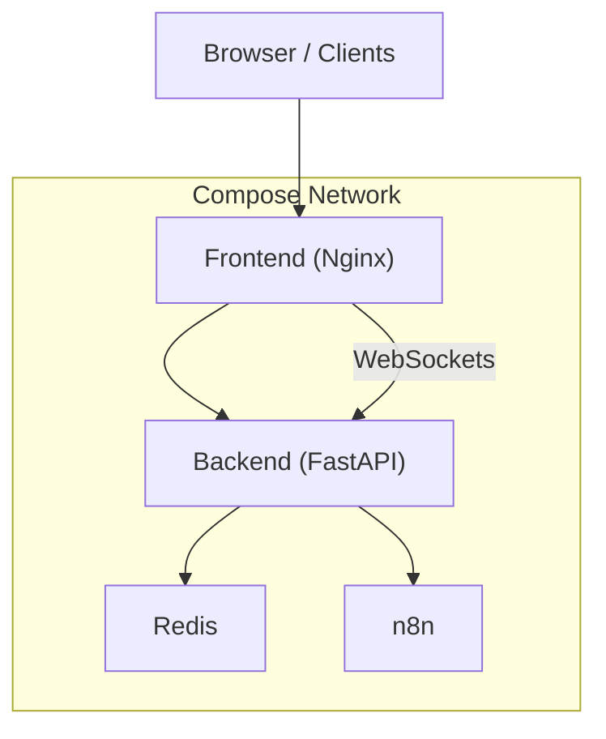
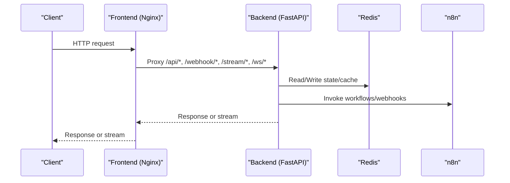
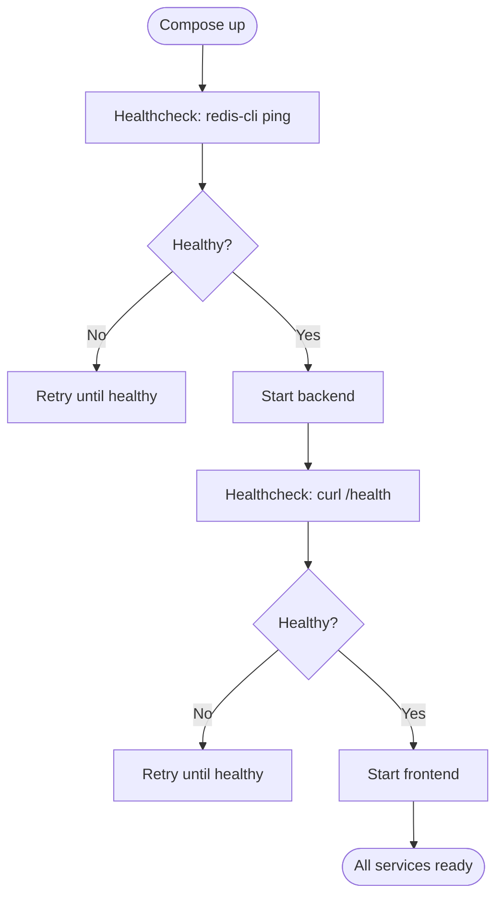
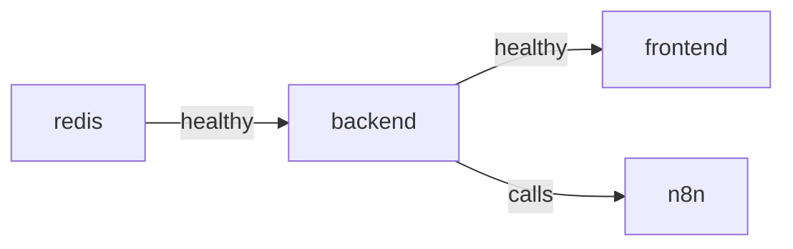

# Containerization & Service Orchestration

<cite>
**Referenced Files in This Document**
- [docker-compose.yml](file://travel-recovery-os/docker-compose.yml)
- [backend Dockerfile](file://travel-recovery-os/backend/Dockerfile)
- [frontend Dockerfile](file://travel-recovery-os/frontend/Dockerfile)
- [root Dockerfile](file://travel-recovery-os/Dockerfile)
- [nginx.conf](file://travel-recovery-os/frontend/nginx.conf)
- [config.py](file://travel-recovery-os/backend/config.py)
- [backend .env.example](file://travel-recovery-os/backend/.env.example)
- [production env example](file://travel-recovery-os/backend/config.production.env.example)
- [CI workflow](file://travel-recovery-os/.github/workflows/ci.yml)
- [deploy workflow](file://travel-recovery-os/.github/workflows/deploy.yml)
</cite>

## Table of Contents
1. Introduction
2. Project Structure
3. Core Components
4. Architecture Overview
5. Detailed Component Analysis
6. Dependency Analysis
7. Performance Considerations
8. Troubleshooting Guide
9. Conclusion

## Introduction
This document explains the containerization strategy for the project using Docker and Docker Compose. It covers service definitions, networking, volume management, environment configuration, development versus production deployments, service dependencies, and container health monitoring. It also outlines CI/CD integration that builds and deploys containers reliably.

## Project Structure
The containerized application consists of:
- Backend API (FastAPI) running in a Python container
- Frontend SPA (Vue 3) served by Nginx
- Redis for caching/state
- n8n for workflow automation
- Docker Compose orchestrates services, networking, volumes, and health checks
- GitHub Actions build images and deploy to a target host

**Diagram sources**
- [docker-compose.yml:4-66](file://travel-recovery-os/docker-compose.yml#L4-L66)
- [nginx.conf:11-40](file://travel-recovery-os/frontend/nginx.conf#L11-L40)

**Section sources**
- [docker-compose.yml:1-71](file://travel-recovery-os/docker-compose.yml#L1-L71)

## Core Components
- Backend service: Python-based FastAPI app with Uvicorn, exposing REST and WebSocket endpoints; includes a health endpoint used by orchestration and CI.
- Frontend service: Vue 3 SPA built with Vite and served via Nginx; proxies API, webhooks, streaming, and WebSocket traffic to the backend.
- Redis: In-memory store used by the backend; persisted via a named volume.
- n8n: Workflow automation service with basic auth enabled; used as an external integration point.
- Docker Compose: Defines services, ports, volumes, environment variables, depends_on with health conditions, and healthchecks.
- Environment configuration: Centralized via Pydantic settings with per-environment files and validation warnings for production.

**Section sources**
- [backend Dockerfile:1-34](file://travel-recovery-os/backend/Dockerfile#L1-L34)
- [frontend Dockerfile:1-15](file://travel-recovery-os/frontend/Dockerfile#L1-L15)
- [docker-compose.yml:4-66](file://travel-recovery-os/docker-compose.yml#L4-L66)
- [config.py:20-116](file://travel-recovery-os/backend/config.py#L20-L116)

## Architecture Overview
The runtime architecture uses a single Docker network created by Compose. The frontend proxies client requests to the backend on internal service names. Redis and n8n are internal-only services accessed by name. Health checks ensure dependent services start only when ready.

**Diagram sources**
- [nginx.conf:11-40](file://travel-recovery-os/frontend/nginx.conf#L11-L40)
- [docker-compose.yml:18-53](file://travel-recovery-os/docker-compose.yml#L18-L53)

## Detailed Component Analysis

### Docker Compose Services and Networking
- Services: redis, backend, frontend, n8n
- Networking: Implicit default bridge network; services communicate via service names (e.g., backend, redis, n8n)
- Ports:
  - Frontend exposes port 80 to the host
  - Backend exposes port 8000 to the host
  - Redis exposed on 6379 for local access
  - n8n exposed on 5678
- Dependencies:
  - backend depends on redis being healthy
  - frontend depends on backend being healthy
- Health checks:
  - Redis: ping
  - Backend: HTTP GET /health
  - Frontend: relies on backend health via depends_on

**Diagram sources**
- [docker-compose.yml:12-16](file://travel-recovery-os/docker-compose.yml#L12-L16)
- [docker-compose.yml:36-40](file://travel-recovery-os/docker-compose.yml#L36-L40)
- [docker-compose.yml:50-53](file://travel-recovery-os/docker-compose.yml#L50-L53)

**Section sources**
- [docker-compose.yml:4-66](file://travel-recovery-os/docker-compose.yml#L4-L66)

### Volume Management
- redis-data: Persists Redis data under /data inside the container
- backend-data: Persists backend data (e.g., SQLite checkpointer) under /app/data
- n8n-data: Persists n8n user data under /home/node/.n8n

These named volumes survive container restarts and enable stateful operation across deployments.

**Section sources**
- [docker-compose.yml:10-11](file://travel-recovery-os/docker-compose.yml#L10-L11)
- [docker-compose.yml:31-32](file://travel-recovery-os/docker-compose.yml#L31-L32)
- [docker-compose.yml:60-61](file://travel-recovery-os/docker-compose.yml#L60-L61)
- [docker-compose.yml:67-70](file://travel-recovery-os/docker-compose.yml#L67-L70)

### Environment Configuration
- Backend loads settings from environment files based on ENVIRONMENT profile (development, staging, production). Defaults and validators enforce required keys in production and provide safe fallbacks where appropriate.
- Production example file documents all required keys for LLM providers, n8n, Atlas, Redis, JWT, observability, and frontend URL.
- Compose injects REDIS_URL and sets ENVIRONMENT=production for the backend at runtime.
- Frontend proxies to backend via service name; no extra env needed for proxying within the compose network.

Key configuration areas:
- Application identity and secrets
- LLM integrations (DeepSeek/Hermes)
- n8n webhook and API URLs
- Atlas GDS sandbox/production endpoints
- Redis connection string
- JWT parameters
- Observability endpoints and log levels

**Section sources**
- [config.py:20-116](file://travel-recovery-os/backend/config.py#L20-L116)
- [production env example:1-49](file://travel-recovery-os/backend/config.production.env.example#L1-L49)
- [backend .env.example:1-25](file://travel-recovery-os/backend/.env.example#L1-L25)
- [docker-compose.yml:26-30](file://travel-recovery-os/docker-compose.yml#L26-L30)

### Frontend Proxying and WebSockets
Nginx serves the static SPA and proxies:
- /api/* to backend REST APIs
- /webhook/* to backend webhook handlers
- /stream/* for server-sent events or streaming responses
- /ws/* for WebSocket upgrades with proper headers
- /health to backend health endpoint

This allows the frontend to run on port 80 while routing all dynamic traffic to the backend service.

**Section sources**
- [nginx.conf:1-42](file://travel-recovery-os/frontend/nginx.conf#L1-L42)

### Backend Containerization
- Base image: Python slim
- Installs system deps (gcc, curl) for health checks and native extensions
- Copies requirements first for layer caching, then installs dependencies
- Copies application code and sets PYTHONPATH
- Creates /app/data for persistent storage
- Exposes multiple ports (7860, 8000, 8001) and runs Uvicorn on a dynamic PORT
- Includes a HEALTHCHECK that probes /health

Note: When orchestrated via Compose, the backend is mapped to port 8000 externally and communicates internally on its own port.

**Section sources**
- [backend Dockerfile:1-34](file://travel-recovery-os/backend/Dockerfile#L1-L34)

### Frontend Containerization
- Multi-stage build: Node.js builds the Vue app, then Nginx serves the static assets
- Copies dist into Nginx’s HTML directory
- Uses custom nginx.conf to proxy to backend
- Exposes port 80

**Section sources**
- [frontend Dockerfile:1-15](file://travel-recovery-os/frontend/Dockerfile#L1-L15)
- [nginx.conf:1-42](file://travel-recovery-os/frontend/nginx.conf#L1-L42)

### Root Dockerfile (Alternative Build)
A root-level Dockerfile can build the entire repository context and run the backend directly. It mirrors the backend Dockerfile behavior but copies the whole repo and sets the same entrypoint. Useful for platforms that expect a single Dockerfile at the repository root.

**Section sources**
- [root Dockerfile:1-35](file://travel-recovery-os/Dockerfile#L1-L35)

## Dependency Analysis
Service dependency graph and health-driven startup:

- Compose ensures Redis is healthy before starting the backend
- Backend must be healthy before starting the frontend
- n8n is independent but called by the backend; not a strict dependency for startup

**Diagram sources**
- [docker-compose.yml:33-35](file://travel-recovery-os/docker-compose.yml#L33-L35)
- [docker-compose.yml:50-53](file://travel-recovery-os/docker-compose.yml#L50-L53)

**Section sources**
- [docker-compose.yml:18-66](file://travel-recovery-os/docker-compose.yml#L18-L66)

## Performance Considerations
- Layer caching: Requirements installed before copying source to maximize Docker layer reuse
- Minimal base images: python:3.12-slim and node:20-alpine reduce image size
- Health checks: Prevent premature traffic routing and aid auto-restart policies
- Port exposure: Only necessary ports are exposed; internal communication uses service names
- Streaming/WebSockets: Nginx disables buffering and caching for /stream/* and properly upgrades /ws/* connections
- Persistent volumes: Use named volumes for stateful services to avoid cold starts and data loss

[No sources needed since this section provides general guidance]

## Troubleshooting Guide
Common issues and resolutions:
- Backend not healthy:
  - Verify /health endpoint responds; check logs and environment variables (especially REDIS_URL and secrets)
  - Ensure Redis is reachable by service name and healthy
- Frontend cannot reach backend:
  - Confirm Nginx proxies to backend service name and correct port
  - Check that frontend depends_on backend with condition service_healthy
- Redis connectivity errors:
  - Validate REDIS_URL and that Redis container is healthy
  - Ensure redis-data volume is mounted and accessible
- n8n integration failures:
  - Verify N8N_API_URL and authentication credentials
  - Confirm n8n container is running and reachable
- Deployment health checks fail:
  - CI/CD waits for /health to return success; inspect logs if timeout occurs
  - Smoke tests call /api/system/status and /api/history to validate functionality

**Section sources**
- [docker-compose.yml:12-16](file://travel-recovery-os/docker-compose.yml#L12-L16)
- [docker-compose.yml:36-40](file://travel-recovery-os/docker-compose.yml#L36-L40)
- [deploy workflow:27-58](file://travel-recovery-os/.github/workflows/deploy.yml#L27-L58)

## Conclusion
The project uses a clear, health-checked, and layered containerization strategy:
- Compose defines services, networking, volumes, and startup order
- Environment configuration is centralized and validated per environment
- Frontend proxies all dynamic traffic to the backend, enabling simple hosting
- CI/CD builds images and performs deployment with health checks and smoke tests
This approach supports both local development and production deployments with consistent behavior across environments.

[No sources needed since this section summarizes without analyzing specific files]