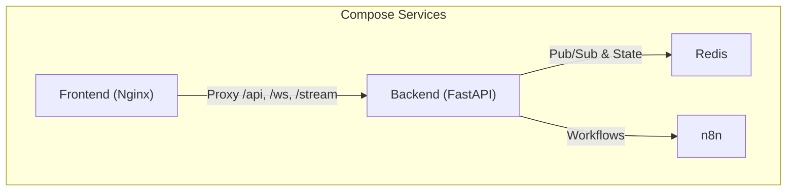
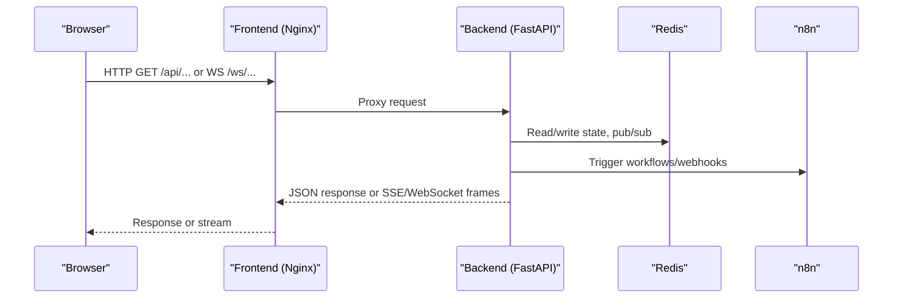
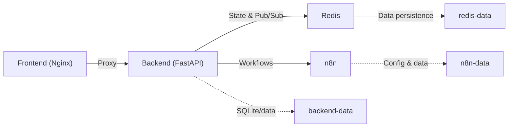

# Infrastructure Components

<cite>
**Referenced Files in This Document**
- [docker-compose.yml](file://travel-recovery-os/docker-compose.yml)
- [backend Dockerfile](file://travel-recovery-os/backend/Dockerfile)
- [frontend Dockerfile](file://travel-recovery-os/frontend/Dockerfile)
- [root Dockerfile](file://travel-recovery-os/Dockerfile)
- [deploy.yml](file://travel-recovery-os/.github/workflows/deploy.yml)
- [ci.yml](file://travel-recovery-os/.github/workflows/ci.yml)
- [config.production.env.example](file://travel-recovery-os/backend/config.production.env.example)
- [system.py](file://travel-recovery-os/backend/api/routers/system.py)
- [tracing.py](file://travel-recovery-os/backend/middleware/tracing.py)
- [nginx.conf](file://travel-recovery-os/frontend/nginx.conf)
- [DEPLOYMENT_GUIDE.md](file://travel-recovery-os/DEPLOYMENT_GUIDE.md)
</cite>

## Table of Contents
1. [Introduction](#introduction)
2. [Project Structure](#project-structure)
3. [Core Components](#core-components)
4. [Architecture Overview](#architecture-overview)
5. [Detailed Component Analysis](#detailed-component-analysis)
6. [Dependency Analysis](#dependency-analysis)
7. [Performance Considerations](#performance-considerations)
8. [Troubleshooting Guide](#troubleshooting-guide)
9. [Conclusion](#conclusion)
10. [Appendices](#appendices)

## Introduction
This document describes the infrastructure for the Travel Recovery OS, focusing on containerization with Docker, service orchestration via Docker Compose, monitoring and observability, deployment automation, environment-specific configuration, health checks, scaling considerations, and operational procedures for production. It is intended for operators and platform engineers who need to run, monitor, and scale the system reliably.

## Project Structure
The project provides:
- A backend API (FastAPI) packaged as a Python container
- A frontend SPA (Vue 3 + Vite) served by Nginx
- Redis for caching/pub-sub and event persistence
- n8n for workflow automation
- GitHub Actions for CI and automated deployments
- Health endpoints and OpenTelemetry-based tracing

**Diagram sources**
- [docker-compose.yml:4-66](file://travel-recovery-os/docker-compose.yml#L4-L66)
- [nginx.conf:11-40](file://travel-recovery-os/frontend/nginx.conf#L11-L40)

**Section sources**
- [docker-compose.yml:1-71](file://travel-recovery-os/docker-compose.yml#L1-L71)
- [backend Dockerfile:1-34](file://travel-recovery-os/backend/Dockerfile#L1-L34)
- [frontend Dockerfile:1-15](file://travel-recovery-os/frontend/Dockerfile#L1-L15)
- [root Dockerfile:1-35](file://travel-recovery-os/Dockerfile#L1-L35)

## Core Components
- Container images
  - Backend: Python 3.12 slim image with uvicorn; exposes multiple ports and includes a healthcheck
  - Frontend: Node build stage producing static assets served by Nginx
  - Root image: Alternative single-image entrypoint that runs the backend from the repo root
- Orchestration
  - Docker Compose defines Redis, Backend, Frontend, and n8n services with restart policies, volumes, environment variables, dependencies, and healthchecks
- Observability
  - OpenTelemetry middleware initializes tracing with console and optional OTLP exporter
  - Health endpoints expose service status and provider connectivity
- Deployment automation
  - CI validates code, builds artifacts, and publishes container images
  - Deploy pipeline pulls images, rebuilds, starts services, and performs health checks and smoke tests

**Section sources**
- [backend Dockerfile:1-34](file://travel-recovery-os/backend/Dockerfile#L1-L34)
- [frontend Dockerfile:1-15](file://travel-recovery-os/frontend/Dockerfile#L1-L15)
- [root Dockerfile:1-35](file://travel-recovery-os/Dockerfile#L1-L35)
- [docker-compose.yml:18-53](file://travel-recovery-os/docker-compose.yml#L18-L53)
- [tracing.py:43-79](file://travel-recovery-os/backend/middleware/tracing.py#L43-L79)
- [system.py:9-52](file://travel-recovery-os/backend/api/routers/system.py#L9-L52)
- [ci.yml:68-99](file://travel-recovery-os/.github/workflows/ci.yml#L68-L99)
- [deploy.yml:15-57](file://travel-recovery-os/.github/workflows/deploy.yml#L15-L57)

## Architecture Overview
End-to-end request flow through the orchestrated stack:

**Diagram sources**
- [nginx.conf:11-40](file://travel-recovery-os/frontend/nginx.conf#L11-L40)
- [docker-compose.yml:18-66](file://travel-recovery-os/docker-compose.yml#L18-L66)

## Detailed Component Analysis

### Docker Images and Entrypoints
- Backend image
  - Base: python:3.12-slim
  - Installs system deps, copies requirements, installs Python packages, sets PYTHONPATH and PORT, creates data directory, exposes ports, defines HEALTHCHECK, and runs uvicorn
- Frontend image
  - Build stage: node:20-alpine, npm ci, build
  - Runtime: nginx:alpine serving built assets and proxying API routes
- Root image
  - Single-image alternative that builds and runs the backend from repository root

Operational notes:
- The backend image’s HEALTHCHECK uses the dynamic PORT env var to probe /health
- The compose file also defines a service-level healthcheck for the backend using curl against port 8000

**Section sources**
- [backend Dockerfile:1-34](file://travel-recovery-os/backend/Dockerfile#L1-L34)
- [frontend Dockerfile:1-15](file://travel-recovery-os/frontend/Dockerfile#L1-L15)
- [root Dockerfile:1-35](file://travel-recovery-os/Dockerfile#L1-L35)
- [docker-compose.yml:18-40](file://travel-recovery-os/docker-compose.yml#L18-L40)

### Service Orchestration with Docker Compose
Services:
- redis: persistent volume, healthcheck via redis-cli ping
- backend: depends on healthy redis, mounts data volume, sets environment including REDIS_URL and ENVIRONMENT
- frontend: depends on healthy backend, serves on port 80
- n8n: basic auth enabled, persistent volume

Volumes:
- redis-data, backend-data, n8n-data

Restart policy:
- unless-stopped across all services

Health and dependency management:
- Backend healthcheck probes /health
- Frontend waits for backend to be healthy before starting

**Section sources**
- [docker-compose.yml:4-71](file://travel-recovery-os/docker-compose.yml#L4-L71)

### Monitoring and Observability
- Health endpoints
  - /health returns online status, version, and provider configuration flags
  - /api/system/status returns detailed integration statuses (LLMs, GDS, n8n)
- Tracing
  - OpenTelemetry initialization supports console and OTLP exporters
  - FastAPI instrumentation is applied when an app instance is provided
  - Helpers provide span context propagation for real-time streams
- Logging
  - Environment-driven log level and JSON formatting via settings

Operational guidance:
- Set OTEL_ENDPOINT to enable OTLP export in production
- Use LOG_LEVEL and LOG_JSON to tune logs for production consumption

**Section sources**
- [system.py:9-52](file://travel-recovery-os/backend/api/routers/system.py#L9-L52)
- [tracing.py:43-79](file://travel-recovery-os/backend/middleware/tracing.py#L43-L79)
- [config.production.env.example:42-45](file://travel-recovery-os/backend/config.production.env.example#L42-L45)

### Environment-Specific Settings
- Configuration loading
  - Pydantic-based settings load from .env files based on ENVIRONMENT (development, staging, production)
  - Defaults include local dev values; production requires explicit secrets and endpoints
- Production example keys
  - Application secret, LLM credentials, n8n URLs, Atlas GDS settings, Redis URL, JWT settings, observability endpoints, frontend URL
- Validation
  - On startup in production mode, missing or default critical keys trigger warnings

Recommended practice:
- Maintain separate env files per environment
- Never commit secrets; use CI/CD secrets or secure secret stores
- Validate required keys before deploying to production

**Section sources**
- [config.py:20-37](file://travel-recovery-os/backend/config.py#L20-L37)
- [config.py:92-112](file://travel-recovery-os/backend/config.py#L92-L112)
- [config.production.env.example:1-49](file://travel-recovery-os/backend/config.production.env.example#L1-L49)

### Health Checks and Probes
- Container-level healthcheck
  - Backend image defines HEALTHCHECK probing /health on the configured port
- Compose-level healthcheck
  - Backend service healthcheck curls /health on port 8000
- Endpoints
  - /health: lightweight status
  - /api/system/status: rich status including integrations

Operational tips:
- Ensure reverse proxy or ingress exposes /health for orchestrators
- Configure external monitors to poll /api/system/status for deeper insights

**Section sources**
- [backend Dockerfile:28-33](file://travel-recovery-os/backend/Dockerfile#L28-L33)
- [docker-compose.yml:36-40](file://travel-recovery-os/docker-compose.yml#L36-L40)
- [system.py:9-52](file://travel-recovery-os/backend/api/routers/system.py#L9-L52)

### Scaling Considerations
- Horizontal scaling
  - Stateless backend can be scaled behind a load balancer; ensure shared Redis and consistent config
  - Frontend is static assets; can be served via CDN or edge hosting
- Concurrency and streaming
  - WebSockets and Server-Sent Events require proper proxy timeouts and keepalive settings at the ingress layer
- Data persistence
  - Redis and backend data volumes are defined; consider managed services for durability and backups
- Resource limits
  - Apply CPU/memory limits in your orchestrator or cloud platform to prevent noisy neighbor issues

[No sources needed since this section provides general guidance]

### Operational Procedures for Production Deployment
- Local validation
  - Build and preview frontend; run backend locally to validate endpoints and streams
- CI/CD
  - CI runs linting, type checks, tests, and builds Docker images; pushes to registry on main branch
  - Deploy workflow pulls latest images, rebuilds if needed, starts services, and verifies health and smoke tests
- Platform options
  - Backend can be deployed on platforms supporting Docker (e.g., Hugging Face Spaces, Render/Railway)
  - Frontend can be deployed to Vercel or Cloudflare Pages with environment variables pointing to the backend

Verification checklist:
- Backend health endpoint responds with expected status
- System status shows active providers and integrations
- WebSocket/stream endpoints are reachable and functional
- Smoke tests pass after deployment

**Section sources**
- [DEPLOYMENT_GUIDE.md:102-127](file://travel-recovery-os/DEPLOYMENT_GUIDE.md#L102-L127)
- [ci.yml:10-67](file://travel-recovery-os/.github/workflows/ci.yml#L10-L67)
- [ci.yml:68-99](file://travel-recovery-os/.github/workflows/ci.yml#L68-L99)
- [deploy.yml:15-57](file://travel-recovery-os/.github/workflows/deploy.yml#L15-L57)

## Dependency Analysis
Service dependencies and runtime relationships:

**Diagram sources**
- [docker-compose.yml:4-71](file://travel-recovery-os/docker-compose.yml#L4-L71)
- [nginx.conf:11-40](file://travel-recovery-os/frontend/nginx.conf#L11-L40)

**Section sources**
- [docker-compose.yml:4-71](file://travel-recovery-os/docker-compose.yml#L4-L71)

## Performance Considerations
- Image layering
  - Requirements installed before application code to leverage Docker cache
- Startup time
  - HEALTHCHECK start-period allows warm-up for large models or slow imports
- Streaming performance
  - Nginx disables buffering and caching for /stream and upgrades connections for /ws to support real-time features
- External dependencies
  - Redis availability impacts event persistence and pub/sub; ensure high availability in production
- Observability overhead
  - Enable OTLP export only when a collector is available; otherwise rely on console logs in development

[No sources needed since this section provides general guidance]

## Troubleshooting Guide
Common issues and resolutions:
- Backend not healthy
  - Verify /health and /api/system/status endpoints respond
  - Check Redis connectivity and credentials
  - Review environment variables for required secrets and endpoints
- Frontend cannot reach backend
  - Confirm Nginx proxy paths for /api, /webhook, /stream, /ws
  - Ensure CORS and headers are set appropriately at the ingress layer
- Real-time streams not working
  - Validate WebSocket upgrade headers and proxy timeouts
  - Check Redis availability for event persistence
- Deployment failures
  - Inspect CI logs for test/lint/type errors
  - Review deploy workflow steps and SSH access to target host
  - Use compose logs to diagnose startup issues

**Section sources**
- [system.py:9-52](file://travel-recovery-os/backend/api/routers/system.py#L9-L52)
- [nginx.conf:11-40](file://travel-recovery-os/frontend/nginx.conf#L11-L40)
- [deploy.yml:27-57](file://travel-recovery-os/.github/workflows/deploy.yml#L27-L57)

## Conclusion
The Travel Recovery OS is containerized with clear separation between frontend and backend, orchestrated via Docker Compose, and supported by robust health checks and observability. CI/CD automates quality gates and deployments, while environment-specific configuration ensures safe operation across stages. For production, follow the recommended practices for secrets management, scaling, and monitoring to maintain reliability and performance.

## Appendices

### Quick Reference: Key Ports and Paths
- Frontend: 80 (Nginx)
- Backend: 8000 (HTTP), 7860/8001 (alternative/dev)
- Redis: 6379
- n8n: 5678
- Health: /health, /api/system/status

**Section sources**
- [docker-compose.yml:8-65](file://travel-recovery-os/docker-compose.yml#L8-L65)
- [backend Dockerfile:25-33](file://travel-recovery-os/backend/Dockerfile#L25-L33)
- [system.py:9-52](file://travel-recovery-os/backend/api/routers/system.py#L9-L52)