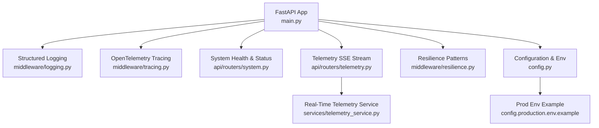
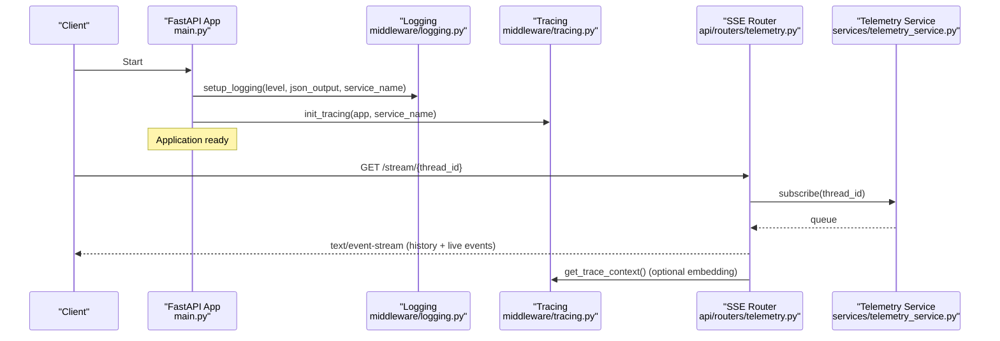
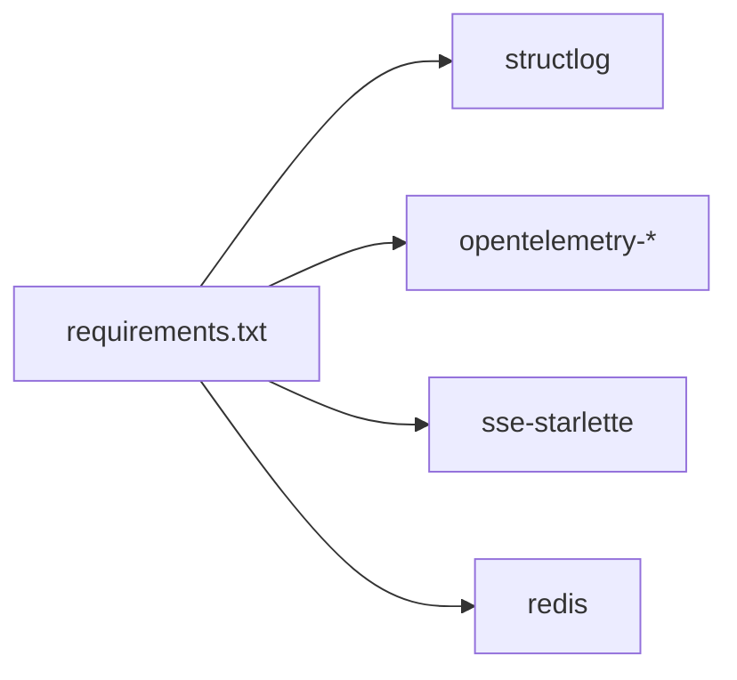

# Monitoring & Observability

<cite>
**Referenced Files in This Document**
- [main.py](file://backend/main.py)
- [config.py](file://backend/config.py)
- [logging.py](file://backend/middleware/logging.py)
- [tracing.py](file://backend/middleware/tracing.py)
- [telemetry_service.py](file://backend/services/telemetry_service.py)
- [telemetry.py](file://backend/api/routers/telemetry.py)
- [system.py](file://backend/api/routers/system.py)
- [resilience.py](file://backend/middleware/resilience.py)
- [requirements.txt](file://backend/requirements.txt)
- [config.production.env.example](file://backend/config.production.env.example)
</cite>

## Table of Contents
1. [Introduction](#introduction)
2. [Project Structure](#project-structure)
3. [Core Components](#core-components)
4. [Architecture Overview](#architecture-overview)
5. [Detailed Component Analysis](#detailed-component-analysis)
6. [Dependency Analysis](#dependency-analysis)
7. [Performance Considerations](#performance-considerations)
8. [Troubleshooting Guide](#troubleshooting-guide)
9. [Conclusion](#conclusion)
10. [Appendices](#appendices)

## Introduction
This document explains the monitoring and observability infrastructure for the application, focusing on structured logging, OpenTelemetry integration, real-time telemetry streaming, distributed tracing, and operational practices for log analysis, alerting, and debugging in production. It also covers resilience patterns that support stable operations under failures.

## Project Structure
Observability is implemented across middleware (logging and tracing), services (real-time telemetry), API routers (SSE stream and health/status endpoints), configuration (environment-driven settings), and startup lifecycle (initialization order).

**Diagram sources**
- [main.py:22-37](file://backend/main.py#L22-L37)
- [logging.py:37-100](file://backend/middleware/logging.py#L37-L100)
- [tracing.py:43-80](file://backend/middleware/tracing.py#L43-L80)
- [system.py:9-22](file://backend/api/routers/system.py#L9-L22)
- [telemetry.py:11-46](file://backend/api/routers/telemetry.py#L11-L46)
- [telemetry_service.py:23-68](file://backend/services/telemetry_service.py#L23-L68)
- [resilience.py:25-244](file://backend/middleware/resilience.py#L25-L244)
- [config.py:79-84](file://backend/config.py#L79-L84)
- [config.production.env.example:42-45](file://backend/config.production.env.example#L42-L45)

**Section sources**
- [main.py:22-37](file://backend/main.py#L22-L37)
- [config.py:79-84](file://backend/config.py#L79-L84)

## Core Components
- Structured logging with optional JSON output and context binding for correlation fields.
- OpenTelemetry tracing with console and OTLP exporters, FastAPI instrumentation, and span helpers/decorators.
- Real-time telemetry via Server-Sent Events (SSE) with Redis-backed persistence and PII masking.
- Health and status endpoints for readiness and provider configuration visibility.
- Resilience utilities (retry with backoff, circuit breaker) to stabilize external calls and improve observability through consistent logs.

**Section sources**
- [logging.py:37-119](file://backend/middleware/logging.py#L37-L119)
- [tracing.py:43-158](file://backend/middleware/tracing.py#L43-L158)
- [telemetry_service.py:23-68](file://backend/services/telemetry_service.py#L23-L68)
- [system.py:9-52](file://backend/api/routers/system.py#L9-L52)
- [resilience.py:25-244](file://backend/middleware/resilience.py#L25-L244)

## Architecture Overview
The application initializes logging and tracing during startup, exposes health/status endpoints, and streams agent activity in real time. Traces are exported to console and optionally to an OTLP collector; logs are structured and can be emitted as JSON lines for production consumption.

**Diagram sources**
- [main.py:22-37](file://backend/main.py#L22-L37)
- [logging.py:37-100](file://backend/middleware/logging.py#L37-L100)
- [tracing.py:43-121](file://backend/middleware/tracing.py#L43-L121)
- [telemetry.py:11-46](file://backend/api/routers/telemetry.py#L11-L46)
- [telemetry_service.py:45-68](file://backend/services/telemetry_service.py#L45-L68)

## Detailed Component Analysis

### Structured Logging
- Initialization supports configurable log level and JSON output mode, with a processor pipeline that adds timestamps, stack info, and Unicode decoding.
- Provides a logger factory that returns a bound logger or falls back to stdlib when structlog is unavailable.
- Context manager enables temporary binding of correlation fields (e.g., thread_id, pnr) to all subsequent logs within scope.

Operational notes:
- Use JSON output in production for log aggregation systems.
- Bind request-scoped identifiers using the context manager to correlate logs across components.

**Section sources**
- [logging.py:37-119](file://backend/middleware/logging.py#L37-L119)

### OpenTelemetry Integration
- Initializes a TracerProvider with resource attributes and adds a console exporter by default; conditionally adds an OTLP exporter based on environment configuration.
- Instruments FastAPI automatically when an app instance is provided.
- Exposes helpers to create spans, retrieve current trace/span IDs, and decorate agent nodes and LLM calls with metadata attributes.

Operational notes:
- Configure OTEL_ENDPOINT to export traces to your collector.
- Use decorators to consistently tag agent and LLM spans for downstream analysis.

**Section sources**
- [tracing.py:43-158](file://backend/middleware/tracing.py#L43-L158)
- [config.py:79-84](file://backend/config.py#L79-L84)
- [config.production.env.example:42-45](file://backend/config.production.env.example#L42-L45)

### Real-Time Telemetry (SSE)
- Streams historical events followed by live events for a given thread_id using a subscription queue.
- Includes PII masking for sensitive fields before broadcasting to clients.
- Integrates with WebSocket manager for additional real-time channels.

Operational notes:
- Monitor connection lifecycles and ensure proper unsubscribe on disconnect.
- Use trace context propagation to correlate UI actions with backend spans.

**Section sources**
- [telemetry.py:11-46](file://backend/api/routers/telemetry.py#L11-L46)
- [telemetry_service.py:23-68](file://backend/services/telemetry_service.py#L23-L68)

### Health and Status Endpoints
- Lightweight health check returning service version and status.
- Detailed system status endpoint exposing provider configurations and integration states.

Operational notes:
- Use these endpoints for liveness/readiness probes and dashboards.
- Alert on missing or misconfigured providers in production.

**Section sources**
- [system.py:9-52](file://backend/api/routers/system.py#L9-L52)

### Resilience Patterns
- Retry with exponential backoff and jitter for transient failures.
- Circuit breaker with CLOSED/OPEN/HALF_OPEN states to protect downstream services and reduce load during outages.
- Pre-configured breakers for key integrations (LLMs, GDS, webhooks).

Operational notes:
- Wrap external calls with retry/circuit breaker to improve stability and generate actionable logs.
- Tune thresholds and cooldowns per service characteristics.

**Section sources**
- [resilience.py:25-244](file://backend/middleware/resilience.py#L25-L244)

## Dependency Analysis
Key dependencies enabling observability:
- Structured logging via structlog.
- Distributed tracing via OpenTelemetry SDK, exporters, and FastAPI instrumentation.
- Real-time streaming via SSE and optional Redis-backed persistence.

**Diagram sources**
- [requirements.txt:1-23](file://backend/requirements.txt#L1-L23)

**Section sources**
- [requirements.txt:1-23](file://backend/requirements.txt#L1-L23)

## Performance Considerations
- Prefer JSON logs in production for efficient parsing and reduced overhead compared to pretty-printed formats.
- Use batched span processing (built-in) to minimize exporter overhead; configure OTLP endpoint only when needed.
- Keep SSE streams lightweight; avoid sending large payloads and mask PII early to reduce serialization costs.
- Apply circuit breakers to expensive or flaky external calls to prevent cascading delays.

[No sources needed since this section provides general guidance]

## Troubleshooting Guide
Common issues and strategies:
- Missing or incorrect OTEL_ENDPOINT: Traces will not be exported to collectors; verify environment variables and network reachability.
- Logs not structured: Ensure LOG_JSON is enabled in production and that logging is initialized at startup.
- SSE disconnections: Confirm client disconnect handling and unsubscribe logic; monitor keep-alive intervals.
- Provider failures: Use health/status endpoints to detect misconfiguration; rely on circuit breakers and retries to mitigate transient errors.
- PII exposure: Validate masking rules in telemetry service; audit event payloads before broadcast.

Actionable checks:
- Verify startup logs indicate successful initialization of logging and tracing.
- Inspect system status endpoint for provider configuration flags.
- Correlate frontend actions with backend spans using trace_id/span_id embedded in SSE events.

**Section sources**
- [main.py:22-37](file://backend/main.py#L22-L37)
- [config.py:79-84](file://backend/config.py#L79-L84)
- [config.production.env.example:42-45](file://backend/config.production.env.example#L42-L45)
- [system.py:9-52](file://backend/api/routers/system.py#L9-L52)
- [telemetry.py:11-46](file://backend/api/routers/telemetry.py#L11-L46)
- [telemetry_service.py:23-68](file://backend/services/telemetry_service.py#L23-L68)
- [resilience.py:25-244](file://backend/middleware/resilience.py#L25-L244)

## Conclusion
The observability stack combines structured logging, OpenTelemetry-based distributed tracing, and real-time telemetry streaming to provide comprehensive insights into system behavior. Health and status endpoints, along with resilience patterns, support robust production operations. By configuring environment variables correctly and leveraging correlation fields and trace contexts, teams can effectively analyze logs, set alerts, and debug issues end-to-end.

[No sources needed since this section summarizes without analyzing specific files]

## Appendices

### Configuration Reference for Observability
- OTEL_ENDPOINT: OTLP collector endpoint for exporting traces.
- LOG_LEVEL: Logging verbosity.
- LOG_JSON: Enable JSON-formatted logs for production.

**Section sources**
- [config.py:79-84](file://backend/config.py#L79-L84)
- [config.production.env.example:42-45](file://backend/config.production.env.example#L42-L45)