# Resilience & Error Handling

<cite>
**Referenced Files in This Document**
- [resilience.py](file://travel-recovery-os/backend/middleware/resilience.py)
- [llm_service.py](file://travel-recovery-os/backend/services/llm_service.py)
- [n8n_service.py](file://travel-recovery-os/backend/services/n8n_service.py)
- [swarm_runner.py](file://travel-recovery-os/backend/services/swarm_runner.py)
- [event_store.py](file://travel-recovery-os/backend/store/event_store.py)
- [redis_broker.py](file://travel-recovery-os/backend/store/redis_broker.py)
- [rate_limiter.py](file://travel-recovery-os/backend/auth/rate_limiter.py)
- [dependencies.py](file://travel-recovery-os/backend/api/dependencies.py)
- [logging.py](file://travel-recovery-os/backend/middleware/logging.py)
</cite>

## Table of Contents
1. Introduction
2. Project Structure
3. Core Components
4. Architecture Overview
5. Detailed Component Analysis
6. Dependency Analysis
7. Performance Considerations
8. Troubleshooting Guide
9. Conclusion

## Introduction
This document explains the resilience patterns implemented across the system to maintain stability under adverse conditions. It covers circuit breakers, retry with exponential backoff, timeout handling, graceful degradation, error propagation, failure isolation, and recovery procedures. The goal is to ensure that transient failures do not cascade and that the system continues to operate in a degraded but safe mode when external dependencies are impaired.

## Project Structure
Resilience is implemented as cross-cutting concerns:
- Middleware provides reusable primitives (retry, circuit breaker).
- Services wrap external calls (LLMs, webhooks) with resilience and fallbacks.
- Store layer persists events and outcomes for auditability and recovery.
- API layer enforces rate limits and returns standardized error responses.
- Logging provides structured observability for debugging and monitoring.

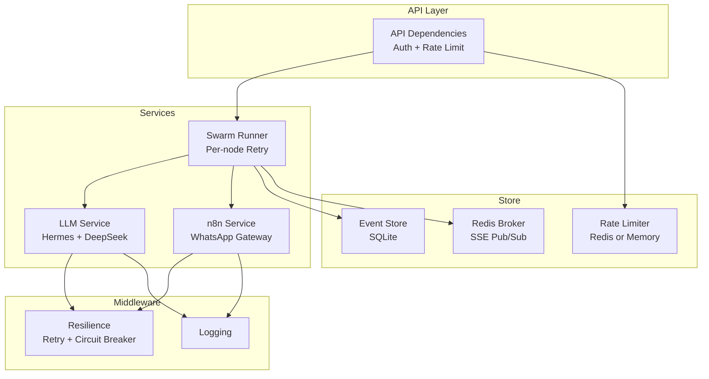

**Diagram sources**
- [resilience.py:25-80](file://travel-recovery-os/backend/middleware/resilience.py#L25-L80)
- [resilience.py:97-215](file://travel-recovery-os/backend/middleware/resilience.py#L97-L215)
- [llm_service.py:34-96](file://travel-recovery-os/backend/services/llm_service.py#L34-L96)
- [llm_service.py:126-205](file://travel-recovery-os/backend/services/llm_service.py#L126-L205)
- [n8n_service.py:51-182](file://travel-recovery-os/backend/services/n8n_service.py#L51-L182)
- [swarm_runner.py:36-216](file://travel-recovery-os/backend/services/swarm_runner.py#L36-L216)
- [event_store.py:47-101](file://travel-recovery-os/backend/store/event_store.py#L47-L101)
- [redis_broker.py:86-120](file://travel-recovery-os/backend/store/redis_broker.py#L86-L120)
- [rate_limiter.py:41-99](file://travel-recovery-os/backend/auth/rate_limiter.py#L41-L99)
- [dependencies.py:103-129](file://travel-recovery-os/backend/api/dependencies.py#L103-L129)
- [logging.py:37-99](file://travel-recovery-os/backend/middleware/logging.py#L37-L99)

**Section sources**
- [resilience.py:25-80](file://travel-recovery-os/backend/middleware/resilience.py#L25-L80)
- [resilience.py:97-215](file://travel-recovery-os/backend/middleware/resilience.py#L97-L215)
- [llm_service.py:34-96](file://travel-recovery-os/backend/services/llm_service.py#L34-L96)
- [llm_service.py:126-205](file://travel-recovery-os/backend/services/llm_service.py#L126-L205)
- [n8n_service.py:51-182](file://travel-recovery-os/backend/services/n8n_service.py#L51-L182)
- [swarm_runner.py:36-216](file://travel-recovery-os/backend/services/swarm_runner.py#L36-L216)
- [event_store.py:47-101](file://travel-recovery-os/backend/store/event_store.py#L47-L101)
- [redis_broker.py:86-120](file://travel-recovery-os/backend/store/redis_broker.py#L86-L120)
- [rate_limiter.py:41-99](file://travel-recovery-os/backend/auth/rate_limiter.py#L41-L99)
- [dependencies.py:103-129](file://travel-recovery-os/backend/api/dependencies.py#L103-L129)
- [logging.py:37-99](file://travel-recovery-os/backend/middleware/logging.py#L37-L99)

## Core Components
- Retry with exponential backoff: A generic async wrapper that retries failed operations with configurable delays and jitter, logging each attempt and surfacing the last exception after exhaustion.
- Circuit breaker: A stateful guard that fast-fails when a dependency is unhealthy, transitions to half-open for probing, and closes on success. Preconfigured instances exist for LLMs and webhooks.
- Graceful degradation: Deterministic fallbacks when LLMs or webhooks are unavailable, ensuring core workflows continue with reduced capability.
- Per-node retry and escalation: The swarm runner tracks node-level errors and escalates after exceeding a threshold, emitting telemetry at each step.
- Durable event persistence: SQLite stores webhook dispatches and disruption lifecycle states to support auditing and recovery.
- Rate limiting: Sliding window limiter using Redis or in-memory storage; returns standard headers and HTTP 429 when exceeded.
- Structured logging: Optional structlog pipeline with automatic fallback to stdlib logging.

**Section sources**
- [resilience.py:25-80](file://travel-recovery-os/backend/middleware/resilience.py#L25-L80)
- [resilience.py:97-215](file://travel-recovery-os/backend/middleware/resilience.py#L97-L215)
- [llm_service.py:34-96](file://travel-recovery-os/backend/services/llm_service.py#L34-L96)
- [llm_service.py:126-205](file://travel-recovery-os/backend/services/llm_service.py#L126-L205)
- [n8n_service.py:51-182](file://travel-recovery-os/backend/services/n8n_service.py#L51-L182)
- [swarm_runner.py:36-216](file://travel-recovery-os/backend/services/swarm_runner.py#L36-L216)
- [event_store.py:47-101](file://travel-recovery-os/backend/store/event_store.py#L47-L101)
- [rate_limiter.py:41-99](file://travel-recovery-os/backend/auth/rate_limiter.py#L41-L99)
- [logging.py:37-99](file://travel-recovery-os/backend/middleware/logging.py#L37-L99)

## Architecture Overview
The system applies resilience at multiple layers:
- External calls (LLMs, n8n webhooks) are wrapped with circuit breakers and retries.
- On failure, services fall back to deterministic logic or simulated modes.
- Errors are persisted and broadcast via SSE for visibility and recovery.
- API endpoints enforce rate limits and return consistent error shapes.

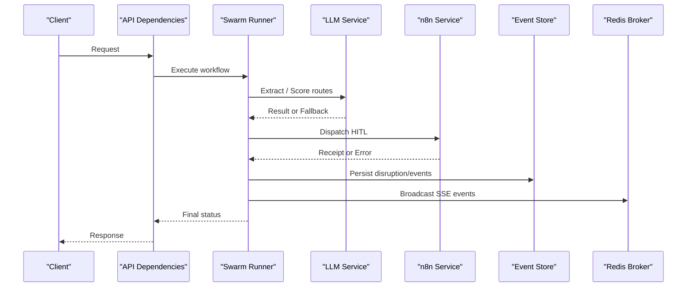

**Diagram sources**
- [swarm_runner.py:36-216](file://travel-recovery-os/backend/services/swarm_runner.py#L36-L216)
- [llm_service.py:34-96](file://travel-recovery-os/backend/services/llm_service.py#L34-L96)
- [llm_service.py:126-205](file://travel-recovery-os/backend/services/llm_service.py#L126-L205)
- [n8n_service.py:51-182](file://travel-recovery-os/backend/services/n8n_service.py#L51-L182)
- [event_store.py:166-239](file://travel-recovery-os/backend/store/event_store.py#L166-L239)
- [redis_broker.py:86-120](file://travel-recovery-os/backend/store/redis_broker.py#L86-L120)
- [dependencies.py:103-129](file://travel-recovery-os/backend/api/dependencies.py#L103-L129)

## Detailed Component Analysis

### Retry with Exponential Backoff
- Purpose: Temporarily failing operations are retried with increasing delays and optional jitter to avoid thundering herds.
- Behavior: Retries up to a configured limit, logs attempts, and raises the last exception if all attempts fail.
- Usage: Applied around LLM calls and webhook dispatches.

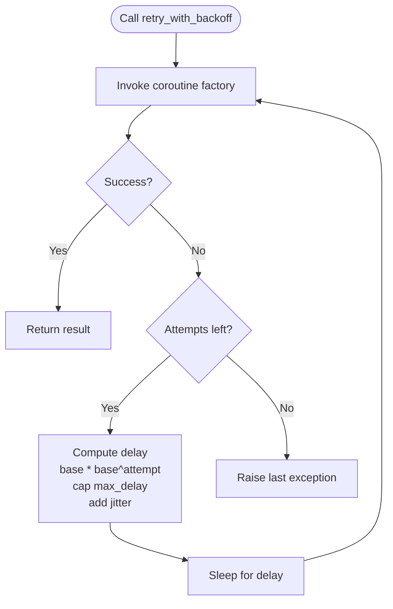

**Diagram sources**
- [resilience.py:25-80](file://travel-recovery-os/backend/middleware/resilience.py#L25-L80)

**Section sources**
- [resilience.py:25-80](file://travel-recovery-os/backend/middleware/resilience.py#L25-L80)

### Circuit Breaker
- States: CLOSED (normal), OPEN (fast-fail), HALF_OPEN (probe one request).
- Transitions: Failures increment count; reaching threshold opens the breaker. After cooldown, it moves to HALF_OPEN; a successful probe closes it; a failure reopens it.
- Prebuilt instances: Dedicated breakers for Hermes, DeepSeek, Atlas API, and n8n webhook.

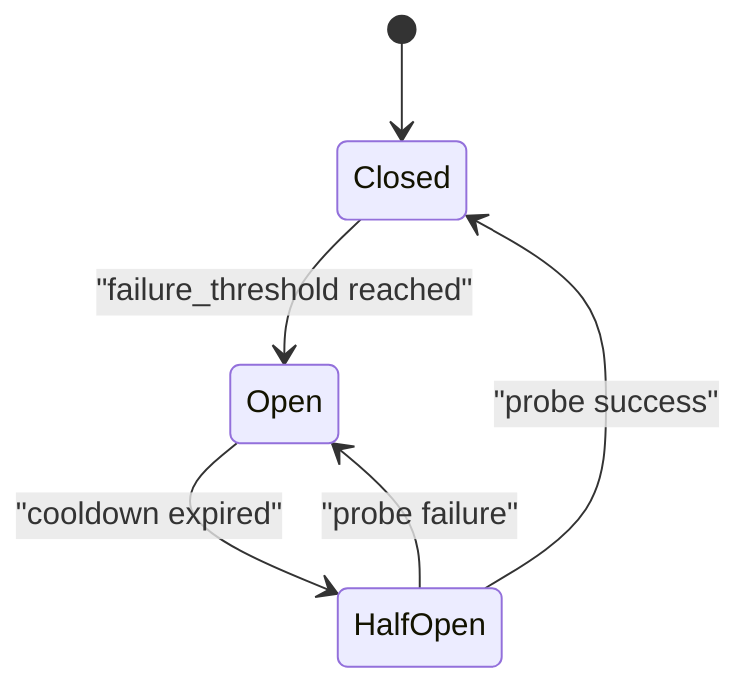

**Diagram sources**
- [resilience.py:97-215](file://travel-recovery-os/backend/middleware/resilience.py#L97-L215)

**Section sources**
- [resilience.py:97-215](file://travel-recovery-os/backend/middleware/resilience.py#L97-L215)

### LLM Orchestration with Fallbacks
- Hermes extraction: Wrapped with circuit breaker and retry; falls back to regex-based extraction when unavailable.
- DeepSeek scoring: Wrapped with circuit breaker and retry; falls back to deterministic arbiter when unavailable or misconfigured.
- Timeouts: HTTP clients use short timeouts to prevent long hangs.

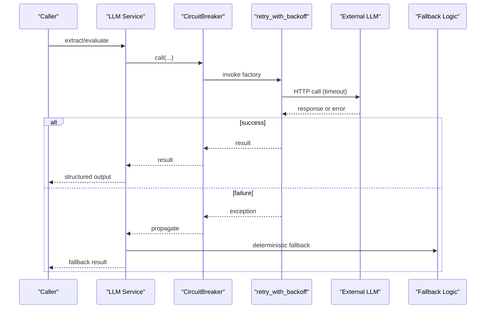

**Diagram sources**
- [llm_service.py:34-96](file://travel-recovery-os/backend/services/llm_service.py#L34-L96)
- [llm_service.py:126-205](file://travel-recovery-os/backend/services/llm_service.py#L126-L205)
- [resilience.py:97-215](file://travel-recovery-os/backend/middleware/resilience.py#L97-L215)
- [resilience.py:25-80](file://travel-recovery-os/backend/middleware/resilience.py#L25-L80)

**Section sources**
- [llm_service.py:34-96](file://travel-recovery-os/backend/services/llm_service.py#L34-L96)
- [llm_service.py:126-205](file://travel-recovery-os/backend/services/llm_service.py#L126-L205)

### n8n Webhook Dispatch with Resilience
- Wraps outbound webhook calls with circuit breaker and retry.
- Persists every attempt (success/failure/error) to SQLite for auditability.
- Returns a receipt including status, latency, and payload snapshot.

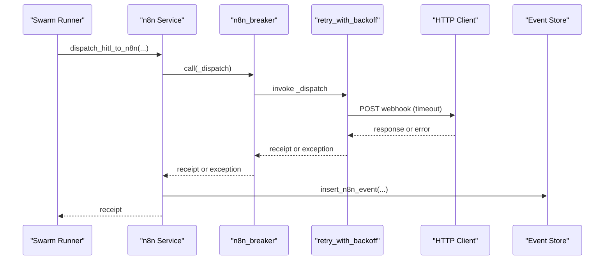

**Diagram sources**
- [n8n_service.py:51-182](file://travel-recovery-os/backend/services/n8n_service.py#L51-L182)
- [event_store.py:107-141](file://travel-recovery-os/backend/store/event_store.py#L107-L141)
- [resilience.py:25-80](file://travel-recovery-os/backend/middleware/resilience.py#L25-L80)
- [resilience.py:97-215](file://travel-recovery-os/backend/middleware/resilience.py#L97-L215)

**Section sources**
- [n8n_service.py:51-182](file://travel-recovery-os/backend/services/n8n_service.py#L51-L182)
- [event_store.py:107-141](file://travel-recovery-os/backend/store/event_store.py#L107-L141)

### Swarm Pipeline Error Handling and Escalation
- Tracks per-node errors and increments retry counters.
- Emits telemetry for each error and escalation.
- Persists final outcome or error state to SQLite and broadcasts completion/error events.

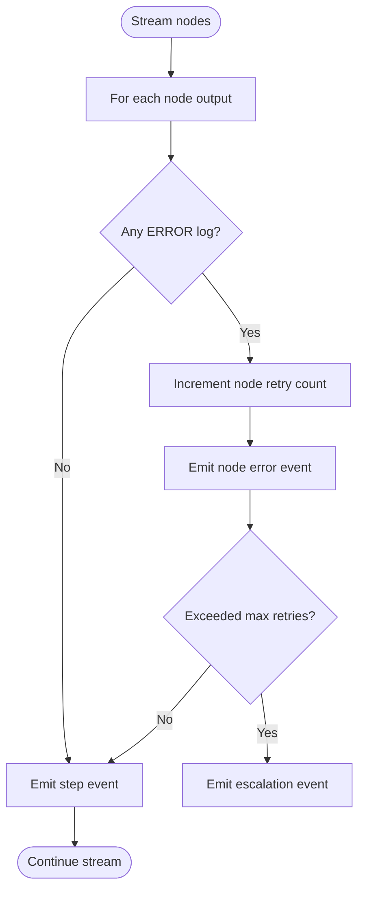

**Diagram sources**
- [swarm_runner.py:71-131](file://travel-recovery-os/backend/services/swarm_runner.py#L71-L131)

**Section sources**
- [swarm_runner.py:71-131](file://travel-recovery-os/backend/services/swarm_runner.py#L71-L131)

### Durable Event Persistence and Recovery
- SQLite tables store webhook events and disruption lifecycle data.
- Functions provide upsert/update/query capabilities for history and analytics.
- Enables post-mortem analysis and recovery actions.

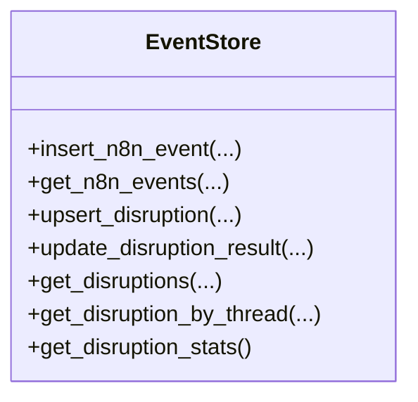

**Diagram sources**
- [event_store.py:107-141](file://travel-recovery-os/backend/store/event_store.py#L107-L141)
- [event_store.py:166-239](file://travel-recovery-os/backend/store/event_store.py#L166-L239)
- [event_store.py:242-335](file://travel-recovery-os/backend/store/event_store.py#L242-L335)

**Section sources**
- [event_store.py:107-141](file://travel-recovery-os/backend/store/event_store.py#L107-L141)
- [event_store.py:166-239](file://travel-recovery-os/backend/store/event_store.py#L166-L239)
- [event_store.py:242-335](file://travel-recovery-os/backend/store/event_store.py#L242-L335)

### Real-Time Telemetry with Fallback
- Broadcasts events to connected clients via Redis Streams and Pub/Sub.
- Falls back to in-memory queues/history when Redis is unavailable.
- Provides subscription APIs for SSE consumers.

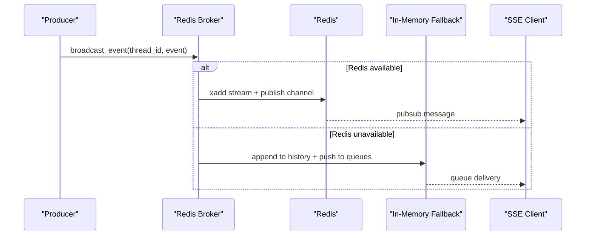

**Diagram sources**
- [redis_broker.py:86-120](file://travel-recovery-os/backend/store/redis_broker.py#L86-L120)
- [redis_broker.py:123-150](file://travel-recovery-os/backend/store/redis_broker.py#L123-L150)

**Section sources**
- [redis_broker.py:86-120](file://travel-recovery-os/backend/store/redis_broker.py#L86-L120)
- [redis_broker.py:123-150](file://travel-recovery-os/backend/store/redis_broker.py#L123-L150)

### Rate Limiting and Failure Isolation
- Sliding window limiter supports Redis-backed or in-memory modes.
- Returns structured results with remaining quota and retry-after hints.
- API dependency enforces limits and returns HTTP 429 with appropriate headers.

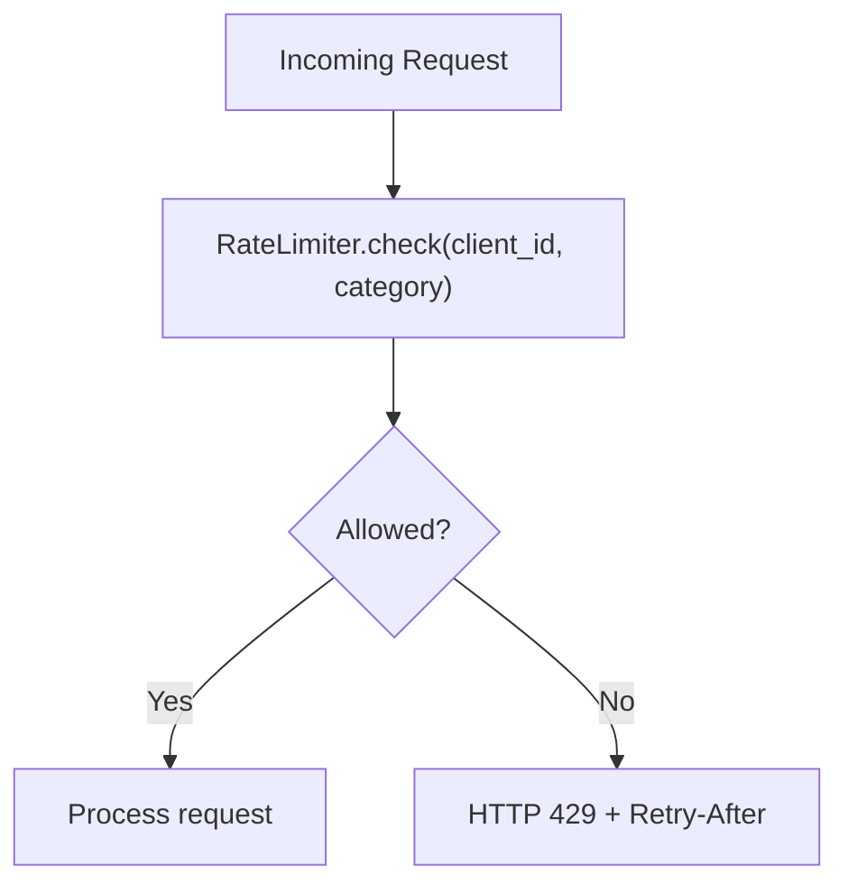

**Diagram sources**
- [rate_limiter.py:41-99](file://travel-recovery-os/backend/auth/rate_limiter.py#L41-L99)
- [dependencies.py:103-129](file://travel-recovery-os/backend/api/dependencies.py#L103-L129)

**Section sources**
- [rate_limiter.py:41-99](file://travel-recovery-os/backend/auth/rate_limiter.py#L41-L99)
- [dependencies.py:103-129](file://travel-recovery-os/backend/api/dependencies.py#L103-L129)

### Observability and Logging
- Structured logging with optional JSON rendering and context binding.
- Gracefully falls back to stdlib logging when advanced features are unavailable.
- Supports contextual fields like thread_id and PNR for traceability.

**Section sources**
- [logging.py:37-99](file://travel-recovery-os/backend/middleware/logging.py#L37-L99)
- [logging.py:107-147](file://travel-recovery-os/backend/middleware/logging.py#L107-L147)

## Dependency Analysis
- Services depend on middleware primitives for resilience.
- Store layer is independent and used by services for persistence.
- API layer composes auth, scope checks, and rate limiting before invoking services.
- Redis broker abstracts transport and provides fallback behavior transparently.

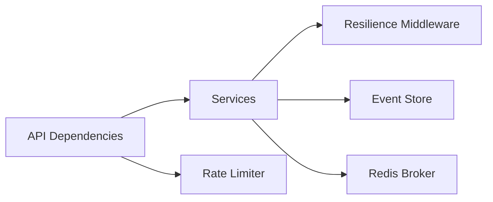

**Diagram sources**
- [dependencies.py:103-129](file://travel-recovery-os/backend/api/dependencies.py#L103-L129)
- [llm_service.py:34-96](file://travel-recovery-os/backend/services/llm_service.py#L34-L96)
- [n8n_service.py:51-182](file://travel-recovery-os/backend/services/n8n_service.py#L51-L182)
- [resilience.py:25-80](file://travel-recovery-os/backend/middleware/resilience.py#L25-L80)
- [event_store.py:107-141](file://travel-recovery-os/backend/store/event_store.py#L107-L141)
- [redis_broker.py:86-120](file://travel-recovery-os/backend/store/redis_broker.py#L86-L120)

**Section sources**
- [dependencies.py:103-129](file://travel-recovery-os/backend/api/dependencies.py#L103-L129)
- [llm_service.py:34-96](file://travel-recovery-os/backend/services/llm_service.py#L34-L96)
- [n8n_service.py:51-182](file://travel-recovery-os/backend/services/n8n_service.py#L51-L182)
- [resilience.py:25-80](file://travel-recovery-os/backend/middleware/resilience.py#L25-L80)
- [event_store.py:107-141](file://travel-recovery-os/backend/store/event_store.py#L107-L141)
- [redis_broker.py:86-120](file://travel-recovery-os/backend/store/redis_broker.py#L86-L120)

## Performance Considerations
- Use short timeouts for external calls to bound latency and free resources quickly.
- Apply jitter to retries to reduce contention during outages.
- Prefer circuit breakers over aggressive retries to protect downstream systems.
- Persist only essential metadata to minimize I/O overhead.
- Use Redis-backed rate limiting in multi-instance deployments to ensure global fairness.

[No sources needed since this section provides general guidance]

## Troubleshooting Guide
- Symptom: Repeated failures to LLM or webhook.
  - Check circuit breaker state and cooldown; verify thresholds and configuration.
  - Inspect retry logs for attempt counts and delays.
  - Confirm fallback paths executed and review stored receipts.
- Symptom: Requests blocked by rate limiter.
  - Review client identity and category; check remaining quota and Retry-After header.
  - Validate Redis connectivity or confirm in-memory mode behavior.
- Symptom: Missing telemetry or history.
  - Verify Redis availability; confirm fallback to in-memory queues/history.
  - Query SQLite tables for persisted events and disruption records.
- Symptom: Workflow stalls or errors.
  - Inspect per-node error events and escalation signals from the swarm runner.
  - Check final disruption status and error_state in the event store.

**Section sources**
- [resilience.py:25-80](file://travel-recovery-os/backend/middleware/resilience.py#L25-L80)
- [resilience.py:97-215](file://travel-recovery-os/backend/middleware/resilience.py#L97-L215)
- [n8n_service.py:51-182](file://travel-recovery-os/backend/services/n8n_service.py#L51-L182)
- [event_store.py:107-141](file://travel-recovery-os/backend/store/event_store.py#L107-L141)
- [event_store.py:166-239](file://travel-recovery-os/backend/store/event_store.py#L166-L239)
- [redis_broker.py:86-120](file://travel-recovery-os/backend/store/redis_broker.py#L86-L120)
- [rate_limiter.py:41-99](file://travel-recovery-os/backend/auth/rate_limiter.py#L41-L99)
- [dependencies.py:103-129](file://travel-recovery-os/backend/api/dependencies.py#L103-L129)

## Conclusion
The system implements robust resilience through layered patterns: retry with backoff, circuit breakers, timeouts, and graceful degradation. Errors are propagated consistently, isolated via circuit breakers and rate limits, and recorded durably for recovery and analysis. These practices collectively improve availability and user experience under adverse conditions while preserving operational insight.

[No sources needed since this section summarizes without analyzing specific files]