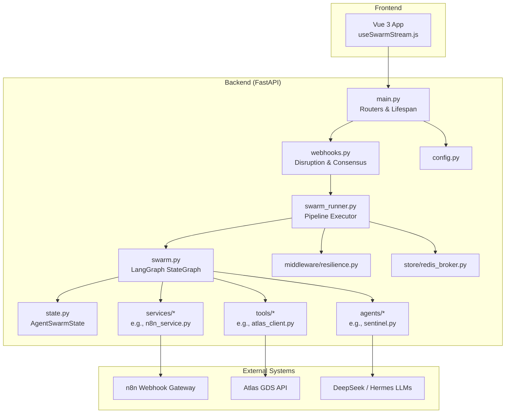
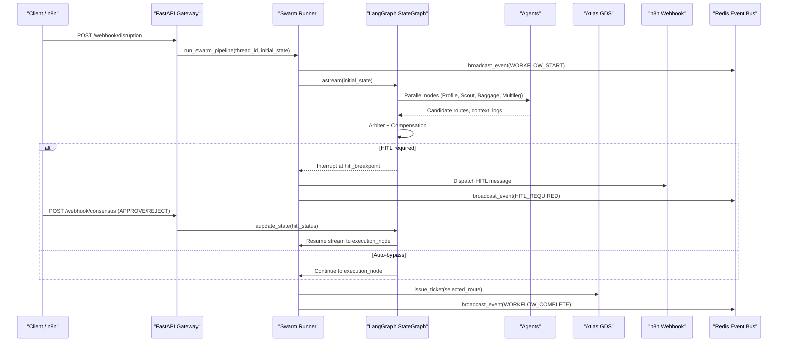
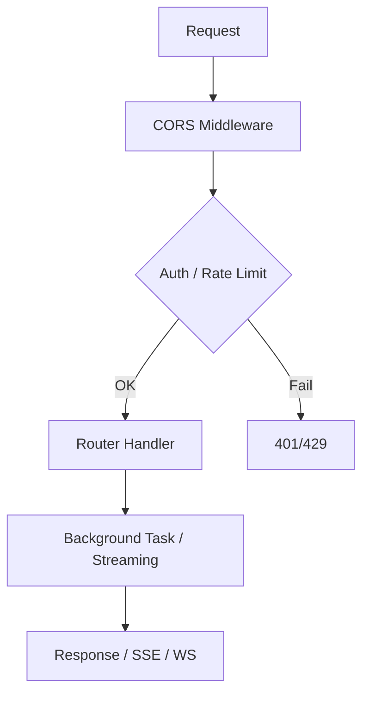
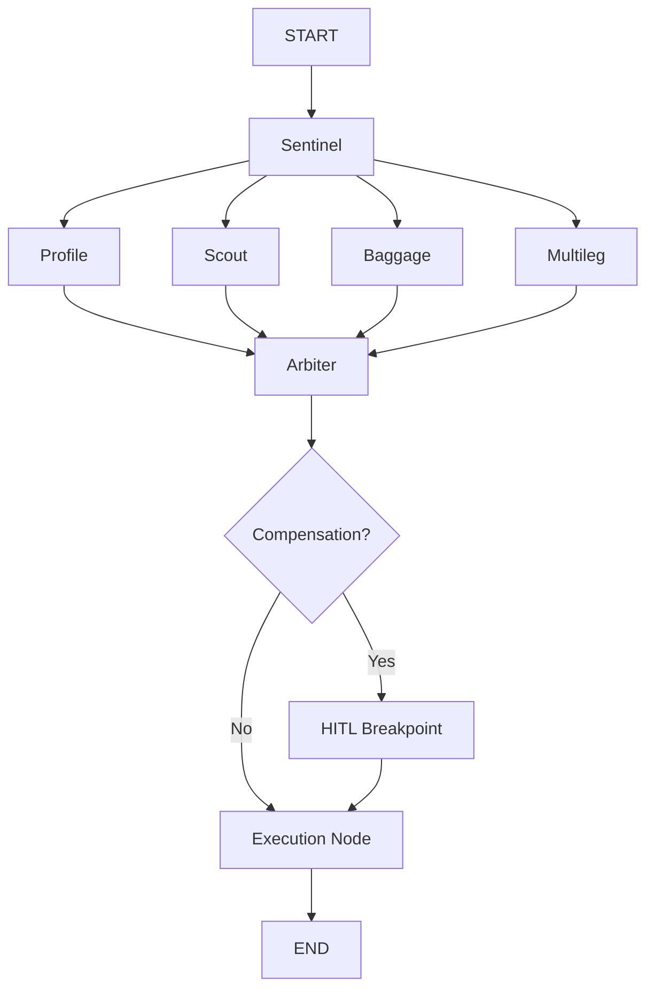
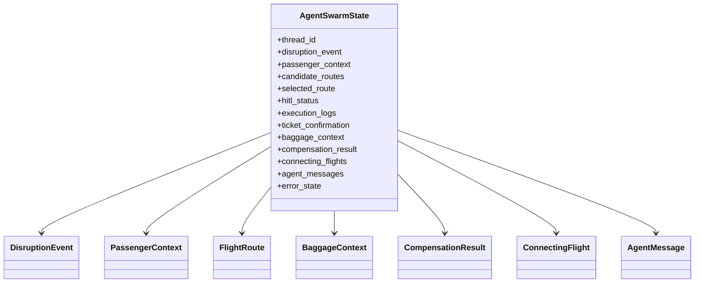
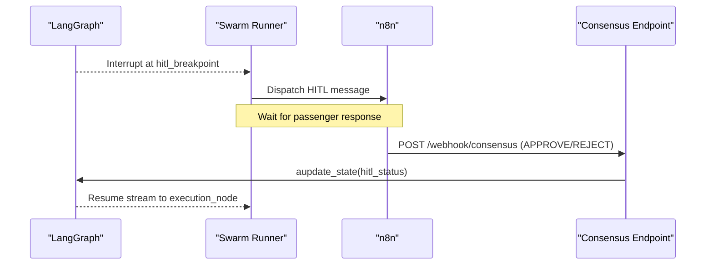
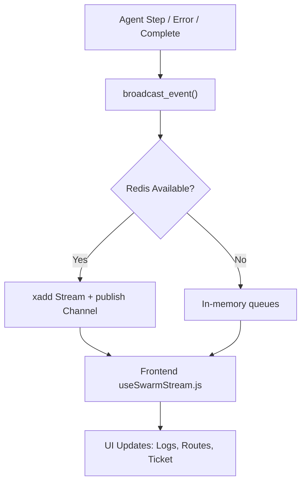
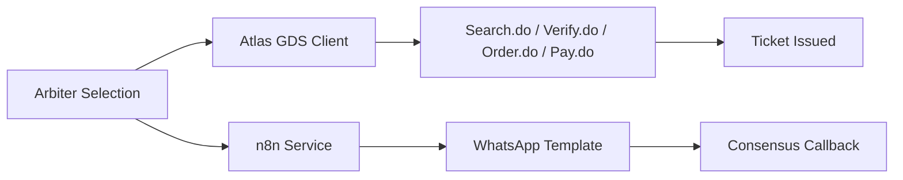
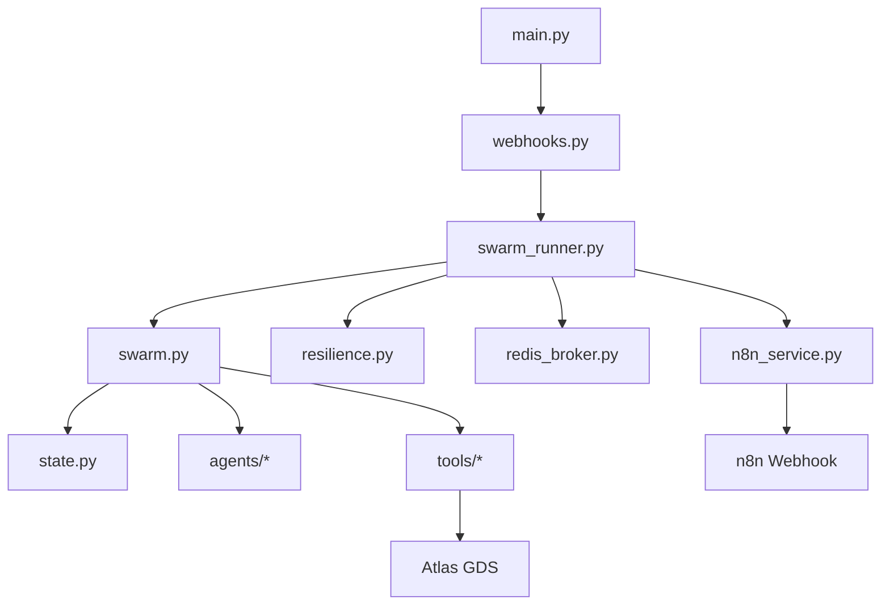

# System Architecture

<cite>
**Referenced Files in This Document**
- [main.py](file://travel-recovery-os/backend/main.py)
- [swarm.py](file://travel-recovery-os/backend/swarm.py)
- [state.py](file://travel-recovery-os/backend/state.py)
- [webhooks.py](file://travel-recovery-os/backend/api/routers/webhooks.py)
- [swarm_runner.py](file://travel-recovery-os/backend/services/swarm_runner.py)
- [sentinel.py](file://travel-recovery-os/backend/agents/sentinel.py)
- [atlas_client.py](file://travel-recovery-os/backend/tools/atlas_client.py)
- [n8n_service.py](file://travel-recovery-os/backend/services/n8n_service.py)
- [resilience.py](file://travel-recovery-os/backend/middleware/resilience.py)
- [redis_broker.py](file://travel-recovery-os/backend/store/redis_broker.py)
- [config.py](file://travel-recovery-os/backend/config.py)
- [useSwarmStream.js](file://travel-recovery-os/frontend/src/composables/useSwarmStream.js)
- [docker-compose.yml](file://travel-recovery-os/docker-compose.yml)
- [README.md](file://travel-recovery-os/README.md)
</cite>

## Table of Contents
1. Introduction
2. Project Structure
3. Core Components
4. Architecture Overview
5. Detailed Component Analysis
6. Dependency Analysis
7. Performance Considerations
8. Troubleshooting Guide
9. Conclusion
10. Appendices

## Introduction
SynapseAir is an autonomous multi-agent orchestration system for flight disruption recovery. It ingests disruption signals, runs a LangGraph StateGraph swarm of specialized agents, and executes rebooking via an external GDS (Atlas). Real-time telemetry streams to a Vue 3 command center, while human-in-the-loop consent flows through n8n and WhatsApp. The system emphasizes event-driven microservices, durable stateful orchestration, and resilient integrations with LLM providers and external systems.

## Project Structure
The repository is organized into:
- Backend (FastAPI): API gateway, routers, services, agents, tools, middleware, store, and configuration
- Frontend (Vue 3): Command center UI with real-time streaming composable
- n8n workflows: HITL messaging and consensus routing
- Docker Compose: Local deployment topology including Redis, backend, frontend, and n8n

**Diagram sources**
- [main.py:22-113](file://travel-recovery-os/backend/main.py#L22-L113)
- [webhooks.py:14-72](file://travel-recovery-os/backend/api/routers/webhooks.py#L14-L72)
- [swarm_runner.py:36-216](file://travel-recovery-os/backend/services/swarm_runner.py#L36-L216)
- [swarm.py:162-231](file://travel-recovery-os/backend/swarm.py#L162-L231)
- [state.py:130-167](file://travel-recovery-os/backend/state.py#L130-L167)
- [sentinel.py:34-91](file://travel-recovery-os/backend/agents/sentinel.py#L34-L91)
- [atlas_client.py:175-219](file://travel-recovery-os/backend/tools/atlas_client.py#L175-L219)
- [n8n_service.py:51-202](file://travel-recovery-os/backend/services/n8n_service.py#L51-L202)
- [redis_broker.py:86-150](file://travel-recovery-os/backend/store/redis_broker.py#L86-L150)
- [config.py:29-116](file://travel-recovery-os/backend/config.py#L29-L116)

**Section sources**
- [main.py:22-113](file://travel-recovery-os/backend/main.py#L22-L113)
- [docker-compose.yml:1-71](file://travel-recovery-os/docker-compose.yml#L1-L71)
- [README.md:88-127](file://travel-recovery-os/README.md#L88-L127)

## Core Components
- FastAPI Gateway: Application lifespan, CORS, router registration, health endpoint
- LangGraph Swarm Orchestrator: StateGraph with parallel fan-out, conditional routing, checkpointing, and interrupt before HITL
- Specialized Agents: Sentinel (parsing), Profile (SLA), Scout (GDS search), Baggage (transfer), Multileg (connections), Arbiter (reasoning), Compensation (rights), Execution (ticketing)
- External Integrations: Atlas GDS client, n8n webhook gateway, LLM providers (DeepSeek/Hermes)
- Real-Time Telemetry: Redis-backed SSE/WS event bus with fallback
- Configuration: Pydantic settings for environment profiles and secrets

**Section sources**
- [main.py:22-122](file://travel-recovery-os/backend/main.py#L22-L122)
- [swarm.py:162-231](file://travel-recovery-os/backend/swarm.py#L162-L231)
- [state.py:130-167](file://travel-recovery-os/backend/state.py#L130-L167)
- [config.py:29-116](file://travel-recovery-os/backend/config.py#L29-L116)

## Architecture Overview
SynapseAir uses an event-driven architecture:
- Ingestion: Webhook endpoints accept structured or raw disruption payloads
- Orchestration: LangGraph StateGraph coordinates parallel agent execution with durable checkpoints
- Decision: Arbiter synthesizes candidate routes and constraints; Compensation evaluates rights
- Consent: Optional HITL pause with n8n WhatsApp dispatch; resume updates graph state
- Execution: Final ticket issuance via Atlas GDS
- Telemetry: Real-time events streamed to the Vue 3 command center via Redis Pub/Sub and Streams

**Diagram sources**
- [webhooks.py:14-185](file://travel-recovery-os/backend/api/routers/webhooks.py#L14-L185)
- [swarm_runner.py:36-216](file://travel-recovery-os/backend/services/swarm_runner.py#L36-L216)
- [swarm.py:162-231](file://travel-recovery-os/backend/swarm.py#L162-L231)
- [n8n_service.py:51-202](file://travel-recovery-os/backend/services/n8n_service.py#L51-L202)
- [atlas_client.py:222-357](file://travel-recovery-os/backend/tools/atlas_client.py#L222-L357)
- [redis_broker.py:86-150](file://travel-recovery-os/backend/store/redis_broker.py#L86-L150)

## Detailed Component Analysis

### FastAPI Gateway and Routers
- Lifespan initializes logging and tracing, registers routers, configures CORS for the Vue 3 app, and exposes a health endpoint
- Routers include webhooks, telemetry, history, websocket, system, and tests (non-production)

**Diagram sources**
- [main.py:22-122](file://travel-recovery-os/backend/main.py#L22-L122)
- [webhooks.py:14-72](file://travel-recovery-os/backend/api/routers/webhooks.py#L14-L72)

**Section sources**
- [main.py:22-122](file://travel-recovery-os/backend/main.py#L22-L122)
- [webhooks.py:14-72](file://travel-recovery-os/backend/api/routers/webhooks.py#L14-L72)

### LangGraph Swarm Orchestrator
- Builds a StateGraph with START -> Sentinel -> parallel Profile/Scout/Baggage/Multileg -> Arbiter -> Compensation -> HITL/Execution -> END
- Uses SQLite checkpointer and interrupts before hitl_breakpoint for durable HITL
- Conditional routing based on hitl_status and compensation_result

**Diagram sources**
- [swarm.py:162-231](file://travel-recovery-os/backend/swarm.py#L162-L231)

**Section sources**
- [swarm.py:162-231](file://travel-recovery-os/backend/swarm.py#L162-L231)
- [state.py:130-167](file://travel-recovery-os/backend/state.py#L130-L167)

### Agent Nodes and Data Flow
- Sentinel parses raw text via Hermes if provided, validates fields, emits logs
- Profile resolves loyalty and SLA constraints
- Scout queries Atlas GDS for candidate routes
- Baggage evaluates transfer feasibility
- Multileg checks connection viability
- Arbiter scores and selects optimal route
- Compensation calculates passenger rights
- Execution issues ticket via Atlas

**Diagram sources**
- [state.py:20-167](file://travel-recovery-os/backend/state.py#L20-L167)

**Section sources**
- [sentinel.py:34-91](file://travel-recovery-os/backend/agents/sentinel.py#L34-L91)
- [atlas_client.py:175-219](file://travel-recovery-os/backend/tools/atlas_client.py#L175-L219)
- [state.py:20-167](file://travel-recovery-os/backend/state.py#L20-L167)

### Human-in-the-Loop (HITL) Flow
- Graph pauses at hitl_breakpoint; runner dispatches HITL payload to n8n
- Passenger responds via WhatsApp; n8n calls consensus endpoint
- Graph resumes with updated hitl_status and proceeds to execution

**Diagram sources**
- [swarm_runner.py:133-176](file://travel-recovery-os/backend/services/swarm_runner.py#L133-L176)
- [webhooks.py:74-185](file://travel-recovery-os/backend/api/routers/webhooks.py#L74-L185)
- [n8n_service.py:51-202](file://travel-recovery-os/backend/services/n8n_service.py#L51-L202)

**Section sources**
- [webhooks.py:74-185](file://travel-recovery-os/backend/api/routers/webhooks.py#L74-L185)
- [swarm_runner.py:133-176](file://travel-recovery-os/backend/services/swarm_runner.py#L133-L176)
- [n8n_service.py:51-202](file://travel-recovery-os/backend/services/n8n_service.py#L51-L202)

### Real-Time Telemetry and Command Center
- Backend broadcasts events via Redis Pub/Sub and Streams with in-memory fallback
- Frontend composable connects via WebSocket/SSE, handles agent steps, HITL, and completion

**Diagram sources**
- [redis_broker.py:86-150](file://travel-recovery-os/backend/store/redis_broker.py#L86-L150)
- [useSwarmStream.js:98-257](file://travel-recovery-os/frontend/src/composables/useSwarmStream.js#L98-L257)

**Section sources**
- [redis_broker.py:86-150](file://travel-recovery-os/backend/store/redis_broker.py#L86-L150)
- [useSwarmStream.js:98-257](file://travel-recovery-os/frontend/src/composables/useSwarmStream.js#L98-L257)

### External Integrations
- Atlas GDS: Search, verify, order, pay, query lifecycle with circuit breaker and retry; sandbox fallback when needed
- n8n: Structured HITL payload with quick replies and callback URLs; durable SQLite audit trail
- LLM Providers: DeepSeek for reasoning and Hermes for parsing; configured via settings

**Diagram sources**
- [atlas_client.py:175-357](file://travel-recovery-os/backend/tools/atlas_client.py#L175-L357)
- [n8n_service.py:51-202](file://travel-recovery-os/backend/services/n8n_service.py#L51-L202)
- [config.py:46-70](file://travel-recovery-os/backend/config.py#L46-L70)

**Section sources**
- [atlas_client.py:175-357](file://travel-recovery-os/backend/tools/atlas_client.py#L175-L357)
- [n8n_service.py:51-202](file://travel-recovery-os/backend/services/n8n_service.py#L51-L202)
- [config.py:46-70](file://travel-recovery-os/backend/config.py#L46-L70)

## Dependency Analysis
Key dependencies and coupling:
- FastAPI depends on routers and middleware; routers depend on services and state
- Swarm orchestrator depends on agents, tools, and checkpointer
- Services depend on resilience patterns and external APIs
- Frontend depends on backend streaming endpoints and REST APIs

**Diagram sources**
- [main.py:22-113](file://travel-recovery-os/backend/main.py#L22-L113)
- [webhooks.py:14-72](file://travel-recovery-os/backend/api/routers/webhooks.py#L14-L72)
- [swarm_runner.py:36-216](file://travel-recovery-os/backend/services/swarm_runner.py#L36-L216)
- [swarm.py:162-231](file://travel-recovery-os/backend/swarm.py#L162-L231)
- [state.py:130-167](file://travel-recovery-os/backend/state.py#L130-L167)
- [resilience.py:221-244](file://travel-recovery-os/backend/middleware/resilience.py#L221-L244)
- [redis_broker.py:86-150](file://travel-recovery-os/backend/store/redis_broker.py#L86-L150)
- [atlas_client.py:175-357](file://travel-recovery-os/backend/tools/atlas_client.py#L175-L357)
- [n8n_service.py:51-202](file://travel-recovery-os/backend/services/n8n_service.py#L51-L202)

**Section sources**
- [main.py:22-113](file://travel-recovery-os/backend/main.py#L22-L113)
- [swarm_runner.py:36-216](file://travel-recovery-os/backend/services/swarm_runner.py#L36-L216)
- [resilience.py:221-244](file://travel-recovery-os/backend/middleware/resilience.py#L221-L244)

## Performance Considerations
- Parallel agent execution reduces end-to-end latency by evaluating profile, scout, baggage, and multileg concurrently
- Redis-backed event bus provides scalable fan-out and durable history with TTL
- Circuit breakers and exponential backoff protect against external service failures and thundering herds
- In-memory fallback ensures availability when Redis is unavailable
- Atlas client caches search results briefly to reduce repeated queries

[No sources needed since this section provides general guidance]

## Troubleshooting Guide
Common issues and strategies:
- Missing thread session: Consensus endpoint returns 404 if no active state; ensure thread_id matches and graph was interrupted
- External service failures: Circuit breakers open after threshold; monitor logs and rely on fallbacks (sandbox for Atlas, simulated n8n)
- Redis unavailability: Event bus falls back to in-memory queues; confirm USE_REDIS flag and connectivity
- Production configuration warnings: Settings validator warns about missing critical keys; set SYNAPSE_API_SECRET, DEEPSEEK_API_KEY, JWT_SECRET_KEY, REDIS_URL

**Section sources**
- [webhooks.py:84-114](file://travel-recovery-os/backend/api/routers/webhooks.py#L84-L114)
- [resilience.py:97-213](file://travel-recovery-os/backend/middleware/resilience.py#L97-L213)
- [redis_broker.py:42-62](file://travel-recovery-os/backend/store/redis_broker.py#L42-L62)
- [config.py:92-112](file://travel-recovery-os/backend/config.py#L92-L112)

## Conclusion
SynapseAir combines event-driven ingestion, stateful LangGraph orchestration, and resilient integrations to deliver rapid, automated flight disruption recovery. Its design supports scalability through parallel processing, durable checkpoints, and robust error handling. The Vue 3 command center provides real-time visibility and control, while n8n enables frictionless passenger consent.

[No sources needed since this section summarizes without analyzing specific files]

## Appendices

### Infrastructure Requirements
- Python 3.10+, Node.js 18+
- Redis (optional but recommended for production)
- Atlas GDS credentials and endpoints
- LLM provider keys (DeepSeek/Hermes)
- n8n instance for WhatsApp gateway

**Section sources**
- [README.md:360-395](file://travel-recovery-os/README.md#L360-L395)
- [docker-compose.yml:1-71](file://travel-recovery-os/docker-compose.yml#L1-L71)
- [config.py:29-116](file://travel-recovery-os/backend/config.py#L29-L116)

### Deployment Topology
- Docker Compose services: Redis, Backend (FastAPI), Frontend (nginx), n8n
- Health checks and dependency ordering ensure stable startup

**Section sources**
- [docker-compose.yml:1-71](file://travel-recovery-os/docker-compose.yml#L1-L71)