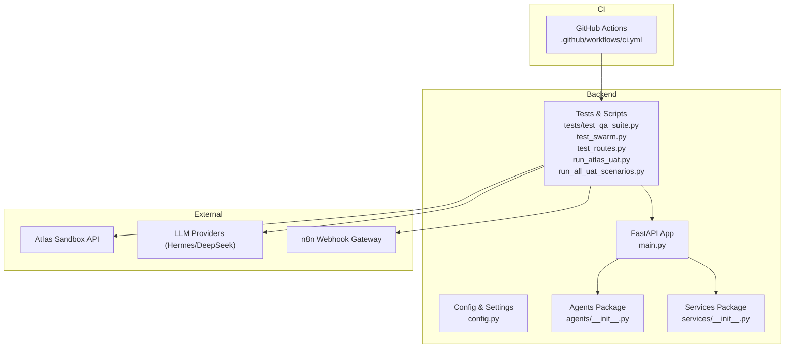
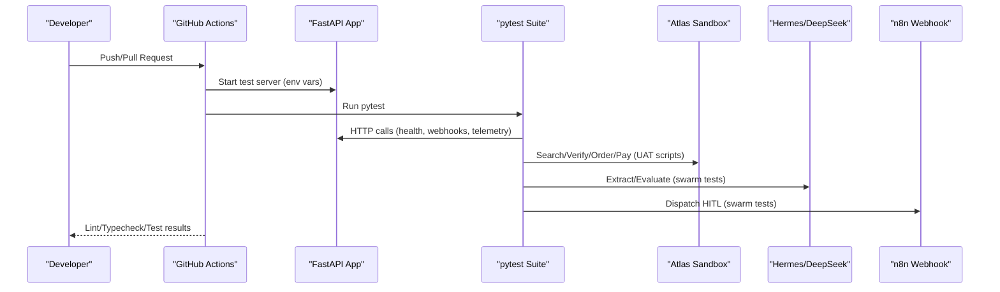
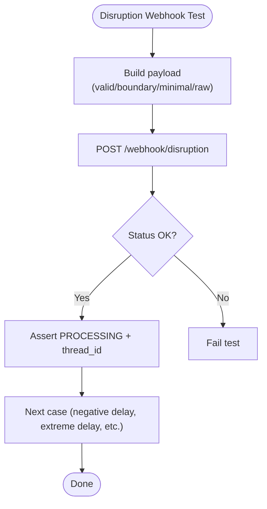
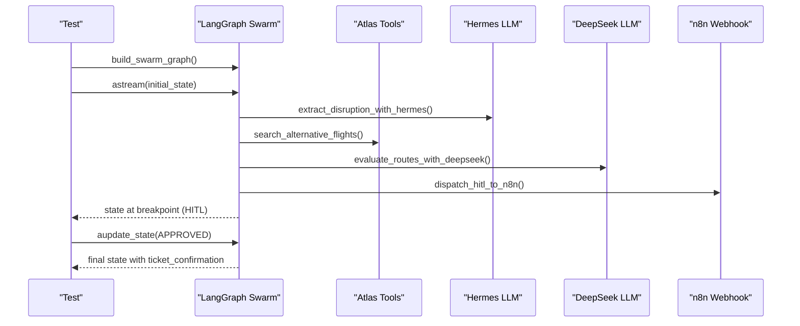
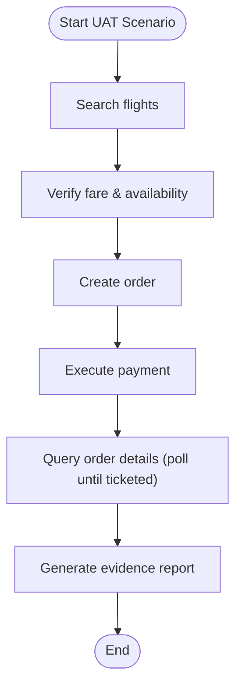
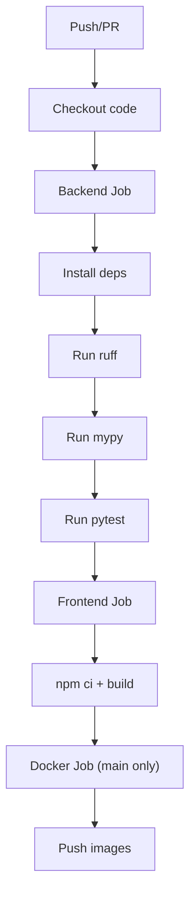
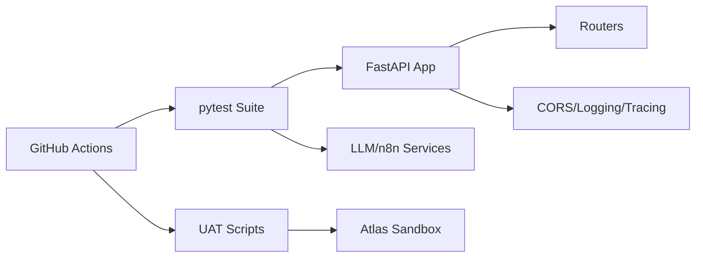

# Testing Strategy

<cite>
**Referenced Files in This Document**
- [main.py](file://travel-recovery-os/backend/main.py)
- [config.py](file://travel-recovery-os/backend/config.py)
- [requirements.txt](file://travel-recovery-os/backend/requirements.txt)
- [test_qa_suite.py](file://travel-recovery-os/backend/tests/test_qa_suite.py)
- [test_swarm.py](file://travel-recovery-os/backend/test_swarm.py)
- [test_routes.py](file://travel-recovery-os/backend/test_routes.py)
- [run_atlas_uat.py](file://travel-recovery-os/backend/run_atlas_uat.py)
- [run_all_uat_scenarios.py](file://travel-recovery-os/backend/run_all_uat_scenarios.py)
- [ci.yml](file://travel-recovery-os/.github/workflows/ci.yml)
- [agents/__init__.py](file://travel-recovery-os/backend/agents/__init__.py)
- [services/__init__.py](file://travel-recovery-os/backend/services/__init__.py)
- [Atlas_UAT_Environment.json](file://Atlas_UAT_Environment (2).json)
- [Atlas_UAT_HappyPath.postman_collection.json](file://Atlas_UAT_HappyPath.postman_collection (2).json)
</cite>

## Table of Contents
1. Introduction
2. Project Structure
3. Core Components
4. Architecture Overview
5. Detailed Component Analysis
6. Dependency Analysis
7. Performance Considerations
8. Troubleshooting Guide
9. Conclusion
10. Appendices

## Introduction
This document defines the comprehensive testing strategy for the SynapseAir platform, covering unit tests for agents and services, API endpoint validation, integration tests for multi-agent workflows, external service mocking strategies, end-to-end scenario validation, user acceptance testing (UAT), test data management, environment setup, and continuous integration pipelines. It consolidates existing pytest suites, UAT automation scripts, and CI configuration into a single, actionable guide.

## Project Structure
The testing surface spans multiple layers:
- Unit and integration tests under backend/tests and backend root-level test files
- UAT automation scripts that exercise the Atlas Sandbox booking flow
- CI pipeline orchestrating linting, type checks, and pytest execution
- Configuration and environment definitions to support consistent test runs

**Diagram sources**
- [main.py:40-113](file://travel-recovery-os/backend/main.py#L40-L113)
- [config.py:29-77](file://travel-recovery-os/backend/config.py#L29-L77)
- [agents/__init__.py:1-18](file://travel-recovery-os/backend/agents/__init__.py#L1-L18)
- [services/__init__.py:1-9](file://travel-recovery-os/backend/services/__init__.py#L1-L9)
- [test_qa_suite.py:1-244](file://travel-recovery-os/backend/tests/test_qa_suite.py#L1-L244)
- [test_swarm.py:1-144](file://travel-recovery-os/backend/test_swarm.py#L1-L144)
- [test_routes.py:1-80](file://travel-recovery-os/backend/test_routes.py#L1-L80)
- [run_atlas_uat.py:1-302](file://travel-recovery-os/backend/run_atlas_uat.py#L1-L302)
- [run_all_uat_scenarios.py:1-348](file://travel-recovery-os/backend/run_all_uat_scenarios.py#L1-L348)
- [ci.yml:1-99](file://travel-recovery-os/.github/workflows/ci.yml#L1-L99)

**Section sources**
- [main.py:40-113](file://travel-recovery-os/backend/main.py#L40-L113)
- [config.py:29-77](file://travel-recovery-os/backend/config.py#L29-L77)
- [requirements.txt:1-23](file://travel-recovery-os/backend/requirements.txt#L1-L23)

## Core Components
- FastAPI application with routers for system, webhooks, telemetry, history, websocket, and optional tests endpoints; includes CORS and lifespan hooks for logging/tracing.
- Centralized settings via Pydantic BaseSettings for environment-specific configuration and production safety checks.
- Agents package exposing specialized nodes (sentinel, profile, scout, arbiter, baggage, compensation, multileg).
- Services package providing LLM extraction/evaluation and n8n webhook dispatch.
- Test suites:
  - API integration tests using httpx and pytest-asyncio against a running backend instance.
  - Swarm integration tests exercising LangGraph graph state transitions and HITL flows.
  - External route verification against Atlas Sandbox.
  - UAT automation scripts executing full booking flows and generating evidence reports.

**Section sources**
- [main.py:40-113](file://travel-recovery-os/backend/main.py#L40-L113)
- [config.py:29-112](file://travel-recovery-os/backend/config.py#L29-L112)
- [agents/__init__.py:1-18](file://travel-recovery-os/backend/agents/__init__.py#L1-L18)
- [services/__init__.py:1-9](file://travel-recovery-os/backend/services/__init__.py#L1-L9)
- [test_qa_suite.py:1-244](file://travel-recovery-os/backend/tests/test_qa_suite.py#L1-L244)
- [test_swarm.py:1-144](file://travel-recovery-os/backend/test_swarm.py#L1-L144)
- [test_routes.py:1-80](file://travel-recovery-os/backend/test_routes.py#L1-L80)
- [run_atlas_uat.py:1-302](file://travel-recovery-os/backend/run_atlas_uat.py#L1-L302)
- [run_all_uat_scenarios.py:1-348](file://travel-recovery-os/backend/run_all_uat_scenarios.py#L1-L348)

## Architecture Overview
The testing architecture integrates unit/integration tests with external systems through controlled environments and mocks where appropriate. The CI pipeline ensures code quality and executes tests on each push/PR.

**Diagram sources**
- [ci.yml:1-99](file://travel-recovery-os/.github/workflows/ci.yml#L1-L99)
- [test_qa_suite.py:1-244](file://travel-recovery-os/backend/tests/test_qa_suite.py#L1-L244)
- [test_swarm.py:1-144](file://travel-recovery-os/backend/test_swarm.py#L1-L144)
- [run_atlas_uat.py:1-302](file://travel-recovery-os/backend/run_atlas_uat.py#L1-L302)
- [run_all_uat_scenarios.py:1-348](file://travel-recovery-os/backend/run_all_uat_scenarios.py#L1-L348)

## Detailed Component Analysis

### API Endpoint Testing Strategy
- Health and system status endpoints are validated for correct status codes and response shapes.
- Disruption webhook tests cover valid payloads, boundary conditions (negative delay, extreme values), minimal payloads, raw text mode, and invalid IATA codes.
- Consensus webhook tests validate error handling for missing or invalid thread identifiers and required fields.
- Authentication enforcement is tested for missing and invalid tokens, with behavior dependent on environment mode.
- CORS preflight requests are verified to return proper headers.
- OpenAPI schema validation ensures expected paths are present.
- Telemetry SSE stream content-type is asserted.
- History endpoints return paginated results and aggregate stats.

**Diagram sources**
- [test_qa_suite.py:54-118](file://travel-recovery-os/backend/tests/test_qa_suite.py#L54-L118)

**Section sources**
- [test_qa_suite.py:30-244](file://travel-recovery-os/backend/tests/test_qa_suite.py#L30-L244)

### Multi-Agent Workflow Testing (Swarm)
- The swarm graph is built and executed asynchronously, asserting state transitions and HITL breakpoints.
- Tools for flight search and ticketing are exercised against the Atlas Sandbox.
- Hermes extraction and DeepSeek evaluation are invoked to validate LLM-driven parsing and scoring.
- n8n webhook dispatch is tested for message delivery and receipt handling.
- End-to-end flow asserts ticket issuance after approval or auto-approval.

**Diagram sources**
- [test_swarm.py:23-125](file://travel-recovery-os/backend/test_swarm.py#L23-L125)

**Section sources**
- [test_swarm.py:1-144](file://travel-recovery-os/backend/test_swarm.py#L1-L144)

### External Service Mocking and Validation
- For LLMs (Hermes/DeepSeek), tests call real endpoints; ensure environment variables are set appropriately for local or remote providers.
- For n8n, tests dispatch to configured webhook URL; ensure the gateway is reachable or mockable in your environment.
- For Atlas Sandbox, tests use explicit client credentials and base URLs; consider isolating these runs from CI to avoid flakiness or quota limits.

**Section sources**
- [config.py:46-77](file://travel-recovery-os/backend/config.py#L46-L77)
- [test_swarm.py:23-75](file://travel-recovery-os/backend/test_swarm.py#L23-L75)
- [test_routes.py:1-80](file://travel-recovery-os/backend/test_routes.py#L1-L80)

### User Acceptance Testing (UAT) Procedures
- Automated UAT scripts execute full booking flows against the Atlas Sandbox, capturing evidence per step and generating markdown reports.
- Postman collection provides a repeatable happy path with environment variables and assertions, including polling until ticketed.
- Scenarios include one-way and roundtrip bookings, ancillaries (baggage/seat), refunds, voids, and webhook notifications.

**Diagram sources**
- [run_atlas_uat.py:22-205](file://travel-recovery-os/backend/run_atlas_uat.py#L22-L205)
- [run_all_uat_scenarios.py:36-180](file://travel-recovery-os/backend/run_all_uat_scenarios.py#L36-L180)
- [Atlas_UAT_HappyPath.postman_collection.json:1-225](file://Atlas_UAT_HappyPath.postman_collection (2).json#L1-L225)

**Section sources**
- [run_atlas_uat.py:1-302](file://travel-recovery-os/backend/run_atlas_uat.py#L1-L302)
- [run_all_uat_scenarios.py:1-348](file://travel-recovery-os/backend/run_all_uat_scenarios.py#L1-L348)
- [Atlas_UAT_HappyPath.postman_collection.json:1-225](file://Atlas_UAT_HappyPath.postman_collection (2).json#L1-L225)

### Test Data Management
- Use environment variables for secrets and endpoints (e.g., SYNAPSE_API_SECRET, ENVIRONMENT, Atlas credentials).
- Postman environment file defines reusable variables for client IDs, secrets, currency, dates, and session artifacts.
- Generate synthetic passenger data (names, passport numbers) within scripts to avoid collisions and maintain privacy.

**Section sources**
- [config.py:29-77](file://travel-recovery-os/backend/config.py#L29-L77)
- [Atlas_UAT_Environment.json:1-63](file://Atlas_UAT_Environment (2).json#L1-L63)
- [run_all_uat_scenarios.py:21-33](file://travel-recovery-os/backend/run_all_uat_scenarios.py#L21-L33)

### Test Environment Setup
- Local development: run the FastAPI app locally and set environment variables for services (LLMs, n8n, Redis).
- CI environment: Python 3.12, dependencies installed, environment variables set for tests, and pytest executed with verbose output.
- Ensure CORS origins and frontend URLs match local dev ports when testing browser interactions.

**Section sources**
- [ci.yml:11-41](file://travel-recovery-os/.github/workflows/ci.yml#L11-L41)
- [main.py:74-99](file://travel-recovery-os/backend/main.py#L74-L99)
- [requirements.txt:1-23](file://travel-recovery-os/backend/requirements.txt#L1-L23)

### Continuous Integration Testing Pipelines
- GitHub Actions job installs dependencies, runs linter (ruff), type checker (mypy), and pytest suite.
- Frontend job installs Node dependencies, lints, and builds.
- Docker job builds and pushes images on main branch merges.

**Diagram sources**
- [ci.yml:1-99](file://travel-recovery-os/.github/workflows/ci.yml#L1-L99)

**Section sources**
- [ci.yml:1-99](file://travel-recovery-os/.github/workflows/ci.yml#L1-L99)

## Dependency Analysis
- Application depends on FastAPI, middleware, routers, and lifecycle hooks.
- Tests depend on httpx, pytest, pytest-asyncio, and backend modules for direct imports.
- UAT scripts depend on httpx and external Atlas Sandbox APIs.
- CI depends on Python toolchain and Node toolchain.

**Diagram sources**
- [main.py:40-113](file://travel-recovery-os/backend/main.py#L40-L113)
- [test_qa_suite.py:1-244](file://travel-recovery-os/backend/tests/test_qa_suite.py#L1-L244)
- [test_swarm.py:1-144](file://travel-recovery-os/backend/test_swarm.py#L1-L144)
- [run_atlas_uat.py:1-302](file://travel-recovery-os/backend/run_atlas_uat.py#L1-L302)
- [ci.yml:1-99](file://travel-recovery-os/.github/workflows/ci.yml#L1-L99)

**Section sources**
- [main.py:40-113](file://travel-recovery-os/backend/main.py#L40-L113)
- [requirements.txt:1-23](file://travel-recovery-os/backend/requirements.txt#L1-L23)
- [ci.yml:1-99](file://travel-recovery-os/.github/workflows/ci.yml#L1-L99)

## Performance Considerations
- Prefer asynchronous clients (httpx.AsyncClient) for concurrent API calls in tests and UAT scripts.
- Limit external calls in CI to reduce flakiness; isolate heavy UAT runs to dedicated jobs or manual triggers.
- Use timeouts and retries judiciously for long-running operations (SSE streams, async ticketing).
- Cache or reuse expensive resources (e.g., sessions) where safe to reduce latency.

[No sources needed since this section provides general guidance]

## Troubleshooting Guide
- Authentication failures: Validate Authorization header and token correctness; check environment mode (dev vs prod) affecting auth enforcement.
- CORS errors: Ensure OPTIONS preflight returns 200 and Access-Control-Allow-Origin headers are present; verify allowed origins configuration.
- Missing endpoints: Confirm routers are included and not gated by environment flags; check OpenAPI schema for available paths.
- External service issues: Validate connectivity to Atlas Sandbox, LLM providers, and n8n; adjust base URLs and credentials in settings.
- Test timeouts: Increase timeouts for SSE streams and async ticketing; handle read timeouts gracefully.

**Section sources**
- [test_qa_suite.py:153-184](file://travel-recovery-os/backend/tests/test_qa_suite.py#L153-L184)
- [main.py:74-99](file://travel-recovery-os/backend/main.py#L74-L99)
- [config.py:92-112](file://travel-recovery-os/backend/config.py#L92-L112)

## Conclusion
SynapseAir’s testing strategy combines robust pytest-based API and swarm integration tests with automated UAT scripts that exercise real-world booking flows against the Atlas Sandbox. The CI pipeline enforces code quality and validates core functionality on every change. By centralizing configuration, leveraging environment variables, and structuring tests around clear boundaries, the platform maintains reliability across unit, integration, and end-to-end scenarios.

[No sources needed since this section summarizes without analyzing specific files]

## Appendices

### Example: Testing Complex Agent Interactions
- Build the LangGraph swarm, run until a HITL breakpoint, update state to simulate approval, then assert final ticket confirmation.
- Validate LLM extraction and route evaluation outputs for expected fields and statuses.

**Section sources**
- [test_swarm.py:78-125](file://travel-recovery-os/backend/test_swarm.py#L78-L125)

### Example: Error Scenarios
- Send disruption payloads with negative delays, extreme values, and invalid IATA codes; assert graceful handling and continued processing.
- Submit consensus webhooks with missing or invalid thread IDs; assert appropriate error responses.

**Section sources**
- [test_qa_suite.py:68-150](file://travel-recovery-os/backend/tests/test_qa_suite.py#L68-L150)

### Example: Performance Benchmarks
- Measure latency of disruption ingestion and consensus handling using httpx timing.
- Benchmark SSE stream establishment and event throughput; record time-to-first-event and sustained rates.

[No sources needed since this section provides general guidance]