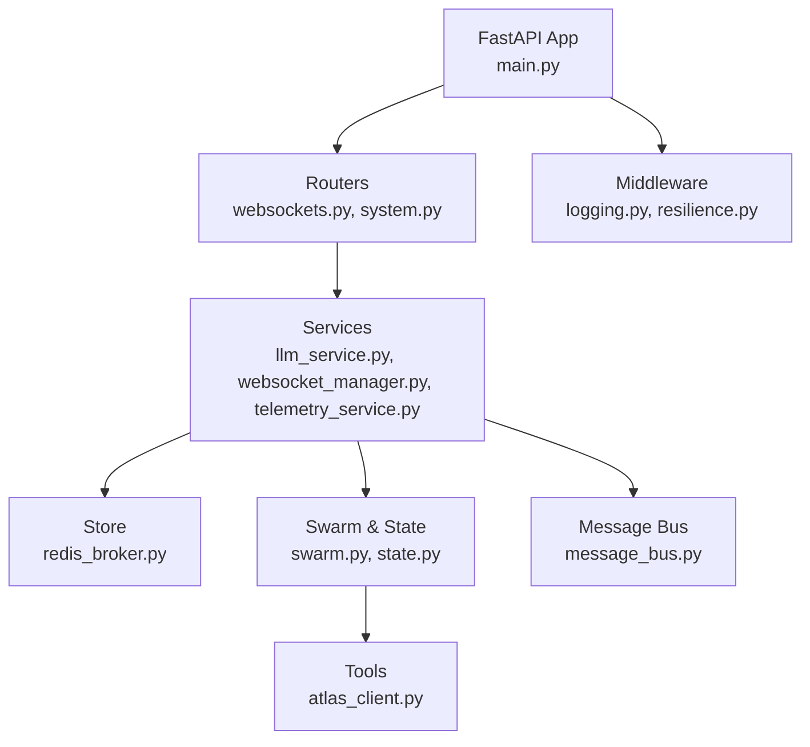
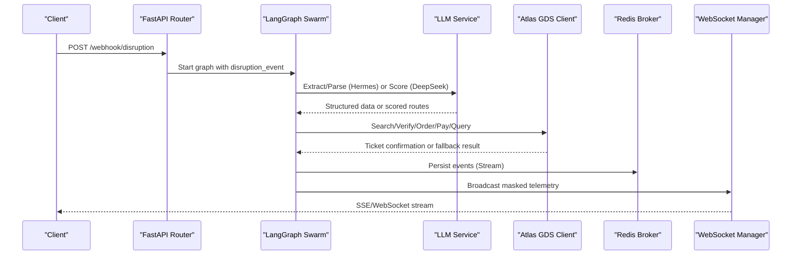
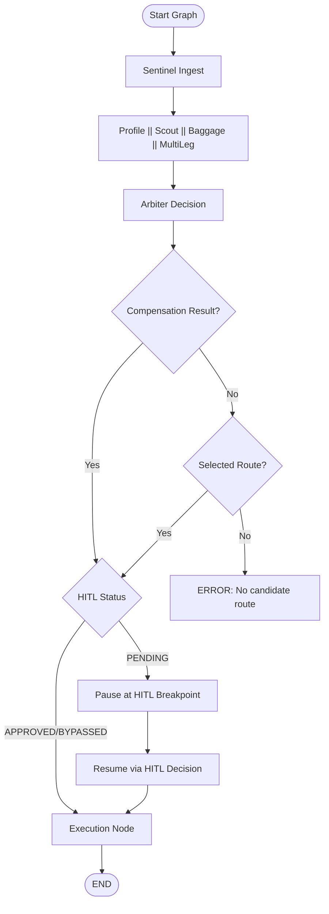
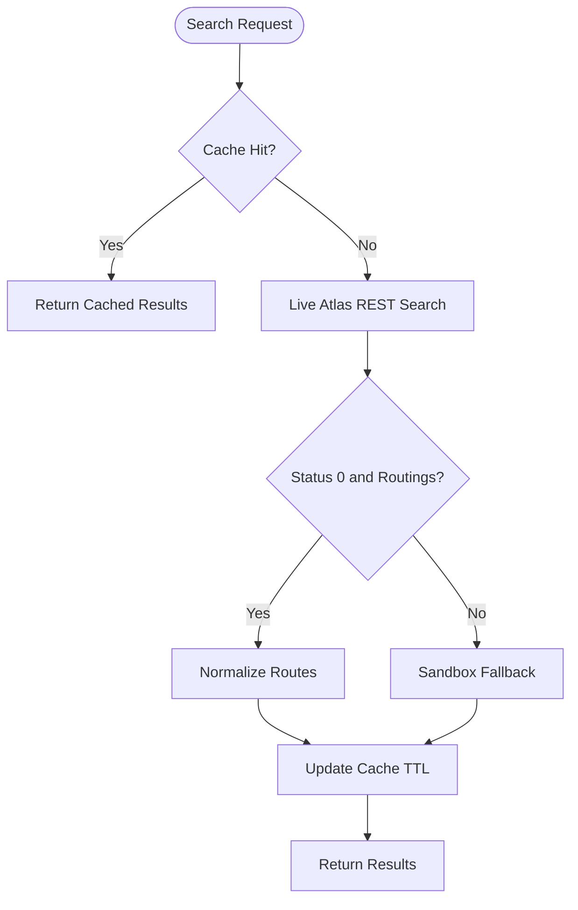
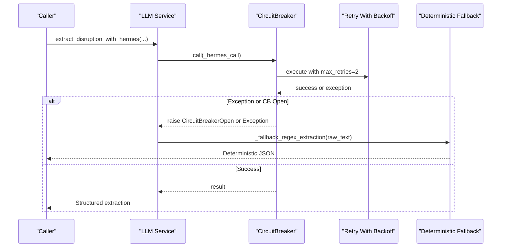
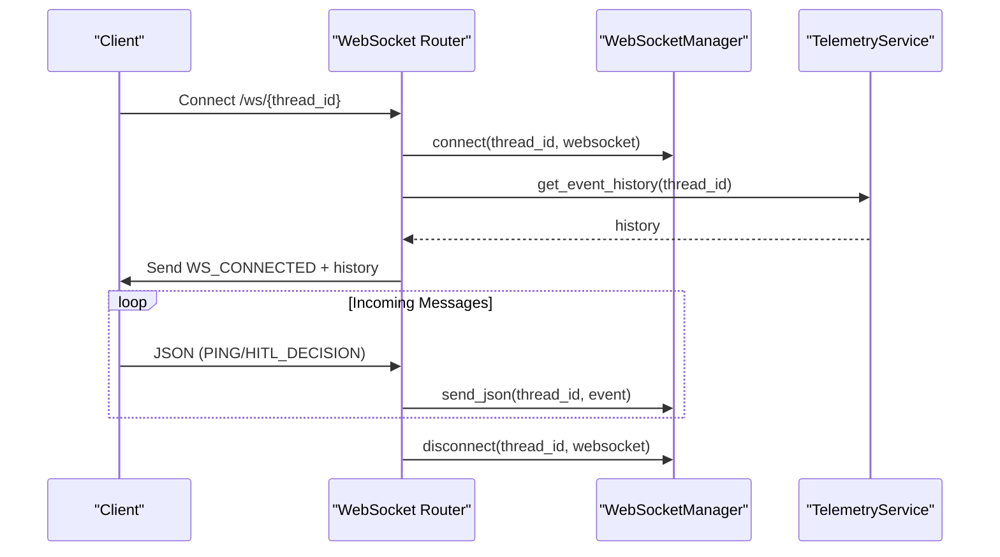
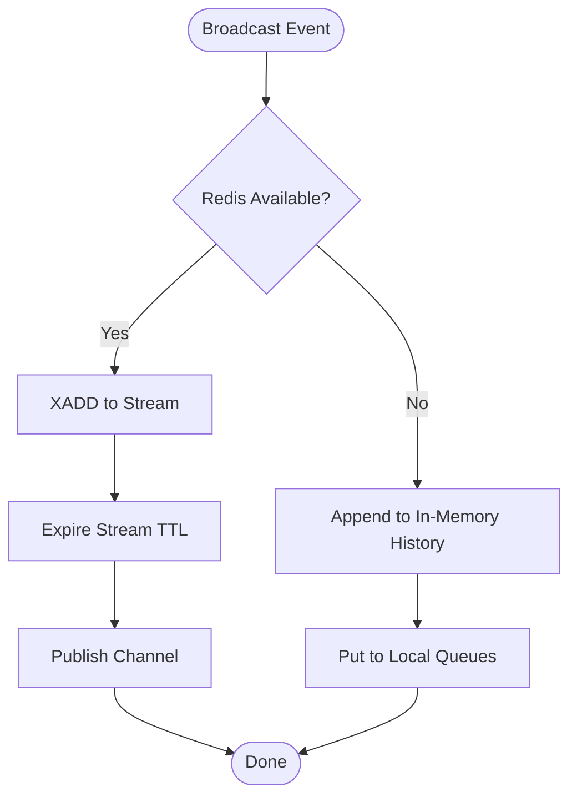
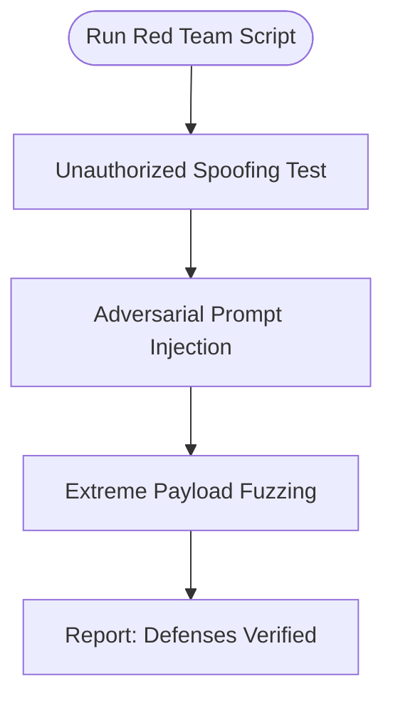
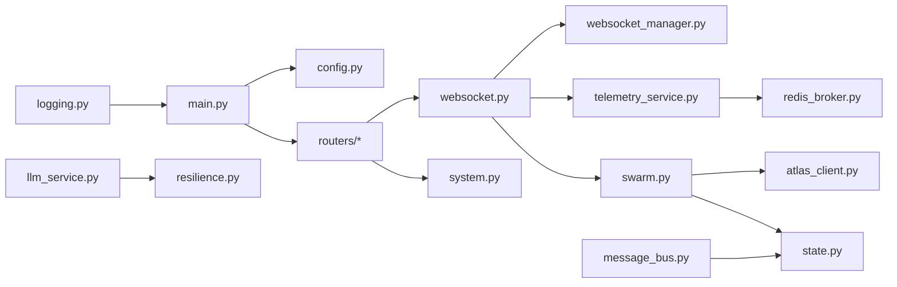

# Troubleshooting Guide

<cite>
**Referenced Files in This Document**
- [main.py](file://travel-recovery-os/backend/main.py)
- [config.py](file://travel-recovery-os/backend/config.py)
- [llm_service.py](file://travel-recovery-os/backend/services/llm_service.py)
- [websocket_manager.py](file://travel-recovery-os/backend/services/websocket_manager.py)
- [message_bus.py](file://travel-recovery-os/backend/services/message_bus.py)
- [redis_broker.py](file://travel-recovery-os/backend/store/redis_broker.py)
- [resilience.py](file://travel-recovery-os/backend/middleware/resilience.py)
- [websocket.py](file://travel-recovery-os/backend/api/routers/websocket.py)
- [atlas_client.py](file://travel-recovery-os/backend/tools/atlas_client.py)
- [telemetry_service.py](file://travel-recovery-os/backend/services/telemetry_service.py)
- [swarm.py](file://travel-recovery-os/backend/swarm.py)
- [state.py](file://travel-recovery-os/backend/state.py)
- [system.py](file://travel-recovery-os/backend/api/routers/system.py)
- [logging.py](file://travel-recovery-os/backend/middleware/logging.py)
- [red_team_attack.py](file://travel-recovery-os/backend/scripts/red_team_attack.py)
</cite>

## Table of Contents
1. Introduction
2. Project Structure
3. Core Components
4. Architecture Overview
5. Detailed Component Analysis
6. Dependency Analysis
7. Performance Considerations
8. Troubleshooting Guide
9. Conclusion
10. Appendices

## Introduction
This guide provides comprehensive troubleshooting for the SynapseAir platform, focusing on multi-agent workflow failures, external API integration problems (Atlas GDS, LLM services), and performance bottlenecks. It includes diagnostic techniques, system health checks, agent state inspection, message flow tracing, and security testing using the included red team attack scripts.

## Project Structure
SynapseAir is a FastAPI-based backend with:
- Routers for webhooks, telemetry, system status, history, and WebSocket
- Services for LLM orchestration, message bus, telemetry broadcasting, and WebSocket management
- Store layer with Redis-backed event streaming and fallbacks
- Middleware for resilience (retry + circuit breaker), logging, and tracing
- Swarm orchestration via LangGraph with durable checkpoints and HITL breakpoints
- Tools for Atlas GDS integration and ticketing lifecycle
- Red team script for adversarial testing

**Diagram sources**
- [main.py:22-113](file://travel-recovery-os/backend/main.py#L22-L113)
- [websocket.py:21-92](file://travel-recovery-os/backend/api/routers/websocket.py#L21-L92)
- [system.py:9-52](file://travel-recovery-os/backend/api/routers/system.py#L9-L52)
- [llm_service.py:34-205](file://travel-recovery-os/backend/services/llm_service.py#L34-L205)
- [websocket_manager.py:16-74](file://travel-recovery-os/backend/services/websocket_manager.py#L16-L74)
- [telemetry_service.py:23-68](file://travel-recovery-os/backend/services/telemetry_service.py#L23-L68)
- [redis_broker.py:86-179](file://travel-recovery-os/backend/store/redis_broker.py#L86-L179)
- [swarm.py:162-231](file://travel-recovery-os/backend/swarm.py#L162-L231)
- [state.py:130-167](file://travel-recovery-os/backend/state.py#L130-L167)
- [atlas_client.py:175-219](file://travel-recovery-os/backend/tools/atlas_client.py#L175-L219)
- [message_bus.py:27-107](file://travel-recovery-os/backend/services/message_bus.py#L27-L107)

**Section sources**
- [main.py:22-113](file://travel-recovery-os/backend/main.py#L22-L113)
- [config.py:29-115](file://travel-recovery-os/backend/config.py#L29-L115)

## Core Components
- Application lifecycle and CORS setup, router mounting, and health endpoint
- Configuration via Pydantic settings with environment profiles and validation warnings
- LLM service with retry and circuit breakers for Hermes and DeepSeek, plus deterministic fallbacks
- WebSocket manager for per-thread fan-out and connection cleanup
- Telemetry service with PII masking and Redis-backed pub/sub with in-memory fallback
- Redis broker for SSE event persistence and real-time fan-out
- Resilience middleware providing exponential backoff retries and circuit breakers
- Swarm graph orchestrating agents, conditional routing, HITL breakpoint, and execution
- Atlas client for search, verify/order/pay/query lifecycle with caching and fallback
- Message bus for inter-agent communication
- System routers exposing health and detailed status endpoints
- Structured logging with optional JSON output and context binding

**Section sources**
- [main.py:22-122](file://travel-recovery-os/backend/main.py#L22-L122)
- [config.py:29-115](file://travel-recovery-os/backend/config.py#L29-L115)
- [llm_service.py:34-205](file://travel-recovery-os/backend/services/llm_service.py#L34-L205)
- [websocket_manager.py:16-74](file://travel-recovery-os/backend/services/websocket_manager.py#L16-L74)
- [telemetry_service.py:23-68](file://travel-recovery-os/backend/services/telemetry_service.py#L23-L68)
- [redis_broker.py:86-179](file://travel-recovery-os/backend/store/redis_broker.py#L86-L179)
- [resilience.py:25-215](file://travel-recovery-os/backend/middleware/resilience.py#L25-L215)
- [swarm.py:162-231](file://travel-recovery-os/backend/swarm.py#L162-L231)
- [atlas_client.py:175-219](file://travel-recovery-os/backend/tools/atlas_client.py#L175-L219)
- [message_bus.py:27-107](file://travel-recovery-os/backend/services/message_bus.py#L27-L107)
- [system.py:9-52](file://travel-recovery-os/backend/api/routers/system.py#L9-L52)
- [logging.py:37-119](file://travel-recovery-os/backend/middleware/logging.py#L37-L119)

## Architecture Overview
The system ingests disruption events, parses them via Hermes or regex fallback, evaluates alternatives via DeepSeek or deterministic arbiter, consults passenger profile and baggage constraints, calculates compensation, pauses at HITL if needed, and executes ticketing through Atlas GDS. Real-time telemetry streams to clients via SSE/WebSocket with Redis-backed persistence.

**Diagram sources**
- [websocket.py:21-92](file://travel-recovery-os/backend/api/routers/websocket.py#L21-L92)
- [swarm.py:162-231](file://travel-recovery-os/backend/swarm.py#L162-L231)
- [llm_service.py:34-205](file://travel-recovery-os/backend/services/llm_service.py#L34-L205)
- [atlas_client.py:175-219](file://travel-recovery-os/backend/tools/atlas_client.py#L175-L219)
- [redis_broker.py:86-179](file://travel-recovery-os/backend/store/redis_broker.py#L86-L179)
- [websocket_manager.py:16-74](file://travel-recovery-os/backend/services/websocket_manager.py#L16-L74)

## Detailed Component Analysis

### Multi-Agent Workflow Failures
Common symptoms:
- Graph stalls at HITL breakpoint without resuming
- Arbiter returns no selected route
- Compensation node not executed before execution
- Execution node fails due to missing selected_route

Diagnostics:
- Inspect swarm state fields such as hitl_status, selected_route, compensation_result, execution_logs, error_state
- Replay historical events for the thread_id to see where processing halted
- Validate that interrupt_before=["hitl_breakpoint"] is configured so the graph pauses correctly

Resolution steps:
- Ensure HITL decision arrives via WebSocket or webhook and updates state
- Confirm compensation_result is computed; if missing, rerun compensation logic
- If selected_route is absent, re-run Scout and Arbiter to generate candidates
- Check execution_logs for ERROR entries indicating missing inputs

**Diagram sources**
- [swarm.py:94-127](file://travel-recovery-os/backend/swarm.py#L94-L127)
- [swarm.py:130-159](file://travel-recovery-os/backend/swarm.py#L130-L159)
- [swarm.py:162-231](file://travel-recovery-os/backend/swarm.py#L162-L231)
- [state.py:130-167](file://travel-recovery-os/backend/state.py#L130-L167)

**Section sources**
- [swarm.py:52-107](file://travel-recovery-os/backend/swarm.py#L52-L107)
- [swarm.py:130-159](file://travel-recovery-os/backend/swarm.py#L130-L159)
- [state.py:130-167](file://travel-recovery-os/backend/state.py#L130-L167)

### External API Integration Problems (Atlas GDS)
Symptoms:
- Search returns no routings or HTTP errors
- Verify/Order/Pay steps fail with non-zero status
- Live API unavailable; fallback to sandbox simulation

Diagnostics:
- Check ATLAS_BASE_URL, ATLAS_SEARCH_BASE_URL, ATLAS_TRANSACTION_BASE_URL, and credentials
- Review circuit breaker logs for atlas_api and retry attempts
- Inspect cached search results and TTL behavior

Resolutions:
- Validate date formatting and ensure future dates for sandbox compliance
- Use fallback path when live search yields no inventory
- Monitor provider field to confirm whether live or sandbox was used

**Diagram sources**
- [atlas_client.py:175-219](file://travel-recovery-os/backend/tools/atlas_client.py#L175-L219)
- [atlas_client.py:222-331](file://travel-recovery-os/backend/tools/atlas_client.py#L222-L331)
- [atlas_client.py:360-425](file://travel-recovery-os/backend/tools/atlas_client.py#L360-L425)

**Section sources**
- [atlas_client.py:175-219](file://travel-recovery-os/backend/tools/atlas_client.py#L175-L219)
- [atlas_client.py:222-331](file://travel-recovery-os/backend/tools/atlas_client.py#L222-L331)
- [atlas_client.py:360-425](file://travel-recovery-os/backend/tools/atlas_client.py#L360-L425)

### LLM Service Errors (Hermes and DeepSeek)
Symptoms:
- Parsing fails or structured extraction not produced
- Route scoring unavailable; deterministic arbiter engaged
- Circuit breaker opens after repeated failures

Diagnostics:
- Check HERMES_API_BASE, HERMES_MODEL, DEEPSEEK_BASE_URL, DEEPSEEK_MODEL, and API keys
- Review retry logs and circuit breaker states for hermes_llm and deepseek_llm
- Inspect fallback outputs to determine which parser was used

Resolutions:
- Ensure OpenAI-compatible endpoints are reachable and timeouts are appropriate
- Adjust failure thresholds and cooldowns if transient errors persist
- Validate prompt outputs and strip markdown wrappers before parsing

**Diagram sources**
- [llm_service.py:34-96](file://travel-recovery-os/backend/services/llm_service.py#L34-L96)
- [resilience.py:25-80](file://travel-recovery-os/backend/middleware/resilience.py#L25-L80)
- [resilience.py:97-215](file://travel-recovery-os/backend/middleware/resilience.py#L97-L215)

**Section sources**
- [llm_service.py:34-205](file://travel-recovery-os/backend/services/llm_service.py#L34-L205)
- [resilience.py:25-215](file://travel-recovery-os/backend/middleware/resilience.py#L25-L215)

### WebSocket Connection Drops
Symptoms:
- Clients disconnect unexpectedly
- No messages received after initial replay
- Dead connections not cleaned up

Diagnostics:
- Check active threads and connection counts
- Inspect broadcast calls and send_json exceptions
- Verify reconnect logic and PING/PONG handling

Resolutions:
- Ensure ws_manager.disconnect is called in finally blocks
- Handle JSON decode errors and unknown message types gracefully
- Reconnect clients and replay historical events for the thread_id

**Diagram sources**
- [websocket.py:21-92](file://travel-recovery-os/backend/api/routers/websocket.py#L21-L92)
- [websocket_manager.py:16-74](file://travel-recovery-os/backend/services/websocket_manager.py#L16-L74)
- [telemetry_service.py:45-68](file://travel-recovery-os/backend/services/telemetry_service.py#L45-L68)

**Section sources**
- [websocket.py:21-92](file://travel-recovery-os/backend/api/routers/websocket.py#L21-L92)
- [websocket_manager.py:16-74](file://travel-recovery-os/backend/services/websocket_manager.py#L16-L74)

### Database Synchronization Issues (Redis Streams and Fallbacks)
Symptoms:
- Event history missing or incomplete
- SSE clients not receiving live events
- Redis unavailability causing degraded mode

Diagnostics:
- Check REDIS_URL and USE_REDIS flags
- Inspect Redis Stream keys and Pub/Sub channels
- Verify fallback listeners and history structures

Resolutions:
- Ensure Redis is reachable and ping succeeds
- If Redis fails, fall back to in-memory queues and history
- Tune STREAM_TTL_SECONDS to retain sufficient history

**Diagram sources**
- [redis_broker.py:86-179](file://travel-recovery-os/backend/store/redis_broker.py#L86-L179)
- [redis_broker.py:195-218](file://travel-recovery-os/backend/store/redis_broker.py#L195-L218)

**Section sources**
- [redis_broker.py:86-179](file://travel-recovery-os/backend/store/redis_broker.py#L86-L179)
- [redis_broker.py:195-218](file://travel-recovery-os/backend/store/redis_broker.py#L195-L218)

### Security Testing Guidance (Red Team Attack Scripts)
Purpose:
- Validate unauthorized access controls
- Test prompt injection defenses
- Perform boundary and fuzzing tests against ingestion endpoints

Procedure:
- Run the red team script against SYNAPSE_TEST_URL
- Observe responses for 401 Unauthorized or safe handling
- Confirm that adversarial payloads do not crash parsers or bypass auth

Key test cases:
- Webhook spoofing with forged tokens
- Adversarial prompt injection into disruption payloads
- Extreme payload fuzzing (large PNRs, negative delays, special characters)

**Diagram sources**
- [red_team_attack.py:13-88](file://travel-recovery-os/backend/scripts/red_team_attack.py#L13-L88)
- [red_team_attack.py:91-104](file://travel-recovery-os/backend/scripts/red_team_attack.py#L91-L104)

**Section sources**
- [red_team_attack.py:13-88](file://travel-recovery-os/backend/scripts/red_team_attack.py#L13-L88)
- [red_team_attack.py:91-104](file://travel-recovery-os/backend/scripts/red_team_attack.py#L91-L104)

## Dependency Analysis
Key dependencies and coupling:
- main.py mounts routers and initializes lifespan (logging, tracing)
- config.py centralizes environment variables and validates production readiness
- llm_service.py depends on resilience patterns and settings for LLM providers
- websocket.py integrates with telemetry and swarm graph for HITL resume
- redis_broker.py provides pub/sub and stream persistence with fallbacks
- resilience.py supplies retry and circuit breakers used across services
- swarm.py orchestrates agents and uses checkpointer for durability
- atlas_client.py integrates with GDS and caches search results
- message_bus.py maintains in-memory inter-agent messages
- telemetry_service.py masks PII and delegates to redis_broker and websocket_manager
- system.py exposes health and status endpoints
- logging.py configures structured logging with optional JSON output

**Diagram sources**
- [main.py:22-113](file://travel-recovery-os/backend/main.py#L22-L113)
- [config.py:29-115](file://travel-recovery-os/backend/config.py#L29-L115)
- [websocket.py:21-92](file://travel-recovery-os/backend/api/routers/websocket.py#L21-L92)
- [system.py:9-52](file://travel-recovery-os/backend/api/routers/system.py#L9-L52)
- [websocket_manager.py:16-74](file://travel-recovery-os/backend/services/websocket_manager.py#L16-L74)
- [telemetry_service.py:23-68](file://travel-recovery-os/backend/services/telemetry_service.py#L23-L68)
- [redis_broker.py:86-179](file://travel-recovery-os/backend/store/redis_broker.py#L86-L179)
- [swarm.py:162-231](file://travel-recovery-os/backend/swarm.py#L162-L231)
- [atlas_client.py:175-219](file://travel-recovery-os/backend/tools/atlas_client.py#L175-L219)
- [llm_service.py:34-205](file://travel-recovery-os/backend/services/llm_service.py#L34-L205)
- [resilience.py:25-215](file://travel-recovery-os/backend/middleware/resilience.py#L25-L215)
- [state.py:130-167](file://travel-recovery-os/backend/state.py#L130-L167)
- [message_bus.py:27-107](file://travel-recovery-os/backend/services/message_bus.py#L27-L107)
- [logging.py:37-119](file://travel-recovery-os/backend/middleware/logging.py#L37-L119)

**Section sources**
- [main.py:22-113](file://travel-recovery-os/backend/main.py#L22-L113)
- [config.py:29-115](file://travel-recovery-os/backend/config.py#L29-L115)
- [websocket.py:21-92](file://travel-recovery-os/backend/api/routers/websocket.py#L21-L92)
- [system.py:9-52](file://travel-recovery-os/backend/api/routers/system.py#L9-L52)
- [websocket_manager.py:16-74](file://travel-recovery-os/backend/services/websocket_manager.py#L16-L74)
- [telemetry_service.py:23-68](file://travel-recovery-os/backend/services/telemetry_service.py#L23-L68)
- [redis_broker.py:86-179](file://travel-recovery-os/backend/store/redis_broker.py#L86-L179)
- [swarm.py:162-231](file://travel-recovery-os/backend/swarm.py#L162-L231)
- [atlas_client.py:175-219](file://travel-recovery-os/backend/tools/atlas_client.py#L175-L219)
- [llm_service.py:34-205](file://travel-recovery-os/backend/services/llm_service.py#L34-L205)
- [resilience.py:25-215](file://travel-recovery-os/backend/middleware/resilience.py#L25-L215)
- [state.py:130-167](file://travel-recovery-os/backend/state.py#L130-L167)
- [message_bus.py:27-107](file://travel-recovery-os/backend/services/message_bus.py#L27-L107)
- [logging.py:37-119](file://travel-recovery-os/backend/middleware/logging.py#L37-L119)

## Performance Considerations
- Use Redis-backed pub/sub for scalable event fan-out; fall back to in-memory queues when Redis is unavailable
- Apply retry with exponential backoff and jitter to reduce thundering herd during transient failures
- Configure circuit breakers per service (hermes_llm, deepseek_llm, atlas_api, n8n_webhook) to fast-fail and recover gracefully
- Cache flight searches with TTL to reduce redundant external calls
- Mask PII before broadcasting to minimize sensitive data exposure overhead
- Tune STREAM_TTL_SECONDS to balance retention and memory usage
- Keep timeouts reasonable for LLM and Atlas calls to avoid blocking long-running tasks

[No sources needed since this section provides general guidance]

## Troubleshooting Guide

### System Health and Diagnostics
- Quick health check: GET /health
- Detailed system status: GET /api/system/status
- Inspect provider configurations and availability (DeepSeek, Hermes, Atlas GDS, n8n)
- Validate environment variables and production warnings for missing secrets

Commands:
- curl http://localhost:8001/health
- curl http://localhost:8001/api/system/status

**Section sources**
- [main.py:119-122](file://travel-recovery-os/backend/main.py#L119-L122)
- [system.py:9-52](file://travel-recovery-os/backend/api/routers/system.py#L9-L52)
- [config.py:92-112](file://travel-recovery-os/backend/config.py#L92-L112)

### Agent State Inspection
- Retrieve event history for a thread_id to inspect agent steps and decisions
- Check execution_logs for ERROR/WARN entries
- Validate hitl_status and selected_route fields in state

Commands:
- Use WebSocket to connect to /ws/{thread_id} and replay history
- Query telemetry endpoints to fetch persisted events

**Section sources**
- [websocket.py:45-51](file://travel-recovery-os/backend/api/routers/websocket.py#L45-L51)
- [telemetry_service.py:66-68](file://travel-recovery-os/backend/services/telemetry_service.py#L66-L68)
- [state.py:130-167](file://travel-recovery-os/backend/state.py#L130-L167)

### Message Flow Tracing
- Publish and retrieve messages for a thread to trace inter-agent communication
- Filter by message_type to isolate REQUEST/RESPONSE/NOTIFICATION/WARNING flows

Commands:
- Use message bus functions to publish and query messages for a thread_id

**Section sources**
- [message_bus.py:27-107](file://travel-recovery-os/backend/services/message_bus.py#L27-L107)

### Common Issues and Solutions

- Atlas GDS connectivity problems
  - Symptoms: No routings, HTTP errors, non-zero status codes
  - Actions: Verify base URLs and credentials; check circuit breaker logs; use fallback sandbox; validate date formatting
  - References: [atlas_client.py:175-219](file://travel-recovery-os/backend/tools/atlas_client.py#L175-L219), [atlas_client.py:222-331](file://travel-recovery-os/backend/tools/atlas_client.py#L222-L331)

- LLM service errors
  - Symptoms: Parsing failures, scoring unavailable, circuit breaker open
  - Actions: Check endpoints and keys; adjust thresholds; rely on deterministic fallbacks
  - References: [llm_service.py:34-205](file://travel-recovery-os/backend/services/llm_service.py#L34-L205), [resilience.py:25-215](file://travel-recovery-os/backend/middleware/resilience.py#L25-L215)

- WebSocket connection drops
  - Symptoms: Disconnections, no live messages, dead connections
  - Actions: Ensure disconnect in finally; handle JSON errors; reconnect and replay history
  - References: [websocket.py:21-92](file://travel-recovery-os/backend/api/routers/websocket.py#L21-L92), [websocket_manager.py:16-74](file://travel-recovery-os/backend/services/websocket_manager.py#L16-L74)

- Database synchronization issues (Redis)
  - Symptoms: Missing history, no live events, degraded mode
  - Actions: Check REDIS_URL and USE_REDIS; verify streams and channels; tune TTL
  - References: [redis_broker.py:86-179](file://travel-recovery-os/backend/store/redis_broker.py#L86-L179), [redis_broker.py:195-218](file://travel-recovery-os/backend/store/redis_broker.py#L195-L218)

- Multi-agent workflow stalls
  - Symptoms: Graph paused at HITL, no selected route, missing compensation
  - Actions: Provide HITL decision; compute compensation; regenerate candidates; review execution_logs
  - References: [swarm.py:94-127](file://travel-recovery-os/backend/swarm.py#L94-L127), [swarm.py:130-159](file://travel-recovery-os/backend/swarm.py#L130-L159), [state.py:130-167](file://travel-recovery-os/backend/state.py#L130-L167)

- Security vulnerabilities and attacks
  - Symptoms: Unauthorized access, prompt injection, malformed payloads
  - Actions: Run red team script; verify 401 responses; sanitize inputs; monitor logs
  - References: [red_team_attack.py:13-88](file://travel-recovery-os/backend/scripts/red_team_attack.py#L13-L88), [red_team_attack.py:91-104](file://travel-recovery-os/backend/scripts/red_team_attack.py#L91-L104)

**Section sources**
- [atlas_client.py:175-219](file://travel-recovery-os/backend/tools/atlas_client.py#L175-L219)
- [llm_service.py:34-205](file://travel-recovery-os/backend/services/llm_service.py#L34-L205)
- [websocket.py:21-92](file://travel-recovery-os/backend/api/routers/websocket.py#L21-L92)
- [redis_broker.py:86-179](file://travel-recovery-os/backend/store/redis_broker.py#L86-L179)
- [swarm.py:94-159](file://travel-recovery-os/backend/swarm.py#L94-L159)
- [state.py:130-167](file://travel-recovery-os/backend/state.py#L130-L167)
- [red_team_attack.py:13-88](file://travel-recovery-os/backend/scripts/red_team_attack.py#L13-L88)

## Conclusion
SynapseAir employs robust resilience patterns, durable state management, and secure integrations to handle flight disruption recovery. When issues arise, leverage health endpoints, telemetry history, and circuit breaker logs to diagnose root causes. Use the provided red team scripts to validate security posture and ensure graceful degradation under adverse conditions.

[No sources needed since this section summarizes without analyzing specific files]

## Appendices

### Diagnostic Commands and Endpoints
- Health: GET /health
- System Status: GET /api/system/status
- WebSocket: Connect to /ws/{thread_id} for real-time telemetry and HITL decisions
- Red Team: Run red_team_attack.py with SYNAPSE_TEST_URL set

**Section sources**
- [main.py:119-122](file://travel-recovery-os/backend/main.py#L119-L122)
- [system.py:9-52](file://travel-recovery-os/backend/api/routers/system.py#L9-L52)
- [websocket.py:21-92](file://travel-recovery-os/backend/api/routers/websocket.py#L21-L92)
- [red_team_attack.py:91-104](file://travel-recovery-os/backend/scripts/red_team_attack.py#L91-L104)