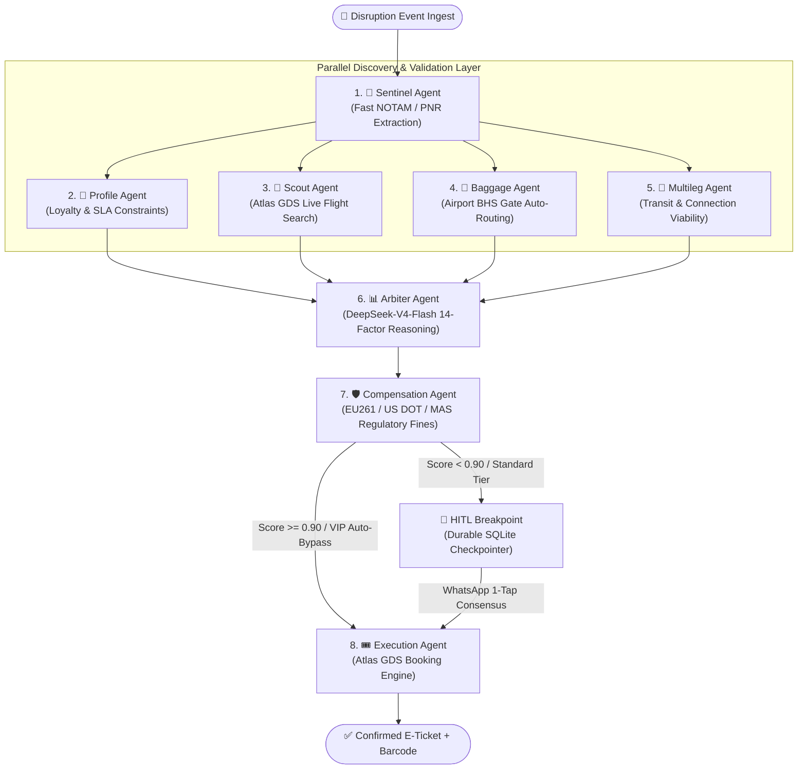

# 🤖 SynapseAir: Multi-Agent Swarm Architecture & Specifications (`AGENTS.md`)

> **Autonomous Multi-Agent Disruption Recovery Operating System**  
> *Built for the Alibaba Cloud × Atlas AI Agentic Hackathon*

---

## 🏗️ 1. Swarm Architecture Topology

SynapseAir executes an autonomous multi-agent state graph compiled via **LangGraph**. The workflow follows a high-performance **parallel fan-out / fan-in** topology designed to minimize latency and execute full recovery lifecycles in under **4.2 seconds**.



---

## 📋 2. Complete Agent Specifications

### **1. Sentinel Agent (`backend/agents/sentinel.py`)**
* **Role**: First-line disruption ingestion, event extraction, and anomaly classification.
* **Technology**: `Hermes-3 Llama` / Fast NLP Parser (< 300ms latency).
* **Inputs**: Raw flight cancellation text, NOTAM stream, or structured webhook (`DisruptionPayload`).
* **Outputs**: Normalized `DisruptionEvent` (PNR, origin, destination, scheduled departure, delay duration, failure reason).
* **Resilience Policy**: Automatic schema fallback if unstructured text contains syntax anomalies or prompt injections.

---

### **2. Profile Agent (`backend/agents/profile.py`)**
* **Role**: Traveler loyalty profile resolution, SLA entitlement enforcement, and constraint derivation.
* **Technology**: Deterministic Tier Rule Matrix + Profile Database.
* **Inputs**: `passenger_name`, `pnr`, `loyalty_tier` (PLATINUM, GOLD, SILVER, STANDARD).
* **Outputs**: `PassengerContext` (cabin class entitlement, max layover tolerance, direct flight requirement, dietary preferences, SLA compensation liability cap).
* **Business Rule**: Platinum/Gold VIP tiers unlock automated zero-touch rebooking bypass for recovery scores $\ge 0.90$.

---

### **3. Scout Agent (`backend/agents/scout.py`)**
* **Role**: Real-time seat inventory discovery across global airline alliances and interline partners.
* **Technology**: `Atlas GDS Live REST API` (`https://sandbox.atriptech.com`) with deterministic fallback mock engine.
* **Inputs**: `origin`, `destination`, departure time window, minimum available seat threshold.
* **Outputs**: `List[FlightRoute]` (flight numbers, departure/arrival times, durations, layovers, cabin availability, base fare USD).
* **Resilience Policy**: Circuit breaker with 3-attempt exponential backoff and jitter.

---

### **4. Baggage Agent (`backend/agents/baggage.py`)**
* **Role**: Airport Ground Baggage Handling System (BHS) synchronization and transfer feasibility.
* **Technology**: Airport BHS Transfer Logic & IATA Baggage Agreement Matrix.
* **Inputs**: `checked_bags`, special baggage tags (`sports_equipment`, `pet`, `fragile`), replacement flight departure gate.
* **Outputs**: `BaggageContext` (interline eligibility, transfer feasibility, estimated transfer duration, baggage routing notes).
* **Key Metric**: Validates whether luggage transfer duration $\le$ transit layover time at the hub.

---

### **5. Multileg Agent (`backend/agents/multileg.py`)**
* **Role**: Multi-segment network connectivity and missed transit connection prevention.
* **Technology**: Minimum Connection Time (MCT) Routing Graph.
* **Inputs**: Candidate connecting itineraries, downstream connecting flight numbers, airport MCT thresholds.
* **Outputs**: `List[ConnectingFlight]` (connection viability boolean, delay buffer margin, risk of missed connection).

---

### **6. Arbiter Agent (`backend/agents/arbiter.py`)**
* **Role**: Multi-criteria utility reasoning and mathematical optimization of candidate solutions.
* **Technology**: `DeepSeek-V4-Flash Reasoner` (14-Factor Chain-of-Thought).
* **Inputs**: `PassengerContext`, `candidate_routes`, `BaggageContext`, `connecting_flights`.
* **Outputs**: `selected_route` with composite utility score ($S \in [0, 1]$), detailed scoring breakdown, and financial savings rationale.
* **Mathematical Formula**:
  $$\text{Score} = w_{\text{time}} \cdot T_{\text{delta}} + w_{\text{loyalty}} \cdot L_{\text{match}} + w_{\text{direct}} \cdot D + w_{\text{baggage}} \cdot B + w_{\text{cost}} \cdot C - w_{\text{fine}} \cdot F_{\text{risk}}$$

---

### **7. Compensation Agent (`backend/agents/compensation.py`)**
* **Role**: Statutory passenger rights compliance, fine avoidance calculation, and consumer claim recording.
* **Technology**: Multi-Jurisdiction Regulatory Rules Engine (EU261, US DOT 14 CFR Part 260, MAS guidelines).
* **Inputs**: `delay_minutes`, flight route distance, cancellation root cause (technical defect vs. extraordinary weather).
* **Outputs**: `CompensationResult` (applicable regulation, eligibility, payout amount USD, statutory fine avoidance savings).

---

### **8. Execution Agent (`backend/swarm.py` -> `execution_node`)**
* **Role**: Real-world GDS order creation, seat assignment, and electronic ticket issuance.
* **Technology**: `Atlas GDS Booking Engine` (`verify.do` $\rightarrow$ `order.do` $\rightarrow$ `pay.do`).
* **Inputs**: `selected_route`, `passenger_context`, `thread_id`.
* **Outputs**: `ticket_confirmation` (10-digit e-ticket number, confirmed PNR, assigned seat, boarding gate, barcode URI).

---

## 🔄 3. LangGraph Central State Schema (`backend/state.py`)

```python
class AgentSwarmState(TypedDict, total=False):
    thread_id: str                                         # Unique trace ID for session checkpoints
    disruption_event: DisruptionEvent                      # Ingested flight cancellation/delay payload
    passenger_context: PassengerContext                    # Resolved loyalty tier & constraints
    candidate_routes: Annotated[List[FlightRoute], operator.add]  # Parallel branch merged candidate flights
    selected_route: Optional[FlightRoute]                  # Chosen optimal flight evaluated by Arbiter
    hitl_status: str                                       # 'PENDING' | 'APPROVED' | 'REJECTED' | 'BYPASSED'
    execution_logs: Annotated[List[ExecutionLog], operator.add]  # Additive real-time telemetry events
    ticket_confirmation: Optional[Dict[str, Any]]          # Confirmed E-Ticket & PNR record from Atlas
    baggage_context: Optional[BaggageContext]              # Baggage routing results from Baggage Agent
    compensation_result: Optional[CompensationResult]      # Regulatory compensation evaluation
    connecting_flights: Annotated[List[ConnectingFlight], operator.add]
    error_state: Optional[Dict[str, Any]]                  # Per-node resilience and error tracking
```

---

## 🛡️ 4. Resilience & Fault-Tolerance Contracts

1. **Defensive Typing**: All graph nodes and router boundaries sanitize incoming state via `_safe_state(state)` to prevent tuple unpack crashes.
2. **Circuit Breakers**: Atlas GDS and DeepSeek API calls are wrapped in 3-state circuit breakers (`CLOSED`, `OPEN`, `HALF-OPEN`) with exponential backoff and random jitter.
3. **Deterministic Mocks**: If upstream networks experience outages, agents gracefully degrade to local certified mock datasets without interrupting the pipeline.
4. **State Persistence**: In-flight Human-in-the-Loop workflows are persisted on disk via `SqliteSaver` (`checkpoints.sqlite`), allowing long-lived WhatsApp approvals to resume safely.
