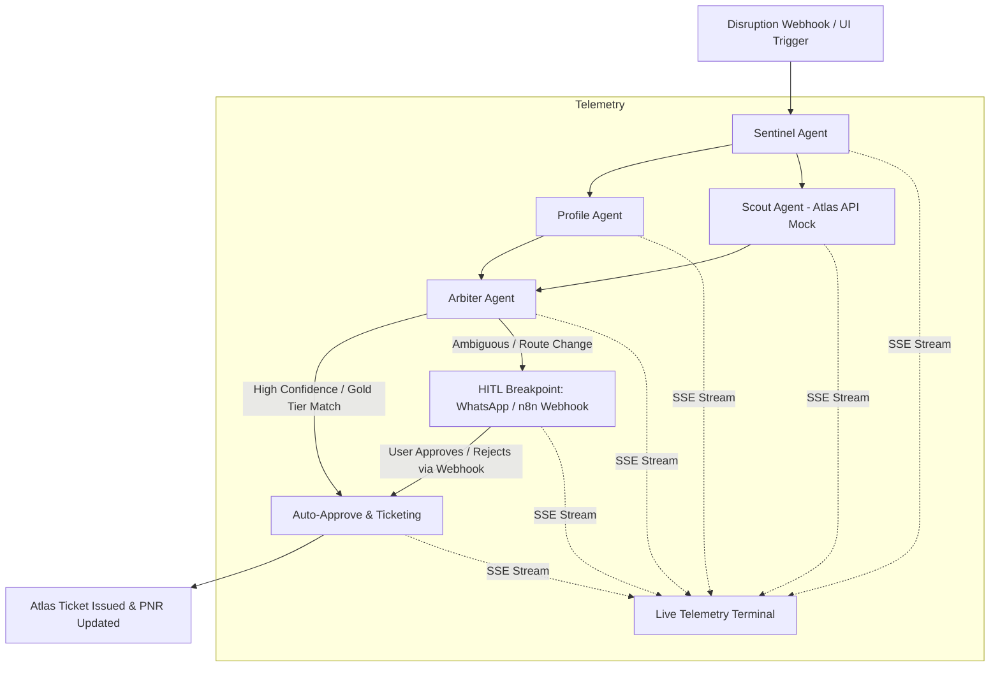

# SynapseAir: Autonomous Disruption Swarm (Travel Recovery OS)
### Built for the Alibaba Cloud x Atlas Agentic AI Hackathon

SynapseAir is an Autonomous Multi-Agent Disruption Recovery Swarm that intercepts airline flight cancellations, parses constraints, searches the Atlas Sandbox API for candidate rebooking routes, multi-criteria scores routes with an Arbiter agent, and coordinates Human-in-the-Loop (HITL) 1-click consensus via WhatsApp/n8n webhooks with live SSE telemetry streaming to a Vue 3 Command Center.

---

## 🏗️ Architecture



---

## 📁 Repository Structure

```
travel-recovery-os/
├── backend/
│   ├── main.py                  # FastAPI server with CORS, Webhooks, SSE stream
│   ├── state.py                 # LangGraph TypedDict state schema
│   ├── swarm.py                 # LangGraph StateGraph orchestration + MemorySaver
│   ├── requirements.txt         # Python dependencies
│   ├── agents/
│   │   ├── __init__.py
│   │   ├── sentinel.py          # Disruption ingest & validation
│   │   ├── profile.py           # Passenger loyalty profile & constraints
│   │   ├── scout.py             # Atlas API candidate route search
│   │   └── arbiter.py           # Multi-criteria scoring & HITL decision
│   └── tools/
│       ├── __init__.py
│       └── atlas_client.py      # Atlas Sandbox API mock client
└── frontend/
    ├── package.json             # Vue 3, Vite, TailwindCSS
    ├── vite.config.js           # Vite dev server configuration
    ├── tailwind.config.js       # Dark Mode Airline Operations theme
    ├── index.html               # Web application entry point
    └── src/
        ├── App.vue              # Top-level operations layout & header
        ├── main.js              # Vue app bootstrap
        ├── style.css            # Tailwind directives & glassmorphism
        └── components/
            └── SwarmDashboard.vue  # 3-Panel Operations Command Center
```

---

## 🚀 Quick Start Guide

### 1. Start the FastAPI Backend

```bash
cd travel-recovery-os/backend
pip install -r requirements.txt
python -m uvicorn main:app --host 127.0.0.1 --port 8000 --reload
```

- API Docs: `http://127.0.0.1:8000/docs`
- Health Check: `http://127.0.0.1:8000/health`

### 2. Start the Vue 3 Frontend

```bash
cd travel-recovery-os/frontend
npm install
npm run dev
```

- Web Command Center: `http://localhost:5173`

---

## 🔄 Webhook API Endpoints

1. **`POST /webhook/disruption`**: Ingests flight cancellation payload and spawns the LangGraph swarm.
2. **`POST /webhook/consensus`**: Receives passenger WhatsApp/n8n reply to resume state at the checkpointer breakpoint.
3. **`GET /stream/{thread_id}`**: Server-Sent Events (SSE) stream feeding real-time JSON logs to the frontend terminal.
4. **`GET /threads/{thread_id}/state`**: LangGraph checkpointer state inspector.
